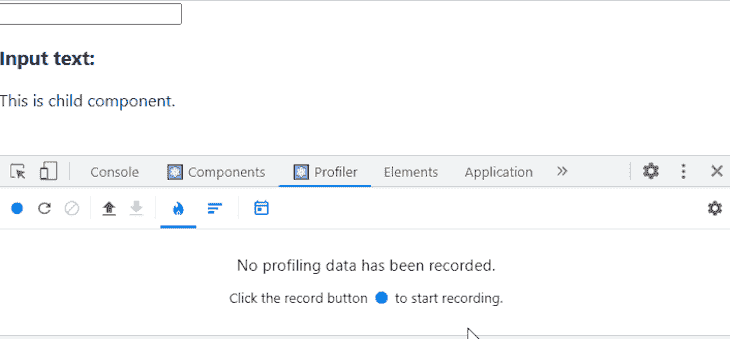
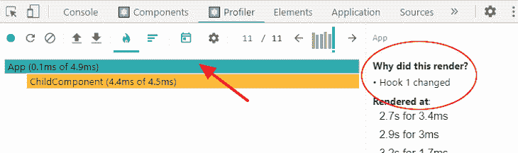
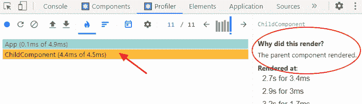

# 在 React app 中优化性能

> 原文：<https://blog.logrocket.com/optimizing-performance-react-app/>

***编者按:**这份优化 React 应用性能的指南最近一次更新是在 2023 年 2 月 9 日，为您的 React 应用提供了更多优化技术。此更新还包括反映 React 更改的更新。要了解更多关于 React 的信息，请访问我们的[档案，这里是](https://blog.logrocket.com/tag/react/)。*

优化应用程序的性能对于那些注重保持[用户体验积极](https://blog.logrocket.com/ux-design/designing-ux-user-flow-app/)的开发人员来说至关重要，这样才能让他们继续使用应用程序并参与其中。根据[网站](https://www.portent.com/blog/analytics/research-site-speed-hurting-everyones-revenue.htm#:~:text=The%20first%205%20seconds%20of,(between%20seconds%200%2D5))的研究，一秒钟加载的网站的[转换率](https://blog.logrocket.com/product-management/what-is-conversion-rate-how-to-calculate/)是十秒钟加载的网站的五倍。众所周知，开发人员必须创建性能优化的应用。

在 React 应用程序中，默认情况下我们保证会有一个非常快的 UI。然而，随着应用程序的增长，开发人员可能会遇到性能问题。在本指南中，我们将讨论优化 React 应用程序性能的一些重要方法，包括预优化技术。

*向前跳转:*

## 了解 React 如何更新其 UI

在优化 React 应用程序之前，我们必须了解 React 如何更新其 UI，以及如何衡量应用程序的性能。这使得解决任何 React 性能问题变得容易。让我们首先回顾一下 React UI 是如何更新的。

当我们创建一个渲染组件时，React 为组件中的元素树创建一个虚拟 DOM。现在，只要组件的状态发生变化，React 就会重新创建虚拟 DOM 树，并将结果与之前的渲染进行比较。它只会通过 diffing 更新实际 DOM 中已更改的元素。

### 检查差异和重新渲染

React 使用虚拟 DOM 的概念来最小化重新呈现网页的性能成本，因为实际的 DOM 操作起来非常昂贵。这很棒，因为它加快了 UI 渲染时间。然而，如果管理不善，这个概念会降低复杂应用程序的速度。在这里，我们可以推断出 React 组件中的状态更改会导致重新呈现。同样，当状态作为道具传递给子组件时，它会重新呈现子组件，这没问题，因为 React 必须更新 UI。

当子组件不受状态更改的影响时，问题就出现了。换句话说，它们不从父组件接收任何道具。尽管如此，React 会重新呈现这些子组件。因此，只要父组件重新渲染，它的所有子组件都会重新渲染，不管是否有道具传递给它们。这是 React 的[默认行为。](https://blog.logrocket.com/complete-guide-react-default-props/)

让我们快速演示一下这个概念。这里，我们有一个包含一个`state`和一个`child`组件的`App`组件:

```
import { useState } from "react";

export default function App() {
  const [input, setInput] = useState("");

  return (
    <div>
      <input
        type="text"
        value={input}
        onChange={(e) => setInput(e.target.value)}
      />
      <h3>Input text: {input}</h3>
      <ChildComponent />
    </div>
  );
}

function ChildComponent() {
  console.log("child component is rendering");
  return <div>This is child component.</div>;
};

```

每当`App`组件的状态更新时，`ChildComponent`就会重新渲染，即使它没有受到状态变化的直接影响。在这个 CodeSandbox 演示的输入字段中，您会看到对于每一次击键，`ChildComponent`都会重新呈现:

在大多数情况下，这种重新渲染不会导致性能问题，我们也不会注意到应用程序中的任何延迟。然而，如果未受影响的组件呈现了昂贵的计算，并且我们注意到了性能问题，那么我们应该优化我们的 React 应用程序。这就把我们带到了第二种预优化技术——概要分析。

### 剖析 React 应用程序以定位瓶颈

React 允许我们使用 React 开发工具中的[分析器来测量应用的性能。在那里，我们可以在应用程序渲染时收集性能信息。分析器记录组件渲染所需的时间、组件渲染的原因等等。从那里，我们可以调查受影响的组件，并提供必要的优化。](https://blog.logrocket.com/debug-react-apps-react-devtools/)

要使用 profiler，请为您选择的浏览器安装 React DevTools。如果你还没有安装，去他们的扩展页面安装它(在这里选择 [Chrome](https://chrome.google.com/webstore/detail/react-developer-tools/fmkadmapgofadopljbjfkapdkoienihi) 或[Firefox](https://addons.mozilla.org/en-US/firefox/addon/react-devtools/))。现在，在处理 React 项目时，我们应该会看到 profiler 选项卡。回到我们的代码。如果我们分析应用程序，我们会看到以下行为:



当输入文本字段更新时，React DevTools profiler 突出显示每个呈现的组件，并且我们从呈现的组件接收每个细节。在下面的火焰图中，我们可以看到渲染组件花了多长时间，以及为什么`App`组件正在渲染:



同样，下图显示了`child`组件正在渲染，因为`parent`组件已经渲染:




如果我们在`child`组件中有一个需要时间计算的操作，这会影响 React 应用程序的性能。这让我们想到了我们的优化技术。

## 反应性能优化技术

### 必要时保持组件状态局部化

我们已经知道，父组件中的状态更新会重新呈现父组件及其子组件。因此，为了确保只在必要时才重新呈现组件，我们可以提取与组件状态相关的代码部分，使其位于该部分代码的本地。

通过重构我们之前的代码，我们得到了以下内容:

```
import { useState } from "react";

export default function App() {
  return (
    <div>
      <FormInput />
      <ChildComponent />
    </div>
  );
}

function FormInput() {
  const [input, setInput] = useState("");

  return (
    <div>
      <input
        type="text"
        value={input}
        onChange={(e) => setInput(e.target.value)}
      />
      <h3>Input text: {input}</h3>
    </div>
  );
}

function ChildComponent() {
  console.log("child component is rendering");
  return <div>This is child component.</div>;
}

```

这确保了只有关心状态的组件才会呈现。在我们的代码中，只有输入字段关心状态。因此，我们将该状态和输入提取到一个`FormInput`组件，使其成为`ChildComponent`的兄弟。

这意味着当`FormInput`组件中的状态改变时，只有组件被重新渲染。如果我们在演示中再次测试这个应用程序，`ChildComponent`不再在每次击键时重新呈现。使用这种技术，我们可以大大提高 React 应用程序的性能。这是演示:

参见 [CodePen](https://codepen.io) 上的笔 [保持组件状态本地](https://codepen.io/nefejames/pen/vYzBBMW)由 Emadamerho Nefe([@ Nefe James](https://codepen.io/nefejames))
。

但有时，我们无法避免在全局组件中有一个状态，同时将它作为道具传递给子组件。在这种情况下，让我们学习如何避免重新渲染未受影响的子组件。

### 记忆反应组件以防止不必要的重新渲染

与前面的性能技术不同，在前面的技术中，重构代码可以提高性能，而在这里，我们用内存空间换取时间。因此，我们必须仅在必要时记忆组件。

[Memoization](https://blog.logrocket.com/react-re-reselect-better-memoization-cache-management/) 是一种优化策略，它缓存组件渲染的操作，将结果保存在内存中，并返回相同输入的缓存结果。本质上，如果一个子组件收到一个道具，默认情况下，记忆组件会简单地比较这个道具，如果道具没有改变，它会跳过子组件的重新渲染。看起来是这样的:

```
import { useState } from "react";

export default function App() {
  const [input, setInput] = useState("");
  const [count, setCount] = useState(0);

  return (
    <div>
      <input
        type="text"
        value={input}
        onChange={(e) => setInput(e.target.value)}
      />
      <button onClick={() => setCount(count + 1)}>Increment counter</button>
      <h3>Input text: {input}</h3>
      <h3>Count: {count}</h3>
      <hr />
      <ChildComponent count={count} />
    </div>
  );
}

function ChildComponent({ count }) {
  console.log("child component is rendering");
  return (
    <div>
      <h2>This is a child component.</h2>
      <h4>Count: {count}</h4>
    </div>
  );
}

```

通过更新输入字段，`App`组件和`ChildComponent`重新呈现，你可以在这里看到。相反，`ChildComponent`应该只在点击 **`count`按钮**时重新渲染，因为它必须更新 UI。

在这里，我们可以记忆`ChildComponent`来优化我们应用的性能:

参见 [CodePen](https://codepen.io) 上 Emadamerho Nefe([@ Nefe James](https://codepen.io/nefejames))
的 Pen [memoization-one](https://codepen.io/nefejames/pen/KKxPKvp) 。

### 实施`React.memo()`

`React.memo`是一个[高阶组件](https://blog.logrocket.com/understanding-react-higher-order-components/)，用于包装一个纯粹的功能组件，以防止在该组件中接收的道具从不改变的情况下重新渲染:

```
import React, { useState } from "react";

// ...

const ChildComponent = React.memo(function ChildComponent({ count }) {
  console.log("child component is rendering");
  return (
    <div>
      <h2>This is a child component.</h2>
      <h4>Count: {count}</h4>
    </div>
  );
});

```

如果`count`属性从不改变，React 将跳过渲染`ChildComponent`并重用之前渲染的结果，最终提高 React 的性能。您可以在此处的教程中尝试一下:

参见 [CodePen](https://codepen.io) 上 Emadamerho Nefe([@ Nefe James](https://codepen.io/nefejames))
的 Pen [memoization-two](https://codepen.io/nefejames/pen/zYJOYPw) 。

在我们的例子中，当我们传递原始值(比如一个数字)时,`React.memo()`工作得很好。而且，如果你熟悉[引用相等](https://blog.logrocket.com/rethinking-hooks-memoization/#use-usememe-referential-equalities)，原始值总是引用相等，如果值从不改变，则返回 true。

另一方面，像`object`这样的非原始值，包括数组和函数，总是在重新渲染之间返回`false`，因为它们指向内存中的不同空间。当我们把`object`、`array`或者`function`作为道具传下来的时候，记忆化的组件总是会重新渲染。

这里，[将一个功能传递给子组件](https://codesandbox.io/s/angry-frost-rl829?file=/src/App.js):

```
import React, { useState } from "react";

export default function App() {
  // ...

  const incrementCount = () => setCount(count + 1);

  return (
    <div>
      {/* ... */}
      <ChildComponent count={count} onClick={incrementCount} />
    </div>
  );
}

const ChildComponent = React.memo(function ChildComponent({ count, onClick }) {
  console.log("child component is rendering");
  return (
    <div>
      {/* ... */}
      <button onClick={onClick}>Increment</button>
      {/* ... */}
    </div>
  );
});

```

这段代码主要关注传递给`ChildComponent`的`incrementCount`函数。当`App`组件重新渲染时，即使没有点击`count`按钮，该函数也会重新定义，使得`ChildComponent`也重新渲染。

为了防止函数总是被重定义，我们将使用一个`useCallback`钩子，它在渲染之间返回回调的一个记忆版本。

### 使用`useCallback`和`useMemo`挂钩

使用`useCallback`钩子，`incrementCount`函数只在`count`依赖数组改变时重新定义:

```
const incrementCount = React.useCallback(() => setCount(count + 1), [count]);

```

你可以在这里亲自尝试一下:

参见 [CodePen](https://codepen.io) 上 Emadamerho Nefe([@ Nefe James](https://codepen.io/nefejames))
的钢笔 [memoization-three](https://codepen.io/nefejames/pen/eYLOYyB) 。

当我们传递给子组件的道具是一个数组或对象时，我们可以使用一个 [`useMemo`](https://blog.logrocket.com/react-memo-vs-usememo/) 钩子来记忆渲染之间的值。正如我们在上面学到的，这些值指向内存中不同的空间，并且是全新的值。

您还可以使用`useMemo`钩子来避免在组件中重新计算同样昂贵的值。它允许我们记住这些值，并且只在依赖关系改变时才重新计算它们。与`useCallback`类似，`useMemo`钩子也需要一个函数和一组依赖项:

```
const memoizedValue = React.useMemo(() => {
  // return expensive computation
}, []);

```

让我们看看如何应用`useMemo`钩子来提高 React 应用程序的性能。看看下面的代码，我们故意把它延迟得很慢:

```
import React, { useState } from "react";

const expensiveFunction = (count) => {
  // artificial delay (expensive computation)
  for (let i = 0; i < 1000000000; i++) {}
  return count * 3;
};

export default function App() {
  // ...
  const myCount = expensiveFunction(count);
  return (
    <div>
      {/* ... */}
      <h3>Count x 3: {myCount}</h3>
      <hr />
      <ChildComponent count={count} onClick={incrementCount} />
    </div>
  );
}

const ChildComponent = React.memo(function ChildComponent({ count, onClick }) {
  // ...
});

```

正如我们在这个[代码沙箱](https://codesandbox.io/s/determined-pond-94xg8?file=/src/App.js)中所看到的，每当我们试图在`input`字段中输入文本以及点击`**count**` **按钮**时，我们的应用程序都会出现延迟。这是因为每次`App`组件渲染时，它都会调用`expensiveFunction`并降低应用程序的速度。

只有当点击`**count**` **按钮**时，才应该调用`expensiveFunction`，而不是当我们在`input`字段中键入时。我们可以使用`useMemo`钩子来记忆`expensiveFunction`的返回值，这样它只在需要时才重新计算函数，例如，当点击`**count**` **按钮**时。

为此，我们会有这样的东西:

```
const myCount = React.useMemo(() => {
  return expensiveFunction(count);
}, [count]);

```

现在，如果我们在 CodeSandbox 上再次测试该应用程序，我们将不再遇到在输入字段中键入时的延迟:

参见 [CodePen](https://codepen.io) 上 Emadamerho Nefe([@ Nefe James](https://codepen.io/nefejames))
的笔 [memoization-four](https://codepen.io/nefejames/pen/OJoLJvY) 。

### 使用动态`import()`在 React 中进行代码拆分

代码分割是 React 应用程序的另一项重要的优化技术。默认情况下，当 React 应用程序在浏览器中呈现时，包含整个应用程序代码的包文件会立即加载并提供给用户。该文件通过合并 web 应用程序运行所需的所有代码文件来生成。

捆绑的想法很有用，因为它减少了一个页面可以处理的 HTTP 请求的数量。但是，随着应用程序的增长，文件大小也会增加，从而增加了包文件。在某一点上，这种连续的文件增加减缓了初始页面加载，降低了用户的满意度。

通过代码分割，React 允许我们使用动态`import()`将一个大的包文件分割成多个块，然后使用`React.lazy`按需通过[延迟加载](https://blog.logrocket.com/lazy-loading-components-in-react-16-6-6cea535c0b52/)这些块。这种策略极大地提高了复杂 React 应用程序的页面性能。

为了实现代码分割，我们像这样转换一个普通的 React 导入:

```
import Home from "./components/Home";
import About from "./components/About";

```

然后，变成这样:

```
const Home = React.lazy(() => import("./components/Home"));
const About = React.lazy(() => import("./components/About"));

```

这个语法告诉 [React 动态加载每个组件](https://blog.logrocket.com/react-dynamic-imports-route-centric-code-splitting-guide/#:~:text=Loadable%20Components-,Dynamic%20imports,-This%20is%20a)。例如，当用户点击主页链接时，React 只下载所请求页面的文件，而不是为整个应用程序加载一个大的包文件。导入之后，我们必须在一个`Suspense`组件中呈现惰性组件，就像这样:

```
<React.Suspense fallback={<p>Loading page...</p>}>
  <Route path="/" exact>
    <Home />
  </Route>
  <Route path="/about">
    <About />
  </Route>
</React.Suspense>

```

当 React 等待在 UI 中呈现惰性组件时，`Suspense`允许我们显示一个加载文本或指示器作为后备。您可以在这里亲自尝试一下:

### React 应用程序中的窗口或列表虚拟化

假设我们有一个应用程序，其中我们在一个页面上呈现几行项目。无论任何项目是否显示在浏览器视窗中，它们都会在 DOM 中呈现，并且可能会影响我们的应用程序的性能。

有了[窗口](https://blog.logrocket.com/react-performance-optimization-windowing-vs-component-recycling/)的概念，我们可以只向 DOM 呈现对用户可见的部分。然后，当滚动时，在替换退出视口的项目的同时，呈现剩余的列表项目。这种技术可以大大提高大型列表的[渲染性能。](https://blog.logrocket.com/render-large-lists-react-5-methods-examples/) [react-window](https://blog.logrocket.com/how-to-virtualize-large-lists-using-react-window/) 和 [react-virtualized](https://blog.logrocket.com/windowing-wars-react-virtualized-vs-react-window/) 是两个流行的窗口库，可以实现这个概念。

### 在 React 中延迟加载图像

为了优化由几个图像组成的应用程序，我们可以避免一次呈现所有图像，以缩短页面加载时间。通过延迟加载，我们可以等到每个图像即将出现在视口中时，才在 DOM 中呈现它们。

与上面提到的窗口概念类似，延迟加载图像可以防止创建不必要的 DOM 节点，从而提高 React 应用程序的性能。
[react-lazyload 和 react-lazy-load-image-component](https://blog.logrocket.com/the-top-choices-for-react-lazy-loading-libraries-in-2021/)是流行的惰性加载库，可以在 React 项目中使用。

下面是一个用`react-lazy-load-image-component`进行延迟加载的例子:

```
import { LazyLoadImage } from "react-lazy-load-image-component";
import "react-lazy-load-image-component/src/effects/blur.css";

export default function App() {
  return (
    <div className="App">
      <LazyLoadImage
        src={"https://placedog.net/500/300"}
        width={600}
        height={400}
        alt="Image Alt"
        effect="blur"
      />
    </div>
  );
}

```

### 使用不可变的数据结构

不可变数据结构背后的思想很简单。不要直接对包含复杂数据的对象进行更改，而是制作已用更改更新的对象的副本。

然后，我们可以很容易地比较原始对象和新对象的引用，以识别更改并触发 UI 更新。React 状态应该被视为不可变的，我们永远不应该直接改变它。让我们看看这在实践中是如何工作的:

```
export default function App() {
  const [bookInfo, setBookInfo] = useState({
    name: "A Cool Book",
    noOfPages: 28
  });

  const updateBookInfo = () => {
   bookInfo.name = 'A New title'
  };
  return (
    <div className="App">
      <h2>Update the book's info</h2>
      <pre>
        {JSON.stringify(bookInfo)}
      </pre>
      <button onClick={updateBookInfo}>Update</button>
    </div>
  );
} 

```

这里，我们试图直接更新`updateBookInfo`函数中的`bookInfo`状态。这将导致一些性能问题，因为 React 无法跟踪更改并相应地更新 UI。我们可以通过将`bookInfo`状态视为[不可变数据结构](https://blog.logrocket.com/immutability-react-should-you-mutate-objects/)来解决这个问题，而不是试图直接改变它:

```
  const updateBookInfo = () => {
    const newBookInfo = { ...bookInfo };
    newBookInfo.name = "A Better Title";
    setBookInfo(newBookInfo);
  };

```

我们不是直接更新`updateBookInfo`中的状态，而是复制`bookInfo`，更新它并将新值传递给`setBookInfo`。这样，React 可以正确地跟踪发生的任何状态变化，并相应地正确更新 UI。虽然我们可以自己设置不变性，但是我们也可以使用像 [Immer](https://blog.logrocket.com/immutability-in-react-with-immer/) 和 [Immutable.js](https://blog.logrocket.com/immer-and-immutable-js-how-do-they-compare/) 这样的库。

这就是它的作用:

参见 [CodePen](https://codepen.io) 上 Emadamerho Nefe([@ Nefe James](https://codepen.io/nefejames))
的 Pen [不可变数据结构](https://codepen.io/nefejames/pen/gOdYYLR)。

在 React 中应用 web workers

### 我们可以使用 [web workers](https://blog.logrocket.com/web-workers-react-typescript/) 与应用程序的主线程并行运行[脚本](https://blog.logrocket.com/everything-you-need-know-about-react-scripts/)。然后，我们可以在一个单独的线程中执行长时间的密集处理，而不会降低 UI 的渲染速度。让我们通过模拟一个阻塞的 UI 来看看这是如何工作的:

在上面的代码片段中，我们设置了一个简单的应用程序，它有两种状态，`noOfApples`和`noOfTomatoes`。当点击**按钮**时，`noOfTomatoes`的计数增加。但是`noOfApples`因为循环而无法增加，进而阻塞了 UI。

```
export default function App() {
  const [noOfTomatoes, setNoOfTomatoes] = useState(0);
  const [noOfApples, setNoOfApples] = useState(0);

  const addApples = () => {
    const start = Date.now();
    while (Date.now() < start + 5000) {}
    setNoOfApples(noOfApples + 1);
  }
  return (
    <main>
      <p> Tomato: {noOfTomatoes} | Apple: {noOfApples} </p>
      <div>
        <button onClick={() => setNoOfTomatoes(noOfTomatoes + 1)}>
          Tomato
        </button>
        <button onClick={() => addApples()}>Apple</button>
      </div>
    </main>
  );
}

```

让我们通过使用一个 web worker 来处理`addApples`功能来修复阻塞效应:

`onmessage`是 web worker 的入口点，是我们在 app 中会触发的监听器。如果有一个事件的一些数据带有适当的`msg`，`"increaseAppleCount"`，在这种情况下，然后我们调用`addApples`函数，这增加了苹果的数量。

```
//apple-worker.js

self.onmessage = async ($event) => {
    if ($event && $event.data && $event.data.msg === 'increaseAppleCount') {
        const newCounter = addApples($event.data.noOfApples);
        self.postMessage(newCounter);
    }
};

function addApples(noOfApples) {
    const start = Date.now();
    while (Date.now() < start + 5000) {
    }
    return noOfApples + 1;
}

```

最后，我们通过`postMessage`将计数值返回给应用程序。然后，我们使用我们在 UI 中创建的`apple worker`:

在`useEffect`中，我们注册了一个监听器，当 web worker 发出一个结果时，它会更新`noOfApples`。最后，我们更新`addApples`函数来调用 web worker。这样，应用程序现在可以同时运行多个进程，而不会阻塞 UI 的呈现。

```
function App() {
  const [noOfTomatoes, setNoOfTomatoes] = useState(0);
  const [noOfApples, setNoOfApples] = useState(0);

  useEffect(() => {
    appleWorker.onmessage = ($event) => {
      if ($event && $event.data) {
        setNoOfApples($event.data);
      }
    };
  }, []);

  function addApples() {
    appleWorker.postMessage({
      msg: "increaseAppleCount",
      noOfApples: noOfApples,
    });
  }
  return (
    <main> ... </main>
  );
} 

```

在 Redux 中使用重选来优化渲染

### 虽然 [React 和 Redux](https://blog.logrocket.com/react-hooks-context-redux-state-management/) 配合得很好，但 Redux 经常会导致性能问题，因为当状态改变时会出现不必要的重新渲染。我们可以使用 Redux 的选择器库[r](https://github.com/reduxjs/reselect)eselect 来防止不必要的渲染发生。

Reselect 提供了一个用于创建记忆选择器的`createSelector`函数。记忆选择器将缓存它的值，只有在值改变时才重新呈现或重新计算。查看 [Redux 文档](https://redux.js.org/usage/deriving-data-selectors)以了解更多关于选择器及其工作方式的信息。

结论

## 为了成功地优化 React 应用程序，我们必须首先找到应用程序中的性能问题并加以纠正。在本指南中，我们解释了如何测量 React 应用程序的性能，以及如何优化性能以获得更好的 UX。

如果你喜欢这个指南，确保你在网上分享它。另外，让我知道你对哪种技术最感兴趣。

[LogRocket](https://lp.logrocket.com/blg/react-signup-general) :全面了解您的生产 React 应用

## 调试 React 应用程序可能很困难，尤其是当用户遇到难以重现的问题时。如果您对监视和跟踪 Redux 状态、自动显示 JavaScript 错误以及跟踪缓慢的网络请求和组件加载时间感兴趣，

.

[try LogRocket](https://lp.logrocket.com/blg/react-signup-general)

LogRocket 结合了会话回放、产品分析和错误跟踪，使软件团队能够创建理想的 web 和移动产品体验。这对你来说意味着什么？

[ ](https://lp.logrocket.com/blg/react-signup-general) [](https://lp.logrocket.com/blg/react-signup-general) 

LogRocket 不是猜测错误发生的原因，也不是要求用户提供截图和日志转储，而是让您回放问题，就像它们发生在您自己的浏览器中一样，以快速了解哪里出错了。

不再有嘈杂的警报。智能错误跟踪允许您对问题进行分类，然后从中学习。获得有影响的用户问题的通知，而不是误报。警报越少，有用的信号越多。

LogRocket Redux 中间件包为您的用户会话增加了一层额外的可见性。LogRocket 记录 Redux 存储中的所有操作和状态。

现代化您调试 React 应用的方式— [开始免费监控](https://lp.logrocket.com/blg/react-signup-general)。

Modernize how you debug your React apps — [start monitoring for free](https://lp.logrocket.com/blg/react-signup-general).