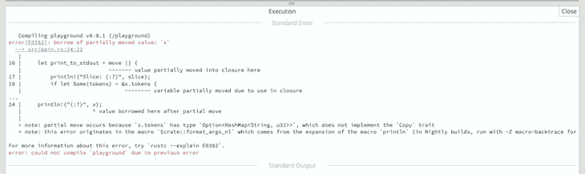

# 用闭包优化 Rust 代码:环境捕获

> 原文：<https://blog.logrocket.com/optimizing-rust-code-with-closures-environment-capturing/>

函数式编程的概念，即函数接受一个参数的类型或返回一个函数的类型，在 Rust 中形成了一个更广泛的闭包讨论，这对开发人员理解今天的内容很重要。

闭包是匿名的类似函数的构造，可以作为参数传递，存储在变量中，或者作为命名函数的值返回。

在本文中，我们将在 [Rust](https://blog.logrocket.com/tag/rust/) 中探索和学习闭包及其相关概念——例如，在 Rust 中使用带有迭代器的闭包，或者`move`关键字如何获得从闭包环境中捕获的值的所有权。我们将在 Rust with closures 中检查环境捕获的关键方面，并使用示例演示如何使用闭包来优化代码。

*向前跳转:*

## Rust 中的闭包与函数

在 Rust 中，闭包和函数是两种不同类型的代码块，服务于不同的目的。

以下是您需要了解的 Rust 中闭包和函数之间的主要区别:

### 句法

Rust 定义闭包和函数的语法略有不同。

闭包使用语法`|parameters| -> return_type { body }`，其中参数在竖线(`||`)之间传递，主体用花括号(`{}`)括起来。

另一方面，函数使用语法`fn name(parameters: type) -> return_type { body }`，其中参数在括号(`()`)之间传递，返回类型在箭头(`->`)之后指定。

### 身体

闭包的主体可以是单个语句，也可以是多个语句。

如果闭包只包含一条语句，花括号是可选的；但是，如果闭包由多个语句组成，那么主体必须用花括号括起来。

相反，函数体必须始终用花括号括起来，不管它是由单个语句还是多个语句组成。

### 返回类型

在 Rust 中，闭包的返回类型是可选的——这意味着您不必指定闭包返回的值类型。

然而，函数的返回类型是强制的——您必须使用语法`-> return_type`指定函数返回的值类型。

### 数据类型

在 Rust 中，您不必指定闭包中参数的数据类型。但是，您必须使用类型参数语法指定函数中参数的数据类型。

### 环境捕捉

Rust 中的闭包可以从它们的环境中捕获变量，而函数却不能。这意味着闭包可以引用外部定义的变量。

## 闭包语法

让我们先快速看一下闭包的语法定义:

```
let closure = |...| {...}

```

在上面的语法中，您可以在定义的`|…|`部分中为闭包定义不同的参数，闭包的主体在`{…}`部分中定义。

看一下这个代码块，了解我的意思:

```
fn main() {
  let closure = |x, y| { x + y };
  println!("{}", closure(1, 2)) // 3
}

```

就像函数一样，闭包使用名字和两个括号来执行。

这些参数在管道语法`||`之间定义。此外，您会注意到闭包中的参数和返回类型是推断出来的。

## 闭包类型推理和注释

上面的代码定义了一个名为“closure”的闭包，它接受两个参数`x`和`y`，并返回它们的和。闭包体由一条语句`x + y`组成，这条语句没有用花括号括起来，因为它是一条语句。

在 Rust 中，闭包的类型是基于其参数和返回值的类型来推断的。在这种情况下，闭包带两个类型为`i32`的参数，并返回一个类型为`i32`的值，因此闭包的类型被推断为`|x: i32, y: i32| -> i32`。

有时，您可能希望使用闭包类型注释来明确指定闭包类型；当 Rust 编译器不能推断闭包类型，或者当您想要为闭包指定一个更具体的类型时，这很有用。

* * *

### 更多来自 LogRocket 的精彩文章:

* * *

要指定闭包类型注释，可以使用语法`|parameters: types| -> return_type`。例如:

```
fn main() {
  let closure: |x: i32, y: i32| -> i32 = |x, y| { x + y };
  println!("{}", closure(1, 2)) // 3
}

```

在这种情况下，闭包类型被显式指定为`|x: i32, y: i32| -> i32`，这与推断的闭包类型相匹配。

总的来说，闭包类型推断和注释允许您在 Rust 中指定闭包的类型，这对于确保类型安全和代码整洁非常有用。

如前所述，闭包相对于函数的一个优点是，它们可以在定义变量的环境中捕获和封装变量。

让我们更详细地了解一下。

## 锈封环境捕捉

正如我们提到的，闭包可以从定义它们的环境中获取值——闭包可以借用或拥有这些周围的值。

让我们构建一个代码场景，其中我们可以在 Rust 中执行一些环境捕获:

```
use std::collections::HashMap;

#[derive(Debug)]
struct Nft {
    tokens: Option<HashMap<String, u32>>
}

fn main() {
    let x = Nft {
        tokens: Some(HashMap::from([(String::from("string"), 32)]))
    };

    let slice = vec![1, 3, 5];

    let print_to_stdout = || {
        println!("Slice: {:?}", slice);
        if let Some(tokens) = &x.tokens {
           println!("Nft supply --> {:?}", tokens); 
        }
    };

    print_to_stdout();
    println!("{:?}", x);
    print_to_stdout();
}

```

下面是您应该收到的输出:

```
Slice: [1, 3, 5]
Nft supply --> {"string": 32}
Nft { tokens: Some({"string": 32}) }
Slice: [1, 3, 5]
Nft supply --> {"string": 32}

```

在上面的代码片段中，我们将`x`定义为`Nft`结构的一个实例。我们还定义了一个`slice`变量——一种类型的`Vec<i32>`。然后，我们定义了一个存储在`print_to_stdout`变量中的闭包。

不用将两个变量(`x`和`slice`)作为参数传递给闭包，我们仍然可以在`print_to_stdout`闭包中不可变地访问它们。

`print_to_stdout`闭包捕获了对`x`和`slice`变量的不可变引用，因为它们是在与自身相同的作用域/环境中定义的。

此外，因为`print_to_stdout`闭包只有对变量的不可变引用——这意味着它不能改变变量的状态——我们可以多次调用闭包来打印值。

我们还可以通过稍微调整代码片段来重新定义闭包，以获取对变量的可变引用，如下所示:

```
// --snip--
fn main() {
  // --snip--
  let mut slice = vec![1, 3, 5];

  let print_to_stdout = || {
        slice.push(11);
        // --snip--
        println!("Slice: {:?}", slice);
    };

    print_to_stdout();
    println!("{:?}", slice);
}

```

以下是输出:

```
Slice: [1, 3, 5, 11]
[1, 3, 5, 11]

```

我们可以通过捕获对`slice`变量的可变引用来修改它的状态。

在执行完`print_to_stdout`闭包之后，被借用的引用被返回，这使得我们可以将`slice`值打印到`stdout`。

在我们想要获得周围变量的所有权的场景中，我们可以在闭包旁边使用`move`关键字。

当我们在闭包中取得变量的所有权时，我们经常想要改变变量的状态。

使用我们之前的示例，让我们看看这是如何工作的:

```
// --snip--
fn main() {
  // --snip--

  //Redefined the closure using move keyword
  let print_to_stdout = move || {
        slice.push(11);
        // --snip--
        println!("Slice: {:?}", slice);
    };

  print_to_stdout();
}

```

现在，我们已经明确地将变量移动到闭包中，并取得它们的值的所有权。

如果您尝试像前面的代码块一样调用`println!("{:?}", slice);`，您将得到一个错误，解释该变量由于在闭包中的使用而被移动(如下所示)。



## 闭包作为函数的参数

前面，我们解释了闭包如何作为参数传递给函数，甚至作为值从函数返回。

让我们探索如何使用函数的不同定义和 [trait](https://blog.logrocket.com/rust-traits-a-deep-dive/) 界限来实现这些行为。

首先，让我们看看三个`Fn`特征，因为由于函数签名定义或主体内容的性质，闭包会自动实现一个、两个或全部三个特征。所有闭包至少都实现了`FnOnce`特征。

以下是对这三个特征的解释:

*   任何将捕获的变量返回到其调用环境的闭包都实现了这一特性
*   这个特性代表闭包，它可能会改变捕获的值，并且不会将捕获的值作为返回值移出闭包的主体
*   这个特征既不变异，不返回捕获的值，也不从它的定义范围捕获变量

这些规则是我们在项目中为不同用途定义闭包时的指路明灯。

让我们通过实现上面提到的特征之一来演示一个样例用例:

```
#[derive(Debug)]
enum State<T> {
    Received(T),
    Pending,
}

impl<T> State<T> {
    pub fn resolved<F>(self, f: F) -> T
    where F: FnOnce() -> T
    {
        match self {
            State::Received(v) => v,
            State::Pending => f(),
        }
    }
}

fn main() {
    let received_state = State::Received(String::from("LogRocket"));
    println!("{:?}", received_state.resolved(|| String::from("executed closure")));

    let pending_state = State::Pending;
    println!("{:?}", pending_state.resolved(|| String::from("executed closure")))
}

```

这是我们的输出:

```
"LogRocket"
"executed closure"

```

在上面的代码片段中，我们创建了一个示例`State` enum 来假想地表示一个网络调用，该调用具有一个`Received(T)`状态和一个`Pending`状态。在 enum 上，我们实现了一个函数来检查网络调用的状态并相应地采取行动。

查看函数签名，您会注意到函数的`f`参数是一个通用参数:一个`FnOnce`闭包。

使用 trait bounding ( `F: FnOnce() -> T`)，我们为`f,`定义了可能的参数值，这意味着`F`最多只能被调用一次，不带任何参数，并返回一个泛型值`T`。

如果我们有一个已实现的状态——`Received(T)`变量——我们返回已实现状态中包含的值，就像我们对`received_state`变量所做的那样。

当状态恰好是`Pending`时，闭包参数将被调用，就像`pending_state`一样。

## 使用带有迭代器的闭包来处理集合

在这一节中，您将了解闭包最常见的用例之一；使用带有[迭代器](https://blog.logrocket.com/rust-iterators-closures-deep-dive/)的闭包来处理集合中的一系列顺序数据。

迭代器模式对存储在 Rust 集合中的这个项目序列执行渐进式任务。

> **注意，**要进一步阅读迭代器，请查看 [Rust 文档](https://doc.rust-lang.org/book/ch13-02-iterators.html)。

让我们通过首先定义一个向量变量来进一步解释闭包如何与迭代器一起工作:

```
#[derive(PartialEq, Debug)]
struct MusicFile {
    size: u32,
    title: String,
}

fn main() {
    let files = vec![
            MusicFile {
                size: 1024,
                title: String::from("Last last"),
            },
            MusicFile {
                size: 2048,
                title: String::from("Influence"),
            },
            MusicFile {
                size: 1024,
                title: String::from("Ye"),
            },
        ];

        let max_size = 1024;

        let accepted_file_sizes: Vec<MusicFile> = files.into_iter().filter( |s| s.size == max_size).collect();

        println!("{:?}", accepted_file_sizes);
}

```

这是我们的输出:

```
[MusicFile { size: 1024, title: "Last last" }, MusicFile { size: 1024, title: "Ye" }]

```

在上面的代码片段中，我们使用`into_iter`方法将`files`变量改编成迭代器，可以在`Vec<T>`类型上调用该方法。

`into_iter`方法创建迭代器类型的消费适配器类型。这个迭代器将每个值移出`files`变量(从开始到结束)，这意味着我们不能在调用变量后使用它。

我们直接在`filter`函数中定义它，以调用闭包作为参数。然后，我们使用最后一个函数调用`collect()`，将迭代器消费并转换回 Rust 集合；在这种情况下，`Vec<MusicFile>`型。

## 结论

闭包是与普通函数或迭代器一起使用的类似函数的结构，用于处理存储在 Rust 集合中的顺序项。

您可以实现一个特定的闭包类型，这取决于您希望将它用于什么样的上下文——这使您可以灵活地获取被捕获变量的所有权，或者借用对变量的引用，或者两者都不做！

根据您在 Rust 中的函数式编程需求，用于环境捕获的闭包会带来很大的好处，让您的生活变得更加轻松。让我知道你在 Rust 中使用闭包和环境捕捉的经历吧！

## [log rocket](https://lp.logrocket.com/blg/rust-signup):Rust 应用的 web 前端的全面可见性

调试 Rust 应用程序可能很困难，尤其是当用户遇到难以重现的问题时。如果您对监控和跟踪 Rust 应用程序的性能、自动显示错误、跟踪缓慢的网络请求和加载时间感兴趣，

[try LogRocket](https://lp.logrocket.com/blg/rust-signup)

.

[](https://lp.logrocket.com/blg/rust-signup)

LogRocket 就像是网络和移动应用程序的 DVR，记录你的 Rust 应用程序上发生的一切。您可以汇总并报告问题发生时应用程序的状态，而不是猜测问题发生的原因。LogRocket 还可以监控应用的性能，报告客户端 CPU 负载、客户端内存使用等指标。

现代化调试 Rust 应用的方式— [开始免费监控](https://lp.logrocket.com/blg/rust-signup)。