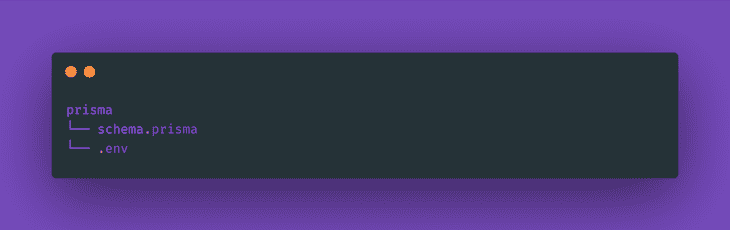
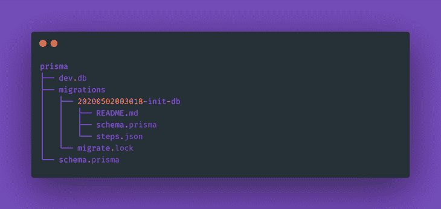
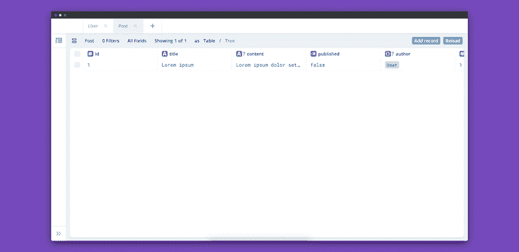
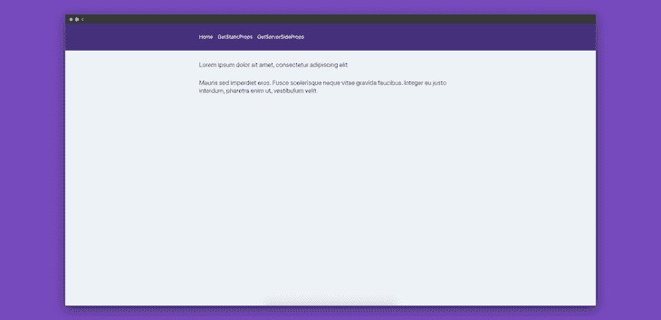
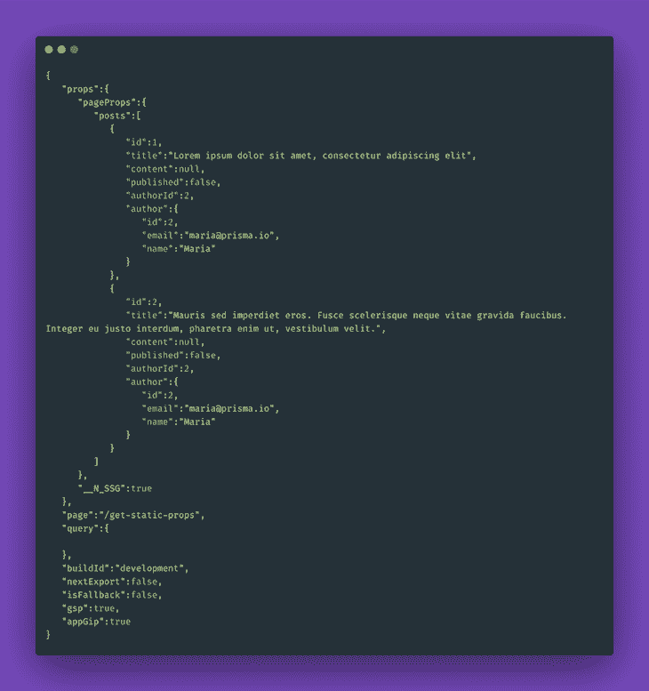
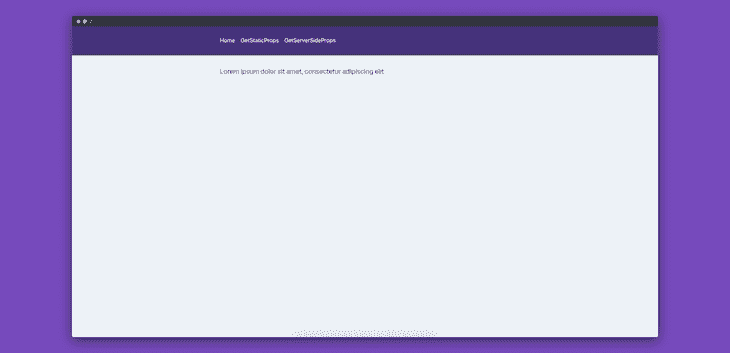

# 使用 Prisma 优化 Next.js 应用程序中的静态页面

> 原文：<https://blog.logrocket.com/optimizing-static-pages-next-js-prisma/>

我使用 [Next.js](https://nextjs.org) 构建应用程序已经有一段时间了，它所提供的开发者体验一直让我感到惊讶。使用 Next.js 很容易构建一个高性能的服务器端呈现(SSR)应用程序。

在[9.3](https://nextjs.org/blog/next-9-3)版本中，Next 引入了一些令人惊叹的功能，包括:

在这篇文章中，我们将主要讨论下一代 SSG 支持，以及为什么将 Next.js 应用程序与 Prisma 集成会使这一功能更加强大。本文中的所有代码片段都可以在 [GitHub](https://github.com/ghoshnirmalya/prisma-next.js) 上获得。

## 为什么要用 Prisma 搭配 Next.js？

Prisma 是一个开源的数据库工具包。它通过提供一个类型安全的 API 来帮助我们查询数据库。 [Prisma Client](https://github.com/prisma/prisma-client-js) 是一个自动生成的查询构建器，提供对我们数据库的类型安全访问。

### 将 Prisma 与 Next.js 集成

将 Prisma 客户端与 Next.js 集成非常容易。我们需要首先安装[依赖项](https://github.com/prisma/prisma-client-js):

```
yarn add @prisma/client
```

接下来，我们需要[初始化 Prisma](https://www.prisma.io/docs/reference/tools-and-interfaces/prisma-cli/command-reference#init) 。从项目根目录运行以下命令:

```
npx prisma init
```

这将生成以下文件:



Initializing Prisma in our app.

1.  `schema.prisma`–带有数据库连接和 Prisma 客户端生成器的 Prisma 模式
2.  `.env`–用于定义环境变量的 dotenv 文件(用于我们的数据库连接)

我们将在应用程序中使用 SQLite，所以让我们修改一下我们的`.env`文件:

```
// prisma/.env

DATABASE_URL="file:./dev.db"
```

让我们也修改我们的模式文件来添加两个模型:

1.  邮政
    1.  `id`
    2.  `title`
    3.  `content`
    4.  `published`
    5.  `author`
    6.  `authorId`
2.  用户
    1.  `id`
    2.  `email`
    3.  `name`
    4.  `posts`

```
// prisma/schema.prisma

datasource db {
  provider = "sqlite"
  url      = env("DATABASE_URL")
}

generator client {
  provider = "prisma-client-js"
}

model Post {
  id        Int     @id @default(autoincrement())
  title     String
  content   String?
  published Boolean @default(false)
  author    User?   @relation(fields: [authorId], references: [id])
  authorId  Int?
}

model User {
  id    Int     @id @default(autoincrement())
  email String  @unique
  name  String?
  posts Post[]
}

```

接下来，我们需要[迁移我们的数据库](https://www.prisma.io/docs/reference/tools-and-interfaces/prisma-cli/command-reference#migrations-experimental)。为此，我们将运行以下命令:

```
npx prisma migrate save --experimental && npx prisma migrate up --experimental
```

现在，我们的 Prisma 目录将如下所示:



Our directory structure after running migrations.

接下来，我们需要[生成我们的 Prisma 客户端](https://www.prisma.io/docs/reference/tools-and-interfaces/prisma-client/generating-prisma-client)。我们可以使用以下命令来实现这一点:

```
npx prisma generate
```

请注意，我们需要在更改 Prisma 模式后运行`prisma generate`命令来更新生成的 Prisma 客户端代码。另外，当我们安装`[@prisma/client](https://github.com/prisma/prisma-client-js)` npm 模块时，`prisma generate`会被自动调用。

现在我们可以在代码中使用 Prisma，如下所示:

```
// pages/get-static-props/index.js

import { PrismaClient } from "@prisma/client";
import { Stack, Box, Link } from "@chakra-ui/core";
import _Link from "next/link";

const IndexPage = ({ posts }) => {
  return (
    <Stack spacing={4}>
      {posts.map((post) => {
        return (
          <Box key={post.id}>
            <_Link
              href="/get-static-props/[postId]"
              as={`/get-static-props/${post.id}`}
            >
              <Link>{post.title}</Link>
            </_Link>
          </Box>
        );
      })}
    </Stack>
  );
};

export async function getStaticProps() {
  const prisma = new PrismaClient();
  const posts = await prisma.post.findMany();

  return {
    props: {
      posts,
    },
  };
}

export default IndexPage;
```

我们可以使用以下命令通过 [Prisma Studio](https://www.prisma.io/docs/reference/tools-and-interfaces/prisma-cli/command-reference#studio-experimental) 查看我们的数据:

```
npx prisma studio --experimental
```

如果我们现在访问`[http://localhost:5555/](http://localhost:5555/)`，我们应该能够看到工作室。



Previewing Prisma Studio.

从这里，我们可以通过这个界面管理数据。

## 什么是静态网站生成？

在构建 web 应用程序时，我们可以选择让我们的应用程序静态生成，或者在服务器端呈现。

在 9.3 版本发布之前，任何用 Next.js 构建的应用都可以选择进入[自动静态优化](https://nextjs.org/blog/next-9#automatic-static-optimization)。任何没有使用`[getInitialProps](https://nextjs.org/docs/api-reference/data-fetching/getInitialProps)`的阻塞请求的页面都将被自动优化，并且该页面将被呈现为静态 HTML。

然而，不可能为动态路由生成静态页面。有了`[getStaticProps](https://nextjs.org/docs/basic-features/data-fetching#getstaticprops-static-generation)`和`[getServerSideProps](https://nextjs.org/docs/basic-features/data-fetching#getserversideprops-server-side-rendering)`，现在可以用 Next.js 做 SSG 了

## `getStaticProps`

如果我们导出一个名为`getStaticProps`的`async`函数，Next.js 将在构建期间获取该页面的数据，并将其作为 JSON 存储在页面中。当我们希望在从 API 获取数据的同时呈现静态页面时，这很有用。

例如，如果我们在页面中定义了一个`getStaticProps`异步函数，它可以在构建时获取数据，并将数据作为 props 发送给组件。

```
// pages/get-static-props/index.js

export async function getStaticProps() {
  const prisma = new PrismaClient();
  const posts = await prisma.post.findMany({
    include: { author: true },
  });
  return {
    props: { // This will be sent to the component as props
      posts, 
    },
  };
}
```

在组件中，我们可以访问作为道具的`posts`数据:

```
// pages/get-static-props/index.js

const GetStaticPropsIndexPage = ({ posts }) => {
  return (
    <Stack spacing={4}>
      {posts.map((post) => {
        return (
          <Box key={post.id}>
            <Heading mb={4} size="md">
              {post.title}
            </Heading>
          </Box>
        );
      })}
    </Stack>
  );
};
```

以上内容将按预期呈现:



Fetching data using getStaticProps.

`getStaticProps`将在构建期间生成以下 JSON:



JSON generated at build time.

现在，如果我们访问`[http://localhost:3000/get-static-props/1](http://localhost:3000/get-static-props/1)`，我们将看到以下页面:



Our first post page.

要查看这个页面，我们必须添加另一个名为`[getStaticPaths](https://nextjs.org/docs/basic-features/data-fetching#getstaticpaths-static-generation)`的`async`函数:

```
// pages/get-static-props/[postId].js

export async function getStaticProps(ctx) {
  const prisma = new PrismaClient();
  const post = await prisma.post.findOne({
    where: {
      id: parseInt(ctx.params.postId),
    },
  });
  return {
    props: {
      post,
    },
  };
}
export async function getStaticPaths() {
  return {
    paths: [{ params: { postId: "1" } }],
    fallback: false,
  };
}
```

Next.js 将在构建时使用`pages/get-static-props/[postId].js`中的页面组件静态生成`/1`。如果我们现在访问`[http://localhost:3000/get-static-props/1](http://localhost:3000/get-static-props/1)`并刷新页面，我们就能够查看页面。然而，如果我们对`[http://localhost:3000/get-static-props/2](http://localhost:3000/get-static-props/2)`做同样的事情，我们会得到 404。

为了解决这个问题，我们需要将 postId `2`也添加到`paths`数组中:

```
paths: [{ params: { postId: "1" } }, { params: { postId: "2" } }],
```

现在，`[http://localhost:3000/get-static-props/2](http://localhost:3000/get-static-props/2)`页面可以正常加载了。

## `getServerSideProps`

如果我们在页面中导出一个名为`getServerSideProps`的`async`函数，Next.js 将使用`getServerSideProps`返回的数据在每次请求时预渲染页面。`getServerSideProps`每次我们加载页面时都会被调用，但是代码只在服务器上执行，不像`getInitialProps`。

```
// pages/get-server-side-props/index.js

export async function getServerSideProps() {
  const prisma = new PrismaClient();
  const posts = await prisma.post.findMany();
  return {
    props: {
      posts,
    },
  };
}
```

我们也可以在 http://localhost:3000/get-server-side-props/1 获取单个帖子:

```
// pages/get-server-side-props/index.js

export async function getServerSideProps(ctx) {
  const prisma = new PrismaClient();
  const post = await prisma.post.findOne({
    where: {
      id: parseInt(ctx.params.postId),
    },
  });
  return {
    props: {
      post,
    },
  };
}
```

## 结论

在这篇文章中，我们学习了如何使用像`getStaticProps`、`getServerSideProps`和 Prisma 这样的高级特性使我们的 Next.js 应用程序更快。到目前为止，我们一直使用`getInitialProps`，这将使页面预渲染。但是，任何后续的页面重定向都将在客户端获取新数据。

有了`getServerSideProps`，每次数据都会在服务器上提取，甚至在页面重定向上。使用`getStaticProps`，在构建时获取数据；不会在客户端调用。因此，SSG 页面变得非常快。

## [LogRocket](https://lp.logrocket.com/blg/nextjs-signup) :全面了解生产 Next.js 应用

调试下一个应用程序可能会很困难，尤其是当用户遇到难以重现的问题时。如果您对监视和跟踪状态、自动显示 JavaScript 错误、跟踪缓慢的网络请求和组件加载时间感兴趣，

[try LogRocket](https://lp.logrocket.com/blg/nextjs-signup)

.

[](https://lp.logrocket.com/blg/nextjs-signup)[](https://lp.logrocket.com/blg/nextjs-signup)

LogRocket 就像是网络和移动应用的 DVR，记录下你的 Next.js 应用上发生的一切。您可以汇总并报告问题发生时应用程序的状态，而不是猜测问题发生的原因。LogRocket 还可以监控应用程序的性能，报告客户端 CPU 负载、客户端内存使用等指标。

LogRocket Redux 中间件包为您的用户会话增加了一层额外的可见性。LogRocket 记录 Redux 存储中的所有操作和状态。

让您调试 Next.js 应用的方式现代化— [开始免费监控](https://lp.logrocket.com/blg/nextjs-signup)。