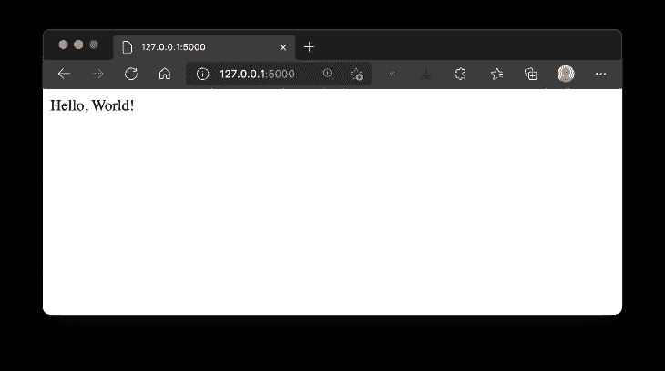
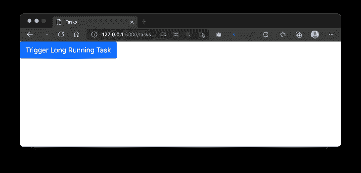
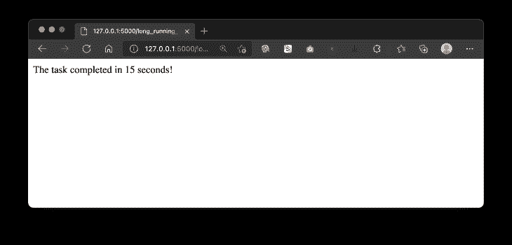
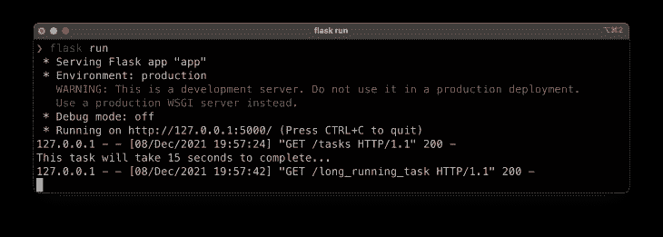
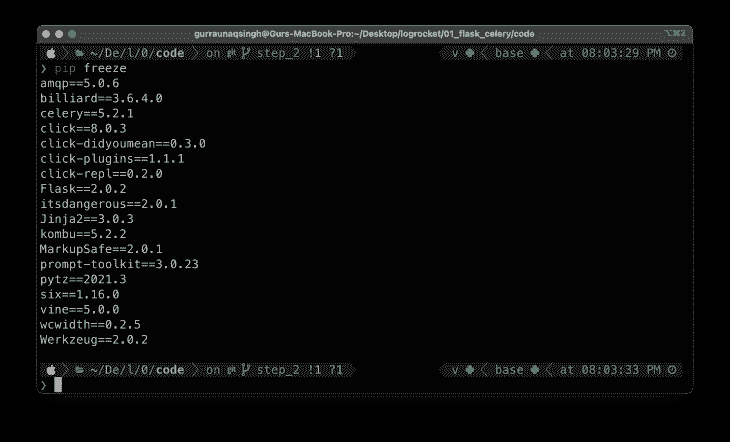
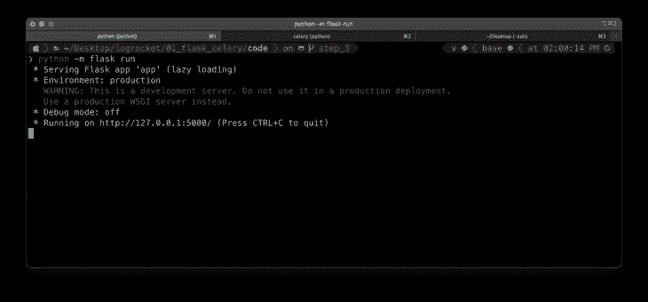
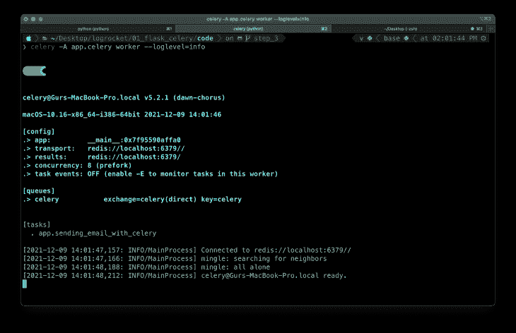

# 用芹菜和 Flask 优化任务队列

> 原文：<https://blog.logrocket.com/optimizing-task-queues-celery-flask/>

如果你偶然看到这篇文章，很可能你已经熟悉了 [Flask](https://flask.palletsprojects.com/en/2.0.x/) ，并且你正在为你的 web 应用程序添加一个需要几秒钟(如果不是更多)才能执行的特性。也许你想知道是否有更好或更快的方法。

一些常见的例子包括:

*   调用第三方 API 根据用户输入获取一些数据
*   注册时向用户发送电子邮件
*   生成 PDF 报告

这些类型的任务会阻塞请求/响应周期，直到它完成，这意味着用户需要等待一段时间。

要像这样卸载长时间运行的任务，您可以使用 [Celery](https://docs.celeryproject.org/en/stable/getting-started/introduction.html) ，它提供了一种将这些任务卸载到单独的工作线程的机制。

Celery 通过消息进行通信，通常使用一个代理在客户和工人之间进行调解。为了启动一个任务，Celery 客户机向队列添加一条消息，然后代理将这条消息传递给一个工人。

最常用的经纪人是 [Redis](https://redis.io/) 和 [RabbitMQ](https://www.rabbitmq.com/) 。我们将在本地设置一个 Redis 服务器来利用这种机制。

## 先决条件

此外，还需要具备 Python 和 Flask 的中级知识。随着文章的进展，其他内容将会得到解释。

## 设置项目

下载 [starter 项目](https://github.com/raunaqness/flask_celery_tutorial/tree/step_1)并使用以下命令设置它:

```
git clone -b step_1 https://github.com/raunaqness/flask_celery_tutorial.git
cd flask_celery_tutorial

# make virtualenv
virtualenv v
source v/bin/activate

# install dependencies
pip install -r requirements.txt

# start server
export FLASK_APP=app; python -m flask run

```

在你的浏览器中打开`[http://127.0.0.1:5000/](http://127.0.0.1:5000/)`，如果一切正常，你应该可以看到“你好，世界！”。



接下来，让我们添加一个将包含一个`Button`的路由，单击它将触发一个模拟的长时间运行的任务，比如发送一封电子邮件、生成一个 PDF 报告、调用一个第三方 API 等。

我们将使用`time.sleep()`来模拟这个 API，它将阻止应用程序运行 15 秒钟。

打开`[app.py](http://app.py)`并添加以下代码块。

```
# route that will show will simply render an HTML template
@app.route("/tasks")
def tasks():
    return render_template("tasks.html")

# route that will execute a long-running task
@app.route("/long_running_task")
def long_running_task():
    # time in seconds 
    time_to_wait = 15

    print(f"This task will take {time_to_wait} seconds to complete...")
    time.sleep(time_to_wait)

    return f"<p>The task completed in {time_to_wait} seconds!"

```

确保通过在文件顶部添加以下内容以及导入语句来导入`time`模块:

```
import time

```

接下来，在项目的根目录下创建一个名为`templates`的目录。在其中，创建一个名为`tasks.html`的新文件，并添加以下内容:

```
<!DOCTYPE html>
<html>

<head>
    <title>Tasks</title>
    <meta charset="utf-8" />
    <meta name="viewport" content="width=device-width, initial-scale=1" />

    <!-- Bootstrap CSS -->
    <link href="https://cdn.jsdelivr.net/npm/[email protected]/dist/css/bootstrap.min.css" rel="stylesheet"
        integrity="sha384-1BmE4kWBq78iYhFldvKuhfTAU6auU8tT94WrHftjDbrCEXSU1oBoqyl2QvZ6jIW3" crossorigin="anonymous" />
</head>

<body>
    <script src="https://cdn.jsdelivr.net/npm/[email protected]/dist/js/bootstrap.bundle.min.js"
        integrity="sha384-ka7Sk0Gln4gmtz2MlQnikT1wXgYsOg+OMhuP+IlRH9sENBO0LRn5q+8nbTov4+1p"
        crossorigin="anonymous"></script>

    <div>
        <a class="btn btn-primary" href="/long_running_task" role="button">Trigger Long Running Task</a>
    </div>
</body>

</html>

```

您的项目结构应该如下所示:

```
code
├── __pycache__
│   └── app.cpython-38.pyc
├── app.py
├── requirements.txt
└── templates
    └── tasks.html

2 directories, 4 files

```

回到终端，停止并重新启动 Flask 服务器，然后在浏览器中打开`[http://127.0.0.1:5000/tasks](http://127.0.0.1:5000/tasks)`。您应该看到用一个按钮呈现的`tasks.html`页面。



现在，当你点击**触发长期运行任务**按钮时，它将执行到路径`/long_running_task`，该路径将执行`[app.py](http://app.py)`文件中定义的函数`def long_running_task()`。

请注意，页面将处于“加载”状态 15 秒钟，因此您的应用程序将停留在该状态，并且在当前操作完成之前不能执行任何其他操作。

15 秒钟后，您应该看到任务完成，并在浏览器中看到预期的响应。



另外，请注意，当长时间运行的任务正在执行时，您将能够在终端窗口中看到`print`语句。



现在，让我们看看如何使用芹菜 *在后台运行这个任务。*

 *如果你有任何问题，你应该可以在这里看到你的项目的当前状态。

## 设置芹菜和 Redis

您已经在初始设置中安装了`Celery` python 包。为了确认软件包的安装，您可以在您的终端窗口中运行`pip freeze`并激活`virtualenv`来查看所有安装的软件包。



接下来，您需要在本地机器上安装 Redis 服务器。你可以在这里找到官方的安装说明。

现在，让我们来摆放芹菜。

### 芹菜入门

在项目根目录下创建一个名为`celery_utils.py`的新文件。这将用于初始化 Celery 应用程序实例，类似于我们如何在`app.py`中初始化 Flask 应用程序。将以下代码添加到文件中:

```
from celery import Celery

# celery config
CELERY_BROKER_URL = 'redis://localhost:6379'
CELERY_RESULT_BACKEND = 'redis://localhost:6379'

# initialize celery app
def get_celery_app_instance(app):
    celery = Celery(
        app.import_name,
        backend=CELERY_BROKER_URL,
        broker=CELERY_BROKER_URL
    )
    celery.conf.update(app.config)

    class ContextTask(celery.Task):
        def __call__(self, *args, **kwargs):
            with app.app_context():
                return self.run(*args, **kwargs)

    celery.Task = ContextTask
    return celery

```

下面简单解释一下:

*   芹菜 python 包是导入的
*   定义了函数`get_celery_app_instance`，它将返回 Celery 的一个实例，该实例又需要以下参数进行初始化:
    *   这是芹菜工人的名字
    *   `backend`:这是要使用的后端的 URL，在本例中是 Redis，主机 URL 用变量`CELERY_BROKER_URL`定义
    *   `broker`:与后端类似，需要定义代理的 URL，代理也是 Redis 服务器
*   `<explain ContextTask>`
*   `<return instance of celery app>`

接下来，让我们用芹菜来定义一个长期运行的任务。在`[app.py](http://app.py)`中进行以下更改:

在导入语句附近添加以下内容。

```
# importing function to get celery app instance
from celery_utils import get_celery_app_instance

```

在初始化 Flask 应用程序的语句后添加以下内容:

```
# celery app instance
celery = get_celery_app_instance(app)

```

接下来，在文件底部添加以下代码块:

```
# celery tasks
@celery.task
def sending_email_with_celery():
    print("Executing Long running task : Sending email with celery...")
    time.sleep(15)
    print("Task complete!")

```

这里，我们简单地定义了一个名为`sending_email_with_celery()`的函数，它将模拟发送一封可能需要 15 秒才能完成的电子邮件的功能。

然而，为了使这个函数作为后台任务运行，修饰器`@celery.task`被添加到函数定义的上一行。

如果你不熟悉 Python 中的 decorators，[这里有一篇很好的入门文章](https://realpython.com/primer-on-python-decorators/)。

最后，定义一条路由来触发此功能:

```
# route to trigger celery task
@app.route("/long_running_task_celery")
def long_running_task_celery():
    # function.delay() is used to trigger function as celery task
    sending_email_with_celery.delay()
    return f"Long running task triggered with Celery! Check terminal to see the logs..."

```

在这个代码块中，我们定义了路由`/long_running_task_celery`，它触发了一个芹菜任务函数。注意，这个函数是通过使用`delay()`方法调用的。

这表明我们希望将这个函数作为一个芹菜任务来运行，而不是作为一个常规的 Python 函数。

最后，为了看到这一点，让我们在`tasks.html`中添加另一个按钮来触发该功能。

```
<div>
    <a class="btn btn-primary" href="/long_running_task" role="button">Trigger Long Running Task</a>
</div>

<!-- new code -->
<div>
    <a class="btn btn-primary" href="/long_running_task_celery" role="button">Trigger Long Running Task with Celery</a>
</div>

```

> 注意:这里是这个部分的 [GitHub repo](https://github.com/raunaqness/flask_celery_tutorial/tree/step_3) 。

是时候看看它的实际效果了！

确保 Flask 服务器在终端窗口中运行。



在另一个终端窗口中，`cd`到项目的根并运行下面的命令来启动芹菜工。

```
celery -A app.celery worker --loglevel=info
```


在浏览器中打开`[http://127.0.0.1:5000/tasks](http://127.0.0.1:5000/tasks)`,您会看到两个按钮:

1.  用 Python 触发一个长期运行的函数
2.  用芹菜触发一个长期运行的功能

我们已经看到，如果我们用 Python 触发一个长时间运行的函数，服务器会一直被阻塞，直到该函数的执行完成。

现在，如果您单击按钮`Trigger Long-Running Task with Celery`，您将看到页面立即重定向到路由`/long_running_task_celery`，并且您将在浏览器窗口中看到预期的输出。


在后台，Celery 正在执行该函数。要查看函数运行的日志，请切换到启动 Celery worker 的终端窗口。它应该是这样的:



## 结论

就是这样！现在，您已经知道如何在 Flask web 应用程序中使用 Celery 设置和运行长时间运行的任务。这里有一个快速回顾。要将函数作为芹菜任务运行，您需要:

## 使用 [LogRocket](https://lp.logrocket.com/blg/signup) 消除传统错误报告的干扰

[](https://lp.logrocket.com/blg/signup)

[LogRocket](https://lp.logrocket.com/blg/signup) 是一个数字体验分析解决方案，它可以保护您免受数百个假阳性错误警报的影响，只针对几个真正重要的项目。LogRocket 会告诉您应用程序中实际影响用户的最具影响力的 bug 和 UX 问题。

然后，使用具有深层技术遥测的会话重放来确切地查看用户看到了什么以及是什么导致了问题，就像你在他们身后看一样。

LogRocket 自动聚合客户端错误、JS 异常、前端性能指标和用户交互。然后 LogRocket 使用机器学习来告诉你哪些问题正在影响大多数用户，并提供你需要修复它的上下文。

关注重要的 bug—[今天就试试 LogRocket】。](https://lp.logrocket.com/blg/signup-issue-free)

1.  在您的文件中导入 Celery 应用程序的实例
2.  在函数定义的顶部添加装饰器`@celery.task`
3.  使用`function_name.delay()`方法运行功能*