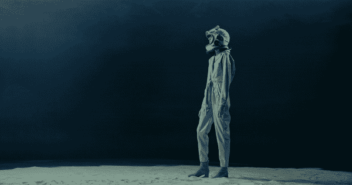
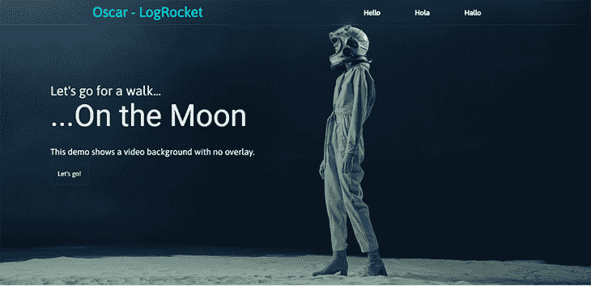
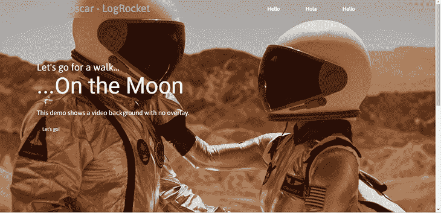
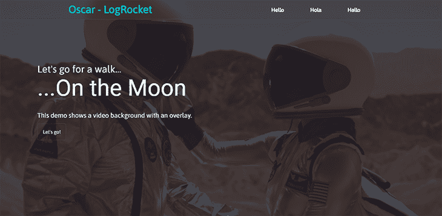
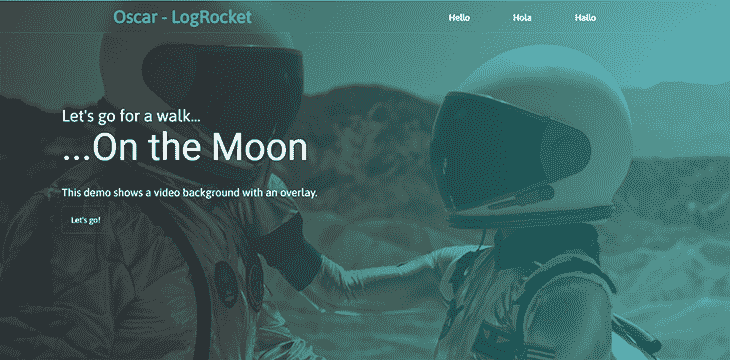
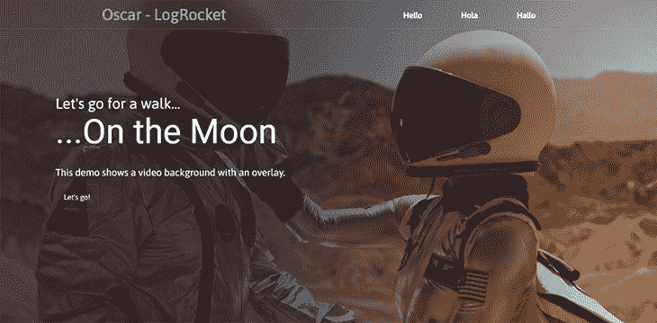
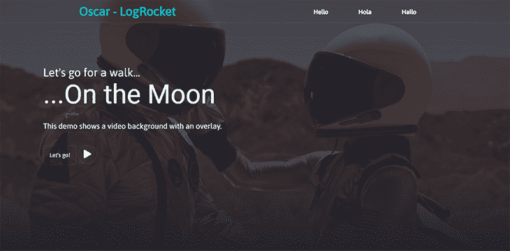

# 优化 CSS 和 JavaScript 中的视频背景

> 原文：<https://blog.logrocket.com/optimizing-video-backgrounds-css-javascript/>

通常，网站的背景颜色很简单——只是一个很大的空白空间。在 CSS 中，您可以使用`background`属性及其所有变体来创建背景。背景是用来增强网站的外观的，所以正确使用背景很重要。

一个非常酷的选择是使用一个视频作为 CSS 的背景，但要让它无缝地工作可能有点棘手。在本文中，您将学习如何使用 CSS 和 JavaScript 添加视频作为网站的背景，以及如何在不影响性能的情况下使其具有响应性和交互性。

重点将放在网站的页眉部分，但视频背景可以放在网站的其他部分。您可以使用全屏或部分背景。我们开始吧！

## 如何创建视频背景

使用`video` HTML 元素，我们可以设置一个视频作为我们网站的背景。这里有两个选择:按原样使用视频，或者添加一个覆盖。[然后我们可以使用`position`属性在它上面添加一些文本](https://blog.logrocket.com/creative-text-styling-with-the-css-mix-blend-mode-property/)或其他元素。

## 照原样使用视频

这只是让视频以其原始的视觉状态播放，然后让你的文本或任何元素直接放在它上面。

首先，你需要一个好的视频，最好是适合网站整体主题的视频。这里有一个来自 [Pexels](https://www.pexels.com/video/a-woman-walking-in-the-moon-in-a-conceptual-video-7170789/) :



让我们开始创建视频背景。设置 HTML 的方式由你决定。你可以在页面上有任何你想要的元素，但最重要的是视频在那里的某个地方:

```
 <body>
    <section id="#main">
      <video src="walking on the moon.mp4" muted autoplay loop></video>
    </section>
</body>

```

我使用 HTML5 `video`标签添加了视频，您可以包含三个属性。第一个属性`muted`，从视频中删除声音。`autoplay`属性会让视频自动播放，视频会用`loop`属性连续循环播放。

对于本教程，这里有一个完整的语法，所以你可以遵循:

```
<body>
  <section id="main">
    <nav>
     <div class="logo">
        <a href="#">Oscar - LogRocket</a>
     </div>
        <ul class="menu">
          <li><a href="#">Hello</a></li>
          <li><a href="#">Hola</a></li>
          <li><a href="#">Hallo</a></li>
        </ul>
    </nav>
      <video src="walking on the moon.mp4" muted autoplay loop></video>
      <div class="main-text">
        <h2>Let's go for a walk...</h2>
        <h1>...On the Moon</h1>
        <p>
          This demo shows a video background with no overlay.
        </p>
        <a href="#" class="btn">Let's go!</a>
      </div>
  </section>
</body>

```

CSS 也是一样，你可以根据自己的喜好设计每个元素的样式。以下是我对视频背景的设计:

```
#main video{
  position: absolute;
  top: 0;
  left: 0;
  width: 100%;
  height: 100%;
  object-fit: cover;
}

```

让我们回顾一下上述每个属性。先说第一件事`position`。它被设置为`absolute`，意味着它相对于网页的顶部和侧面。剩下的语法是删除视频周围的任何空间(`top`和`left`)，并确保视频完全适合页面(因为我们要全屏显示背景)。

以下是该页面的截图:



这里有比截图更好的东西，现场演示！最佳视角为 0.5x:

看笔 [视频背景无叠加](https://codepen.io/oscar-jite/pen/qBYBYVx)由 Oscar-Jite([@ Oscar-Jite](https://codepen.io/oscar-jite))
上 [CodePen](https://codepen.io) 。

重要的是文本和视频之间要有良好的对比。正如您从演示中所看到的，文本非常清晰。

## 将覆盖添加到视频背景

当视频上的文本难以辨认时，在背景上添加一个覆盖层会特别有用。或者，如果视频令人分心，你想降低音量。

在这里你可以找点乐子！覆盖可以是简单透明的颜色，也可以是渐变颜色。对于渐变，您可以使用颜色到颜色渐变或颜色到透明叠加。

颜色到颜色渐变将两种不同的颜色混合在一起。通过颜色到透明的渐变，视频可以逐渐淡入下一部分的颜色。

这次我们将使用一个更亮的视频，这样叠加效果就能真正显现出来。这里有一个，也是来自 [Pexels](https://www.pexels.com/video/a-couple-of-astronauts-holding-hands-8474609/) :


让我们看看没有覆盖时的样子:



在这里，由于视频背景的原因，文本可能会丢失。叠加可以增加对比度，使文本更加清晰可见。

### 素色覆盖

让我们开始吧，我们使用和以前一样的设置。这一次我们在 HTML 代码中使用一个空的`div`作为覆盖:

```
<body>
    <section id="#main">
      <div class="overlay"></div>
      <video src="video.mp4" muted autoplay loop></video>
    </section>
</body>

```

在 CSS 代码中，首先将它准确地定位在视频背景上。这是因为它的大小也是一样的。然后，用`background`属性给它一个颜色:

```
.overlay{
  position: absolute;
  top: 0;
  left: 0;
  width: 100%;
  height: 100%;
  background: rgba(48,25,52,0.75);
}

```

这是结果:



好多了。

### 渐变叠加

因为我们正在处理渐变，我们将使用`background-image`属性。[确切地说，这将是一场](https://blog.logrocket.com/complex-patterns-using-css-gradients/) `linear-gradient`。方向由你决定，但最好是水平或垂直方向，以保持一致性:

```
.overlay{
  background-image: linear-gradient(to right, rgba(34,35,46,0.75), 
  rgba(0,194,203,0.5));
}

```



确保渐变中与文本重叠的部分不会影响文本的可读性。

接下来，我们有颜色到透明的渐变，也就是说，一种颜色逐渐消失。您可以设定颜色过渡开始的时间点:

```
background-image: linear-gradient(to right, rgba(34,35,46,0.75) 40%, 
rgba(0,0,0,0));

```



这里，覆盖从左边的深蓝色过渡到右边的视频背景的原始状态。

您也可以让过渡垂直发生。渐变混合到视频背景后面的下一部分:

`background-image: linear-gradient(to bottom, rgba(34,35,46,0.75) 50%, rgba(34,35,46));`

看 [CodePen](https://codepen.io) 上 Oscar-Jite([@ Oscar-Jite](https://codepen.io/oscar-jite))
渐变叠加的 Pen [视频背景。](https://codepen.io/oscar-jite/pen/OJZVzOo)

## 使视频背景具有响应性

调整窗口大小时，视频背景通常是静态的，纵横比不会改变。它会有一定程度的响应，但不会随着视口变小而缩放。

最常见(或普遍接受)的纵横比是 16:9。这是几乎所有带屏幕的现代设备的默认设置。我们将使用媒体查询来设置我们的视频背景，以保持此纵横比:

```
@media (min-aspect-ratio: 16/9) {
  video {
    width: 100%;
    height: auto;
  }
}
@media (max-aspect-ratio: 16/9) {
  video {
    width: auto;
    height: 100%;
  }
}

```

这里，我们说的是在任何宽度大于 16:9 的视口中，宽度应该是固定的，高度应该相应地缩放。较小的视口则相反。

我们不能只关心响应能力，而不谈移动设备。您可以禁用视频，只在较小的屏幕上显示图像来提高性能。为了保持一致，您应该使用视频截图作为图像:

```
@media (max-width: 768px) {
    video {
    display: none;
  }
  #main{
    background: url(/snapshot.png);
    background-size: cover;
  }
}

```

现在，视频不会在任何屏幕宽度小于 768 像素的设备上显示。相反，他们会看到一个静态图像。

## 使视频背景富有表现力

你刚刚学习了如何使视频背景具有响应性，现在让我们让它具有表演性。

* * *

### 更多来自 LogRocket 的精彩文章:

* * *

### 选择何时播放和暂停视频

视频背景在不可见时不会停止播放。这可能会导致性能问题，因为您的 CPU 将会不停地工作。您需要一种方法来阻止视频在视图之外播放，您可以使用 JavaScript 中的[交叉点观察器 API](https://developer.mozilla.org/en-US/docs/Web/API/Intersection_Observer_API) 来做到这一点。

这使得代码可以注册一个回调函数，只要您希望监视的元素进入或退出视口，就会执行该函数。

首先给视频一个`id`，然后创建一个路口观察者:

```
let options = {
        root: null,
        rootMargin: '0px',
        threshold:1.0
      };

```

`options`对象包含回调的条件。设置为`null`的`root`是浏览器的视窗，或者说是父元素。这将有助于检查目标元素(视频背景)的可见性。

`rootMargin`是`root`周围的边距。您可以选择缩小视口周围的区域。它最多可以保存四个值，类似于 CSS `margin`属性。

`threshold`是在回调被触发之前元素应该在视窗中的百分比。在这个例子中，它被设置为`1.0`，这意味着在视频播放之前，100%的视频区域都应该在视窗中。

接下来，你瞄准将要被观察的元素。这是你需要`id`的时候。我们使用的`id`是`video-bg`:

```
let observer = new IntersectionObserver(callback, options);
observer.observe(document.querySelector('#video-bg'));

```

现在，让我们创建回调函数。它包含两个参数:`entries`和`observer`:

```
let callback = (entries, observer)=>{
        entries.forEach(entry => {
          if(entry.isIntersecting){
            entry.target.play();
          }
          else{
            entry.target.pause();
          }
        });
      }

```

对于每个`entry`，视频与视口相交。当它在视图中时，视频`target`将会播放，当它离开视窗时，它将会暂停。

下面是完整的 JavaScript 代码:

```
      let options = {
        root: null,
        rootMargin: '0px',
        threshold:1.0
      };
      let callback = (entries, observer)=>{
        entries.forEach(entry => {
          if(entry.isIntersecting){
            entry.target.play();
          }
          else{
            entry.target.pause();
          }
        });
      }
      let observer = new IntersectionObserver(callback, options);
      observer.observe(document.querySelector('#video-bg'));

```

现在，视频背景只有在完全位于视窗内部时才会播放。

### 移除视频的声音

有一个静音的视频将减少分心，这是一个 CPU 少担心的事情。如果您确实想要声音，您可以选择从一开始就不在 HTML `video`标签中包含`mute`属性。

### 使用正确的视频格式

某些视频格式与 HTML 不兼容。HTML5 只支持三种视频格式，分别是 MP4、WEBM 和 Ogg。因此，在将视频用作背景之前，您需要将它转换为这些格式中的任何一种。

### 长度和尺寸

保持视频短小精悍，这样在播放前不会花太多时间加载。如果视频太大，请压缩视频。

### 暂停和播放功能

通常视频设置为`autoplay`，但是您可以添加暂停和播放功能。您已经看到了如何基于可见性暂停视频，但现在您不必等到它退出视口。

首先，当鼠标不在视频上时，你可以暂停视频。也就是说，只要鼠标停留在视频背景上，视频背景就是活动的:

```
const video = document.querySelectorAll('#video-bg');
      for (let i = 0; i<video.length; i++){
        video[i].addEventListener('mouseenter', function(e){
          video[i].play()
        })
        video[i].addEventListener('mouseout', function(e){
          video[i].pause()
        })
      }

```

这里，我们使用视频背景的`id`作为目标，然后让事件监听器`play`当光标在视频上时(`mouseenter`)让事件监听器`pause`当光标离开时(`mouseout`)。这在没有覆盖时有效，所以你可以直接悬停在视频上。

如果你想保持覆盖，那么播放/暂停按钮是你最好的选择。您需要为此创建一个按钮:

```
<button type="button" class="play-btn" id="play-btn">
          <span><i class="fas fa-play"></i></span>
  </button>

.play-btn{
  background: none;
  border: 1px solid rgba(255, 255, 255, 0.1);
  font-size: 22px;
  padding: 1rem;
  border-radius: 50%;
  width: 50px;
  height: 50px;
  display: inline-flex;
  justify-content: center;
  align-items: center;
  outline: none;
  color: #e0ffff;
}

```

这应该放在页面的一个容易访问的区域，最好靠近标题文本。我们使用的是[字体中的播放图标](https://fontawesome.com/icons/play?s=solid&f=classic):



接下来，添加功能，我们将使用 jQuery。您需要将此链接到您的 HTML 文件:

```
<script src="https://code.jquery.com/jquery-3.6.1.min.js"></script>

```

下面是完整的函数:

```
 const video = $('#video-bg');
      let playing = false;
      $('#play-btn').click(function(){
        if(playing = false){
          video.trigger("play");
          playing = true;
          $(this).html("<span><i class= 'fas fa-pause'></i></span>");
        } else {
          video.trigger("pause");
          playing = false;
          $(this).html("<span><i class= 'fas fa-play'></i></span>");
        }
      }
      )

```

现在可以随意暂停播放视频背景了。

## 使用视频背景的其他方式

现在我们将讨论一些在你的网站上使用视频背景的其他有趣的方法。

### 作为文本的背景视频

您可以使用`mix-blend-mode` CSS 属性在视频背景上添加文本覆盖。此属性设置元素应如何与父元素的内容混合:

```
  <section>
    <video src="video.mp4" autoplay muted loop></video>
    <h1>AMONG THE STARS</h1>
  </section>

```

```
section h1{
  position: absolute;
  top: 0;
  left: 0;
  width: 100%;
  height: 100%;
  display: flex;
  justify-content: center;
  align-items: center;
  flex-direction: column;
  text-transform: uppercase;
  font-size: 7rem;
  color: #e0ffff;
  background: #22232e;
  mix-blend-mode: multiply;
}
```

请看 [CodePen](https://codepen.io) 上 Oscar-Jite ( [@oscar-jite](https://codepen.io/oscar-jite) )的文字叠加的 Pen [视频背景。](https://codepen.io/oscar-jite/pen/RwyGorG)

有几个值可以和`mix-blend-mode`属性一起使用，但是`multiply`是一个可以让你看清文本的值。它向页面的其余部分添加了一个覆盖，因为您设置了保存文本的`h1`元素，以占据其父元素的 100%。

### 作为视频背景滑块

您可以在一个滑块设置中拥有多个视频背景，这是可以控制的。继续将其他视频添加到 HTML 中:

```
<video class="video-bg active" src="video.mp4" muted autoplay loop></video>
    <video class="video-bg" src="video2.mp4" muted autoplay loop></video>
    <video class="video-bg" src="video3.mp4" muted autoplay loop></video>

```

接下来，创建滑块控件。这应该在网页的标题部分:

```
<div class="slider-btns">
        <div class="slide-btn"></div>
        <div class="slide-btn"></div>
        <div class="slide-btn"></div>
</div>

```

```
.slider-btns{
  position: relative;
  display: flex;
  justify-content: center;
  align-items: center;
  transform: translateY(50px);
  z-index: 100;
}
.slide-btn{
  width: 10px;
  height: 10px;
  background: #e0ffff;
  border-radius: 50%;
  cursor: pointer;
}
.slide-btn.active{
  background: #00c2cb;
}
.slide-btn:not(:last-child){
  margin-right: 20px;
}
.slide-btn:hover{
  transform: scale(1.2);
}

```

`.active`类用于滑块起作用时。现在，是 JavaScript 的时候了。您正在为改变颜色的滑块按钮和改变的视频背景创建相同的语句。

从瞄准元素开始:

```
const btns =document.querySelectorAll(".slide-btn");
const slider =document.querySelectorAll(".video-bg");

```

然后是主要功能:

```
var slideVideo = function(index) {
      btns.forEach((btn) => {
        btn.classList.remove('active');
      });
      slider.forEach((slide) => {
        slide.classList.remove('active');
      });
      btns[index].classList.add('active');
      slider[index].classList.add('active');
    }
    btns.forEach((btn,i) => {
      btn.addEventListener('click', () => {
        slideVideo(i);
      });
    });

```

您可以使用`clip-part`获得不错的过渡效果:

```
.video-bg{
  position: absolute;
  width: 100%;
  clip-path: circle(0% at 0 50%);
}
.video-bg.active{
  clip-path: circle(150% at 0 50%);
  transition: 1s ease;
  transition-property: clip-path;
}

```

这是结果:

看笔 [多视频背景滑块](https://codepen.io/oscar-jite/pen/gOzLOpe)由 Oscar-Jite([@ Oscar-Jite](https://codepen.io/oscar-jite))
上 [CodePen](https://codepen.io) 。

好了，你现在可以在你的网站上使用视频作为背景。

## 浏览器兼容性

我们使用了一些元素和属性，我们希望确保它们可以在任何设备上工作。

主要元素`video`标签[I](https://caniuse.com/?search=videohttps://caniuse.com/?search=video)兼容所有现代浏览器，然而，Safari 3.1–3.2、Firefox 2–3、Opera 10.1 和 IE 6–8 不支持。Firefox 3.5–19 支持`video`元素，但不支持`loop`属性。

任何版本的 Internet Explorer 以及 Chrome 4–40、Edge 12–18、Safari 3.1–7.1、Firefox 2–31 或 Opera 10–27 都不支持`mix-blend-loop`属性[。](https://caniuse.com/?search=mix-blend-mode)

`clip-path`有点复杂，因为有很多形状可以使用这个属性。[你可以找到关于](https://caniuse.com/?search=clip-path)的详细分析。

## 结论

视频背景是独特的，引人注目的。记得使用与网站整体主题相匹配的视频，带领用户踏上旅程。

视频背景在原始状态下看起来很棒，但如果做得好，添加覆盖层不会造成任何伤害。您可以使覆盖图为单色或渐变。渐变为许多可能性打开了大门，所以一定要尝试不同的颜色组合。

你可以用视频背景做的其他伟大的事情是有一个文本覆盖或多个背景。选择权在你！

## 你的前端是否占用了用户的 CPU？

随着 web 前端变得越来越复杂，资源贪婪的特性对浏览器的要求越来越高。如果您对监控和跟踪生产环境中所有用户的客户端 CPU 使用、内存使用等感兴趣，

[try LogRocket](https://lp.logrocket.com/blg/css-signup)

.

[](https://lp.logrocket.com/blg/css-signup)[https://logrocket.com/signup/](https://lp.logrocket.com/blg/css-signup)

LogRocket 就像是网络和移动应用的 DVR，记录你的网络应用或网站上发生的一切。您可以汇总和报告关键的前端性能指标，重放用户会话和应用程序状态，记录网络请求，并自动显示所有错误，而不是猜测问题发生的原因。

现代化您调试 web 和移动应用的方式— [开始免费监控](https://lp.logrocket.com/blg/css-signup)。