# 使用 Debug 优化您的 Unity 项目。日志-日志火箭博客

> 原文：<https://blog.logrocket.com/optimizing-your-unity-project-debug-log/>

所以你想用 Unity 引擎做一个游戏？您已经坐下来设计了您想要创建的游戏，组装了一个小的项目管理板，并且您已经开始实现驱动您的游戏所需的逻辑。

您已经点击了几次**播放**按钮，并测试了您为基本功能创建的几个脚本，现在您正在处理一个稍微复杂一点的东西，您已经点击了**播放**，并且您的 IDE *(集成开发环境)*没有抛出任何错误。

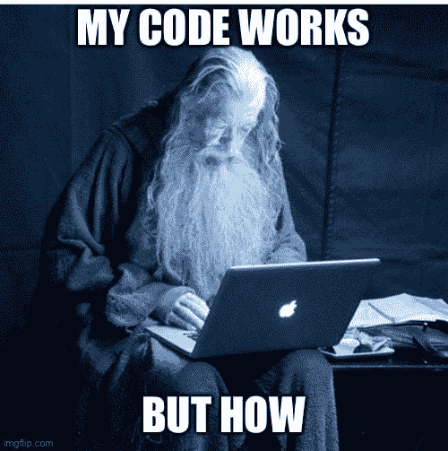

一切看起来都很好，游戏也在运行，但有些事情不太对劲。你没有得到你期望得到的数据，或者你没有得到你需要的结果。作为 Unity 初学者，这可能会非常令人沮丧，但本文将帮助您使用`Debug.Log`语句调试 Unity 项目。

我们将介绍使用`Debug.Log`语句的不同方法，格式化输出以提高可读性，并研究一些方法来确保有效地使用`Debug.Log`语句。

对于本文，我将假设您熟悉 Unity 引擎界面，并且已经编写了您的第一个脚本。我们将创建一个非常简单的项目来演示这些语句的用法，但我会在我们进行的过程中添加截图和对过程的解释。

## 设置基础项目

对于这篇文章，我将在 Unity 2021.3.4f1 中创建一个 3D 项目，但您使用的 Unity 引擎版本无关紧要。我还将使用 VS Community 2019，因此如果您使用 VS 代码或 Rider IDE，您可能会注意到一些界面差异，但这里演示的原则将适用于任何 IDE。

在下面的场景中，我有一架飞机和一些基本物体。这些对象中的每一个都有唯一的名称(它们的原始类型)、转换和脚本。它们将分别被编号为 *1(球体)、2(立方体)、3(胶囊)和 4(圆柱体)*。

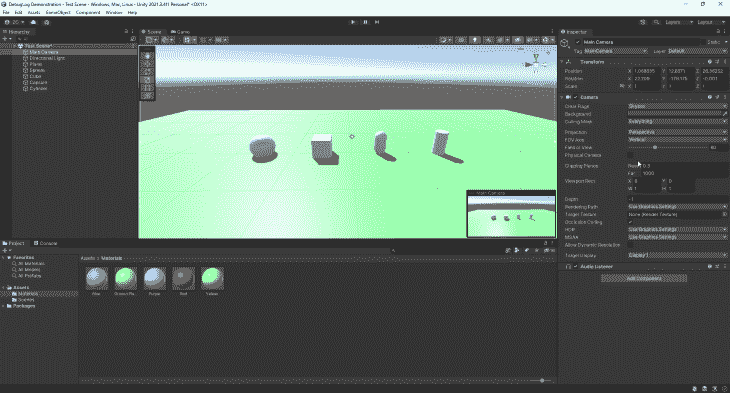

接下来，我为我的脚本创建了一个文件夹，一个`GameManager`脚本和一个层次结构中的`GameManager`游戏对象，它将包含我刚刚创建的`GameManager`脚本。

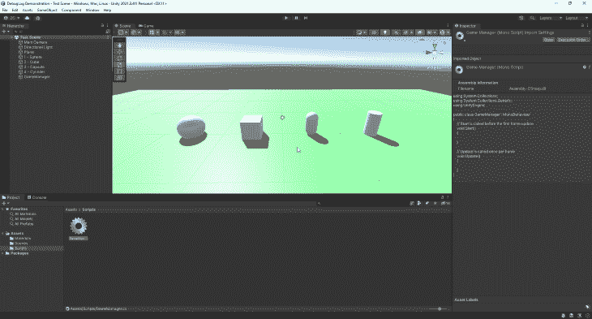

然后，我将`GameManager.cs`脚本拖动或分配给我在层级中创建的游戏对象，当我们点击播放按钮时，它将运行。现在我们都设置好了，我们可以看看`Debug.Log`语句的基本用法。

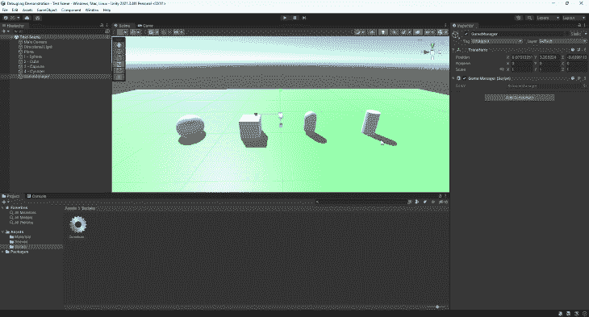

## 如何在 Unity 中使用`Debug.Log`语句

既然我们已经将`GameManager`脚本分配给了测试场景中的`GameManager`游戏对象，我们可以插入第一个`Debug.Log`语句来测试它是否在我们需要的时候运行。

`Debug.Log`语句的语法如屏幕右侧所示。这里我简单地声明了`“Debug.Log(”Hello!);”`，因为我已经将这个声明插入到我们的`Start`方法中，所以当我们运行我们的游戏时，它应该运行一次:

```
using System.Collections;
using System.Collections.Generic;
using UnityEngine;

public class GameManager : MonoBehaviour
{
    // Start is called before the first frame update
    void Start()
    {
        Debug.Log("Hello!");
    }

    // Update is called once per frame
    void Update()
    {

    }
}

```

如果我们在 Unity 编辑器中点击**播放**按钮，你会看到单词“Hello！”打印在编辑器控制台窗口中。

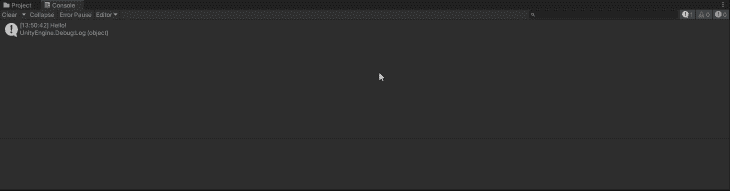

我们现在能够使用`Debug.Log`语句将简单的文本输出到控制台，但是在调试时，它对我们来说仍然没有什么价值。让我们试着显示一个变量的值，这个变量是我们在游戏开始时创建的。

为此，我在我们的`GameManager.cs`脚本中创建了一个名为`testValue`(如下所示)的私有整数，并在`Start`函数中给它赋值。您可能还注意到，我可以通过组合文本和`testValue`并用`+`符号分隔来创建一个更复杂的`Debug.Log`语句。您还会注意到，我在简单文本的最后一个字符和变量之间添加了一个空格，以便在控制台窗口中创建一些空间:

```
using System.Collections;
using System.Collections.Generic;
using UnityEngine;

public class GameManager : MonoBehaviour
{
    private int testValue;

    // Start is called before the first frame update
    void Start()
    {
        testValue = 1000;
        Debug.Log("This is the value of testValue: " + testValue);
    }

    // Update is called once per frame
    void Update()
    {

    }
}

```

让我们保存我们的脚本，回到 Unity 编辑器，看看控制台中的输出会是什么。

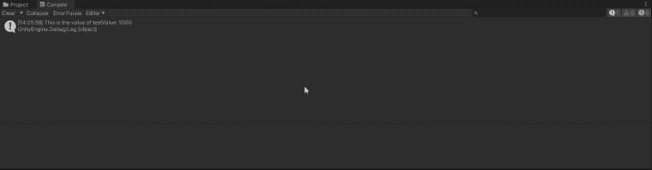

太好了！我们现在可以看到`testValue`的赋值，以及我们为了更好地理解`Console`窗口中的输出而添加的一小段文本。

### 使用`Debug.Log`语句确定游戏对象的名称

让我们在脚本中创建一个对游戏对象的引用，在 Unity 编辑器中将它附加到脚本中，然后使用`Debug.Log`语句输出该对象的名称:

```
using System.Collections;
using System.Collections.Generic;
using UnityEngine;

public class GameManager : MonoBehaviour
{
    public GameObject testObject;

    void Awake()
    {
        Debug.Log(testObject.name);
    }
}

```

一旦你在 Unity 编辑器中把对象附加到了`GameManager.cs`脚本的游戏对象字段，你就可以点击**播放**，被引用的游戏对象的名称就会显示在编辑器中。

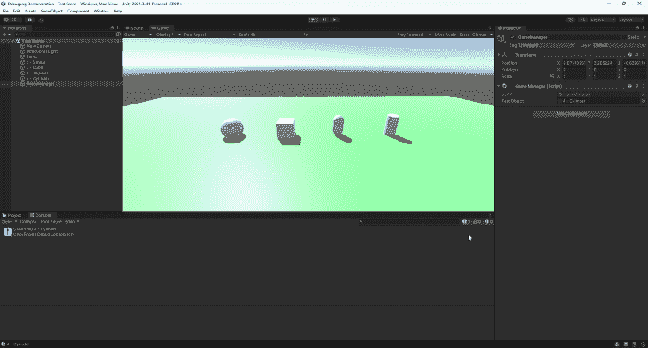

### 使用`Debug.Log`语句确定一个条件的值

我们还可以使用`Debug.Log`语句来确定条件值或布尔值。让我们创建两个整数值，然后检查它们是否相同。为此，我声明并初始化了两个整数(`a`和`b`)，并使用了一个`Debug.Log`语句来检查它们是否相等:

```
using System.Collections;
using System.Collections.Generic;
using UnityEngine;

public class GameManager : MonoBehaviour
{
    private int a = 51;
    private int b = 62;

    void Awake()
    {
        Debug.Log(a == b);
    }
}

```

由于`a`与`b`不同，控制台的输出如预期。

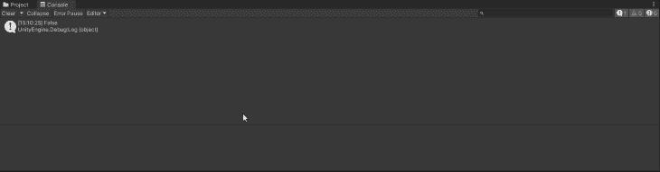

### 使用`Debug.Log`语句确定函数何时被调用

在上一节中，我们学习了一个简单的`Debug.Log`语句的语法，并向该语句添加了一个变量值。我们还能够看到控制台的输出。在这一节中，我将关注某些 Unity 函数的计时，以及如何判断自定义函数何时被调用。

以下摘自官方 [Unity 文档，介绍事件功能](https://docs.unity3d.com/Manual/ExecutionOrder.html)的执行顺序。

当您的脚本运行时，Unity 脚本函数将按定义的顺序执行，这对于在调试时查看特定事件或函数何时被触发非常有价值。让我们看看下面的流程图，由 Unity 提供。

从下图中，我们可以看到,`Awake`函数是 Unity 脚本运行时调用的第一个函数。然后我们让`OnEnable`和`Start`方法按顺序运行。

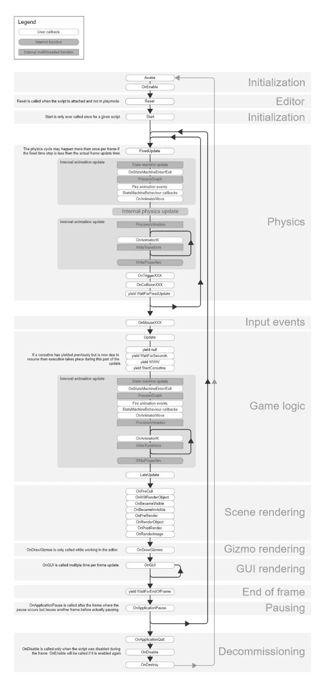

让我们用一个简单的脚本和几个`Debug.Log`语句的插入来测试这个顺序。我添加了一个`testValue`整数，然后定制了每个`Debug.Log`语句，这样我们就知道每个语句在哪里运行。每个`Debug.Log`语句上面的语句只是增加了`testValue`的值:

```
using System.Collections;
using System.Collections.Generic;
using UnityEngine;

public class GameManager : MonoBehaviour
{
    private int testValue = 0;

    private void Awake()
    {
        testValue++;
        Debug.Log("This was run in the Awake method: " + testValue);
    }

    private void OnEnable()
    {
        testValue++;
        Debug.Log("This was run in the OnEnable method: " + testValue);
    }

    private void Start()
    {
        testValue++;
        Debug.Log("This was run in the Start method: " + testValue);
    }
}

```

让我们看看当我们点击**播放**按钮时，控制台窗口中会发生什么。

太好了！我们可以看到，`Awake`方法首先执行，接着是`OnEnable`方法，然后是`Start`方法。我们还可以看到，当我们点击**播放**按钮时，这些方法只运行一次。

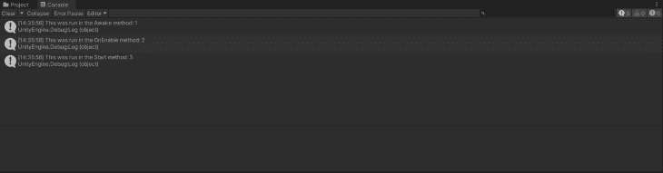

现在让我们创建一个名为`OurOwnFunction`的自定义函数，它将包含一个自己的`Debug.Log`语句。我们将在另外两个 Unity 函数中调用这个函数，看看输出是什么:

```
using System.Collections;
using System.Collections.Generic;
using UnityEngine;

public class GameManager : MonoBehaviour
{
    private int testValue = 0;

    private void Awake()
    {
        testValue++;
        Debug.Log("This was run in the Awake method: " + testValue);
        OurOwnFunction();
    }

    private void OnEnable()
    {
        testValue++;
        Debug.Log("This was run in the OnEnable method: " + testValue);
    }

    private void Start()
    {
        testValue++;
        Debug.Log("This was run in the Start method: " + testValue);
        OurOwnFunction();
    }

    private void OurOwnFunction()
    {
        Debug.Log("This is the custom function call!");
    }
}

```

控制台中的输出如下所示，我们现在可以看到我们的自定义函数分别在`Awake`和`Start`函数中被调用。

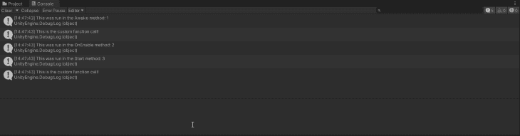

## 其他类型的调试消息

现在，我们已经看到了使用`Debug.Log`语句的方法，但是我们也可以使用其他种类的调试语句。这些语句的使用方式与`Debug.Log`语句相同，但允许我们在 Unity 控制台中显示警告或错误:

```
using System.Collections;
using System.Collections.Generic;
using UnityEngine;

public class GameManager : MonoBehaviour
{
    void Start()
    {
        Debug.Log("This is a normal log.");
        Debug.LogWarning("This is a warning message.");
        Debug.LogError("This is an error message.");
    }
}

```

这是上面的输出。

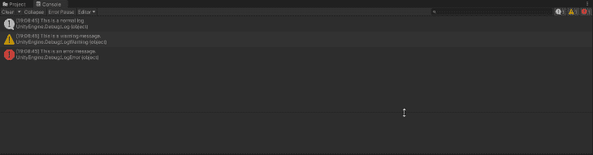

## 最后

使用`Debug`语句可以非常有助于查看某些变量或对象在运行时的值，确定一个函数是否真正按照您的意思运行，或者甚至只是跟踪一个讨厌的 bug。

我希望你已经发现这很有用，并且能够在你的项目中更有效地使用`Debug`语句。只要记住，当它们不再被使用时，把它们删除或者把它们变成评论，你就可以开始调试你的下一个大游戏了。

## 使用 [LogRocket](https://lp.logrocket.com/blg/signup) 消除传统错误报告的干扰

[](https://lp.logrocket.com/blg/signup)

[LogRocket](https://lp.logrocket.com/blg/signup) 是一个数字体验分析解决方案，它可以保护您免受数百个假阳性错误警报的影响，只针对几个真正重要的项目。LogRocket 会告诉您应用程序中实际影响用户的最具影响力的 bug 和 UX 问题。

然后，使用具有深层技术遥测的会话重放来确切地查看用户看到了什么以及是什么导致了问题，就像你在他们身后看一样。

LogRocket 自动聚合客户端错误、JS 异常、前端性能指标和用户交互。然后 LogRocket 使用机器学习来告诉你哪些问题正在影响大多数用户，并提供你需要修复它的上下文。

关注重要的 bug—[今天就试试 LogRocket】。](https://lp.logrocket.com/blg/signup-issue-free)