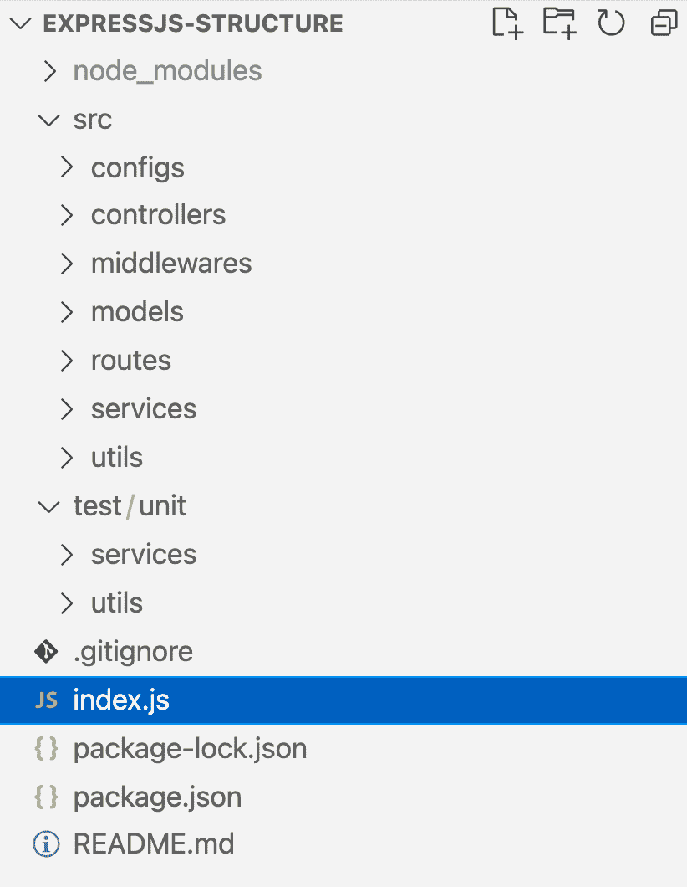
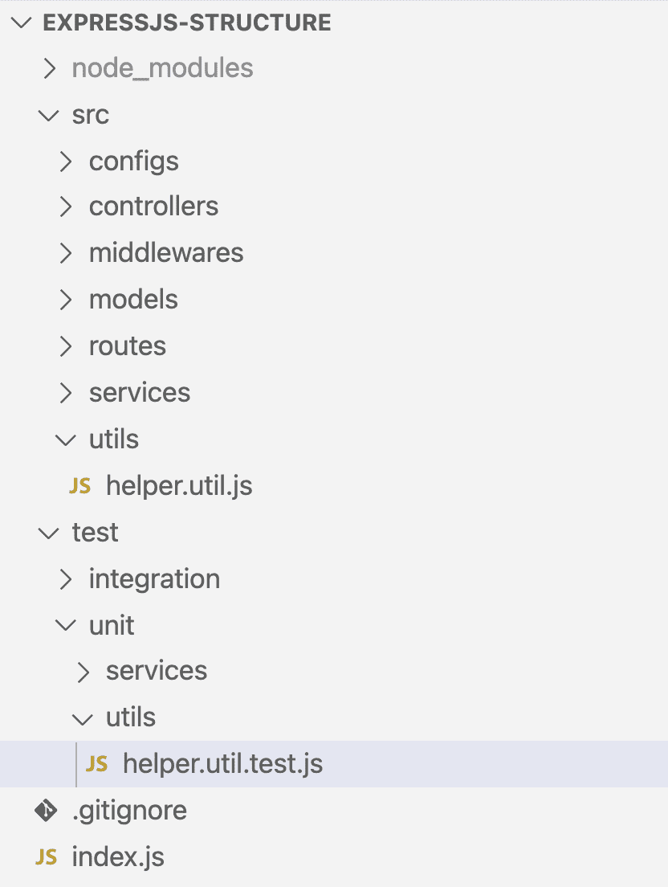
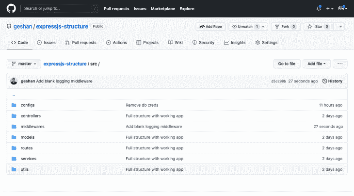

# 组织您的 Express.js 项目结构以获得更高的生产率

> 原文：<https://blog.logrocket.com/organizing-express-js-project-structure-better-productivity/>

Express.js 是 web 开发中最流行的 Node.js 框架。它很快，没有个人化，背后有一个很大的社区。它很容易学习，也有很多模块和中间件可供使用。

像埃森哲、IBM 和优步这样的大公司都使用 express，这意味着它在生产环境中也很棒。如果您也以这种方式使用 Express(或者只是在团队中使用 Express)，那么学习如何组织您的项目结构以提高生产率是很重要的。

在这篇文章中，我们将学习如何组织一个软件工程师团队使用的快速项目，以提高生产率和可维护性。我们开始吧！

## 为什么要用 Express.js？

除了作为最流行的节点框架之一，Express 还提供了优化的构建块，如路由、中间件和其他组件，以使应用程序快速工作。它提供简单、高效和极简主义，没有包袱或观点。这就是为什么在使用 Express 时需要一个好的结构，尤其是在一个软件工程师团队中。

## 与其他框架的比较

与其他框架如 [NestJS](https://blog.logrocket.com/node-back-end-next-level-nestjs/) 或 AdonisJs 相比，Express 没有利用任何结构或格式。对于如何布置文件以及逻辑的哪一部分应该驻留在某个特定的地方，它没有强加任何意见。

例如，如果你在 PHP 中使用过 [Laravel](https://blog.logrocket.com/whats-new-in-laravel-8/) ,它基本上为你决定了在哪里放置控制器，事情将如何运行，或者默认使用哪个 ORM。

另一方面，Express 并不伴随着这些有预谋的决定而来。它让用户决定项目的结构和布局。这可能是一把双刃剑，因为没有观点提供了灵活性，但如果使用不当，可能会导致非常难以理解的混乱局面。

这也给不一致留下了空间，这对一个团队来说是非常不好的。因此，下一节将详细介绍一个组织良好，但仍未结束的 Express 项目结构。

## 组织良好的 Expess.js 项目结构示例

例如，对于一个好的 web 项目，一个 API 肯定会有一些路由和控制器。它还将包含一些中间件，如认证或日志。该项目将有一些逻辑与数据存储进行通信，如数据库和一些业务逻辑。

这是一个示例结构，可以帮助我组织上面提到的代码。我将在下面进一步解释我是如何组织这个项目的:

让我们更深入地研究主文件夹`src`和`test`及其子文件夹。这个有组织的 Express 应用程序的主要入口点是根上的`index.js`文件，可以使用`node index.js`启动应用程序，通过 Node 运行这个文件。这将需要快速应用程序和链接的路线与相关的路由器。

任何中间件通常也会包含在这个文件中。然后它将启动服务器。

### 文件夹结构

在上图中，你会看到两个主要的文件夹:`src`存放源代码，`test`存放所有的测试代码。是时候深入挖掘一下`src`子文件夹了。

首先，我们有`configs`文件夹，它保存了应用程序所需的所有配置。例如，如果应用程序连接到一个数据库，数据库的配置(如数据库名称和用户名)可以放在一个类似`db.config.js`的文件中。类似地，其他配置，比如每页显示多少条记录用于分页，可以保存在这个`configs`文件夹中的一个名为`general.config.js`的文件中。

下一个文件夹是`controllers`，它将包含应用程序所需的所有控制器。这些控制器方法从路由中获取请求，并在必要时使用任何中间件将它们转换为 HTTP 响应。

随后，`middlewares`文件夹将把应用程序所需的任何中间件隔离在一个地方。可以有用于认证、记录或任何其他目的的中间件。

接下来，我们有一个`routes`文件夹，它将为每一组逻辑路径创建一个单独的文件。例如，一种类型的资源可以有多条路线。它可以被版本 v1 或 v2 进一步分解，以根据 API 的版本来分离路由文件。

之后,`models`文件夹将包含应用程序所需的数据模型。这还取决于所使用的数据存储是关系型还是非关系型(NoSQL)数据库。该文件夹的内容也将通过使用一个[对象关系映射(ORM)](https://blog.logrocket.com/why-you-should-avoid-orms-with-examples-in-node-js-e0baab73fa5/#whatisorminnodejs) 库来定义。如果使用了像 [Sequelize](https://blog.logrocket.com/using-sequelize-with-typescript/) 或 [Prisma](https://blog.logrocket.com/prisma-2-introduction/) 这样的 ORM，这个文件夹会有根据其需求定义的数据模型。

因此，`services`文件夹将包含所有的业务逻辑。它可以拥有代表业务对象的服务，并且可以在数据库上运行查询。根据需要，甚至像数据库这样的一般服务也可以放在这里。

最后但同样重要的是，我们有一个`utils`目录，其中包含应用程序所需的所有实用程序和助手。它还将充当放置共享逻辑(如果有的话)的地方。例如，一个计算分页 SQL 查询偏移量的简单助手可以放在这个文件夹中的一个`helper.util.js`文件中。

文件夹`test`有类似于`unit`和`integration`的子文件夹，用于单元测试和集成测试。

`test`文件夹中的`unit`文件夹将具有类似于`src`文件夹的结构，因为`src`文件夹中的每个文件都需要测试，并且最好遵循相同的结构，如下所示:

`helper.util.test.js`文件放在`unit`文件夹的`utils`文件夹中。这与`src`文件夹中的模式相同。在下一节的示例项目中，我们将使用 Jest 来编写和运行测试。

即使使用这种文件夹结构，也可能会遗漏一些内容。例如，如果您的项目使用带有节点的 [RabbitMQ，您将需要将发布者和消费者保存在组织良好的文件夹中。类似地，如果您正在创建一个 CLI 应用程序来使用节点](https://geshan.com.np/blog/2021/07/rabbitmq-docker-nodejs/)进行 [web 抓取，这个项目结构可能只是部分有用。如上所述，这种文件夹结构对于大多数需要更好布局的 API 或通用 web 项目来说已经足够了。](https://geshan.com.np/blog/2021/09/web-scraping-nodejs/)

此外，记住可能需要其他文件，比如一个`.env`文件来保证秘密的安全，并且每个部署环境都不同。在下一部分中，我们将研究一个遵循我刚刚展示的结构的示例项目。

## 使用 Node.js 和 MySQL 的示例项目

在 MySQL 中使用 [Node.js 有很多很好的例子，所以我们将我们的示例应用程序称为编程语言 API，它列出了流行的编程语言。](https://blog.logrocket.com/node-js-express-js-mysql-rest-api-example/)

我们可以使用免费层 [PlanetScale](https://planetscale.com/) ，这是一个 MySQL 兼容的、无服务器的超大规模服务。您可以在 [GitHub](https://github.com/geshan/expressjs-structure) 资源库中查看这个工作应用的代码:

除了上面看到的`src`文件夹结构，项目的测试可以通过在根上运行`npm test`来执行，它运行 Jest。对于`helper.util.js`文件只有一些测试，但是这给了我们一个如何组织源代码和单元测试代码的好主意。

与其他 Node 和 Express 项目类似，我们可以运行`npm start`来运行这个项目，并点击[http://localhost:3000/programming-languages](http://localhost:3000/programming-languages)来查看结果。您将需要正确地设置数据库，最好是在 PlanetScale 上，并将正确的凭证放在`src/configs/db.config.js`文件中以使其正常工作。

## 结论

在本文中，我们已经看到了如何为一个非个性化的 Express 框架提供一个个性化的结构。组织确实有助于保持一致性，尤其是在一个更大的团队中。

项目结构的一致性等同于代码的可预测性，这反过来有助于整个团队的生产力。始终使用一致的结构使事情容易预测，以最小化或消除猜测，并帮助您的团队实现他们的目标。

## 使用 [LogRocket](https://lp.logrocket.com/blg/signup) 消除传统错误报告的干扰

[LogRocket](https://lp.logrocket.com/blg/signup) 是一个数字体验分析解决方案，它可以保护您免受数百个假阳性错误警报的影响，只针对几个真正重要的项目。LogRocket 会告诉您应用程序中实际影响用户的最具影响力的 bug 和 UX 问题。

然后，使用具有深层技术遥测的会话重放来确切地查看用户看到了什么以及是什么导致了问题，就像你在他们身后看一样。

LogRocket 自动聚合客户端错误、JS 异常、前端性能指标和用户交互。然后 LogRocket 使用机器学习来告诉你哪些问题正在影响大多数用户，并提供你需要修复它的上下文。

关注重要的 bug—[今天就试试 LogRocket】。](https://lp.logrocket.com/blg/signup-issue-free)

## 200 只显示器出现故障，生产中网络请求缓慢

部署基于节点的 web 应用程序或网站是容易的部分。确保您的节点实例继续为您的应用程序提供资源是事情变得更加困难的地方。如果您对确保对后端或第三方服务的请求成功感兴趣，

[try LogRocket](https://lp.logrocket.com/blg/node-signup)

.

[https://logrocket.com/signup/](https://lp.logrocket.com/blg/node-signup)

LogRocket 就像是网络和移动应用程序的 DVR，记录下用户与你的应用程序交互时发生的一切。您可以汇总并报告有问题的网络请求，以快速了解根本原因，而不是猜测问题发生的原因。

LogRocket 检测您的应用程序以记录基线性能计时，如页面加载时间、到达第一个字节的时间、慢速网络请求，还记录 Redux、NgRx 和 Vuex 操作/状态。

[Start monitoring for free](https://lp.logrocket.com/blg/node-signup)

.