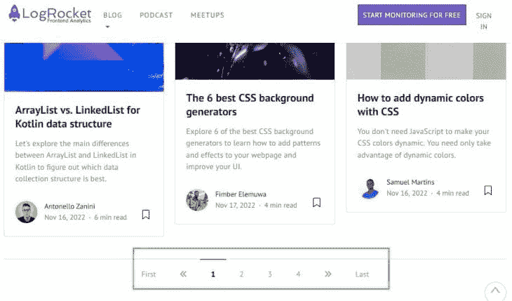
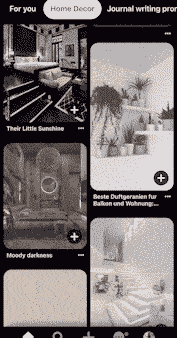
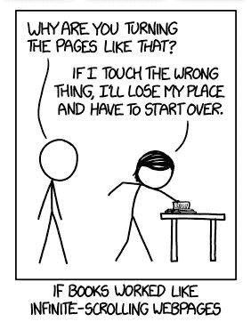
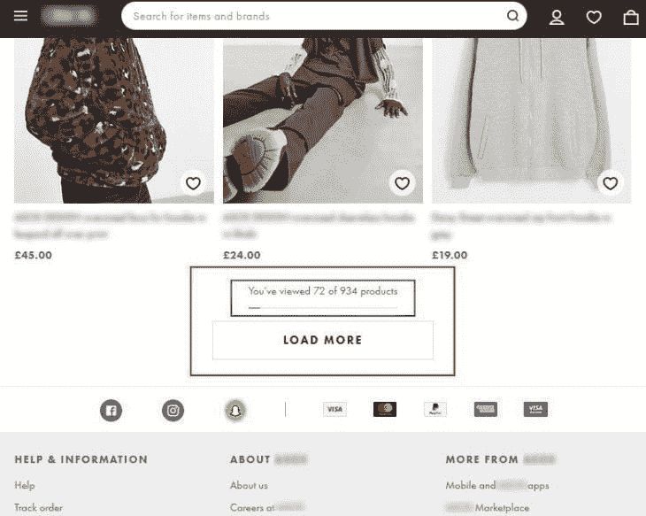

# 分页与无限卷轴:为 UX 做出正确的决定

> 原文：<https://blog.logrocket.com/ux-design/pagination-vs-infinite-scroll-ux/>

互联网上的内容过多，找到一种合适的方式来呈现这些内容(考虑用户体验)是创建吸引受众的产品的良好基础。

分页和无限滚动是 web 设计中向用户显示大量相似内容的两种常用方法。这两种方法都有适合它们的用例，相反，也有不那么有效的场景。

在这篇文章中，我们将分析这两种方法，并学习如何在我们的应用程序中做出最佳用户体验的正确决定。

分页是将显示在站点(或应用程序)中的内容划分为独立页面的过程。通过这种方式分离内容，用户可以轻松地筛选您的材料，同时可以在页面之间来回切换，搜索他们想要的结果。

LogRocket 的博客登录页面是分页界面的一个例子:

底部的分页系统允许用户轻松地遍历内容，从博客的首页到最后一页。我想我们可以同意这种方法可以使浏览体验有点类似于阅读一本书；因此，术语“分页”就像翻页一样。

通常，在为面向目标的任务设计界面时，比如显示查询的搜索结果，分页是一种合适的方法。

分页还有其他好处，包括改善页面加载时间，但我们将在后续部分讨论它的所有起伏。

现在让我们来看看竞争对手无限卷轴。

无限滚动是一种设计模式，当用户向下滚动到页面底部时，它会不断加载新内容。这种方法的突出优点是它降低了交互成本，使用户无需点击**下一个**或**上一个**按钮就能获得新内容，就像在分页界面上一样。

Pinterest 应用是无限滚动的一个很好的例子:

通过不断提供新鲜内容，Pinterest 鼓励其用户继续滚动，看看展开的内容是否满足他们的搜索——或者比页面上已经看到的结果更好。

随后，该滚动动作增加了用户的参与度。Nir Eyal 的挂钩模型的第三步更好地解释了这一模型成功背后的心理学:可变奖励。

就像分页一样，无限滚动也有它的缺点，在下一节中，我们将深入探讨这两种方法的亮点和挑战。

既然我们已经熟悉了这两种呈现内容的方法，我们可以从提供令人满意的用户体验的角度来深入研究这两种方法的优缺点。

#### 它促进转化

分页界面为浏览网站内容提供了更好的布局。这使得用户登陆你的产品时更容易完成他们想要的任务。以这种方式为用户提供价值，可以将他们转化为你产品的客户。

#### 卓越的导航体验

分页界面非常适合提供网站内容的鸟瞰图。与无限滚动相比，页脚旁边的分页系统提供了更好的导航体验。此外，分页有助于读者将单个页面标记为书签，以备后用。

#### 缩短页面加载时间

分页页面通常包含较少的内容，导致页面加载速度更快。

#### 需要额外的操作来获得新的内容

点击下一页、上一页或页码按钮来获取新内容的手动(和重复)任务会损害用户参与度。

如今，大多数用户的时间越来越少，注意力越来越分散；让他们采取额外的步骤来找到他们想要的东西很容易就会把他们赶走。

#### 它阻碍了用户的参与

当目标是增加用户参与度时，分页界面不是最好的选择。因为新内容不是无缝地呈现给用户，所以更难吸引他们的注意力。

#### 每页内容有限

通常，分页页面包含的内容较少。对于试图快速筛选内容的用户来说，这可能会令人沮丧，因为他们必须重复打开新页面才能找到它。

增加每页的结果数量是解决这个问题的一个好办法——在揭示分页系统之前，LogRocket 的博客页面提供 24 篇文章。

#### 这是一种移动友好的方法

相反，无限滚动对于移动用户来说是一种有利的方法。向下滚动新内容比在新标签页中打开结果更方便。

#### 滚动比点击更直观

因为滚动对 web 访问者来说更直观，所以用户可以更容易地浏览站点，而无需进行额外的交互来获得新的内容。

#### 它提高了用户参与度

如前所述，持续的内容供应鼓励用户在网站上花更多的时间，从而保持他们的参与。

#### 较慢的加载时间

无限滚动界面向用户显示大量资产，并向数据库发出额外请求以获取更多数据。因此，加载时间取决于用户的互联网连接强度(以及许多其他因素)，糟糕的连接会导致加载时间缓慢。确保使用[主屏幕](https://blog.logrocket.com/build-skeleton-screen-css/)提供视觉反馈。

#### 可用性问题

创建一个可用的无限滚动布局需要有意识的努力。许多网站提供的体验令人印象深刻，没有滚动到顶部的按钮；保持页脚不可见；更糟糕的是，当用户在滚动时点击一个项目时，不能保存用户的滚动位置。

我们都有过这样的经历:你在电子商务商店滚动搜索结果，在屏幕上看到你喜欢的商品。你点击进一步检查，但后来意识到你不满意的项目。因此，您点击后退按钮继续搜索，结果却是在搜索结果的开头。

无限滚动界面的设计应该始终考虑可用性。这个购物网站是一个可用的无限滚动设计的例子，它有一个 **Load More** 来保持页脚可见。

它们还通过显示当前浏览的产品数量来提供用户搜索进度的反馈。

这两种内容布局方法都很有前途，但最终取决于产品的用户体验设计。你的目标是增加用户参与度吗？你的产品依赖用户生成的内容吗？对于这些情况，无限滚动是一种更好的方法。

或者你希望帮助用户完成目标导向的任务，同时提供令人满意的导航体验？那么分页将为您解决这个问题。

就我个人而言，我倾向于无限滚动，因为它是移动友好和直观的。但是这两种方法都不明显不好，而且这两种方法都可以调整以表现得更好。

有多种工具可以在您的界面中实现分页和无限滚动。像 Webflow 和 WordPress 这样的代码工具都没有你可以在它们的网站构建器中使用的插件。以下是一些帮助您入门的资源:

JavaScript 生态系统也有流行的无限滚动和分页包。

## [LogRocket](https://lp.logrocket.com/blg/signup) :无需采访即可获得 UX 洞察的分析

[LogRocket](https://lp.logrocket.com/blg/signup) 让您可以回放用户的产品体验，以可视化竞争，了解影响采用的问题，并结合定性和定量数据，以便您可以创建令人惊叹的数字体验。

查看设计选择、交互和问题如何影响您的用户— [立即尝试 LogRocket】。](hhttps://lp.logrocket.com/blg/signup)