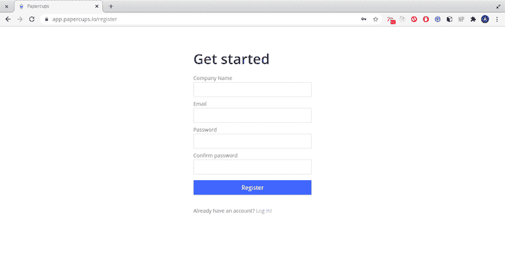
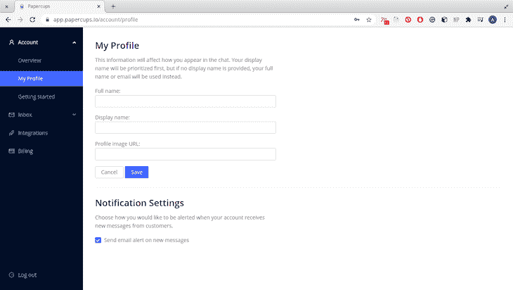
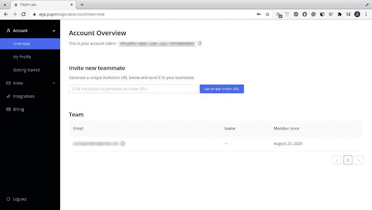
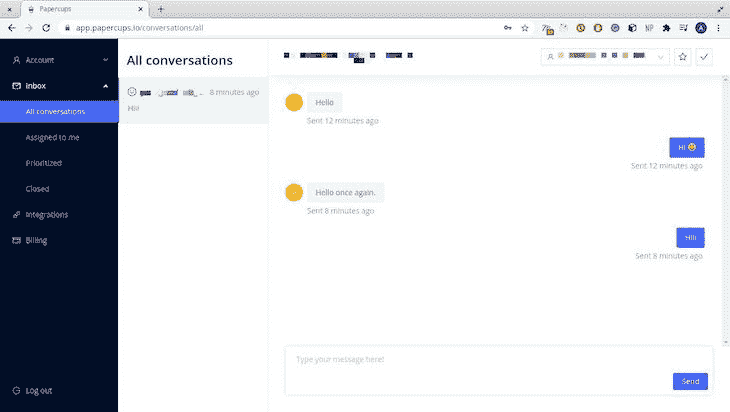
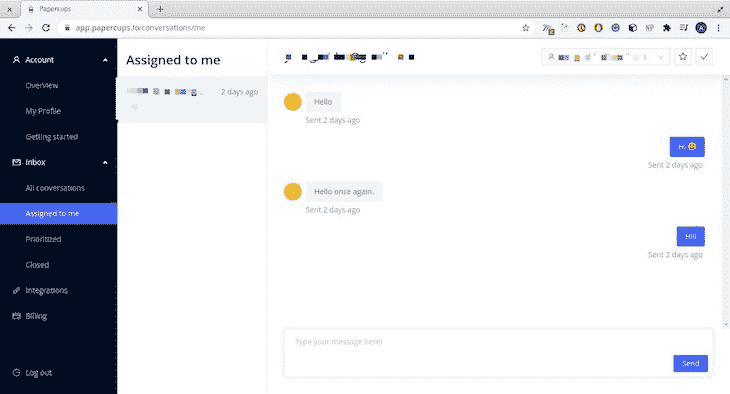
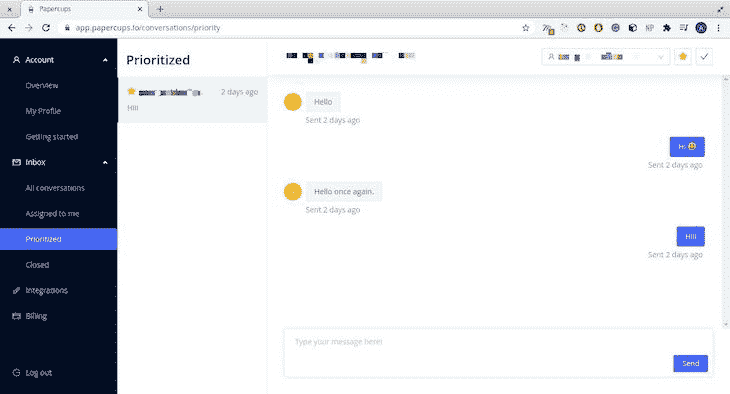
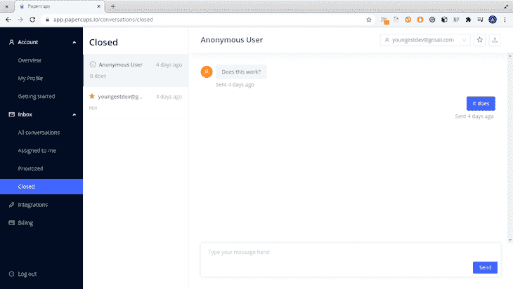
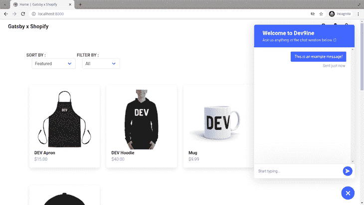
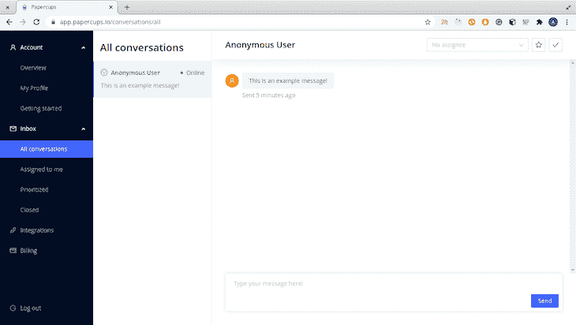
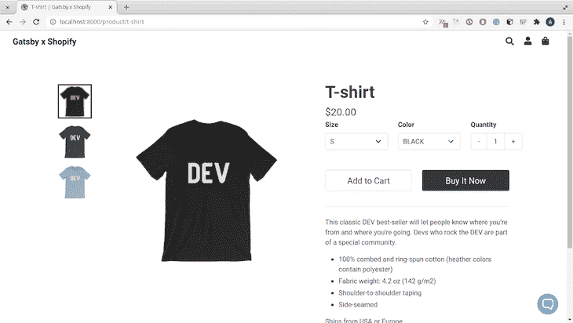

# 将 Papercups 聊天小部件集成到电子商务应用程序中

> 原文：<https://blog.logrocket.com/papercups-chat-widget-ecommerce-app/>

获得实时的客户问题、反馈和其他快速消息在电子商务领域非常重要。在本文中，您将学习如何在您的电子商务应用程序中集成一个聊天小部件，以使客户能够轻松联系到您。出于本教程的目的，您将使用一个 [Gatsby 电子商务启动器](https://github.com/alexislepresle/gatsby-shopify-theme)。

## 什么是纸杯？

[Papercups](https://papercups.io) 是一款实时客户聊天网络应用，用户无需注册即可与其服务提供商联系和互动。Papercups 支持松散集成、通过库在 React 应用程序中直接集成，以及使用`script`标签的静态应用程序。

### 创建 Papercups 帐户

将 Papercups 聊天小部件集成到您的电子商务网站中需要您拥有一个用户令牌。用户令牌是将 Papercups 帐户映射到应用程序中的小部件的唯一标识符，要获得该用户令牌，您必须注册。

访问[注册页面](https://app.papercups.io/register)并填写必要的详细信息:



公司名称将显示在您的聊天小工具中，因此建议您选择一个准确的名称。注册后，您将被重定向到您的新仪表板。

接下来，点击左侧边栏**账户**标题下的**我的个人资料**链接，填写您的个人资料详情。您的屏幕应该与下图类似:



在“编辑个人资料”部分，填写您的全名、显示名称和个人资料图像 URL。保存个人资料详细信息后，将立即从 URL 中检索图像并显示在聊天小部件上。

## 探索 Papercups 仪表板

Papercups 仪表板有三个部分。在上一节中，您探索了在**账户**部分下的**个人资料**页面。

在**帐户概述**页面，您可以通过生成邀请 URL 来邀请其他员工。您还可以编辑注册时最初输入的公司名称。

您的概览页面应该如下所示:



您的 Papercups 帐户令牌也会显示在**帐户概述**页面上。建议保持它的安全，因为它是一个唯一的标识符。

### 收件箱部分

**收件箱**部分包含来自客户的所有对话的链接、分配给当前用户的消息、优先消息和已结束的对话。

正在进行的对话列在**所有对话**页面中。例如:



分配给您的对话列在**分配给我**页面上。



被赋予最高优先级的对话列在**优先**页面上。此部分对于指示特别紧急或代表未解决问题的对话特别有用。



要对邮件进行优先级排序，请点击右上角的星号按钮。它会自动将邮件添加到优先邮件列表中。

在**关闭**页面，可以查看已经结束并关闭的对话。要关闭对话，请单击对话右上角的检查按钮。关闭的对话如下所示:



### 集成页面

**集成**页面列出了您可以将 Papercups 帐户连接到的服务。在撰写本文时，Papercups 仅与 Slack 集成。

## 向电子商务应用程序添加纸杯

在本节中，您将把 Papercups 小部件添加到您的电子商务应用程序中。您将为您的电子商务应用程序使用 Gatsby starter。我假设您对 Node、npm 和 React 有很好的理解。

没用过《盖茨比》也可以；你可以在这里查阅关于盖茨比的文章。如果您没有安装 Gatsby CLI，请使用 npm 命令安装它:

```
npm install -g gatsby-cli
```

让我们首先使用 Gatsby CLI 工具搭建您的电子商务应用程序:

```
gatsby new papercups-shop https://github.com/alexislepresle/gatsby-shopify-theme
```

Gatsby 会完成安装后的过程，因此您不必再次安装任何东西。但是，如果您的依赖项没有安装，请使用以下命令:

```
npm install
```

安装完成后，运行您的应用程序，感受一下它是什么:

```
npm run develop
```

它应该会加载一个如下所示的页面:


Papercups 聊天小部件有一个 React 库。还可以使用`head`部分的`script`标签将聊天小部件添加到静态网站。将 Papercups 小部件添加到您的应用程序的代码可以在 Papercups 仪表板的**入门**页面中找到。

让我们使用 React 库将 Papercups 小部件添加到应用程序中，因为 Gatsby 是基于 React 构建的。首先，安装 Papercups React 库:

```
npm install --save @papercups-io/chat-widget
```

安装完成后，从**入门**页面获取现成的小部件代码。正如预期的那样，Papercups 让这变得很容易——你可以从**入门**页面或者代码中的属性值定制你的小部件的显示方式。

您可以将小部件添加到您希望它出现的任何页面。传统上，小部件应该被添加到根组件中，这样用户就可以在任何页面上访问它。

接下来，在代码编辑器中修改位于`src/layouts/index.js`中的根组件返回块:

```
        <>
            <Provider>
                <StaticQuery
                    *query={*graphql`
                    query SiteTitleQuery {
                    site {
                        siteMetadata {
                        title
                        }
                    }
                    }
                `*}*
                    *render*={data => (
                        <>
                            <Header *siteTitle*={data.site.siteMetadata.title} />
                            {children}
                            <Footer />
                        </>
                    )*}*
                />
            </Provider>
            <ChatWidget
                *title*='Welcome to YouCompanyName'
                *subtitle*= 'Ask us anything in the chat window below 😊'
                *primaryColor*='#1890ff'
                *greeting*=''
                *newMessagePlaceholder*='Start typing...'
                *accountId*='your-account-id'
                *baseUrl*='https://app.papercups.io'
            />
        </>
```

接下来，刷新浏览器选项卡以反映更改。你应该在页面的右下角有一个蓝色的图标。点击它将打开小部件:



上述流程适用于所有 React 应用。因此，如果你的电子商务商店不是基于 Gatsby 而是基于 React，你会遵循同样的过程。

> 如果你的电子商务网站是一个静态网站，即 HTML 和 CSS，你需要做的就是将来自**G*****getting started *页面的 HTML 代码添加到你的`index.html` head 标签中。

## 发送和接收消息

消息发出后，会立即在对话页面中列出，并会向您的注册地址发送一封电子邮件来通知您。您可以回复、优先处理、关闭或分配邮件，正如您在前面章节中所学。您还可以从您的对话页面查看客户的可用性状态:



每个页面上都有聊天工具，因此客户可以随时随地发送消息。这是另一个页面的截图:



## 结论

在本文中，您学习了如何将 Papercups 添加到 Gatsby 电子商务应用程序中。您还学习了如何执行基本操作—回复、分配、区分优先级和关闭邮件。启动器修改后的代码可以在 [GitHub](https://github.com/Youngestdev/papercups-demo/blob/820e35cf0f2f8e7abdeb05aba1af028ac83845d4/src/layouts/index.js) 上查看。

## [LogRocket](https://lp.logrocket.com/blg/ecommerce-signup) :看看用户为什么不完成你的电子商务流程中的一个步骤的技术和 UX 原因。

[](https://lp.logrocket.com/blg/ecommerce-signup)

LogRocket 就像是一个网络和移动应用程序和网站的 DVR，记录你的电子商务应用程序上发生的一切。LogRocket 没有猜测用户不转化的原因，而是主动揭示了阻止你转化的根本原因，比如 JavaScript 错误或死点击。LogRocket 还可以监控应用的性能，报告客户端 CPU 负载、客户端内存使用等指标。

开始主动监控您的电子商务应用程序— [免费试用](https://lp.logrocket.com/blg/ecommerce-signup)。