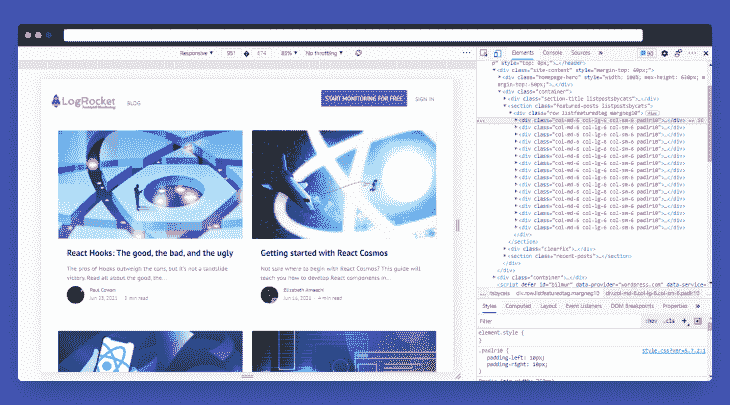
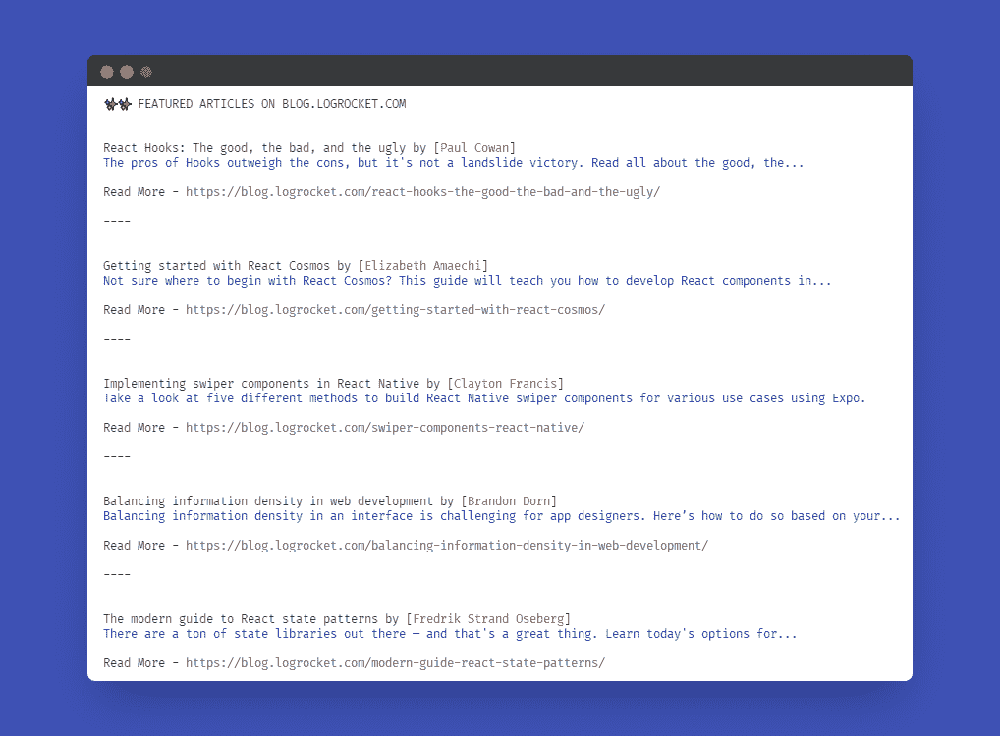

# 用 Cheerio - LogRocket Blog 解析 Node.js 中的 HTML

> 原文：<https://blog.logrocket.com/parsing-html-nodejs-cheerio/>

## 介绍

传统上，Node.js 不允许解析和操作标记，因为它在浏览器之外执行代码。在本文中，我们将探索 Cheerio，一个专门为此目的设计的开源 JavaScript 库。

Cheerio 提供了一个灵活而精简的 jQuery 实现，但它是为服务器设计的。使用 Cheerio 操作和呈现标记的速度非常快，因为它使用简洁而简单的标记(类似于 jQuery)。除了解析 HTML，Cheerio 在处理 XML 文档方面也表现出色。

### 目标

本教程假设没有 Cheerio 的先验知识，将涵盖以下领域:

*   在 Node.js 项目中安装 Cheerio
*   理解 Cheerio(加载、选择器、DOM 操作和呈现)
*   构建一个示例应用程序(FeatRocket ),用于抓取日志火箭特色文章，并将它们记录到控制台

### 先决条件

要完成本教程，您需要:

*   基本熟悉 HTML、CSS 和 [DOM](https://en.wikipedia.org/wiki/Document_Object_Model)
*   熟悉 npm 和 Node.js
*   熟悉使用命令行和文本编辑器

## 建立啦啦队

Cheerio 可以用于任何 ES6+、TypeScript 和 Node.js 项目，但是对于本文，我们将重点讨论 Node.js。

首先，我们需要运行`npm init -y`命令，这会生成一个新的`package.json`文件，其内容如下:

```
{
  "name": "cheerio-sample",
  "version": "1.0.0",
  "description": "",
  "main": "index.js",
  "scripts": {
    "test": "echo \"Error: no test specified\" && exit 1"
  },
  "keywords": [],
  "author": "",
  "license": "ISC"
}

```

完成后，让我们继续进行[安装 Cheerio](https://github.com/cheeriojs/cheerio) :

```
npm install cheerio

```

检验安装是否成功的一种方法是检查 `package.json`文件。您应该会看到添加了一个名为`dependencies`的新条目，如下所示:

```
...
"dependencies": {
    "cheerio": "^1.0.0-rc.10"
  }

```

## 了解 cheerios 加载

### 使用 Cheerio 的第一步是加载我们想要解析或操作的 HTML/XML 文件。我们必须这样做，因为我们正在使用 Node.js，它不能直接访问我们的应用程序标记，除非它是以某种方式下载的。

加载可以用`cheerio.load()`方法来实现，这需要一个重要的参数——您想要加载的 HTML/XML 文档。

下面是一个例子:

类似于 web 浏览器，使用`cheerio.load()`方法将自动分别包含`<html>`、`<head>`和`<body>`标签，如果它们还没有出现在我们的标记中的话。

```
const cheerio = require("cheerio");
const markup = `<ul id="js-frameworks">
                    <li class="vue">Vue.js ⚡</li>
                    <li class="react">React</li>
                    <li class="svelte">Svelte</li>
                    <li class="angular">Angular</li>
                </ul>`;
/* Note - variable name is declared as '$' to bring the familiarity of JQuery to cheerio */
const $ = cheerio.load(markup);

```

您可以通过将`.load()`方法的第三个参数设置为`false`来禁用此功能:

在处理 XML 文档而不是 HTML 的情况下，这可能很方便。

```
const $ = cheerio.load(markup, null, false);

```

选择器

### 我们使用选择器来告诉 Cheerio 我们想要处理什么元素。如前所述，Cheerio 中的选择器实现类似于 jQuery，也遵循 CSS 样式，但有一些补充。

Cheerio 中一些最常用的选择器包括:

`$("*")` —星号符号`(*)`用作通配符选择器，它将选择所提供标记上的每个元素

*   `$("div")` —标签选择器:选择提供的标签的每个实例。在这种情况下，它将选择`<div>`标签的每个实例
*   `$(".foo")` —类:选择应用了`foo`类的每个元素
*   `$("#bar")` — Id:选择具有唯一`bar` id 的每个元素
*   `$(":focus")` —选择当前具有焦点的元素
*   `$("input[type='text']")` —属性:选择任意输入类型为`text`的输入元素
*   `$('.bar, '#foo)` —在具有 foo 类的元素下选择所有具有类栏的子元素
*   事件和 DOM 操作

### 类似于 [JQuery](https://blog.logrocket.com/the-history-and-legacy-of-jquery/) ，Cheerio 附带了一系列与 DOM 相关的方法，用于访问和操作 HTML 元素及其属性。

一些最常用的方法包括:

`.text()` —设置或返回所选元素的`innerText`内容。以我们之前的标记为例，我们可以用下面的代码获取带有类`vue`的元素的文本内容: `$(".vue").text();
// output => Vue.js ⚡`

*   `.html()` —设置或返回所选元素的`innerHTML`内容
*   `.append()` —将插入所提供的内容，作为每个所选元素的最后一个子元素
*   `.prepend()` —与 append 不同，这将把提供的内容作为每个选定元素的第一个子元素插入
*   `.addClass()`和`.removeClass()` —将删除或添加提供给所有匹配元素的类
*   `.hasClass()` —如果所选元素具有提供的类名，则返回布尔值(真/假)
*   `.toggleClass()` —将检查所选元素中是否存在提供的类。如果存在，所提供的类将被移除，否则它将被添加到所选元素类列表中
*   翻译

### 一旦完成了对标记的解析和操作，就可以使用以下命令访问它的根内容:

默认情况下，当您在 Cheerio 中解析 HTML 内容时，一些标签将是打开的，如果您正在处理 XML 内容，XML 文件将以这种方式无效。

```
$.root().html();

```

要呈现有效的 XML 文档，可以使用 Cheerio 的 XML 实用函数:

建筑特征

```
// Loading XML content
const $ = cheerio.load(
  '<media:thumbnail url="http://www.foo.com/keyframe.jpg" width="75" height="50" time="12:05:01.123"/>'
);

// Rendering xml content
$.xml();
// Output => <media:thumbnail url="http://www.foo.com/keyframe.jpg" width="75" height="50" time="12:05:01.123"/>

```

## 现在我们已经对 Cheerio 的工作原理有了基本的了解，让我们继续构建一个示例项目。

我们将构建 FeatRocket，这是一个 CLI 应用程序，它将抓取 LogRocket 博客上的所有特色文章，并将它们记录到我们的控制台。

以下是我们实现这一目标的方法:

了解 LogRocket 博客结构

1.  下载网页标记
2.  将下载的标记加载到新的 Cheerio 实例中
3.  定位并过滤出需要的内容
4.  将结果记录到控制台
5.  了解网站结构

### 网页抓取的第一步是了解网站的内容是如何排列的，即你要访问的元素被赋予了什么属性(`class`、`id`、`href`，等等。



在我们的例子中，我们可以注意到我们的目标内容排列如下:

其中类别为`listfeaturedtag` 的`div`是我们所有目标文章的包装，类别为`col.. padlr10`的`div`是每篇特色文章的卡片。

```
<div class="listfeaturedtag">
    <!-- first article -->
    <div class="col.. padlr10"></div>
    ...
    <!-- second article -->
    <div class="col.. padlr10"></div>
    ...
</div>

```

下载网页标记

### 我们现在了解了网站结构以及我们的目标内容。接下来创建一个新文件`scrapper.js`，然后继续安装[Axios](https://blog.logrocket.com/5-ways-to-make-http-requests-in-node-js/)——我们将使用 Axios 下载网站内容。

我们可以通过以下方式获取网站源代码:

```
npm install axios

```

将上面的代码粘贴到新创建的`scrapper.js`文件中，并运行它，如下所示:

```
const axios = require("axios");

axios
  .get("https://blog.logrocket.com/")
  .then((response) => {
    console.log(response)
  })
  .catch((err) => console.log("Fetch error " + err));

```

您会注意到网站的整个 HTML 内容都记录在控制台中。

```
node scrapper.js

```

将加价加载到 Cheerio 中

### 下一步是将下载的标记加载到新的 Cheerio 中:

过滤出结果

```
const axios = require("axios");
const cheerio = require("cheerio");
axios
  .get("https://blog.logrocket.com/")
  .then((response) => {
    const $ = cheerio.load(response.data);
  })
  .catch((err) => console.log("Fetch error " + err));

```

### 接下来，我们希望只过滤掉需要的内容。我们已经知道了目标对象的属性。`listfeaturedtag` 和`.padlr10`。我们只需遍历其中的每一个并将它们记录到控制台，这样我们的完整代码将如下所示:

现在，如果我们运行`node scrapper.js`，您应该会在控制台中看到如下所示的输出:

```
const axios = require("axios");
const cheerio = require("cheerio");

axios
  .get("https://blog.logrocket.com/")
  .then((response) => {
    const $ = cheerio.load(response.data);

    const featuredArticles = $(".listfeaturedtag .padlr10");

    for (let i = 0; i < featuredArticles.length; i++) {
      let postTitleWrapper = $(featuredArticles[i]).find(".card-title")[0],
        postTitle = $(postTitleWrapper).text();

      let authorWrapper = $(featuredArticles[i]).find(".post-name a")[0],
        author = $(authorWrapper).text();

      let postDescWrapper = $(featuredArticles[i]).find(".card-text")[0],
        postDesc = $(postDescWrapper).text();

      let postLinkWrapper = $(featuredArticles[i]).find(".card-title > a")[0],
        postLink = $(postLinkWrapper).attr("href");

      // console.log("\n++++++");
      console.log(`${postTitle} by [${author}]`);
      console.log(`${postDesc}`);
      console.log("\n" + `Read More - ${postLink}`);
      console.log("\n----\n\n");
    }
  })
  .catch((err) => console.log("Fetch error " + err));

```



结论

## Cheerio 是在服务器端操作和抓取标记内容的优秀框架，而且它是轻量级的，实现了熟悉的语法。

本教程提供了如何在实际项目中开始使用 Cheerio 的深入指导。

为了进一步参考，你也可以在 [GitHub](https://github.com/AsaoluElijah/cheerio-tutorial) 上查看 FeatRocket 源代码。

感谢阅读！

更多来自 LogRocket 的精彩文章:

* * *

### 200 只显示器出现故障，生产中网络请求缓慢

* * *

## 部署基于节点的 web 应用程序或网站是容易的部分。确保您的节点实例继续为您的应用程序提供资源是事情变得更加困难的地方。如果您对确保对后端或第三方服务的请求成功感兴趣，

.

[try LogRocket](https://lp.logrocket.com/blg/node-signup)

LogRocket 就像是网络和移动应用程序的 DVR，记录下用户与你的应用程序交互时发生的一切。您可以汇总并报告有问题的网络请求，以快速了解根本原因，而不是猜测问题发生的原因。

[](https://lp.logrocket.com/blg/node-signup)[https://logrocket.com/signup/](https://lp.logrocket.com/blg/node-signup)

LogRocket 检测您的应用程序以记录基线性能计时，例如页面加载时间、第一个字节的时间、慢速网络请求，还记录 Redux、NgRx 和 Vuex 操作/状态。

.

[Start monitoring for free](https://lp.logrocket.com/blg/node-signup)

.