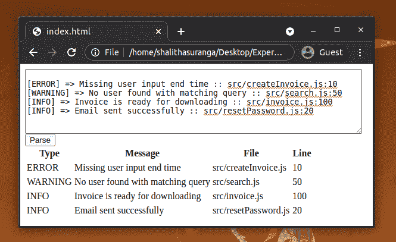

# 使用 ANTLR - LogRocket Blog 解析 web 应用程序中的原始文本输入

> 原文：<https://blog.logrocket.com/parsing-raw-text-inputs-in-web-applications-using-antlr/>

## 介绍

Web 应用程序经常接受用户的输入。在大多数情况下，web 应用程序分别请求每个用户输入。例如，一个典型的 web 应用程序会在注册过程中要求您输入您的名字、姓氏和电子邮件地址。

这种表单填充机制来自最初的 Web 2.0 阶段。现在，为了更好的用户体验，几乎所有的应用程序都在试图减少强制用户输入的次数。例如，一些应用程序现在只在注册时要求您的登录电子邮件。

一些 web 应用程序执行复杂的用户输入处理，例如分析日志文件、接受带有自定义语法的文本(例如，标签、内部文档标识符和用户提及)以及特定于领域的搜索查询。如果模式匹配要求很简单，我们可以使用正则表达式实现一个解决方案。然而，如果我们需要一个可扩展的解决方案，我们必须实现我们自己的解析器。

本教程将解释如何使用 [ANTLR](https://www.antlr.org/) 工具包创建一个解析器来处理原始文本输入。为了进行演示，我们将创建一个简单的日志解析器应用程序，将原始文本转换为 HTML 样式的输出。

## 编译器设计概念

在开始学习 ANTLR 之前，我们必须熟悉以下编译器设计原则。

### 标记化

这是解析过程的初始一般步骤。这个步骤接受一个原始文本流并产生一个令牌流。记号代表语法的最小部分。例如，`return`这个词在许多编程语言中都是一个标记。

### 解析树

解析树是一种树形数据结构实例，它具有关于解析结果的信息。它包含令牌和复杂的解析器节点。

### 编译器前端

典型的编译器有三个关键模块:前端、中间端和后端。编译器前端通过使用语言语法定义来构建源代码的内部表示。

### 编译器后端

编译器后端从源代码的内部表示生成目标语言代码。

## ANTLR 是什么？

[ANTLR](https://www.antlr.org/) (另一个语言识别工具)是一个用 Java 编写的解析器生成器工具包。ANLTR 广泛应用于软件开发行业，用于开发编程语言、查询语言和模式匹配。它根据自己的语法生成解析器代码。

如果我们打算从头开始实现一个解析器，我们必须编写用于标记化和解析器树生成的代码。当给出语言规范时，ANTLR 生成可扩展的解析器代码。换句话说，如果我们定义了解释我们需要如何使用 ANTLR grammar 语法进行解析的规则，它将自动生成解析器的源代码。

ANTLR 可以用 [10 种不同的编程语言](https://github.com/antlr/antlr4/blob/master/doc/targets.md)生成解析器代码。ANTLR 被称为 JavaScript 解析器代码和运行时。

## ANTLR 教程

在本教程中，我将解释如何使用 ANTLR 制作一个简单的日志解析器。

让我们将日志文件的语法命名为 SimpleLog。我们的日志解析程序接受原始日志输入。之后，它将根据日志文件内容生成一个 HTML 表。这意味着 SimpleLog 翻译器有一个编译器后端来从解析树生成 HTML 表。

您可以按照类似的步骤用 JavaScript 创建任何复杂的输入解析器。

## 使用 webpack 设置 ANTLR

如果您需要在应用程序的后端使用 ANTLR，您可以将 npm 包与 Node 一起使用。

否则，如果你需要在应用的前端使用 ANTLR，有几种方法。最舒适和最简单的方法是用 webpack 将 ANTLR 运行时与您的项目源代码捆绑在一起。在本教程中，我们将使用 webpack 设置 ANTLR。

首先，我们需要为 ANTLR 创建开发环境。确保首先安装 [JRE](https://openjdk.java.net/install/) (Java 运行时环境)。创建一个目录并下载 ANTLR 解析器生成器 CLI:

```
$ wget https://www.antlr.org/download/antlr-4.9.2-complete.jar

```

上面的命令是针对 Linux 的。使用等效命令下载。其他操作系统的 jar 文件。此外，您可以使用 web 浏览器手动下载特定文件。

用`npm init`命令创建一个新的 npm 项目。之后，将以下内容添加到`package.json`文件中:

```
{
  "name": "log-parser",
  "version": "1.0.0",
  "scripts": {
    "build": "webpack --mode=development",
    "generate": "java -jar antlr-4.9.2-complete.jar SimpleLog.g4 -Dlanguage=JavaScript -o src/parser"
  },
  "dependencies": {
    "antlr4": "^4.9.2",
  },
  "devDependencies": {
    "@babel/core": "^7.13.16",
    "@babel/plugin-proposal-class-properties": "^7.13.0",
    "@babel/preset-env": "^7.13.15",
    "babel-loader": "^8.2.2",
    "webpack": "^4.46.0",
    "webpack-cli": "^4.6.0"
  }
}

```

用以下内容创建`webpack.config.js`:

```
const path = require('path');

module.exports = {
  entry: path.resolve(__dirname, './src/index.js'),
  module: {
    rules: [
      {
        test: /\.js$/,
        exclude: /node_modules/,
        use: {
          loader: 'babel-loader',
          options: {
            presets: ['@babel/preset-env']
          }
        }
      },
    ],
  },
  resolve: {
    extensions: ['.js'],
    fallback: { fs: false }
  },
  output: {
    filename: 'logparser.js',
    path: path.resolve(__dirname, 'static'),
    library: 'LogParser',
    libraryTarget: 'var'
  }
};

```

我们还需要一个`.babelrc`，因为 ANTLR 使用了一些最新的 ECMAScript 特性。

因此，将以下代码片段添加到`.babelrc`:

```
{
  "presets": [
    "@babel/preset-env"
  ],
  "plugins": [
    [
      "@babel/plugin-proposal-class-properties",
      {
        "loose": true
      }
    ]
  ]
}

```

确保在终端上输入`npm install`来获取所需的依赖项，包括 ANTLR 运行时库。现在我们的 ANTLR 环境有足够的命令来生成解析器代码并构建最终的源代码。

然而，我们仍然缺少一个重要的部分。这是我们日志文件格式的语法。让我们继续实现 ANTLR 语法。

* * *

### 更多来自 LogRocket 的精彩文章:

* * *

## 编写语法

假设我们的日志文件遵循以下格式，并且我们需要解析它来识别所需的信息:

```
[ERROR] => Missing user input end time :: src/createInvoice.js:10
[WARNING] => No user found with matching query :: src/search.js:50
[INFO] => Invoice is ready for downloading :: src/invoice.js:100
[INFO] => Email sent successfully :: src/resetPassword.js:20

```

上述日志文件行有三个日志级别:`ERROR`、`WARNING`和`INFO`。之后，还有一条消息。最后，我们有触发日志记录过程的代码模块和行号。

在为上面的日志文件语法编写 ANTLR 语法之前，我们需要识别标记。SimpleLog 语法有三个关键标记，如下所示:

*   日志类型(`ERROR`、`WARNING`和`INFO`)
*   文本(`Datetime`、`Message`和`Module`)
*   数字(触发线)

现在，我们有了一个关于 lexer 规则的想法。让我们通过使用上述标记和一些解析器树生成规则来编写 ANTLR 语法。当你写语法的时候，你可以遵循自下而上的方法。换句话说，您可以从标记开始，以解析器规则结束。将以下语法逻辑添加到`SimpleLog.g4`:

```
grammar SimpleLog;

logEntry    : logLine+;

logLine     : '[' logType ']' ' => ' logMessage ' :: ' logSender;
logType     : (INFO | WARNING | ERROR);
logMessage  : TEXT+?;
logSender   : logFile ':' DIGITS;
logFile     : TEXT+?;

INFO     : 'INFO';
WARNING  : 'WARNING';
ERROR    : 'ERROR';
TEXT     : [a-zA-Z ./]+?;
DIGITS   : [0-9]+;
WS       : [ \n\t]+ -> skip;

```

Camelcase 单词表示上述 SimpleLang 语法文件中的解析器规则。这些解析器规则通过使用标记来帮助构建解析树。在解析树的最顶端，有一行的入口。之后，每个线节点有`logType`、`logMessage`和`logSender`节点。

大写的定义是 lexer 规则。这些词法分析器规则有助于标记化过程。来自用户的原始输入将使用诸如文本片段、数字和日志类型之类的 tokes 进行标记化。

在您的终端上从项目目录运行以下命令来触发解析器代码生成:

```
$ npm run generate

```

如果您正确地创建了语法文件，您将能够在`src/parser`目录中看到自动生成的解析器代码。让我们实现 SimpleLog 翻译程序的后端。

## 实现树访问者

ANTLR 解析过程将生成一个内存中的解析树。它还提供了一个侦听器类来遍历解析树。我们需要创建一个树访问者来遍历解析树并生成输出 HTML 表结构。在编译器理论中，这被称为代码生成过程。

将以下代码添加到`src/TableGenerator.js`中:

```
import SimpleLogListener from "./parser/SimpleLogListener"

export default class TableGenerator extends SimpleLogListener {

    tableSource = "";

    exitLogLine(ctx) {
        const logType = ctx.logType().getText();
        const logMessage = ctx.logMessage().getText();
        const logFile = ctx.logSender().logFile().getText();
        const logLine = ctx.logSender().DIGITS(0).getText();
        this.tableSource += 
        `
        <tr>
            <td>${logType}</td>
            <td>${logMessage}</td>
            <td>${logFile}</td>
            <td>${logLine}</td>
        <tr>
        `
    }

    getTable() {
        const table = `
            <table>
                <thead>
                    <th>Type</th>
                    <th>Message</th>
                    <th>File</th>
                    <th>Line</th>
                <thead>
                ${this.tableSource}
            </table>
        `;
        return table;
    }
}

```

上面的类扩展了自动生成的基本侦听器类。基本侦听器类具有所有与树遍历相关的方法。在我们的场景中，为了简单起见，我们只覆盖了`exitLogLine`方法。我们可以从`exitLogLine`方法中获得日志类型、消息、文件和行号。代码编写过程被称为发出。这里我们从树遍历器类发出 HTML 表语法。

## 最终完成 SimpleLog 解析器库

我们正在用 webpack 准备一个客户端库，因为我们需要在浏览器中直接使用解析器逻辑。现在我们的图书馆需要一个公共入口。让我们将`LogParser.parse()`方法暴露给浏览器。

将下面的代码添加到`src/index.js`中，它是我们解析器库的入口点:

```
import antlr4 from 'antlr4';
import SimpleLogLexer from './parser/SimpleLogLexer';
import SimpleLogParser from './parser/SimpleLogParser';
import TableGenerator from './TableGenerator';

export let parse = (input) => {
   const chars = new antlr4.InputStream(input);
   const lexer = new SimpleLogLexer(chars);
   const tokens  = new antlr4.CommonTokenStream(lexer);
   const parser = new SimpleLogParser(tokens);
   parser.buildParseTrees = true;
   const tree = parser.logEntry();
   const tableGenerator = new TableGenerator();
   antlr4.tree.ParseTreeWalker.DEFAULT.walk(tableGenerator, tree);
   return tableGenerator.getTable();
}

```

parse 方法接受原始输入，并相应地返回 HTML 表结构。现在，我们的解析器库完成了。

在您的终端上执行以下命令，从源代码创建一个 JavaScript 源文件:

```
$ npm run build

```

生成的 JavaScript 文件将被保存到`static/logparser.js`中。

最后，我们可以实现 SimpleLog 解析程序的图形用户界面(GUI)。

## 开发简单日志解析器 web 应用程序

我们的 web 应用程序有三个主要组件:文本区域、解析按钮和结果区域。对于这个示例程序，我使用普通的 HTML 和普通的 JavaScript 构建了一个简单的界面。

将以下 HTML 和 JavaScript 代码添加到`static/index.html`文件中:

```
<script src="logparser.js"></script>
<textarea id="rawText"></textarea>
<button onclick="generateTable();">Parse</button>
<div id="tableWrapper"></div>
<script>
    function generateTable() {
        const textarea = document.getElementById("rawText");
        const tableWrapper = document.getElementById("tableWrapper");
        tableWrapper.innerHTML = LogParser.parse(textarea.value);
    }
</script>

```

恭喜你！我们的 SimpleLog parser web 应用程序现在已经准备好了。web 应用程序可以通过静态文件服务器启动，也可以通过双击 HTML 文件来启动。尝试复制粘贴一个样本输入。之后，单击 Parse 按钮获得原始文本的 HTML 版本。



完整的项目源代码可以在 [GitHub](https://github.com/shalithasuranga/simplelog-parser) 上获得。

## 结论

我们还可以使用 ANTLR 解析来自用户的原始文本输入。ANTLR 有各种各样的用例。本教程解释了一个简单的例子。同样的方法可以用于开发 web transpilers、高级 web 抓取、复杂模式匹配和基于 web 的查询语言，以构建下一级 web 应用程序。

您是否正在尝试为您的 web 应用程序构建一种定制的查询语言？试试 ANTLR。

## 使用 [LogRocket](https://lp.logrocket.com/blg/signup) 消除传统错误报告的干扰

[](https://lp.logrocket.com/blg/signup)

[LogRocket](https://lp.logrocket.com/blg/signup) 是一个数字体验分析解决方案，它可以保护您免受数百个假阳性错误警报的影响，只针对几个真正重要的项目。LogRocket 会告诉您应用程序中实际影响用户的最具影响力的 bug 和 UX 问题。

然后，使用具有深层技术遥测的会话重放来确切地查看用户看到了什么以及是什么导致了问题，就像你在他们身后看一样。

LogRocket 自动聚合客户端错误、JS 异常、前端性能指标和用户交互。然后 LogRocket 使用机器学习来告诉你哪些问题正在影响大多数用户，并提供你需要修复它的上下文。

关注重要的 bug—[今天就试试 LogRocket】。](https://lp.logrocket.com/blg/signup-issue-free)