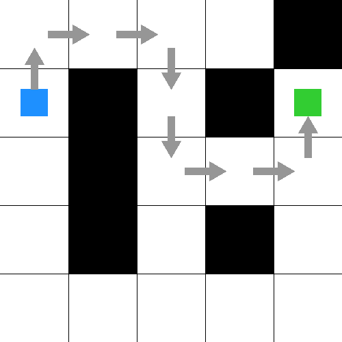
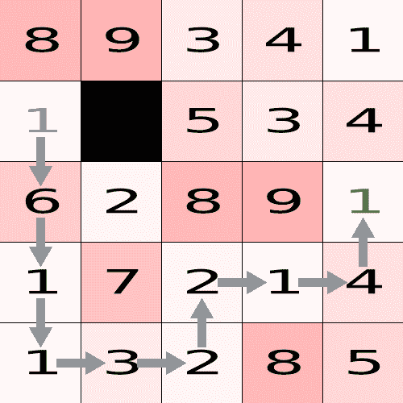
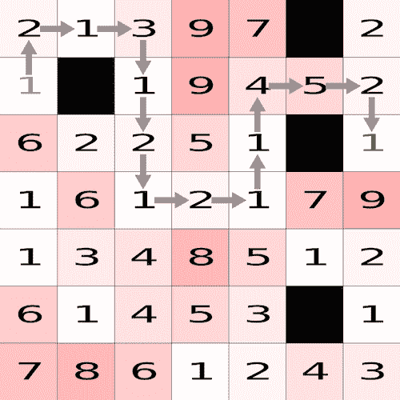

# Rust 中的寻路:示例教程

> 原文：<https://blog.logrocket.com/pathfinding-rust-tutorial-examples/>

寻路是许多应用中的一个重要问题。在本文中，我们将看看 Rust 语言中的一些寻路选项。

我们将涵盖的内容:

## 什么是寻路？

简单来说，寻路就是寻找两点之间的最短路径。在最简单的情况下，答案是“一条直线”，但事情可以变得比这复杂得多！

一些复杂因素的例子有:

*   无法逾越的障碍
*   更难通过的地形

例如，要处理更难通过的地形，可以给这两个点一个通过成本。然后，您可以将目标更改为找到这两点之间成本最低的路线。

## 寻路的用法

寻路在许多应用中使用。一些最常见的是机器人和视频游戏，如 roguelike 游戏。

在机器人学中，机器人的一个常见任务是在环境中导航，并尽快从 A 点到达 B 点。

在视频游戏中，由计算机控制的角色可能需要在环境中移动位置。此外，如果游戏允许玩家设置路点，它可能还想显示到达下一个路点的最快方法。

## Rust 中的寻路示例

既然我们已经确定了寻路的有用性，那么让我们来看几个在 [Rust，一种越来越流行的编程语言](https://blog.logrocket.com/why-is-rust-popular/)中寻路的例子。

对于这些例子，我们将使用名副其实的`[pathfinding](https://crates.io/crates/pathfinding)`板条箱，这是在[Rust 社区的板条箱注册表](https://crates.io/)上最受欢迎的寻路板条箱。

请注意，大多数寻路算法是根据节点而不是连续空间来工作的。这篇[游戏开发者文章](https://www.gamasutra.com/view/feature/3096/toward_more_realistic_pathfinding.php)讨论了一些让这些算法的结果看起来更自然的方法。

### Rust 寻路框架示例

你可以查看我们将在 GitHub repo 中使用的[完整代码。](https://github.com/gregstoll/rust-pathfinding)

`[Board](https://github.com/gregstoll/rust-pathfinding/blob/main/src/lib.rs#L11)` [结构](https://github.com/gregstoll/rust-pathfinding/blob/main/src/lib.rs#L11)定义了一个矩形棋盘，其中每个单元格都可能是一个障碍，或者有一个与移动到它相关联的成本。

`Board::new()`允许创建电路板并用`Vec<string>`指定这些单元。在此字符串中，值在 1 到 9 之间的字符表示可以按定义的成本移动到的单元格。同时，字符“X”表示有障碍。

请注意，这些算法支持单元之间的单向链接。为了简单起见，我们不允许在`Board`结构中使用该功能。

`Board::get_successors()`接受一个单元格位置并返回一个`Vec`单元格，这些单元格可以直接移动到它们的成本。正如我们将看到的，这是我们在寻路箱中将要看到的所有算法中使用的一个关键方法。

还有`Board::draw_to_image()`，这是用`Board`单元格编写图像的一种便捷方式——也可以选择一个路径。这种方法使用`[imageproc](https://crates.io/crates/imageproc)`板条箱来绘图。

### 使用广度优先搜索在 Rust 中寻路

[广度优先搜索是一种相当简单的算法](https://en.wikipedia.org/wiki/Breadth-first_search)，用于寻找从起始节点到目标节点的最短路径。从起始节点开始，它一次处理每个连接的节点。

如果那个节点是目标节点，那么我们就完成了！否则，我们将它的每个连接放入节点队列中查看并继续。

广度优先搜索算法不考虑节点的成本，但这是一个非常简单的例子。您可以使用广度优先搜索查看本例的完整源代码。

下面的代码显示了实际执行广度优先搜索的调用:

```
    let result = bfs(
        &start,
        |p| board.get_successors(p).iter().map(|successor| successor.pos).collect::<Vec<_>>(), 
        |p| *p==goal);

```

根据 `[bfs()](https://docs.rs/pathfinding/3.0.12/pathfinding/directed/bfs/fn.bfs.html)`的[文档，参数为:](https://docs.rs/pathfinding/3.0.12/pathfinding/directed/bfs/fn.bfs.html)

*   开始的节点
*   接受一个节点并返回一个可以直接移动到的节点的`Vec`的函数
*   接受一个节点并返回它是否是目标节点的函数

注意，由于广度优先搜索不支持节点的成本，我们必须映射`Board::get_successors()`的结果来移除成本。

此外，正如文档中提到的，接受一个节点并返回它是否是目标节点比仅仅接受目标节点更灵活。这是因为它允许多个目标节点，或者对一个节点是否是目标进行某种动态计算。

在这种情况下，我们只需要一个目标节点，这也很容易做到！

`bfs()`返回`Option<Vec<N>>`，其中`N`是您传入的节点的类型。这是一个`Option<>`，因为从起点到目标可能没有路径；在那种情况下`None`被退回。否则，它返回从起点到目标的路径的`Vec`，包括两个端点。

要运行该示例，请使用`cargo run --bin bfs`。下图显示了从开始(蓝色)节点到目标(绿色)节点的路径:



### 用 Dijkstra 算法计算 Rust 寻路的代价

[Dijkstra 算法](https://en.wikipedia.org/wiki/Dijkstra's_algorithm)是另一种寻找从起始节点到目标节点最短路径的算法。与广度优先搜索不同，它在计算中使用了移动到一个节点的成本。

确保使用 Dijkstra 的算法查看本例的[完整源代码。](https://github.com/gregstoll/rust-pathfinding/blob/main/src/bin/dijkstra.rs)

下面是运行 Dijkstra 算法的调用:

```
    let result = dijkstra(
        &start,
        |p| board.get_successors(p).iter().map(|s| (s.pos, s.cost)).collect::<Vec<_>>(),
        |p| *p==goal);

```

根据 `[dijkstra()](https://docs.rs/pathfinding/3.0.12/pathfinding/directed/dijkstra/fn.dijkstra.html)`的[文档，论据与`bfs()`非常相似。唯一的区别是第二个参数现在是元组的`Vec`，每个元组包含以下内容:](https://docs.rs/pathfinding/3.0.12/pathfinding/directed/dijkstra/fn.dijkstra.html)

*   可以直接移动到的节点
*   移动到该节点的开销

再次，类似于`bfs()`，`dijkstra()`返回`Option<(Vec<N>, C)>`；元组的第二个成员是从起始节点到目标节点的总开销。

要运行这个例子，使用`cargo run --bin dijkstra`，这里是显示从开始节点(蓝色数字的那个)到目标节点(绿色数字的那个)的路径的结果图像:



请注意，由于节点的成本，该路径比直接路径更迂回一些。

### 使用 A*搜索算法的 Rust 寻路

我们之前看到的两个搜索都是从尝试每个连接的节点开始的。然而，问题中通常有更多的结构是这些算法没有利用的。

例如，如果你的目标节点在你的开始节点的正西方，那么第一次移动应该是在西方的方向！

[A*搜索算法](https://en.wikipedia.org/wiki/A*_search_algorithm)(读作“A-star”)利用了这个额外的结构。它要求您传递一个启发式函数来估计从一个节点到目标的距离，并且这个估计值总是小于或等于实际距离。

使用这种试探，A*搜索算法可以首先尝试成本更低的路径。它还可以计算出何时可以停止，因为没有更短的路径。

警告:如果启发式算法不遵守这个属性，算法可能不会返回最短路径！如果你担心这一点，你可以用 Dijkstra 的算法运行一些测试用例，并确认 A*和 Dijkstra 的算法给出相同的结果，以确保启发式算法是有效的。

通常，如果您在二维空间中进行寻路，忽略成本并只计算两个节点之间的距离的启发式方法效果很好。

对于我们的例子`Board`，我们不允许对角线移动，所以两个单元格之间的距离是[曼哈顿距离](https://en.wikipedia.org/wiki/Taxicab_geometry)。由于到达任何单元的最小成本是`1`，我们可以用它作为我们的启发式算法。

这里是使用 A*搜索算法的这个例子的[完整源代码，这里是运行它的调用:](https://github.com/gregstoll/rust-pathfinding/blob/main/src/bin/astar.rs)

```
    let result = astar(
        &start,
        |p| board.get_successors(p).iter().map(|s| (s.pos, s.cost)).collect::<Vec<_>>(),
        |p| ((p.0 - goal.0).abs() + (p.1 - goal.1).abs()) as u32,
        |p| *p==goal);

```

根据 `[astar()](https://docs.rs/pathfinding/3.0.12/pathfinding/directed/astar/fn.astar.html)`的[文档，参数和返回值与`dijkstra()`相同，除了启发式函数，它是第三个参数。](https://docs.rs/pathfinding/3.0.12/pathfinding/directed/astar/fn.astar.html)

如上所述，我们使用像元之间的曼哈顿距离作为启发式距离，即 x 值之差加上 y 值之差。

要运行该示例，请使用`cargo run --bin astar`。这是生成的图像:



## 结论

当谈到 Rust 中的寻路时，A*搜索通常用于机器人和视频游戏应用程序。然而，A*搜索的一个缺点是它需要大量的内存来运行。

有一些变体，如[迭代深化 A*搜索](https://en.wikipedia.org/wiki/Iterative_deepening_A*)和[边缘搜索](https://en.wikipedia.org/wiki/Fringe_search)，可以改善其内存使用，寻路箱通过`[idastar()](https://docs.rs/pathfinding/3.0.12/pathfinding/directed/idastar/fn.idastar.html)`和`[fringe()](https://docs.rs/pathfinding/3.0.12/pathfinding/directed/fringe/fn.fringe.html)`方法支持这两种方法。这些方法与上面的`astar()`方法采用相同的参数，所以很容易试用。

如果你想在 Rust 中做一些探索，[克隆回购并尝试一下](https://github.com/gregstoll/rust-pathfinding)！

## [log rocket](https://lp.logrocket.com/blg/rust-signup):Rust 应用的 web 前端的全面可见性

调试 Rust 应用程序可能很困难，尤其是当用户遇到难以重现的问题时。如果您对监控和跟踪 Rust 应用程序的性能、自动显示错误、跟踪缓慢的网络请求和加载时间感兴趣，

[try LogRocket](https://lp.logrocket.com/blg/rust-signup)

.

[](https://lp.logrocket.com/blg/rust-signup)

LogRocket 就像是网络和移动应用程序的 DVR，记录你的 Rust 应用程序上发生的一切。您可以汇总并报告问题发生时应用程序的状态，而不是猜测问题发生的原因。LogRocket 还可以监控应用的性能，报告客户端 CPU 负载、客户端内存使用等指标。

现代化调试 Rust 应用的方式— [开始免费监控](https://lp.logrocket.com/blg/rust-signup)。