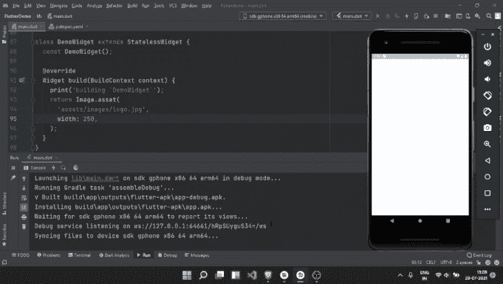
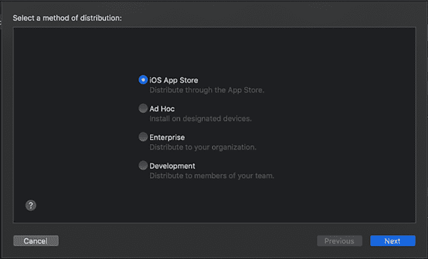
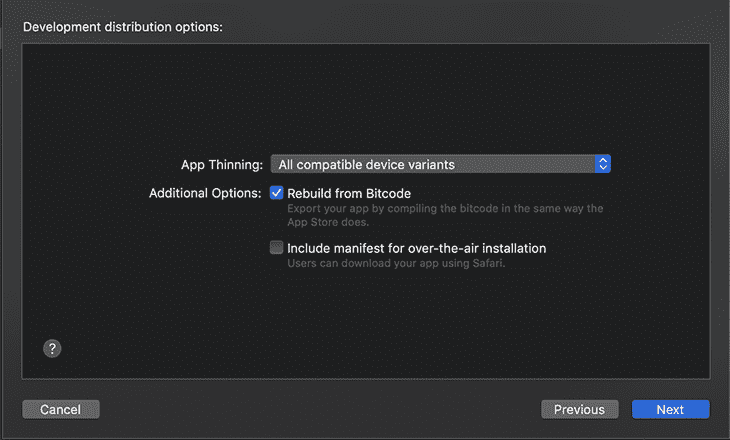

# Flutter 中移动应用的性能改进

> 原文：<https://blog.logrocket.com/performance-improvements-mobile-apps-flutter/>

对于任何应用或产品来说，性能都是一个至关重要的因素，并且会受到多种因素的影响。一般来说，当你在 Flutter 中构建应用程序时，性能结果已经足够好了，但你可能仍然会面临应用程序性能的问题。

这就是为什么您需要在开发过程中关注 Flutter 应用程序的最佳实践和性能改进——提前解决问题，并为您的最终用户提供完美的体验。

本文的目标是带您了解 Flutter 应用程序性能改进的基本最佳实践。我将向您展示如何:

1.  [避免重新构建窗口小部件](#avoid-rebuilding-widgets)
2.  [利用常量小工具](#make-use-constant-widgets)
3.  [按需高效加载列表项目](#load-list-items-efficiently)
4.  [利用异步/等待](#make-use-async-await)
5.  [高效使用运算符](#efficiently-use-operators)
6.  [利用插值技术](#use-interpolation-techniques)
7.  [缩小你的应用尺寸](#reduce-your-app-size)

最常见的性能反模式之一是使用`setState`来重建`[StatefulWidgets](https://blog.logrocket.com/difference-between-stateless-stateful-widgets-flutter/)`。每次用户与小部件交互时，整个视图都会刷新，影响支架、背景小部件和容器，这显著增加了应用程序的加载时间。

在这种情况下，只有重建我们必须更新的内容才是好策略。这可以通过在颤振中使用阻塞模式来实现。像 flutter_bloc，MobX，Provider 这些包都是比较流行的。

但是，您知道这也可以在没有任何外部包装的情况下完成吗？让我们看看下面的例子:

```
class _CarsListingPageState extends State<CarsListingPage> {
  final _carColorNotifier = ValueNotifier<CarColor>(Colors.red);
  Random _random = new Random();

  void _onPressed() {
    int randomNumber = _random.nextInt(10);
    _carColorNotifier.value =
        Colors.primaries[randomNumber % Colors.primaries.lengths];
  }

  @override
  void dispose() {
    _carColorNotifier.dispose();
    super.dispose();
  }

  @override
  Widget build(BuildContext context) {
    print('building `CarsListingPage`');
    return Scaffold(
      floatingActionButton: FloatingActionButton(
        onPressed: _onPressed,
        child: Icon(Icons.colorize),
      ),
      body: Stack(
        children: [
          Positioned.fill(
            child: BackgroundWidget(),
          ),
          Center(
            child: ValueListenableBuilder(
              valueListenable: _colorNotifier,
              builder: (_, value, __) => Container(
                height: 100,
                width: 100,
                color: value,
              ),
            ),
          ),
        ],
      ),
    );
  }
}

```

类`_CarsListingPageState`描述了基于状态的可能动作的行为，例如`_onPressed`。框架的`build`方法正在基于提供给该方法的`context`构建`Widget`的实例。它创建了一个`floatingActionButton`的实例，并指定了颜色、高度和宽度等属性。

当用户按下屏幕上的`FloatingActionButton`时，`onPressed`被调用，从 `_CarsListingPageState`调用`_onPressed`。然后从原色调色板中分配一种随机颜色，然后通过`builder`返回，该颜色填充在屏幕中央。

这里，每次，上面代码中的`build`方法都不会在控制台上打印输出`building CarsListingPage`。这意味着这个逻辑工作正常——它只是构建我们需要的小部件。

普通 widget 和常量有什么区别？正如定义所暗示的，将`const`应用到小部件将在编译时初始化它。

这意味着将小部件声明为常量将在编译期间初始化小部件及其所有依赖项，而不是在运行时。这也将允许你尽可能地使用小部件，同时避免不必要的重建。

下面是一个如何使用常量小部件的示例:

```
class _CarListingPageState extends State<CarListingPage> {
  int _counter = 0;

  void _onPressed() {
    setState(() {
      _counter++;
    });
  }

  @override
  Widget build(BuildContext context) {
    return Scaffold(
      floatingActionButton: FloatingActionButton(
        onPressed: _onPressed,
        child: Icon(Icons.play_arrow),
      ),
      body: Stack(
        children: [
          Positioned.fill(
            child: const DemoWidget(),
          ),
          Center(
              child: Text(
                _counter.toString(),
              )),
        ],
      ),
    );
  }
}

class DemoWidget extends StatelessWidget {
  const DemoWidget();

  @override
  Widget build(BuildContext context) {
    print('building `DemoWidget`');
    return Image.asset(
      'assets/images/logo.jpg',
      width: 250,
    );
  }
}

```

`_CarListingPageState`类指定了一个状态:`_onPressed`，它调用`setState`并增加`_counter`的值。`build`方法生成一个`FloatingActionButton`和树中的其他元素。`DemoWidget`中的第一行创建了一个新实例，并将其声明为常量。

每次按下`FloatingActionButton`时，计数器增加，计数器的值被写入屏幕上的子项目中。在这个执行过程中，`DemoWidget`被重用，整个小部件的重新生成被跳过，因为它被声明为常量小部件。

如下面的 GIF 所示，第一次构建小部件时，语句“building `DemoWidget`”只打印一次，然后就被重用了。

但是，每次热加载或重启应用程序时，您都会看到打印的语句“building `DemoWidget`”。



## 3.按需高效加载列表项目

当处理列表项时，开发人员通常使用小部件`SingleChildScrollView`和`Column`的组合。

当处理大型列表时，如果继续使用这一组小部件，事情会很快变得混乱。这是因为每个项目都被附加到列表中，然后呈现在屏幕上，这增加了系统的整体负载。

在这种情况下，使用`ListView`构建器是个好主意。这在很大程度上提高了性能。让我们看一个构建器对象的例子:

```
ListView.builder(
itemCount: items.length,
itemBuilder: (context, index) {
return ListTile(
title: Text('Row: ${items[index]}'),
);},);

```

## 4.利用异步/等待

编写执行流时，确定代码是允许同步运行还是异步运行非常重要。异步代码更难调试和改进，但是仍然有[几种方法可以在 Flutter](https://blog.logrocket.com/async-callbacks-with-flutter-futurebuilder/) 中编写异步代码，包括使用`Future`、`async/await`等等。

当与`async`结合使用时，由于遵循了编写代码的结构和模式，代码可读性得到了提高。另一方面，由于它能够在需要的地方采用防故障策略，整体执行性能得到了提高——在本例中是`try ... catch`。让我们看看下面的例子:

```
// Inappropriate
Future<int> countCarsInParkingLot() {
  return getTotalCars().then((cars) {

    return cars?.length ?? 0;

  }).catchError((e) {
    log.error(e);
    return 0;
  });
}

// Appropriate
Future<int> countCarsInParkingLot() async {     // use of async
  try {
    var cars = await getTotalCars();

    return cars?.length ?? 0;

  } catch (e) {
    log.error(e);
    return 0;
  }
}

```

## 5.高效使用运算符

Flutter 包含了语言特有的特性。其中一个就是运营商。

如果您希望减少开发时间，编写健壮的代码以避免逻辑错误，并提高代码的可读性，建议使用空检查运算符、可空运算符和其他合适的运算符。

让我们看看下面的一些例子:

```
car = van == null ? bus : audi;         // Old pattern

car = audi ?? bus;                      // New pattern

car = van == null ? null : audi.bus;    // Old pattern

car = audi?.bus;                        // New pattern

(item as Car).name = 'Mustang';         // Old pattern

if (item is Car) item.name = 'Mustang'; // New pattern

```

## 6.利用插值技术

使用操作符`+`执行字符串操作和链接是一种常见的做法。代替这样做，我们将利用字符串插值，这提高了代码的可读性并减少了出错的机会。

```
// Inappropriate
var discountText = 'Hello, ' + name + '! You have won a brand new ' + brand.name + 'voucher! Please enter your email to redeem. The offer expires within ' + timeRemaining.toString() ' minutes.';

// Appropriate
var discountText = 'Hello, $name! You have won a brand new ${brand.name} voucher! Please enter your email to redeem. The offer expires within ${timeRemaining} minutes.';

```

如前所述，以内联方式访问变量可以提高指定文本的可读性，并且代码不容易出错，因为字符串被分成了更少的部分。

* * *

### 更多来自 LogRocket 的精彩文章:

* * *

## 7.减少你的应用程序大小

在开发过程中，向代码中添加大量的包是非常容易的。您可能已经意识到，这可能会变成臃肿的软件。

我们用一个安卓的 app 来举例。你可以使用 [Gradle](https://gradle.org) ，一个强大的开源构建工具，带有过多的配置选项，以减少应用程序的大小。

还可以生成 Android 应用捆绑包，这是 Google 推出的一个新的打包系统。

应用捆绑包在多方面都很高效。仅从谷歌 Play 商店下载特定目标设备所需的代码。这之所以成为可能，是因为谷歌 Play 商店只为目标设备的屏幕密度、平台架构、支持硬件功能等重新打包和运送必要的文件和资源。

[Google Play 控制台统计数据](https://developer.android.com/platform/technology/app-bundle#size-savings-because-of-android-app-bundles)显示，在大多数情况下，当你选择应用捆绑包而不是 apk 时，应用的下载量会减少 40%到 60%。

生成应用捆绑包的命令是:

```
flutter build appbundle

```

为了混淆 Dart 语言代码，您需要在 build 命令中使用`obfuscate`和`--split-debug-info`标志。该命令如下所示:

```
flutter build apk --obfuscate --split-debug-info=/<project-name>/<directory>

```

上述命令生成一个符号映射文件。该文件对于消除堆栈跟踪的模糊很有用。

### 进步和保持规则

以下是应用了 ProGuard 和其他配置的应用级`build.gradle`文件示例:

```
android {
    ...

    def proguard_list = [
            "../buildsettings/proguard/proguard-flutter.pro",
            "../buildsettings/proguard/proguard-firebase.pro",
            "../buildsettings/proguard/proguard-google-play-services.pro",
            ...
    ]

    buildTypes {
        release {
            debuggable false                // make app non-debuggable
            crunchPngs true                 // shrink images
            minifyEnabled true              // obfuscate code and remove unused code
            shrinkResources true            // shrink and remove unused resources
            useProguard true                // apply proguard
            proguard_list.each {            
               pro_guard -> proguardFile pro_guard
           }
            signingConfig signingConfigs.release
        }
    }

```

减少 APK 大小的最佳实践之一是将 ProGuard 规则应用于您的 Android 应用程序。ProGuard 应用规则从最终生成的包中删除未使用的代码。在构建生成过程中，上面的代码使用指定位置的 ProGuard 对代码和资源应用各种配置。

以下是为 Firebase 指定的 ProGuard 规则的示例:

```
-keepattributes EnclosingMethod
-keepattributes InnerClasses
-dontwarn org.xmlpull.v1.**
-dontnote org.xmlpull.v1.**
-keep class org.xmlpull.** { *; }
-keepclassmembers class org.xmlpull.** { *; }

```

上述声明称为 keep 规则。keep 规则在 ProGuard 配置文件中指定。这些规则定义了在代码收缩和混淆阶段，当 keep 规则的指定模式匹配时，如何处理文件、属性、类、成员声明和其他注释。

您可以使用破折号和声明规则关键字指定要保留的内容和要忽略的内容，如下所示:

`-keep class org.xmlpull.** { *; }`

当应用 ProGuard 时，上述规则不会在代码收缩阶段删除类或任何类内容。

在使用它的时候你仍然需要小心，因为如果操作不当，它会引入错误。其原因是，如果您指定一个规则来移除代码块、类或任何已声明并用于运行代码执行的成员，则该规则可能会引入编译时错误、运行时错误，甚至是致命错误，如空指针异常。

你可以从官方 Android 开发者社区了解更多关于如何正确实施 ProGuard 规则的信息。

### `.IPA`构建 iOS 的步骤

类似地，对于 iOS，您需要执行如下的`.IPA`构建步骤:

1.  进入 XCode，点击右侧窗格中**档案**部分下的**分发应用**。
2.  选择分配方式后，例如**开发**，然后点击**下一步**按钮进入 **App 细化**部分。
3.  在应用精简部分，选择**所有兼容设备变体**。T3
4.  然后选择**从位码重建**和**剥离 Swift 符号**。然后签名并导出`.IPA`文件。它还会生成一个应用程序细化大小报告文件。

## 结论

在本文中，我们讨论了提高 Flutter 应用程序性能的技术。虽然 [Flutter 作为一个框架](https://blog.logrocket.com/tag/flutter)提供了很多功能，并且随着新的更新不断发展，但是性能始终是一个关键的考虑因素。

在占领全球市场时，应用性能已经并将继续成为一个巨大的决定因素。当考虑移动应用程序的不同方面时，如应用程序大小、设备分辨率、代码的执行速度和硬件功能，提高性能会产生巨大的影响，尤其是在面向大量受众时。

## 使用 [LogRocket](https://lp.logrocket.com/blg/signup) 消除传统错误报告的干扰

[](https://lp.logrocket.com/blg/signup)

[LogRocket](https://lp.logrocket.com/blg/signup) 是一个数字体验分析解决方案，它可以保护您免受数百个假阳性错误警报的影响，只针对几个真正重要的项目。LogRocket 会告诉您应用程序中实际影响用户的最具影响力的 bug 和 UX 问题。

然后，使用具有深层技术遥测的会话重放来确切地查看用户看到了什么以及是什么导致了问题，就像你在他们身后看一样。

LogRocket 自动聚合客户端错误、JS 异常、前端性能指标和用户交互。然后 LogRocket 使用机器学习来告诉你哪些问题正在影响大多数用户，并提供你需要修复它的上下文。

关注重要的 bug—[今天就试试 LogRocket】。](https://lp.logrocket.com/blg/signup-issue-free)