# Unity 中的性能:async、await 和 Tasks 与协程、C#作业系统和突发编译器

> 原文：<https://blog.logrocket.com/performance-unity-async-await-tasks-coroutines-c-job-system-burst-compiler/>

当你试图发布到网络、手机、游戏机，甚至一些低端电脑时，性能就是一切。运行速度低于 30 FPS 的游戏或应用程序会让用户感到沮丧。让我们来看看一些可以通过减少 CPU 负载来提高性能的东西。

在本帖中，我们将介绍 C#中的`async`、`await`和`Task`是什么，以及如何在 Unity 中使用它们来提高项目的性能。接下来，我们将看看 Unity 的一些内置包:协程、C#作业系统和突发编译器。我们将看看它们是什么，如何使用它们，以及它们如何提高项目的性能。

为了启动这个项目，我将使用 Unity 2021.3.4f1。我没有在 Unity 的任何其他版本上测试过这个代码；这里的所有概念应该可以在 Unity 2019.3 之后的任何 Unity 版本上工作。如果使用旧版本，您的性能结果可能会有所不同，因为 Unity 在 2021 年确实对 async/await 编程模型进行了一些重大改进。在 Unity 的博客[中了解更多信息。NET，下一步是什么](https://blog.unity.com/technology/unity-and-net-whats-next)，特别是标有“现代化 Unity 运行时”的部分

我创建了一个新的 2D (URP)核心项目，但是你可以在你喜欢的任何类型的项目中使用它。

我有一个从 Kenney Vleugels 的 Space Shooter (Redux，加上字体和声音)得到的精灵。

我创建了一个包含精灵渲染和敌人组件的敌人预设。敌人组件是一个`MonoBehaviour`，它有一个`Transform`和一个`float`来跟踪位置和在 y 轴上移动的速度；

```
using UnityEngine;

public class Enemy
{
   public Transform transform;
   public float moveY;
}
```

## C#中的`async`、`await`、`Task`是什么

### 什么是`async`？

在 C#中，方法前面可以有一个`async`关键字，这意味着这些方法是异步方法。这只是告诉编译器，我们希望能够在中执行代码，并允许该方法的调用方在等待该方法完成时继续执行。

这方面的一个例子就是做饭。你将开始煮肉，当肉在煮的时候，你正在等待它完成，你将开始做边。当食物正在烹调的时候，你将开始布置桌子。代码中的一个例子是`static async Task<Steak> MakeSteak(int number)`。

Unity 也有各种内置的方法，你可以异步调用；方法列表见[Unity 文档](https://docs.unity3d.com/2021.3/Documentation/ScriptReference/30_search.html?q=async)。在 Unity 处理内存管理的方式上，它要么使用[协程](https://docs.unity3d.com/2021.3/Documentation/ScriptReference/Coroutine.html)、`[AsyncOperation](https://docs.unity3d.com/2021.3/Documentation/ScriptReference/AsyncOperation.html)`，要么使用 [C#作业系统](https://docs.unity3d.com/2021.3/Documentation/Manual/JobSystemOverview.html)。

### `await`是什么，怎么用？

在 C#中，可以使用`await`关键字等待异步操作完成。这用在任何有`async`关键字的方法中，以等待操作继续:

```
Public async void Update()
{
     // do stuff
     await // some asynchronous method or task to finish
     // do more stuff or do stuff with the data returned from the asynchronous task.
}
```

关于`await`的更多信息，请参见[微软文档](https://docs.microsoft.com/en-us/dotnet/csharp/language-reference/operators/await)。

### 什么是`Task`以及如何使用它？

`Task`是一个异步方法，执行单个操作，不返回值。对于返回值的`Task`，我们将使用`Task<TResult>`。

为了使用任务，我们像在 C#中创建任何新对象一样创建它:`Task t1 = new Task(void Action)`。接下来，我们开始任务`t1.wait`。最后，我们用`t1.wait`等待任务完成。

有几种方法可以创建、启动和运行任务。`Task t2 = Task.Run(void Action)`将创建并开始一项任务。`await Task.Run(void Action)`将创建、启动并等待任务完成。我们可以用最常见的替代方式对付`Task t3 = Task.Factory.Start(void Action)`。

有几种方法可以让我们等待任务完成。`int index = Task.WaitAny(Task[])`将等待任何任务完成，并给我们数组中已完成任务的索引。`await Task.WaitAll(Task[])`将等待所有的任务完成。

有关任务的更多信息，请参见微软文档。

#### 一个简单的`task`例子

```
private void Start()
{
   Task t1 = new Task(() => Thread.Sleep(1000));
   Task t2 = Task.Run(() => Thread.Sleep(2000000));
   Task t3 = Task.Factory.StartNew(() => Thread.Sleep(1000));
   t1.Start();
   Task[] tasks = { t1, t2, t3 };
   int index = Task.WaitAny(tasks);
   Debug.Log($"Task {tasks[index].Id} at index {index} completed.");

   Task t4 = new Task(() => Thread.Sleep(100));
   Task t5 = Task.Run(() => Thread.Sleep(200));
   Task t6 = Task.Factory.StartNew(() => Thread.Sleep(300));
   t4.Start();
   Task.WaitAll(t4, t5, t6);
   Debug.Log($"All Task Completed!");
   Debug.Log($"Task When any t1={t1.IsCompleted} t2={t2.IsCompleted} t3={t3.IsCompleted}");
   Debug.Log($"All Task Completed! t4={t4.IsCompleted} t5={t5.IsCompleted} t6={t6.IsCompleted}");
}

public async void Update()
{
   float startTime = Time.realtimeSinceStartup;
   Debug.Log($"Update Started: {startTime}");
   Task t1 = new Task(() => Thread.Sleep(10000));
   Task t2 = Task.Run(() => Thread.Sleep(20000));
   Task t3 = Task.Factory.StartNew(() => Thread.Sleep(30000));

   await Task.WhenAll(t1, t2, t3);
   Debug.Log($"Update Finished: {(Time.realtimeSinceStartup - startTime) * 1000f} ms");
}
```

#### 任务如何影响绩效

现在让我们比较任务的性能和方法的性能。

我需要一个静态类，可以在我所有的性能检查中使用。它将有一个模拟性能密集型操作的方法和任务。方法和任务执行完全相同的操作:

```
using System.Threading.Tasks;
using Unity.Mathematics;

public static class Performance
{
   public static void PerformanceIntensiveMethod(int timesToRepeat)
   {
       // Represents a Performance Intensive Method like some pathfinding or really complex calculation.
       float value = 0f;
       for (int i = 0; i < timesToRepeat; i++)
       {
           value = math.exp10(math.sqrt(value));
       }
   }

   public static Task PerformanceIntensiveTask(int timesToRepeat)
   {
       return Task.Run(() =>
       {
           // Represents a Performance Intensive Method like some pathfinding or really complex calculation.
           float value = 0f;
           for (int i = 0; i < timesToRepeat; i++)
           {
               value = math.exp10(math.sqrt(value));
           }
       });
   }
}
```

现在我需要一个`MonoBehaviour`来测试任务和方法的性能影响。这样我就可以看到对性能的更好的影响，我将假装我想在十个不同的游戏对象上运行它。我还将记录运行`Update`方法所花费的时间。

在`Update`中，我得到开始时间。如果我正在测试这个方法，我将遍历所有模拟的游戏对象，并调用性能密集型方法。如果我正在测试任务，我将创建一个新的`Task`数组循环，遍历所有模拟的游戏对象，并将性能密集型任务添加到任务数组中。然后我将所有的任务交给`await`去完成。在方法类型检查之外，我更新了方法时间，将其转换为`ms`。我也记录它。

```
public class PerformanceTaskCoroutineJob : MonoBehaviour
{
   private enum MethodType
   {
       Normal,
       Task
   }

   [SerializeField] private int numberGameObjectsToImitate
= 10;

   [SerializeField] private MethodType method = MethodType.Normal;

   [SerializeField] private float methodTime;

   private async void Update()
   {
       float startTime = Time.realtimeSinceStartup;

       switch (method)
       {
           case MethodType.Normal:
               for (int i = 0; i < numberGameObjectsToImitate
; i++)
                   Performance.PerformanceIntensiveMethod(50000);
               break;
           case MethodType.Task:
               Task[] tasks = new Task[numberGameObjectsToImitate
];
               for (int i = 0; i < numberGameObjectsToImitate
; i++)
                   tasks[i] = Performance.PerformanceIntensiveTask(5000);
               await Task.WhenAll(tasks);
               break;
       }

       methodTime = (Time.realtimeSinceStartup - startTime) * 1000f;
       Debug.Log($"{methodTime} ms");
   }
}
```

密集型方法需要大约 65 毫秒才能完成，游戏运行速度约为 12 FPS。

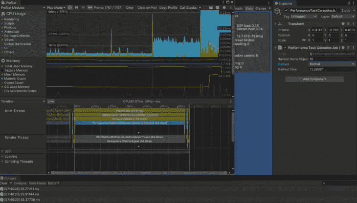

游戏以大约 200 帧/秒的速度运行，完成这项高强度的任务需要大约 4 毫秒。

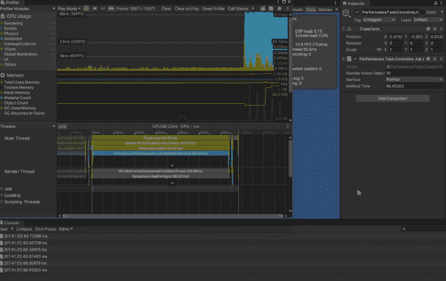

让我们用一千个敌人来试试这个:

```
using System.Collections.Generic;
using System.Threading.Tasks;
using Unity.Collections;
using Unity.Jobs;
using Unity.Mathematics;
using UnityEngine;
using Random = UnityEngine.Random;

public class PerformanceTaskJob : MonoBehaviour
{
   private enum MethodType
   {
       NormalMoveEnemy,
       TaskMoveEnemy
   }

   [SerializeField] private int numberEnemiesToCreate = 1000;
   [SerializeField] private Transform pfEnemy;

   [SerializeField] private MethodType method = MethodType.NormalMoveEnemy;
   [SerializeField] private float methodTime;

   private readonly List<Enemy> m_enemies = new List<Enemy>();

   private void Start()
   {
       for (int i = 0; i < numberEnemiesToCreate; i++)
       {
           Transform enemy = Instantiate(pfEnemy,
                                         new Vector3(Random.Range(-8f, 8f), Random.Range(-8f, 8f)),
                                         Quaternion.identity);
           m_enemies.Add(new Enemy { transform = enemy, moveY = Random.Range(1f, 2f) });
       }
   }

   private async void Update()
   {
       float startTime = Time.realtimeSinceStartup;

       switch (method)
       {
           case MethodType.NormalMoveEnemy:
               MoveEnemy();
               break;
           case MethodType.TaskMoveEnemy:
               Task<Task[]> moveEnemyTasks = MoveEnemyTask();
               await Task.WhenAll(moveEnemyTasks);
               break;
           default:
               MoveEnemy();
               break;
       }

       methodTime = (Time.realtimeSinceStartup - startTime) * 1000f;
       Debug.Log($"{methodTime} ms");
   }

   private void MoveEnemy()
   {
       foreach (Enemy enemy in m_enemies)
       {
           enemy.transform.position += new Vector3(0, enemy.moveY * Time.deltaTime);
           if (enemy.transform.position.y > 5f)
               enemy.moveY = -math.abs(enemy.moveY);
           if (enemy.transform.position.y < -5f)
               enemy.moveY = +math.abs(enemy.moveY);
           Performance.PerformanceIntensiveMethod(1000);
       }
   }

   private async Task<Task[]> MoveEnemyTask()
   {
       Task[] tasks = new Task[m_enemies.Count];
       for (int i = 0; i < m_enemies.Count; i++)
       {
           Enemy enemy = m_enemies[i];
           enemy.transform.position += new Vector3(0, enemy.moveY * Time.deltaTime);
           if (enemy.transform.position.y > 5f)
               enemy.moveY = -math.abs(enemy.moveY);
           if (enemy.transform.position.y < -5f)
               enemy.moveY = +math.abs(enemy.moveY);
           tasks[i] = Performance.PerformanceIntensiveTask(1000);
       }

       await Task.WhenAll(tasks);

       return tasks;
  }
```

用这种方法显示和移动一千个敌人需要大约 150 毫秒，帧速率大约为 7 FPS。


在一个任务中显示和移动一千个敌人大约需要 50 毫秒，帧速率大约为 30 帧/秒。

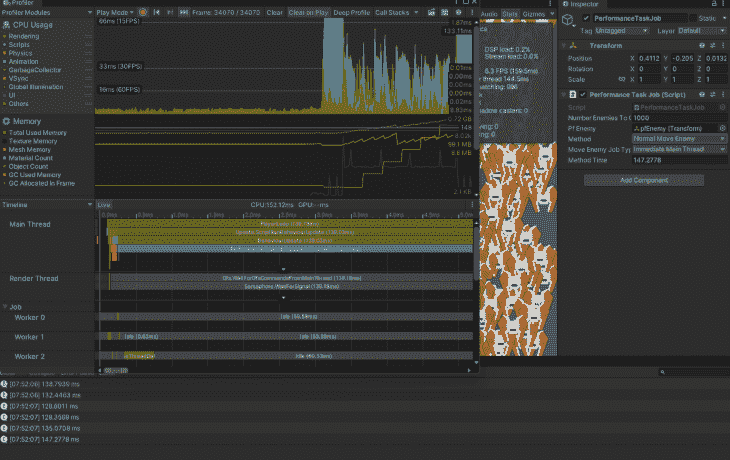

### 为什么不是`useTasks`？

任务非常高效，可以降低系统性能的压力。您甚至可以使用任务并行库(TPL)在多线程中使用它们。

然而，在 Unity 中使用它们也有一些缺点。在 Unity 中使用`Task`的主要缺点是它们都运行在`Main`线程上。是的，我们可以让它们在其他线程上运行，但 Unity 已经做了自己的线程和内存管理，你可以通过创建比 CPU 核心更多的线程来产生错误，这导致了资源的竞争。

任务也很难正确执行和调试。当编写原始代码时，我结束了所有运行的任务，但是没有一个敌人在屏幕上移动。结果是我需要返回我在`Task`中创建的`Task[]`。

* * *

### 更多来自 LogRocket 的精彩文章:

* * *

任务会产生大量影响性能的垃圾。它们也不会出现在分析器中，所以如果您有一个影响性能的问题，很难找到。此外，我注意到有时我的任务和更新功能继续从其他场景运行。

## 统一协程

根据 [Unity](https://docs.unity3d.com/ScriptReference/Coroutine.html) ，“协程是一个可以暂停执行(让步)直到给定的[让步指令](https://docs.unity3d.com/2021.3/Documentation/ScriptReference/YieldInstruction.html)完成的函数。”

这意味着我们可以运行代码，等待任务完成后再继续。这很像异步方法。它使用返回类型`IEnumerator`和 we `yield return`来代替`await`。

Unity 有几种不同类型的[产量指令](https://docs.unity3d.com/2021.3/Documentation/ScriptReference/30_search.html?q=yield+instructions)可供我们使用，即`WaitForSeconds`、`WaitForEndOfFrame`、`WaitUntil`或`WaitWhile`。

要启动协程，我们需要一个`MonoBehaviour`并使用`[MonoBehaviour.StartCoroutine](https://docs.unity3d.com/2021.3/Documentation/ScriptReference/MonoBehaviour.StartCoroutine.html)`。

为了在协程完成之前停止它，我们使用`[MonoBehaviour.StopCoroutine](https://docs.unity3d.com/2021.3/Documentation/ScriptReference/MonoBehaviour.StartCoroutine.html)`。当停止协程时，确保使用与启动时相同的方法。

Unity 中协同程序的常见用例是等待资产加载和创建冷却计时器。

### 示例:使用协程的场景加载器

```
using System.Collections;
using UnityEngine;
using UnityEngine.SceneManagement;

public class SceneLoader : MonoBehaviour
{
   public Coroutine loadSceneCoroutine;
   public void Update()
   {
       if (Input.GetKeyDown(KeyCode.Space) && loadSceneCoroutine == null)
       {
           loadSceneCoroutine = StartCoroutine(LoadSceneAsync());
       }

       if (Input.GetKeyDown(KeyCode.Escape) && loadSceneCoroutine != null)
       {
           StopCoroutine(loadSceneCoroutine);
           loadSceneCoroutine = null;
       }
   }

   private IEnumerator LoadSceneAsync()
   {
       AsyncOperation asyncLoad = SceneManager.LoadSceneAsync("Scene2");
       yield return new WaitWhile(() => !asyncLoad.isDone);
   }
}
```

### 检查协程对性能的影响

让我们看看使用协程如何影响我们项目的性能。我只打算用性能密集型的方法来做这件事。

我将`Coroutine`添加到`MethodType`枚举和变量中，以跟踪它的状态:

```
public class PerformanceTaskCoroutineJob : MonoBehaviour
{
   private enum MethodType
   {
       Normal,
       Task,
       Coroutine
   }

   ...

   private Coroutine m_performanceCoroutine;
```

我创造了协程。这类似于我们之前创建的性能密集型任务和方法，添加了代码来更新方法时间:

```
   private IEnumerator PerformanceCoroutine(int timesToRepeat, float startTime)
   {
       for (int count = 0; count < numberGameObjectsToImitate; count++)
       {
           // Represents a Performance Intensive Method like some pathfinding or really complex calculation.
           float value = 0f;
           for (int i = 0; i < timesToRepeat; i++)
           {
               value = math.exp10(math.sqrt(value));
           }
       }

       methodTime = (Time.realtimeSinceStartup - startTime) * 1000f;
       Debug.Log($"{methodTime} ms");
       m_performanceCoroutine = null;
       yield return null;
   }
```

在`Update`方法中，我添加了对协程的检查。我还修改了方法时间，更新了代码，并添加了代码来停止正在运行的协程，如果我们更改了方法类型:

```
   private async void Update()
   {
       float startTime = Time.realtimeSinceStartup;

       switch (method)
       {
           ...
           case MethodType.Coroutine:
               m_performanceCoroutine ??= StartCoroutine(PerformanceCoroutine(5000, startTime));
               break;
           default:
               Performance.PerformanceIntensiveMethod(50000);
               break;
       }

       if (method != MethodType.Coroutine)
       {
           methodTime = (Time.realtimeSinceStartup - startTime) * 1000f;
           Debug.Log($"{methodTime} ms");
       }

       if (method != MethodType.Coroutine || m_performanceCoroutine == null) return;
       StopCoroutine(m_performanceCoroutine);
       m_performanceCoroutine = null;
   }
```

密集的协程需要大约 6 毫秒来完成，游戏以大约 90 帧/秒的速度运行。

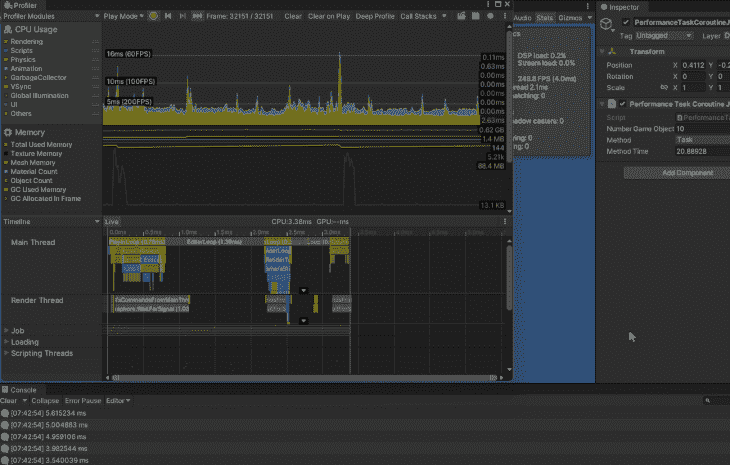

## C#作业系统和突发编译器

### 什么是 C#作业系统？

C#作业系统是 Unity 对任务的实现，这些任务易于编写，不会产生任务产生的垃圾，并且利用 Unity 已经创建的[工作线程](https://docs.microsoft.com/en-us/cpp/parallel/multithreading-creating-worker-threads)。这解决了任务的所有缺点。

Unity 将作业比作线程，但是他们确实说一个作业做一个特定的任务。作业也可以依赖其他作业在运行前完成；这解决了我的任务没有正确移动我的`Units`的问题，因为它依赖于另一个任务先完成。

Unity 会自动为我们处理作业依赖关系。作业系统还有一个内置的安全系统，主要是为了防止竞争条件。关于作业的一个警告是，它们只能包含属于[blittable type](https://en.wikipedia.org/wiki/Blittable_types)或 [NativeContainer](https://docs.unity3d.com/2021.3/Documentation/Manual/JobSystemNativeContainer.html) 类型的成员变量；这是安全系统的一个缺点。

要使用作业系统，您需要创建作业、安排作业、等待作业完成，然后使用作业返回的数据。为了使用 Unity 的面向数据的技术堆栈(DOTS ),需要作业系统。

有关作业系统的更多详细信息，请参见 [Unity 文档](https://docs.unity3d.com/2021.3/Documentation/Manual/JobSystemJobSystems.html)。

#### 创建工作

要创建一个作业，您需要创建一个`stuct`，它实现了一个`IJob`接口( [IJob](https://docs.unity3d.com/2021.3/Documentation/ScriptReference/Unity.Jobs.IJobFor.html) ， [IJobFor](https://docs.unity3d.com/2021.3/Documentation/ScriptReference/Unity.Jobs.IJobFor.html) ，[ijobparallelffor](https://docs.unity3d.com/2021.3/Documentation/ScriptReference/Unity.Jobs.IJobParallelFor.html)， [Unity)。engine . jobs . ijobparallelfortransform](https://docs.unity3d.com/2021.3/Documentation/ScriptReference/Jobs.IJobParallelForTransform.html))。`IJob`是一项基础工作。`IJobFor`和`IJobForParallel`用于对原生容器的每个元素执行相同的操作，或者进行多次迭代。它们之间的区别在于，IJobFor 运行在单线程上，而`IJobForParallel`将在多个线程之间分开。

我将使用`IJob`创建一个密集操作任务，`IJobFor`和`IJobForParallel`创建一个可以移动多个敌人的任务；这只是为了让我们可以看到对性能的不同影响。这些作业将与我们之前创建的任务和方法相同:

```
public struct PerformanceIntensiveJob : IJob { }
public struct MoveEnemyJob: IJobFor { }
public struct MoveEnemyParallelJob : IJobParallelFor { }
```

添加成员变量。在我的情况下，我的`IJob`不需要任何。由于作业没有帧的概念，`IJobFor`和`IJobParallelFor`需要当前增量时间的浮点数；他们在 Unity 的`MonoBehaviour`之外运作。他们还需要一个关于位置的`float3`数组和一个关于 y 轴上移动速度的数组:

```
public struct MoveEnemyJob : IJobFor
{
   public NativeArray<float3> positions;
   public NativeArray<float> moveYs;
   public float deltaTime; 
}
public struct MoveEnemyParallelJob : IJobParallelFor
{
   public NativeArray<float3> positions;
   public NativeArray<float> moveYs;
   public float deltaTime;
}
```

最后一步是实现所需的`Execute`方法。`IJobFor`和`IJobForParallel`都需要一个`int`作为作业正在执行的当前迭代的索引。

不同之处在于，我们没有访问敌人的`transform`并移动，而是使用工作中的阵列:

```
public struct PerformanceIntensiveJob : IJob
{
   #region Implementation of IJob

   /// <inheritdoc />
   public void Execute()
   {
       // Represents a Performance Intensive Method like some pathfinding or really complex calculation.
       float value = 0f;
       for (int i = 0; i < 50000; i++)
       {
           value = math.exp10(math.sqrt(value));
       }
   }

   #endregion
}

// MoveEnemyJob and MoveEnemyParallelJob have the same exact Execute Method. 

   /// <inheritdoc />
   public void Execute(int index)
   {
       positions[index] += new float3(0, moveYs[index] * deltaTime, 0);
       if (positions[index].y > 5f)
           moveYs[index] = -math.abs(moveYs[index]);
       if (positions[index].y < -5f)
           moveYs[index] = +math.abs(moveYs[index]);

       // Represents a Performance Intensive Method like some pathfinding or really complex calculation.
       float value = 0f;
       for (int i = 0; i < 1000; i++)
       {
           value = math.exp10(math.sqrt(value));
       }
   }
```

```
   private JobHandle PerformanceIntensiveMethodJob()
   {
       PerformanceIntensiveJob job = new PerformanceIntensiveJob();
       return job.Schedule();
   }
```

#### 计划作业

首先，我们需要设置作业并填充作业数据:

```
NativeArray<float> result = new NativeArray<float>(1, Allocator.TempJob);

MyJob jobData = new MyJob();
jobData.myFloat = result;
```

然后我们用`JobHandle jobHandle = jobData.Schedule();`来调度作业。`Schedule`方法返回一个可以在以后使用的`[JobHandle](https://docs.unity3d.com/2021.3/Documentation/ScriptReference/Unity.Jobs.JobHandle.html)`。

我们不能从作业中安排作业。但是，我们可以创建新的作业，并在作业中填充它们的数据。一旦安排了作业，就不能中断。

##### 性能密集型工作

我创建了一个创建新作业并对其进行调度的方法。它返回我可以在我的`update`方法中使用的作业句柄:

```
public class PerformanceTaskCoroutineJob : MonoBehaviour
{
   ....

   private JobHandle PerformanceIntensiveMethodJob()
   {
       PerformanceIntensiveJob job = new PerformanceIntensiveJob();
       return job.Schedule();
   }
}
```

我将该工作添加到我的枚举中。然后，在`Update`方法中，我将`case`添加到`switch`部分。我创建了一个`JobHandles`数组。然后，我遍历所有模拟的游戏对象，将每个对象的计划作业添加到数组中:

```
public class PerformanceTaskCoroutineJob : MonoBehaviour
{
   private enum MethodType
   {
       Normal,
       Task,
       Coroutine,
       Job
   }

   ...
   private async void Update()
   {
       float startTime = Time.realtimeSinceStartup;

       switch (method)
       {
           ...
           case MethodType.Job:
               NativeArray<JobHandle> jobHandles =
                   new NativeArray<JobHandle>(numberGameObjectsToImitate, Allocator.Temp);
               for (int i = 0; i < numberGameObjectsToImitate; i++)
                   jobHandles[i] = PerformanceIntensiveMethodJob();
               break;
           default:
               Performance.PerformanceIntensiveMethod(50000);
               break;
       }

       ...
   }
}
```

##### `MoveEnemy`和`MoveEnemyParallelJob`

接下来，我将作业添加到我的枚举中。然后在`Update`方法中，我调用一个新的`MoveEnemyJob`方法，传递 delta 时间。通常你会使用`JobFor`或者`JobParallelFor`:

```
public class PerformanceTaskJob : MonoBehaviour
{
   private enum MethodType
   {
       NormalMoveEnemy,
       TaskMoveEnemy,
       MoveEnemyJob,
       MoveEnemyParallelJob
   }

   ...

   private async void Update()
   {
       float startTime = Time.realtimeSinceStartup;

       switch (method)
       {
           ...
           case MethodType.MoveEnemyJob:
           case MethodType.MoveEnemyParallelJob:
               MoveEnemyJob(Time.deltaTime);
               break;
           default:
               MoveEnemy();
               break;
       }

       ...
   }

   ...
```

我做的第一件事是为位置设置一个数组，为我将传递给作业的`moveY`设置一个数组。然后我用敌人的数据填充这些数组。接下来，我创建作业，并根据我想要使用的作业设置作业的数据。之后，我根据我要使用的作业和我要执行的调度类型来调度作业:

```
private void MoveEnemyJob(float deltaTime)
   {
       NativeArray<float3> positions = new NativeArray<float3>(m_enemies.Count, Allocator.TempJob);
       NativeArray<float> moveYs = new NativeArray<float>(m_enemies.Count, Allocator.TempJob);

       for (int i = 0; i < m_enemies.Count; i++)
       {
           positions[i] = m_enemies[i].transform.position;
           moveYs[i] = m_enemies[i].moveY;
       }

       // Use one or the other
       if (method == MethodType.MoveEnemyJob)
       {
           MoveEnemyJob job = new MoveEnemyJob
           {
               deltaTime = deltaTime,
               positions = positions,
               moveYs = moveYs
           };

           // typically we would use one of these methods
           switch (moveEnemyJobType)
           {
               case MoveEnemyJobType.ImmediateMainThread:
                   // Schedule job to run immediately on main thread.
                   // typically would not use.
                   job.Run(m_enemies.Count);
                   break;
               case MoveEnemyJobType.ScheduleSingleWorkerThread:
               case MoveEnemyJobType.ScheduleParallelWorkerThreads:
               {
                   // Schedule job to run at a later point on a single worker thread.
                   // First parameter is how many for-each iterations to perform.
                   // The second parameter is a JobHandle to use for this job's dependencies.
                   //   Dependencies are used to ensure that a job executes on worker threads after the dependency has completed execution.
                   //   In this case we don't need our job to depend on anything so we can use a default one.
                   JobHandle scheduleJobDependency = new JobHandle();
                   JobHandle scheduleJobHandle = job.Schedule(m_enemies.Count, scheduleJobDependency);

                   switch (moveEnemyJobType)
                   {
                       case MoveEnemyJobType.ScheduleSingleWorkerThread:
                           break;
                       case MoveEnemyJobType.ScheduleParallelWorkerThreads:
                       {
                           // Schedule job to run on parallel worker threads.
                           // First parameter is how many for-each iterations to perform.
                           // The second parameter is the batch size,
                           //   essentially the no-overhead inner-loop that just invokes Execute(i) in a loop.
                           //   When there is a lot of work in each iteration then a value of 1 can be sensible.
                           //   When there is very little work values of 32 or 64 can make sense.
                           // The third parameter is a JobHandle to use for this job's dependencies.
                           //   Dependencies are used to ensure that a job executes on worker threads after the dependency has completed execution.
                           JobHandle scheduleParallelJobHandle =
                               job.ScheduleParallel(m_enemies.Count, m_enemies.Count / 10, scheduleJobHandle);

                           break;
                       }
                   }

                   break;
               }
           }
       }
       else if (method == MethodType.MoveEnemyParallelJob)
       {
           MoveEnemyParallelJob job = new MoveEnemyParallelJob
           {
               deltaTime = deltaTime,
               positions = positions,
               moveYs = moveYs
           };

           // Schedule a parallel-for job. First parameter is how many for-each iterations to perform.
           // The second parameter is the batch size,
           // essentially the no-overhead inner-loop that just invokes Execute(i) in a loop.
           // When there is a lot of work in each iteration then a value of 1 can be sensible.
           // When there is very little work values of 32 or 64 can make sense.
           JobHandle jobHandle = job.Schedule(m_enemies.Count, m_enemies.Count / 10);

           }
   }
```

#### 从作业中获取数据

我们必须等待这项工作完成。我们可以从我们调度任务来完成它时使用的`JobHandle`中获得状态。这将等待作业完成后再继续执行:> `handle.Complete();`或`JobHandle.CompleteAll(jobHandles)`。一旦作业完成，我们用来设置作业的`[NativeContainer](https://docs.unity3d.com/2021.3/Documentation/Manual/JobSystemNativeContainer.html)`将拥有我们需要使用的所有数据。一旦我们从它们那里获取了数据，我们就必须正确地处理它们。

##### 性能密集型工作

这非常简单，因为我没有向作业中读取或写入任何数据。我等待所有计划完成的作业，然后释放`Native`数组:

```
public class PerformanceTaskCoroutineJob : MonoBehaviour
{
   ...

   private async void Update()
   {
       float startTime = Time.realtimeSinceStartup;

       switch (method)
       {
           ...
           case MethodType.Job:
               ....
               JobHandle.CompleteAll(jobHandles);
               jobHandles.Dispose();
               break;
           default:
               Performance.PerformanceIntensiveMethod(50000);
               break;
       }

       ...
   }
}
```

游戏以大约 90 帧/秒的速度运行，完成这项高强度的工作需要大约 6 毫秒。


##### `MoveEnemy`工作

我添加适当的完整检查:

```
   private void MoveEnemyJob(float deltaTime)
   {
      ....

       if (method == MethodType.MoveEnemyJob)
       {
          ....

           switch (moveEnemyJobType)
           {
               case MoveEnemyJobType.ScheduleSingleWorkerThread:
               case MoveEnemyJobType.ScheduleParallelWorkerThreads:
               {
                   ....

                   // typically one or the other
                   switch (moveEnemyJobType)
                   {
                       case MoveEnemyJobType.ScheduleSingleWorkerThread:
                           scheduleJobHandle.Complete();
                           break;
                       case MoveEnemyJobType.ScheduleParallelWorkerThreads:
                       {
                           scheduleParallelJobHandle.Complete();
                           break;
                       }
                   }

                   break;
               }
           }
       }
       else if (method == MethodType.MoveEnemyParallelJob)
       {
           ....

          jobHandle.Complete();
       }
   }
```

在方法类型检查之后，我遍历所有的敌人，将他们的`transform`位置和`moveY`设置为作业中设置的数据。接下来，我正确地处理了原生数组:

```
private void MoveEnemyJob(float deltaTime)
   {
      ....

       if (method == MethodType.MoveEnemyJob)
       {
          ....
       }
       else if (method == MethodType.MoveEnemyParallelJob)
       {
           ....
       }

       for (int i = 0; i < m_enemies.Count; i++)
       {
           m_enemies[i].transform.position = positions[i];
           m_enemies[i].moveY = moveYs[i];
       }

       // Native arrays must be disposed manually.
       positions.Dispose();
       moveYs.Dispose();
   }
```

用 job 显示和移动一千个敌人需要大约 160 毫秒，帧速率大约为 7 FPS，性能没有任何提高。

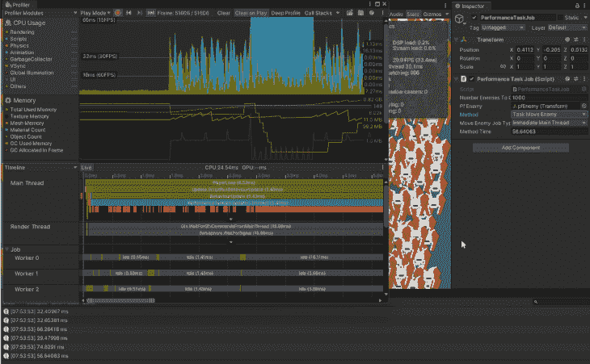

用 job parallel 显示和移动一千个敌人需要大约 30 毫秒，帧速率大约为 30 FPS。

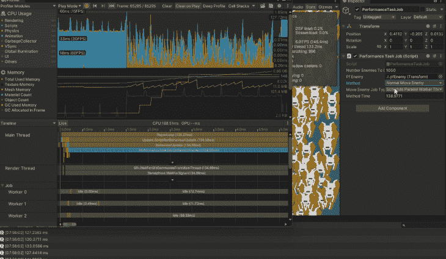

### Unity 中的 burst 编译器是什么？

突发编译器是一个从字节码翻译成本机代码的编译器。在 C# Job 系统中使用它可以提高生成代码的质量，显著提升性能，并减少移动设备的电池消耗。

要使用它，您只需告诉 Unity 您想在带有`[BurstCompile]`属性的作业上使用突发编译:

```
using Unity.Burst;
using Unity.Jobs;
using Unity.Mathematics;

[BurstCompile]
public struct PerformanceIntensiveJob : IJob
{
   ...
}

using Unity.Burst;
using Unity.Collections;
using Unity.Jobs;
using Unity.Mathematics;

[BurstCompile]
public struct MoveEnemyJob : IJobFor
{
   ...
}
[BurstCompile]
public struct MoveEnemyParallelJob : IJobParallelFor
{
   ...
}
```

然后在 Unity 中选择**作业** > **突发> **启用完成****

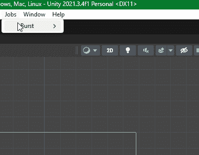

**Burst** 在编辑器中是实时的(JIT ),这意味着在播放模式下可以关闭。当您构建项目时，它是超前的(AOT)，这意味着需要在构建项目之前启用它。你可以通过编辑**项目设置窗口**中的**连拍 AOT 设置**部分来实现。

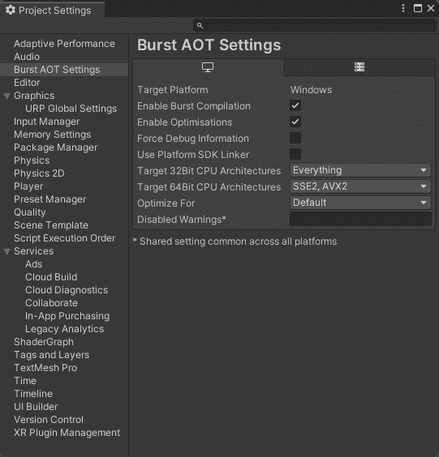

关于突发编译器的更多细节，参见 [Unity 文档](https://docs.unity3d.com/Packages/com.unity.burst@1.7/manual/docs/StandalonePlayerSupport.html#burst-aot-requirements)。

#### 使用拆分编译器的性能密集型工作

在游戏以大约 150 FPS 的速度运行的情况下，使用 burst 的密集工作需要大约 3 毫秒来完成。

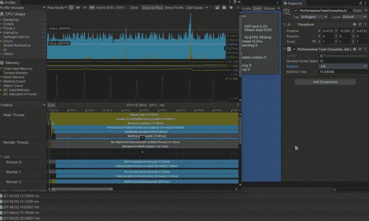

显示和移动一千个敌人，使用 burst 的工作需要大约 30 毫秒，帧速率大约为 30 FPS。

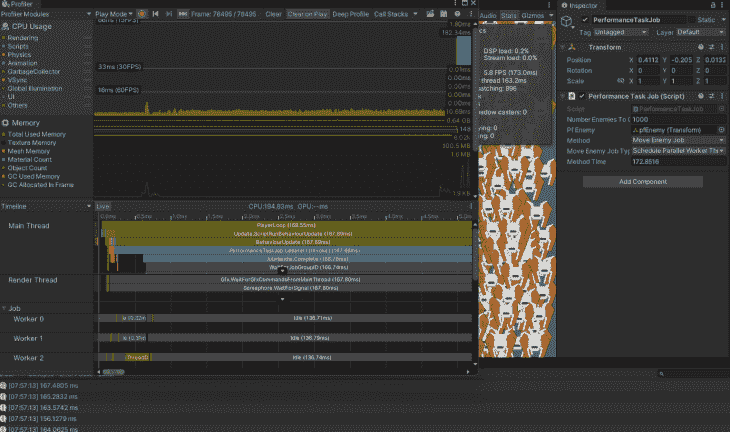

显示和移动一千个敌人，与突发并行的工作需要大约 6 毫秒，帧速率大约为 80 到 90 FPS。

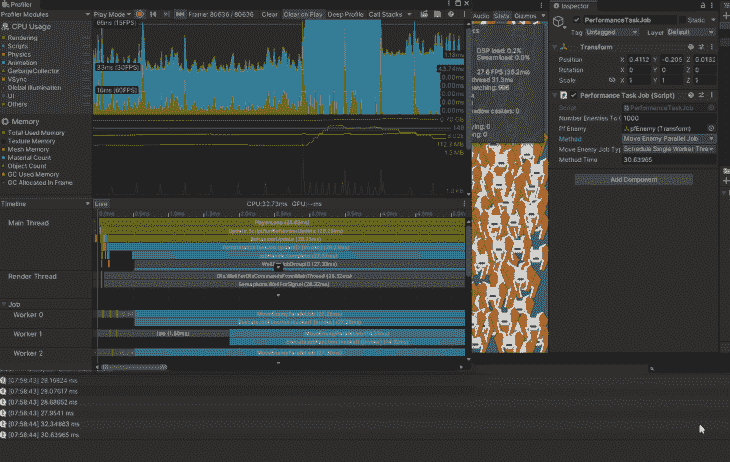

## 结论

我们可以使用`Task`来提高我们的 Unity 应用程序的性能，但是使用它们有几个缺点。根据我们想要做的事情，最好使用 Unity 中打包的东西。如果我们想等待一些东西异步加载完成，就使用协程；我们可以启动协程，而不停止程序的运行。

我们可以使用带有突发编译器的 C#作业系统来获得巨大的性能提升，同时在执行进程密集型任务时不必担心所有的线程管理问题。使用内置的系统，我们确信它是以安全的方式完成的，不会导致任何不必要的错误或缺陷。

任务确实比不使用突发编译器的作业运行得好一点，但这是因为在后台为我们安全地设置一切有一点额外的开销。当使用突发编译器时，我们的作业执行我们的任务。当你需要所有你能得到的额外性能时，使用 C#作业系统和 burst。

这个项目的文件可以在 [my GitHub](https://github.com/JamesLaFritz/TaskVSJobSystem) 上找到。

## 使用 [LogRocket](https://lp.logrocket.com/blg/signup) 消除传统错误报告的干扰

[](https://lp.logrocket.com/blg/signup)

[LogRocket](https://lp.logrocket.com/blg/signup) 是一个数字体验分析解决方案，它可以保护您免受数百个假阳性错误警报的影响，只针对几个真正重要的项目。LogRocket 会告诉您应用程序中实际影响用户的最具影响力的 bug 和 UX 问题。

然后，使用具有深层技术遥测的会话重放来确切地查看用户看到了什么以及是什么导致了问题，就像你在他们身后看一样。

LogRocket 自动聚合客户端错误、JS 异常、前端性能指标和用户交互。然后 LogRocket 使用机器学习来告诉你哪些问题正在影响大多数用户，并提供你需要修复它的上下文。

关注重要的 bug—[今天就试试 LogRocket】。](https://lp.logrocket.com/blg/signup-issue-free)