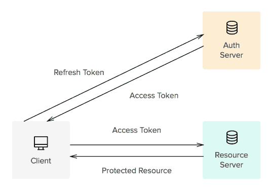
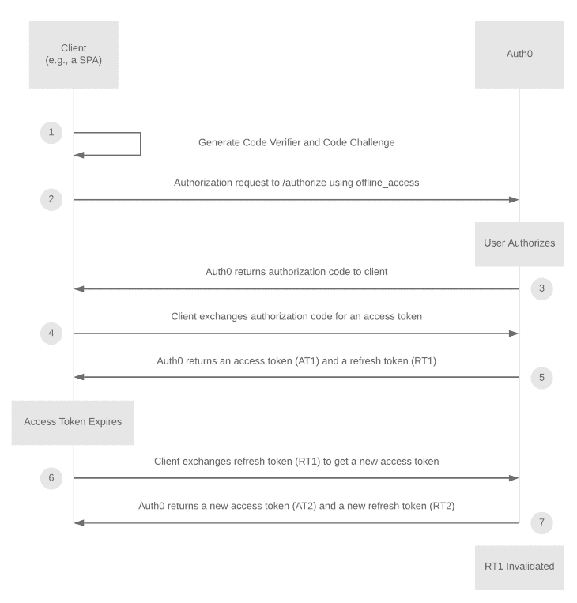
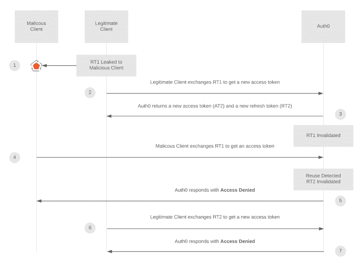
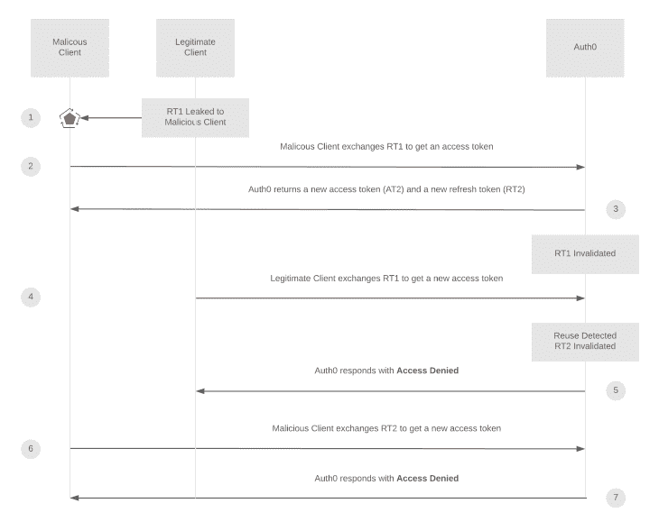
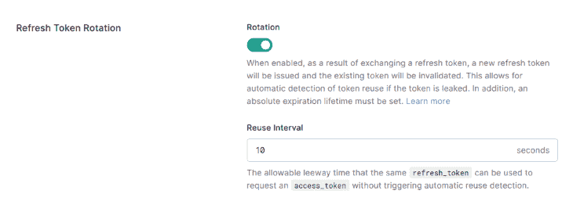

# React 中的持久登录使用刷新令牌循环

> 原文：<https://blog.logrocket.com/persistent-login-in-react-using-refresh-token-rotation/>

前端开发人员主要关心的是建立一个安全快速的授权和认证结构。此外，最重要的是用户体验，这在很大程度上受到身份认证过程的影响。

你还记得你最后一次输入登录谷歌、脸书、LinkedIn 或其他应用程序或网站的凭据是什么时候吗？大概不会。这是因为现在许多应用和网络服务使用持久登录来提供流畅的用户体验。

在本教程中，我们将向您展示如何在 React 中使用刷新令牌来促进无限长的登录会话。我们将讨论以下内容:

## 什么是刷新令牌？

简单来说，访问令牌使用户能够从您的应用程序获取资源。

出于安全原因，访问令牌的生存期通常很短。当访问令牌过期时，刷新令牌可用于获取新的访问令牌，而无需再次输入登录凭据。



刷新令牌具有很长的生存期。如果它们有效且未过期，客户端可以获得新的访问令牌。这种长寿命可能导致受保护资源的脆弱性。

## 什么是刷新令牌循环？

刷新令牌轮换是一种保护刷新令牌的技术。当用刷新令牌请求新的访问令牌时，新的刷新令牌也被返回，旧的令牌被无效。[刷新令牌轮换](https://auth0.com/docs/security/tokens/refresh-tokens/refresh-token-rotation)的目的是消除持久刷新令牌带来的漏洞风险。

直到最近，在单页面 web 应用程序中还不推荐使用刷新令牌(不像移动应用程序)，因为 spa 没有存储令牌的安全机制。刷新令牌轮换和刷新令牌重用检测(我们将在后面介绍)提高了这种高价值信息的安全性。

下图解释了刷新令牌循环机制的工作原理。您可以接受 Auth0 作为身份提供者:



Refresh Token Rotation Mechanism (Source: [https://auth0.com/docs/tokens/refresh-tokens/refresh-token-rotation](https://auth0.com/docs/tokens/refresh-tokens/refresh-token-rotation))

## 什么是刷新令牌重用检测？

刷新令牌重用检测是一种支持刷新令牌轮换的机制。当访问令牌过期时，客户端使用刷新令牌获得一组新的令牌(访问和刷新令牌)。然后，身份提供者会立即使之前的刷新令牌失效。

如果身份提供者检测到该无效刷新令牌的使用，它会立即使所有刷新和访问令牌无效，使客户端再次使用登录凭据进行身份验证。当令牌泄漏时，这种机制可以防止您的应用程序受到恶意攻击。

Auth0 文档中的以下两个案例很好地说明了这些攻击的可能情况以及刷新令牌重用检测的工作原理:



Refresh token reuse detection mechanism scenario 1



Refresh token reuse detection mechanism scenario 2

## 存储刷新令牌的位置

有几种方法可以在客户端会话中存储令牌:通过静默身份验证存储在内存中，以及存储在浏览器的本地存储中。

### 在内存中存储令牌

您可以在内存中存储刷新令牌。但是，这种存储不会在页面刷新或新选项卡之间持续存在。因此，用户应该在每次页面刷新或在新选项卡上输入登录凭据，这会对用户体验产生负面影响。

### 静默认证

通过静默身份验证存储刷新令牌包括每当有 API 请求时或在页面刷新期间向身份服务器发送请求以获取访问令牌。如果您的会话仍然存在，身份提供者将返回有效令牌。否则，它会将您重定向到登录页面。

然而，这是一种安全得多的结构:每当客户端发送一个静默身份验证请求时，它都会阻止应用程序。这可能是在页面呈现时或者在 API 调用期间。

此外，我还在匿名模式下经历过不想要的行为，比如登录循环。

### 本地存储令牌

持久登录的建议做法是将令牌存储在浏览器的本地存储中。本地存储在页面刷新和各种选项卡之间提供持久数据。

虽然在本地存储刷新令牌并不能完全消除跨站点脚本(XSS)攻击的威胁，但它确实可以将这种漏洞显著降低到可接受的水平。它还通过使应用程序运行更流畅来改善用户体验。

## 使用刷新令牌循环配置具有持久登录的 React 应用程序

为了演示刷新令牌和刷新令牌轮换的工作原理，我们将使用刷新令牌配置 react 应用程序身份验证机制。我们将使用 [Auth0](https://auth0.com) 进行刷新令牌轮换和刷新令牌重用检测。Auth0 是最流行的认证和授权平台之一。

为了将 Auth0 集成到我们的 React 应用程序中，我们将使用 [auth0-react](https://github.com/auth0/auth0-react) 将应用程序与 auth0 和一个名为`useAuth0`的钩子连接起来，以获取身份验证状态和方法。然而，在组件之外实现身份验证状态和方法是一个挑战。

因此，我转换了库`[@auth0/auth0-spa-js](https://github.com/auth0/auth0-spa-js)`，它是另一个官方的 Auth0 客户端库，具有一个身份验证挂钩和可以在组件外部访问的方法。

我创建了一个`auth0.tsx`文件(你当然可以和 JSX 一起去),如下所示:

```
import React, { useState, useEffect, useContext, createContext } from 'react';
import createAuth0Client, {
  getIdTokenClaimsOptions,
  GetTokenSilentlyOptions,
  GetTokenWithPopupOptions,
  IdToken,
  LogoutOptions,
  PopupLoginOptions,
  RedirectLoginOptions,
} from '@auth0/auth0-spa-js';
import Auth0Client from '@auth0/auth0-spa-js/dist/typings/Auth0Client';
import { config } from '../config';
import history from '../history';
import { urls } from '../routers/urls';

interface Auth0Context {
  isAuthenticated: boolean;
  user: any;
  loading: boolean;
  popupOpen: boolean;
  loginWithPopup(options: PopupLoginOptions): Promise<void>;
  handleRedirectCallback(): Promise<any>;
  getIdTokenClaims(o?: getIdTokenClaimsOptions): Promise<IdToken>;
  loginWithRedirect(o: RedirectLoginOptions): Promise<void>;
  getAccessTokenSilently(o?: GetTokenSilentlyOptions): Promise<string | undefined>;
  getTokenWithPopup(o?: GetTokenWithPopupOptions): Promise<string | undefined>;
  logout(o?: LogoutOptions): void;
}

export const Auth0Context = createContext<Auth0Context | null>(null);
export const useAuth0 = () => useContext(Auth0Context)!;

const onRedirectCallback = appState => {
  history.replace(appState && appState.returnTo ? appState.returnTo : urls.orderManagement);
};

let initOptions = config.auth; // Auth0 client credentials

const getAuth0Client: any = () => {
  return new Promise(async (resolve, reject) => {
    let client;
    if (!client) {
      try {
        client = await createAuth0Client({ ...initOptions, scope: 'openid email profile offline_access', cacheLocation: 'localstorage', useRefreshTokens: true });
        resolve(client);
      } catch (e) {
        reject(new Error(`getAuth0Client Error: ${e}`));
      }
    }
  });
};

export const getTokenSilently = async (...p) => {
  const client = await getAuth0Client();
  return await client.getTokenSilently(...p);
};

export const Auth0Provider = ({ children }): any => {
  const [isAuthenticated, setIsAuthenticated] = useState(false);
  const [user, setUser] = useState<any>();
  const [auth0Client, setAuth0] = useState<Auth0Client>();
  const [loading, setLoading] = useState(true);
  const [popupOpen, setPopupOpen] = useState(false);

  useEffect(() => {
    const initAuth0 = async () => {
      const client = await getAuth0Client();
      setAuth0(client);
      if (window.location.search.includes('code=')) {
        const { appState } = await client.handleRedirectCallback();
        onRedirectCallback(appState);
      }
      const isAuthenticated = await client.isAuthenticated();
      setIsAuthenticated(isAuthenticated);

      if (isAuthenticated) {
        const user = await client.getUser();
        setUser(user);
      }

      setLoading(false);
    };
    initAuth0();
    // eslint-disable-next-line
  }, []);

  const loginWithPopup = async (params = {}) => {
    setPopupOpen(true);
    try {
      await auth0Client!.loginWithPopup(params);
    } catch (error) {
      console.error(error);
    } finally {
      setPopupOpen(false);
    }
    const user = await auth0Client!.getUser();
    setUser(user);
    setIsAuthenticated(true);
  };

  const handleRedirectCallback = async () => {
    setLoading(true);
    await auth0Client!.handleRedirectCallback();
    const user = await auth0Client!.getUser();
    setLoading(false);
    setIsAuthenticated(true);
    setUser(user);
  };

  return (
    <Auth0Context.Provider
      value={{
        isAuthenticated,
        user,
        loading,
        popupOpen,
        loginWithPopup,
        handleRedirectCallback,
        getIdTokenClaims: (o: getIdTokenClaimsOptions | undefined) => auth0Client!.getIdTokenClaims(o),
        loginWithRedirect: (o: RedirectLoginOptions) => auth0Client!.loginWithRedirect(o),
        getAccessTokenSilently: (o: GetTokenSilentlyOptions | undefined) => auth0Client!.getTokenSilently(o),
        getTokenWithPopup: (o: GetTokenWithPopupOptions | undefined) => auth0Client!.getTokenWithPopup(o),
        logout: (o: LogoutOptions | undefined) => auth0Client!.logout(o),
      }}
    >
      {children}
    </Auth0Context.Provider>
  );
};

```

在第 44 行可以看到，`cacheLocation`被设置为`localStorage` , `useRefreshToken`被设置为`true`,`offline_access`被添加到范围中。

在主`App.tsx`文件中，您应该导入`Auth0Provider` HOC 来包装所有路由。

我还想确保每个 API 请求都用有效的令牌发送。即使 API 响应说未经授权，它也会将客户端重定向到身份验证页面。

我使用了 Axios 的拦截器，它使您能够在发送请求或获得响应之前插入逻辑。

```
// Request interceptor for API calls
axios.interceptors.request.use(
  async config => {
    const token = await getTokenSilently();
    config.headers.authorization = `Bearer ${token}`;
    return config;
  },
  error => {
    Promise.reject(error);
  }
);

// Response interceptor for API calls
axios.interceptors.response.use(
  response => {
    return response.data;
  },
  async function(error) {
    if (error.response?.status === 401 || error?.error === 'login_required') {
      history.push(urls.authentication);
    }
    return Promise.reject(error);
  }
);

```

身份验证页面组件仅包括 loginWithRedirect 方法，该方法将客户端重定向到 Auth0 登录页面，然后重定向到所需的页面。

```
import React, { useEffect } from 'react';
import { useAuth0 } from '../../../auth/auth0';
import { urls } from '../../../routers/urls';

const Login: React.FC = () => {
  const { loginWithRedirect, loading } = useAuth0();

  useEffect(() => {
    if (!loading) {
      loginWithRedirect({ appState: urls.orderManagement });
    }
  }, [loading]);
  return null;
};
export default Login; 

```

在 Auth0 仪表板中转到您的应用程序。在设置中，您会看到**刷新令牌旋转**设置。打开循环并设置重用间隔，在此间隔内刷新令牌重用检测算法将不起作用。



就是这样！现在，我们的应用程序有一个持久和安全的认证系统。这将使您的应用程序更加安全，并改善用户的启动体验。

特别感谢我的同事 [Turhan Gür](https://www.linkedin.com/in/turhan-ali-g%C3%BCr/) ,他在我的旅程中提供了至关重要的反馈。

## 使用 LogRocket 消除传统反应错误报告的噪音

[LogRocket](https://lp.logrocket.com/blg/react-signup-issue-free)

是一款 React analytics 解决方案，可保护您免受数百个误报错误警报的影响，只针对少数真正重要的项目。LogRocket 告诉您 React 应用程序中实际影响用户的最具影响力的 bug 和 UX 问题。

[ ](https://lp.logrocket.com/blg/react-signup-general) [  ](https://lp.logrocket.com/blg/react-signup-general) [LogRocket](https://lp.logrocket.com/blg/react-signup-issue-free)

自动聚合客户端错误、反应错误边界、还原状态、缓慢的组件加载时间、JS 异常、前端性能指标和用户交互。然后，LogRocket 使用机器学习来通知您影响大多数用户的最具影响力的问题，并提供您修复它所需的上下文。

关注重要的 React bug—[今天就试试 LogRocket】。](https://lp.logrocket.com/blg/react-signup-issue-free)