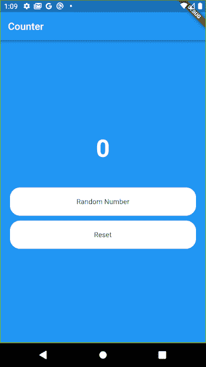

# 在 Flutter 中使用水合 BLoC 保持应用状态

> 原文：<https://blog.logrocket.com/persisting-application-state-hydrated-bloc-flutter/>

## 还记得 BLoC 吗？

在[动荡](https://flutter.dev/)的生态系统中，BLoC 是一个极其强大的状态管理解决方案。首字母缩写词 BloC 仅仅意味着一个业务逻辑组件。在计算机科学中，这被称为程序的逻辑层或业务逻辑部分，它封装了规定如何创建、存储或修改数据的规则。

创建 [BLoC 库](https://bloclibrary.dev/#/)是为了迎合状态管理，使其简单、功能强大(即使是大规模业务逻辑)，同时也是可测试的。

BLoC 由事件和状态组成。它接收事件，并基于预定义的规则，在数据经过处理以满足特定标准后产生不同的状态。

## 什么是水合集团？

[另一方面，Hydrated bloc](https://pub.dev/packages/hydrated_bloc) 是 BLoC 包的扩展，为我们的 BLoC 或 cubits 提供开箱即用的持久性。

正确地保持应用程序的状态有很多好处。这使得用户更容易使用我们的应用程序，特别是当他们不必在每次启动我们的应用程序时重新输入某些数据。

出现这种情况主要是因为每当我们关闭应用程序时，我们的操作系统往往会清除或破坏其中包含的活动和状态。

例如，大多数用户更喜欢使用天气应用程序，默认情况下，它会显示您最近位置或您上次查看的位置的天气情况，而不是在他们打开它时手动搜索您的位置。

使用浏览器应用程序时，可以体验到状态持久性至关重要的另一个好例子。大多数人喜欢从他们使用浏览器应用程序的最后一页继续浏览，而不是总是不得不重新浏览互联网，这就是保存应用程序的状态应该是你要考虑的一个大问题。

## 为什么使用水合块？

如果您在 Flutter 中使用 BLoC 库进行状态管理，那么您不需要编写大量代码来保存和恢复您的状态。你可以简单地使用 BLoC 库中的 hydrated BLoC，这与那些来自原生 Android 开发背景的人的`[onSaveInstanceState()](https://developer.android.com/reference/android/app/Activity#onSaveInstanceState(android.os.Bundle))`类似。

在本教程中，我们将建立一个简单的随机数生成器。为了演示如何保持应用程序的状态，我们将利用我们的 Hydrated BLoC 来确保每当应用程序重新启动时，它都会显示最后生成的随机数。

## 入门指南

为了使用 Hydrated BLoC 进行状态持久化，本文假设您已经对使用 [BLoC 库进行状态管理](https://blog.logrocket.com/state-management-flutter-bloc-pattern/)有了基本的了解。

在这个项目的过程中，我们将需要持久化我们的 blocs，我们将通过添加必要的依赖项来帮助我们做到这一点。

其中之一是最新版本的`hydrated bloc`库，我们添加了其他依赖项，如下面的`pubspec.yaml`文件所示:

```
dependencies:
 hydrated_bloc: ^8.1.0
 flutter_bloc: ^8.0.0
 equatable: ^0.5.1
 json_annotation: ^3.0.0
 path: ^1.8.0
 path_provider: ^2.0.9

```

下一步您需要做的是将 Hydrated BLoC 库指向一个路径，它应该将数据保存在我们的本地存储中

下面的 main 方法中的代码片段有助于我们完成这项任务:

```
Future<void> main() async {
  WidgetsFlutterBinding.ensureInitialized();
 final storage = await HydratedStorage.build(
  storageDirectory: kIsWeb
      ? HydratedStorage.webStorageDirectory
      : await getTemporaryDirectory(),
);

HydratedBlocOverrides.runZoned(
  () => runApp(AppView()),
  storage: storage,
);
}

```

我们在`runApp`之前调用`WidgetsFlutterBinding.ensureInitialized()`的原因是 Hydrated BLoC 必须与本机代码进行通信，为了确保我们无缝地做到这一点，我们检查所有东西都是本机初始化的。

*   然后使用`HydratedStorage.build()`函数为我们的应用程序创建一个存储。根据平台的不同，`storageDirectory`参数被设置为`webStorageDirectory`的参数，否则它将被默认设置为设备的临时存储
*   `HydratedStorage.build()`还检查是否存在任何以前保存的数据，并尝试通过反序列化它和发出最后保存在我们的应用程序上的状态来恢复该数据。这是可能的，因为 Hydrated BLoC 在引擎盖下使用了[蜂巢](https://pub.dev/packages/hive)来存储数据
*   为了确保我们的应用程序在我们声明的所有过程之后安全运行，我们需要用`HydratedBlocOverrides.runZoned()`包装对`runApp`的调用

## 形成水合块

对于我们的视图，我们有一个简单的 UI，由一个文本视图和两个按钮组成。我们的一个按钮用于生成随机数，另一个按钮用于将生成的随机数重置为零:

```
class RandomNumberView extends StatelessWidget {
  @override
  Widget build(BuildContext context) {
    final textTheme = Theme.of(context).textTheme;
    return Scaffold(
      appBar: AppBar(title: const Text('Counter')),
      body: Container(
        decoration: BoxDecoration(color: ThemeData().primaryColor),
        child: Center(
          child: BlocBuilder<RandomNumberBloc, int>(
            builder: (context, state) {
              return Column(
                mainAxisAlignment: MainAxisAlignment.center,
                children: [
                  Text('$state',
                      style: textTheme.headline2?.copyWith(
                          fontSize: 48,
                          fontWeight: FontWeight.bold,
                          color: Colors.white)),
                  const SizedBox(
                    height: 50,
                  ),
                  Button(
                    title: "Random Number",
                    action: () {
                      context
                          .read<RandomNumberBloc>()
                          .add(GenerateRandomNumber(max: 20, min: 1));
                    },
                  ),
                  const SizedBox(
                    height: 10,
                  ),
                  Button(
                    title: "Reset",
                    action: () {
                      context.read<RandomNumberBloc>().add(ResetRandomNumber());
                      HydratedBlocOverrides.current?.storage.clear();
                    },
                  )
                ],
              );
            },
          ),
        ),
      ),
    );
  }
}

```

为了使我们的块对我们的小部件树的其余部分可用，我们将使用`BlocProvider`把它传递给小部件树。

`BlocProvider`用于向微件提供对块的访问，它使用依赖注入(DI)来确保块的单个实例可用于微件树中的多个微件:

```
class RandomNumberGeneratorPage extends StatelessWidget {
  @override
  Widget build(BuildContext context) {
    return BlocProvider<RandomNumberBloc>(
      create: (_) => RandomNumberBloc(),
      child: RandomNumberView(),
    );
  }
}

```

为了使用水合块，我们必须用`HydratedBloc`替换常规的`Bloc`或者使用混合`HydratedMixin`，这就是我们的`RandomNumberBloc`的样子:

```
class RandomNumberBloc extends HydratedBloc<RandomNumberEvent, int> {
  RandomNumberBloc() : super(0) {
  on<GenerateRandomNumber>((event, emit) =>
        emit(_fetchRandomNumber(maxNumber: event.max, minNumber: event.min)));
    on<ResetRandomNumber>((event, emit) => emit(0));
  }

  @override
  int fromJson(Map<String, dynamic> json) => json['value'] as int;

  @override
  Map<String, int> toJson(int state) => {'value': state};

  int _fetchRandomNumber({required int maxNumber, required int minNumber}) {
    return minNumber + Random().nextInt(maxNumber - minNumber + 1);
  }
}

```

对于我们的事件类，我们只有两个事件。一个用于生成随机数，另一个用于重置所生成的随机数:

```
abstract class RandomNumberEvent {}

class GenerateRandomNumber extends RandomNumberEvent {
  final int max;
  final int min;

  GenerateRandomNumber({required this.max, required this.min});
}

class ResetRandomNumber extends RandomNumberEvent {}

```

这里我们没有 state 类，这是因为我们的 state 只是一个整数。因此，这不太复杂，不需要为它写一个完整的类。

## 存储和检索状态

为了存储我们的数据，我们需要为更复杂的模型序列化它。我的意思是我们必须把它转换成 JSON 格式。为了实现这一点，我们必须覆盖我们的`bloc`类中的`fromJson`和`toJson`方法，该类扩展了`HydratedBloc`或使用了`HydratedMixin`。

当我们的状态通过我们的`bloc`类时，它被默认保存，因为 Hydrated BLoC 使用 [Hive](https://blog.logrocket.com/handling-local-data-persistence-flutter-hive/) 来保存数据。每当我们的应用程序重新启动时，它都会监听我们的状态和数据，这些数据已经保存到我们以前的状态，因此不会丢失。



## 最后的想法

状态持久化可能是必要的，并且为我们的应用程序的用户提供无缝的和用户友好的体验。

使用上面演示的`hydratedBloc`模式，可以尽可能有序、简单地实现这一点。

你可以[在这里](https://github.com/Ekeminie/random_number_generator)找到这个应用的代码库。

## 使用 [LogRocket](https://lp.logrocket.com/blg/signup) 消除传统错误报告的干扰

[](https://lp.logrocket.com/blg/signup)

[LogRocket](https://lp.logrocket.com/blg/signup) 是一个数字体验分析解决方案，它可以保护您免受数百个假阳性错误警报的影响，只针对几个真正重要的项目。LogRocket 会告诉您应用程序中实际影响用户的最具影响力的 bug 和 UX 问题。

然后，使用具有深层技术遥测的会话重放来确切地查看用户看到了什么以及是什么导致了问题，就像你在他们身后看一样。

LogRocket 自动聚合客户端错误、JS 异常、前端性能指标和用户交互。然后 LogRocket 使用机器学习来告诉你哪些问题正在影响大多数用户，并提供你需要修复它的上下文。

关注重要的 bug—[今天就试试 LogRocket】。](https://lp.logrocket.com/blg/signup-issue-free)