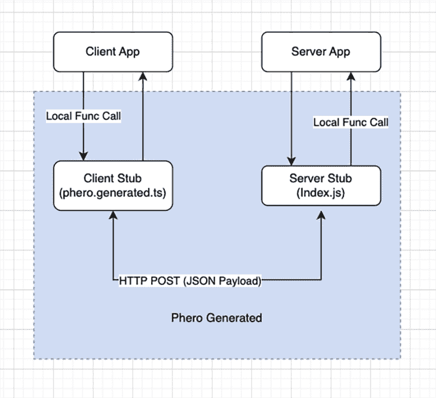
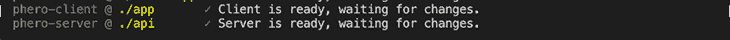
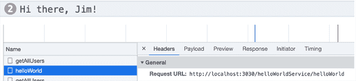

# 费罗:用 TypeScript 构建一个类型安全的全栈应用

> 原文：<https://blog.logrocket.com/phero-build-type-safe-full-stack-apps-with-typescript/>

***编者按*** : *本帖于 2022 年 12 月 29 日更新，提及了新功能。*

将后端 API 更改同步到客户端应用是前端开发人员面临的一个常见问题。当后端 API 接口改变时，客户端应用可能需要手动更新以防止错误或崩溃。

费罗就是为了解决这个问题而设计的。由 [Press Play](https://pressplay.dev/) 的人在 2020 年开发的，它最初是为了管理他们的软件产品的类型和接口而创建的，这消耗了大量的 API 端点。Phero 是使用 TypeScript 开发的，可以与任何基于 TypeScript 的框架一起工作。它将处理后端代码并为前端生成一个类型安全的客户端。

使用 Phero，您可以像调用本地函数一样从前端调用后端服务/函数。从 2022 年 9 月开始开源。

让我们仔细看看费罗。

*向前跳转:*

## 费罗解决什么问题？

让我们用一个典型的 Node.js/Express web API 作为例子。我们公开一个端点，如下所示:

```
# API
export enum UserRole {
  ADMIN = "admin",
  USER = "user",
}
export interface User {
  name: string;
  age: number;
  role: UserRole;
}
export interface Users {
  [key: number]: User;
}
app.get("users/:userId", (req, res) => {
  res.send(
     {
      name: "Jane",
      age: 30,
      role: UserRole.USER
    });
});
```

在客户端应用程序中，我们需要创建另一组类型/接口，然后转换响应 JSON 以获得类型化的响应对象。

```
# Client App
export enum UserRole {
  ADMIN = "admin",
  USER = "user",
}

export interface User {
  name: string;
  age: number;
  role: UserRole;
}

const response = await fetch(`${Root_URL}/users/1`);
const user = await response.json() as User;
```

这种模式存在一些问题。首先，在客户端和服务器端都有重复的类型和接口。这种重复会使应用程序难以维护。

其次，当 API 发生变化时(即添加了新的`UserType`)，如果没有更新，客户端应用程序可能会崩溃——即使您更新了客户端，旧版本的客户端应用程序仍会有同样的问题。因此，服务器和客户机都需要同时更新，以确保向后兼容性。

为了克服上述问题，一种常见的做法是向客户端代码添加 JSON 响应。但是额外的验证需要额外的工作，并且不够安全，因为它不能在编译时捕捉问题。

费罗为这个问题提供了一个干净的解决方案。

## 费罗是如何工作的？

在幕后，费罗使用了[远程过程调用(RPC)](https://blog.logrocket.com/introduction-to-rpc-using-go-and-node/) 。RPC 是一种通信协议，允许一台机器上的程序调用另一台机器上的服务，而不知道它是远程的。

下图显示了使用 RPC 的 Phero 客户端和服务通信。



A diagram illustrating the connection between Phero and the client via RPC

您可以使用任何基于 TypeScript 的框架来构建您的后端和前端；除此之外，一个启用信息素的应用程序包含三个组件:

1.  客户端应用程序:您的客户端应用程序只需要在与服务器交互时使用生成的 Phero 客户端文件
2.  服务器 app:服务器组件的入口点是`Phero.ts`；只要 Phero 文件公开了函数，您还可以灵活地组织服务器项目结构
3.  费罗生成的代码:生成的文件是后端和前端之间的粘合剂，包括客户端存根和服务器端存根文件。存根使服务器和客户机能够使用 HTTP 协议通过 RPC 进行通信

Phero 利用 TypeScript 编译器 API 来分析类型和接口。它还生成验证器来解析客户机和服务器之间的传入和传出数据。它公开了后端公开的所有域类型和接口；因此，如果返回输入错误或不正确的数据，将会引发编译时错误。

### 与费罗合作的好处

费罗的好处包括:

*   纯类型脚本(不需要其他依赖项)
*   端到端类型安全
*   分离后端和前端，就像它们没有分离一样
*   使用任何基于类型脚本的框架

## 开始使用费罗

让我们来看看构建一个费罗应用程序的过程。由于 Phero 是一个纯 TypeScript 库，所以唯一的依赖项是 npm 和 TypeScript。

### 后端设置

首先，让我们初始化一个 Node.js 应用程序。我们在下面创建一个`api`目录。你想叫它什么都可以。

```
# bash script
#  Create a Server folder
mkdir api
cd ./api
# Initialise the server app, and get TypeScript ready 
npm init -y
npm install typescript --save-dev
npx tsc --init

​# edit tsconfig.json file to add the following entries
# it is a temporary workaround until the bug is fixed in Phero CLI
{
 "compilerOptions": {
   ...
   "rootDir": "src",
   "outDir": "dist"
 }
}
# Add Phero to your backend project
npx phero init server
```

以上命令成功完成后，您将在`api/src`文件夹中拥有一个新的`phero.ts`文件。

```
# api/src/phero.ts
import { createService } from '@phero/server'

async function helloWorld(name: string): Promise<string> {
  return `Hi there, ${name}!`
}

export const helloWorldService = createService({
  helloWorld
})
```

生成的`Phero.ts`文件公开了一个`helloWorld`服务，并准备好供客户端使用。

### 前端设置

让我们运行下面的脚本来设置客户端。我们创建了一个`app`子文件夹，但是它可以被命名为其他名称。费罗 CLI 可以扫描依赖关系，以确定项目是`phero-server`还是`phero-client`项目。

```
# bash script 
# from your project root directory, create a app subfolder 
mkdir app
cd ../app

# initialise a node app
npm init -y
npm install typescript --save-dev
npx tsc --init

# Add Phero to your frontend project:
npx phero init client
```

`phero init client`命令安装`@phero/client`并生成一个`Phero.ts`文件。

```
# app/src/Phero.ts
import { PheroClient } from "./phero.generated";

const fetch = window.fetch.bind(this);
const client = new PheroClient(fetch);

async function main() {
  const message = await client.helloWorldService.helloWorld('Jim')
  console.log(message) // `Hi there, Jim!`
}

main()
```

### 运行 CLI 启动开发环境

现在我们可以运行 Phero CLI 来启动开发环境。

```
# back to the project root directory
cd ../
npx phero
```

上述命令启动服务器，同时为前端(或多个前端)生成一个 SDK。您应该会在控制台中看到以下输出:



The output of the Phero SDK installation in the console

在前端项目中，会生成一个`phero.generated.ts` 文件。它是用于连接到服务器存根的 RPC 客户端存根。顾名思义，它不应该手动更新。当 CLI 运行时，它会自动与任何服务器端更改同步。

虽然基本设置已经完成，但我们还不能运行客户端来证明它正在工作，因为我们还没有一个合适的客户端应用程序可以在浏览器中运行。

让我们构建一个 React 客户端应用程序来进行端到端测试。

### 创建 React 客户端应用程序

运行以下命令来生成 React 应用程序的框架。

```
npx create-react-app react-app --template typescript
```

然后，就可以如下图启动 app 了。

```
cd react-app
npm start
```

现在我们有了一个工作的 React 应用程序，所以下一步是给它添加费罗。

```
# bash script
npx phero init client
cd .. # Back to project root directory
# run Phero CLI to start the dev environment
npx phero
```

上面的命令将在 React 项目中生成`phero.generated.ts`文件。

最后一步是打开`src/App.tsx`，用下面的代码片段替换原来的代码:

```
import { PheroClient } from './phero.generated';
import { useCallback, useEffect } from "react";

const phero = new PheroClient(window.fetch.bind(this))

function App() {
  const getHello = useCallback(async () => {
      const message = await phero.helloWorldService.helloWorld('Jim');
      console.log(message);
  }, [])

  useEffect(() => {
    getHello()
  }, [getHello])
```

上面的代码片段将初始化一个`PheroClient`，并调用`helloWorldService.helloWorld`方法。

要验证应用程序是否正常工作，请打开`[http://localhost:3000/](http://localhost:3000/)`并打开 [Chrome DevTools](https://blog.logrocket.com/debugging-node-js-chrome-devtools/) 。您可以在**网络**选项卡中看到控制台消息和客户端到服务器的 RPC 调用。



The client-server RPC call as shown in the Network tab

你可以在[的 GitHub repo](https://github.com/sunnyy02/PheroDemo) 中找到相关的源代码。

## 用信息素处理错误

使用 Phero，我们可以在前端处理定制的服务器端错误，就像处理本地函数一样。

让我们继续前面的 API 例子。如果用户不能通过他们给定的用户 ID 被找到，我们希望在后端抛出一个`UserNotExistException`错误。

```
class UserNotExistException extends Error {
  constructor(userId: number) {
    super()
  }
}
app.get("users/:userId", (req, res) => {
    const user = db.getById(userId);
    if(user === null) {
      throw new UserNotExistException(userId);
    }
    return user;    
});
```

然后在前端，我们可以如下处理错误。请注意，`UserNotExistException`是由生成的费罗文件暴露在客户端的。

```
import {
 PheroClient,
 UserNotExistException,
} from "./phero.generated"

const fetch = window.fetch.bind(this)
const client = new PheroClient(fetch)
 try {
   const user = await client.userService.getUser(1)
 } catch (error) {
   if (error instanceof UserNotExistException ) {
     console.log("User not found")
   } else {
     console.log("Unexpected error")
   }
 }
```

同样，我们在用费罗处理错误时获得了类型安全。此外，`userId`在服务器端被填充为错误的属性，并且可以通过`error.userId`在客户端访问。

## 部署到生产

在本地开发环境中，默认的 Phero 服务器 API 在`port 3030`运行。当部署到更高的环境或生产环境时，您可能需要使用不同的端口号。与任何 Node.js API 一样，端口号可通过在运行时传入环境变量`PORT`或使用`.env`文件来配置。

例如，要在`port 8080`运行服务器 API:

```
cd ./.build
PORT=8080 node index.js
```

在非本地环境中，您可能还需要在客户端配置 API URl。我们可以将 URL 存储在一个环境变量中，并将 URl 传递给`PheroClient`,如下所示。

```
import { PheroClient } from "./phero.generated"
const client = new PheroClient(fetch, `${API_ROOT}`)
```

要构建用于部署的服务器代码包，请运行下面的命令。

```
cd ./server
npx phero server export
```

这将把包文件生成到`.build`目录中。可以用标准的 Node.js 命令启动服务器。

目前，费罗服务器可以运行在任何基于节点的服务器上。以下新的导出和部署功能可用于不同的云平台:

## 迁移现有应用程序以使用费罗

如果你想迁移一个现有的服务器应用程序来使用费罗，你可能要先重组你的费罗应用程序。

费罗没有太多限制。您只需要将`Phero.ts`定义为后端应用程序的入口点，并从费罗文件中导出您的服务。您可以使用任何基于 TypeScript 的框架来设计您的服务和功能。

假设我们需要将一个 Node.js/Express API 应用程序迁移到费罗。我们需要定义清晰的需要从前端调用的函数“组”。在 Express 中，您通常会将它们分组到“`Routers`”中。我们可以把这些组织转化成费罗的服务。您当前在这些路由器中拥有的所有路由都可以迁移到常规的 TypeScript 函数。

例如，该功能:

```
router.post('/example-route', (req, res) => {
  const data: MyData = req.body

  res.send({ output: 123 })
})
```

路由器迁移后会变成如下:

```
async function exampleFunction(data: MyData): Promise<{ output: number }> {
  return { output: 123 }
}
```

在设计新的费罗服务接口时，您应该考虑类型。如果你只使用像 string 和 number 这样的基本类型，那么 Phero 提供的类型安全对你来说可能是多余的。在 Phero 后端定义良好约束的类型将有助于您在前端检测编译时的错误。

## 摘要

费罗是后端和前端之间的类型安全粘合剂。这是在前端开发中确保更好的类型安全的可行解决方案。使用 Phero，您可以从前端调用后端函数或处理后端错误，具有端到端的类型安全性。它会帮助你写出更简洁的代码，让你在重构中安心。

希望这篇文章对你有用。编码快乐！

## [LogRocket](https://lp.logrocket.com/blg/typescript-signup) :全面了解您的网络和移动应用

[](https://lp.logrocket.com/blg/typescript-signup)

LogRocket 是一个前端应用程序监控解决方案，可以让您回放问题，就像问题发生在您自己的浏览器中一样。LogRocket 不需要猜测错误发生的原因，也不需要向用户询问截图和日志转储，而是让您重放会话以快速了解哪里出错了。它可以与任何应用程序完美配合，不管是什么框架，并且有插件可以记录来自 Redux、Vuex 和@ngrx/store 的额外上下文。

除了记录 Redux 操作和状态，LogRocket 还记录控制台日志、JavaScript 错误、堆栈跟踪、带有头+正文的网络请求/响应、浏览器元数据和自定义日志。它还使用 DOM 来记录页面上的 HTML 和 CSS，甚至为最复杂的单页面和移动应用程序重新创建像素级完美视频。

[Try it for free](https://lp.logrocket.com/blg/typescript-signup)

.