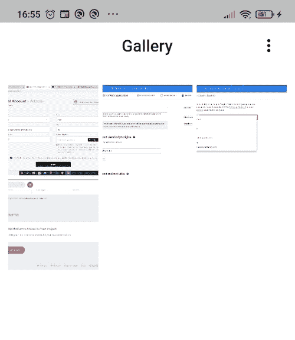
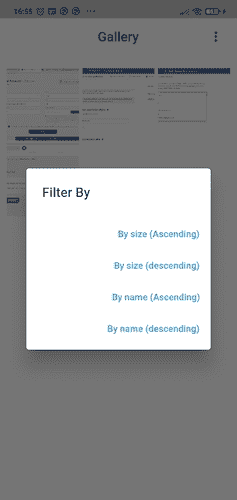
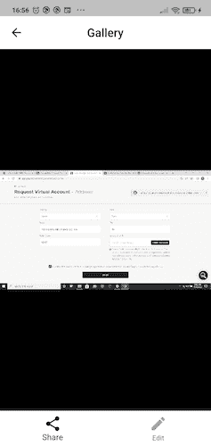
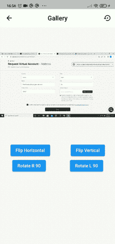

# 使用 Flutter 构建照片库应用程序

> 原文：<https://blog.logrocket.com/photo-gallery-app-flutter/>

你正在寻找一个有趣的项目来扩大你在 Flutter 中的学习吗？那么这就是适合你的！本文将指导你如何在 Flutter 中使用`image_editor`包来构建一个照片库应用。这些步骤将包括从本地存储中获取图像、创建排序功能和编辑功能。

向前跳:

## 先决条件

本教程要求读者具备:

1.  [颤动](https://docs.flutter.dev/get-started/install)
2.  依赖项(图像大小获取器、图像编辑器、照片视图)
3.  和一些咖啡(不是必需的，但推荐:)

## 构建我们的照片库应用程序

为了开始本教程，让我们来研究跨越三个 Dart 文件的四个主要组件，它们对于构建我们的照片库应用程序是必不可少的。这些组件包括:

*   建立主页
*   创建有组织的特征
*   路由到图像索引
*   在路线中创建导航栏

我们开始吧！

## 建立主页

在我们开始之前，我们需要创建一个新的颤振项目。

首先，在终端中使用命令`mkdir <foldername>`创建一个新目录。要将现有目录更改为您创建的新目录，请使用命令`cd <foldername>`。然后，使用命令`Flutter create <projectname>`创建一个新的 Flutter 项目，剩下的交给 Flutter SDK 处理。

(注意:将关键字`<foldername>`和`<pojectname>`更改为您选择的名称)

接下来，将下面的代码粘贴到`main.dart`文件中。

```
import 'package:flutter/material.dart';
import 'homepage.dart';

void main() {
  runApp(const MyApp());
}
class MyApp extends StatelessWidget {
  const MyApp({Key? key}) : super(key: key);
  static const String _title = 'Gallery App';
  // This widget is the root of your application.
  @override
  Widget build(BuildContext context) => const MaterialApp(
        title: _title,
        debugShowCheckedModeBanner: false,
        home: MyHomePage(title: 'Gallery'),
      );
}

```

上面的代码只是实例化了`MyHomePage`类。因此，我们需要创建一个新的类，我们将在一个名为`homepage.dart`的新 Dart 文件中这样做，就像上面代码中导入的那样。

接下来，我们将下面的代码粘贴到`homepage.dart`文件中:

```
import 'package:flutter/material.dart';
import 'package:flutter/services.dart';

import 'gallerywidget.dart';

const whitecolor = Colors.white;
const blackcolor = Colors.black;
class MyHomePage extends StatefulWidget {
  const MyHomePage({Key? key, required this.title}) : super(key: key);
  final String title;
  @override
  State<MyHomePage> createState() => _MyHomePageState();
}
class _MyHomePageState extends State<MyHomePage> {
  final urlImages = [
    'assets/images/a.jpg',
    'assets/images/b.jpg',
    'assets/images/c.jpg',
    'assets/images/d.jpg',
  ];
  var transformedImages = [];

  Future<dynamic> getSizeOfImages() async {
    transformedImages = [];
    for (int i = 0; i < urlImages.length; i++) {
      final imageObject = {};
      await rootBundle.load(urlImages[i]).then((value) => {
            imageObject['path'] = urlImages[i],
            imageObject['size'] = value.lengthInBytes,
          });
      transformedImages.add(imageObject);
    }
  }
  @override
  void initState() {
    getSizeOfImages();
    super.initState();
  }
  @override
  Widget build(BuildContext context) {
    return Scaffold(
      appBar: AppBar(
        elevation: 0,
        backgroundColor: whitecolor,
        centerTitle: true,
        title: Text(
          widget.title,
          style: const TextStyle(color: blackcolor),
        ),
        iconTheme: const IconThemeData(color: blackcolor),
      ),
      // Body area
      body: SafeArea(
          child: Column(
        crossAxisAlignment: CrossAxisAlignment.stretch,
        children: <Widget>[
          Expanded(
              child: Container(
                  padding:
                      const EdgeInsets.symmetric(horizontal: 10, vertical: 20),
                  decoration: const BoxDecoration(
                    color: whitecolor,
                  ),
                  child: GridView.builder(
                    gridDelegate:
                        const SliverGridDelegateWithFixedCrossAxisCount(
                      crossAxisCount: 3,
                      crossAxisSpacing: 5,
                      mainAxisSpacing: 5,
                    ),
                    itemBuilder: (context, index) {
                      return RawMaterialButton(
                        child: InkWell(
                          child: Ink.image(
                            image: AssetImage(transformedImages\[index\]['path']),
                            height: 300,
                            fit: BoxFit.cover,
                          ),
                        ),
                        onPressed: () {
                            Navigator.push(
                              context,
                              MaterialPageRoute(
                                  builder: (context) => GalleryWidget(
                                        urlImages: urlImages,
                                        index: index,
                                      )));
                        },
                      );
                    },
                    itemCount: transformedImages.length,
                  )))
        ],
      )),
    );
  }
}

```

在上面的代码中，我们创建了一个数组列表，其中包含从项目应用程序结构的 assets 文件夹中检索到的四个图像路径。

然后，我们创建了一个名为`getSizeOfImages`的`Future <dynamic>`实例来获取每个文件的大小。最后，我们调用了生命周期方法`initState`来调用我们的`getSizeOfImages`函数。

我们用一个简单的`appBar`和小部件网格返回了我们的脚手架。`appBar`包含我们的标题，它将包含我们稍后将讨论的 action 属性。

`GridView.builder`将按照图像在数组中的索引指定的网格格式显示图像。在我们的`itemBuilder`中，我们用一个`onPressed`属性将一个`Inkwell`小部件包裹在我们的图像周围，当我们点击一个图像时，它会将我们引导到一个新页面。

下面是上面代码的结果:



## 创建有组织的特征

我们需要有组织的功能来根据大小和名称对图像进行排序。因此，在我们的`homepage.dart`文件中，让我们在`initState`函数(`sortImagesByIncreseSize, sortImagesByDecreaseSize, sortImagesByNamesIncrease, sortImagesByNamesDecrease`)之上创建四个回调`Future <dynamic>`函数。

我们将调用上面的函数，只要我们点击我们链接到的相应按钮。

代码如下:

```
Future<dynamic> sortImagesByIncreseSize() async {
  transformedImages.sort((a, b) => a['size'].compareTo(b['size']));
}
Future<dynamic> sortImagesByDecreseSize() async {
  transformedImages.sort((b, a) => a['size'].compareTo(b['size']));
}
Future<dynamic> sortImagesByNamesIncrease() async {
  transformedImages.sort((a, b) => a['path'].compareTo(b['path']));
}
Future<dynamic> sortImagesByNamesDecrease() async {
  transformedImages.sort((b, a) => a['path'].compareTo(b['path']));
}

```

现在，我们想使用我们创建的回调函数。因此，我们将在我们的`appBar`中创建一个带有四个`TextButtons`的动作属性:升序名称、降序名称、升序大小和降序大小。

下面是代码的样子:

```
actions: <Widget>[
  GestureDetector(
    onTap: () {
      // show the dialog
      showDialog(
        context: context,
        builder: (BuildContext context) {
          return AlertDialog(
            title: const Text("Filter By"),
            // content: const Text("This is my message."),
            actions: [
              TextButton(
                child: Column(
                  children: const [
                    Text('By size (Ascending)'),
                  ],
                ),
                onPressed: () {
                  sortImagesByIncreseSize()
                      .then((value) => setState(() {}));
                  Navigator.pop(context);
                },
              ),
              TextButton(
                child: Column(
                  children: const [
                    Text('By size (descending)'),
                  ],
                ),
                onPressed: () {
                  sortImagesByDecreseSize()
                      .then((value) => setState(() {}));
                  Navigator.pop(context);
                },
              ),
              TextButton(
                child: Column(
                  children: const [
                    Text('By name (Ascending)'),
                  ],
                ),
                onPressed: () {
                  sortImagesByNamesIncrease()
                      .then((value) => setState(() {}));
                  Navigator.pop(context);
                },
              ),
              TextButton(
                child: Column(
                  children: const [
                    Text('By name (descending)'),
                  ],
                ),
                onPressed: () {
                  sortImagesByNamesDecrease()
                      .then((value) => setState(() {}));
                  Navigator.pop(context);
                },
              ),
            ],
          );
        },
      );
    },
    child: Container(
      margin: const EdgeInsets.only(right: 20),
      child: const Icon(Icons.more_vert),
    ),
  )
],

```

我们来分析一下这是怎么回事。

我们使用上述方法来实现排序功能。因此，为了按大小排序图像，我们的应用程序将使用最初创建的`getSizeOfImages`函数来遍历图像数组并获得它们的大小。

然后，它将根据大小对图像进行排序，增加和减少，分别使用`sortImagesByIncreasingSize`、`sortImagesByDecreasingSize`、`sortImagesByNameIncrease`和`sortImagesByNameDecrease`功能。

现在看起来是这样的:



## 路由到图像索引

本节的目标是学习如何在我们点击图像时显示它。为此，我们将引用我们的`GridView.builder`中的`onPressed`属性。

正如我们之前提到的，一旦我们点击一个图像，它就会用`GalleryWidget`类将我们导航到一个新的页面。

我们需要创建`GalleryWidget`类，我们将在一个名为`gallerywidget.dart`的新文件中完成这项工作。

在我们的`GalleryWidget`类中，我们希望能够滚动浏览我们的图像，并在我们点击图像时通过使用它们的索引来获取我们的图像。因此，我们需要创建一个`pageController`，我们将使用它来控制页面的索引。

接下来，我们需要创建一个构建方法，在这个方法中，我们将创建一个`PhotoViewGallery`，它来自我们之前安装的`photo_view`包。

为了正确调用我们的图像索引，我们将把`pageController`放在`PhotoViewGallery`中。接下来，我们将使用一个`builder`属性在索引的帮助下构建每个图像。

然后，我们将返回从`photo_view`包中获得的`PhotoViewGalleryPageOptions`，并在其中放入带有`AssetImage`类的图像(`urlImage`)。

下面是上面解释的一个实现:

```
import 'package:flutter/material.dart';
import 'package:photo_view/photo_view_gallery.dart';

import 'homepage.dart';

class GalleryWidget extends StatefulWidget {

  final List<String> urlImages;
  final int index;
  final PageController pageController;
  // ignore: use_key_in_widget_constructors
  GalleryWidget({
    required this.urlImages,
    this.index = 0,
  }) : pageController = PageController(initialPage: index);
  @override
  State<GalleryWidget> createState() => _GalleryWidgetState();
}
class _GalleryWidgetState extends State<GalleryWidget> {
  var urlImage;
  @override
  void initState() {
    provider = AssetImage(widget.urlImages[widget.index]);
    super.initState();
  }
  @override
  Widget build(BuildContext context) {
    return Scaffold(
      appBar: AppBar(
        elevation: 0,
        backgroundColor: whitecolor,
        centerTitle: true,
        title: const Text(
          'Gallery',
          style: TextStyle(color: blackcolor),
        ),
        iconTheme: const IconThemeData(color: blackcolor),
        leading: IconButton(
            onPressed: () => Navigator.of(context).pop(),
            icon: const Icon(Icons.arrow_back)),
      ),
      body: Column(
        children: <Widget>[
          Expanded(
            child: PhotoViewGallery.builder(
              pageController: widget.pageController,
              itemCount: widget.urlImages.length,
              builder: (context, index) {
                urlImage = widget.urlImages[index];
                return PhotoViewGalleryPageOptions(
                  imageProvider: AssetImage(urlImage),
                );
              },
            ),
          ),
        ],
      ),
    );
  }
}

```

## 创建底部导航栏

现在，我们想创建一个底部导航栏。为此，我们将从调用身体下方的`bottomNavigationBar`小部件开始。在这个小部件中，创建一个`onTap`函数，我们将使用它来导航到一个新页面(编辑页面)。我们想创建一个带有`Edit`标签的`BottomNavigationBarItem`。

回到`onTap`属性，我们将需要获得选中的导航栏项目。我们可以通过在`_GalleryWidgetState`类中设置一个索引来实现。我们将使用下面的代码来实现该功能:

```
int bottomIndex = 0;

```

现在，我们将使用`setState`函数来跟踪索引，之后，我们将在`setState`中创建一个`if`语句来检查索引是否等于 1。如果是真的，它会带我们到编辑部分。

以下是导航小部件的外观:

```
bottomNavigationBar: BottomNavigationBar(
  onTap: (e) {
    setState(() {
      bottomIndex = e;
      if (e == 1) {
        Navigator.push(
            context,
            MaterialPageRoute(
                builder: (context) => EditScreen(image: urlImage)));
      }
    });
  },
  currentIndex: bottomIndex,
  backgroundColor: Colors.white,
  iconSize: 30,
  selectedItemColor: Colors.black,
  unselectedIconTheme: const IconThemeData(
    color: Colors.black38,
  ),
  elevation: 0,
  items: const <BottomNavigationBarItem>[
    BottomNavigationBarItem(icon: Icon(Icons.share), label: 'Share'),
    BottomNavigationBarItem(
      icon: Icon(Icons.edit),
      label: 'Edit',
    ),
  ],
),

```

下面是上面代码的结果:



## 创建编辑要素

什么是没有编辑功能的图库应用程序？以下部分是本指南的重要部分，因为它将向您展示如何在 Flutter 中使用`image_editor`包创建编辑特征。

我们开始吧！

### `edit_screen.dart`

我们将从创建一个名为`edit_screen.dart`的新 Dart 文件开始。在这个文件中，我们将调用导航栏中的`EditScreen`类。我们将在本节中创建两个编辑功能:旋转和翻转。

以下是相关流程的分类:

1.  单击“编辑”按钮后，我们将进入编辑页面，在这里，我们将全屏显示图像，并在底部选择一个选项来编辑图像
2.  接下来，我们将创建一个`restore`函数，并将值设置为当前选中的图像
3.  然后，我们将创建两个函数，`_flipHorizon`和`_flipVert`，来水平和垂直翻转我们的图像
4.  最后，我们将创建一个`rotate`函数，并将值设置为一个名为`handleOption`的函数

下面是前面解释的一个实现:

```
import 'dart:convert';
import 'dart:typed*data';
import 'package:flutter/material.dart';
import 'package:flutter/services.dart';
import 'package:image*editor/image*editor.dart';
import 'package:image*size*getter/image*size_getter.dart';
import 'homepage.dart';

class EditScreen extends StatefulWidget {
  String image;
  EditScreen({required this.image, Key? key}) : super(key: key);
  @override
  State<EditScreen> createState() => _EditScreenState();
}
class _EditScreenState extends State<EditScreen> {
  ImageProvider? provider;
  bool horizon = true;
  bool vertic = false;
  int angle = 1;
  int angleConstant = 90;
  @override
  void initState() {
    provider = AssetImage(widget.image);
    super.initState();
  }
  @override
  Widget build(BuildContext context) {
    return Scaffold(
      appBar: AppBar(
        elevation: 0,
        backgroundColor: whitecolor,
        centerTitle: true,
        title: const Text(
          'Gallery',
          style: TextStyle(color: blackcolor),
        ),
        iconTheme: const IconThemeData(color: blackcolor),
        actions: <Widget>[
          IconButton(
            icon: const Icon(Icons.settings_backup_restore),
            onPressed: restore,
            tooltip: 'Restore image to default.',
          ),
        ],
      ),
      body: Column(
        children: <Widget>[
          if (provider != null)
            AspectRatio(
              aspectRatio: 1,
              child: Image(
                image: provider!,
              ),
            ),
          Expanded(
            child: Scrollbar(
              child: SingleChildScrollView(
                child: Column(
                  children: [
                    Row(
                      mainAxisAlignment: MainAxisAlignment.spaceAround,
                      children: <Widget>[
                        ElevatedButton(
                          child: const Text('Flip Horizontal'),
                          onPressed: () {
                            _flipHorizon(FlipOption(
                                horizontal: horizon, vertical: vertic));
                          },
                        ),
                        ElevatedButton(
                          child: const Text('Flip Vertical'),
                          onPressed: () {
                            _flipVert(FlipOption(
                                horizontal: vertic, vertical: horizon));
                          },
                        ),
                      ],
                    ),
                    Row(
                      mainAxisAlignment: MainAxisAlignment.spaceAround,
                      children: [
                        ElevatedButton(
                          child: const Text('Rotate R 90'),
                          onPressed: () {
                            _rotate(RotateOption(angleConstant * angle!));
                            setState(() {
                              angle = angle + 1;
                              if ((angleConstant * angle) > 360) angle = 1;
                            });
                          },
                        ),
                        ElevatedButton(
                          child: const Text('Rotate L 90'),
                          onPressed: () {
                            _rotate(
                                RotateOption(360 - (angleConstant * angle!)));
                            setState(() {
                              angle = angle + 1;
                              if ((angleConstant * angle) > 360) angle = 1;
                            });
                          },
                        )
                      ],
                    )
                  ],
                ),
              ),
            ),
          ),
        ],
      ),
    );
  }
  void setProvider(ImageProvider? provider) {
    this.provider = provider;
    setState(() {});
  }
  void restore() {
    setProvider(AssetImage(widget.image));
  }
  Future<Uint8List> getAssetImage() async {
    final ByteData byteData = await rootBundle.load(widget.image!);
    return byteData.buffer.asUint8List();
  }
  Future<void> _flipHorizon(FlipOption flipOption) async {
    handleOption(<Option>[flipOption]);
    setState(() {
      horizon = !horizon;
    });
  }
  Future<void> _flipVert(FlipOption flipOption) async {
    handleOption(<Option>[flipOption]);
    setState(() {
      horizon = !horizon;
    });
  }
  Future<void> _rotate(RotateOption rotateOpt) async {
    handleOption(<Option>[rotateOpt]);
  }
  Future<void> handleOption(List<Option> options) async {
    final ImageEditorOption option = ImageEditorOption();
    for (int i = 0; i < options.length; i++) {
      final Option o = options[i];
      option.addOption(o);
    }
    option.outputFormat = const OutputFormat.png();
    final Uint8List assetImage = await getAssetImage();
    final srcSize = ImageSizeGetter.getSize(MemoryInput(assetImage));
    print(const JsonEncoder.withIndent('  ').convert(option.toJson()));
    final Uint8List? result = await ImageEditor.editImage(
      image: assetImage,
      imageEditorOption: option,
    );
    if (result == null) {
      setProvider(null);
      return;
    }
    final resultSize = ImageSizeGetter.getSize(MemoryInput(result));
    print('srcSize: $srcSize, resultSize: $resultSize');
    final MemoryImage img = MemoryImage(result);
    setProvider(img);
  }
}

```

下面是上面代码的结果:



## 结论

教程到此结束，希望有所帮助。让我们总结一下这个项目中值得注意的部分。在**创建有组织的特征**部分，我们详细说明了根据图像文件的大小或名称改变图像的排列(升序和降序)。

然后，在**路由到图像** **索引**部分，我们谈到了根据位置(索引)导航到每个图像。 **`edit_screen.dart`** 部分讲述了使用 Flutter 中的`image_editor`包转换图像位置(翻转和旋转)并将其恢复到原始位置。

下面是一些其他的文章，您可以通过阅读来更好地了解我们在本教程中构建的组件:

感谢您的阅读！快乐编码💻。

## 使用 [LogRocket](https://lp.logrocket.com/blg/signup) 消除传统错误报告的干扰

[](https://lp.logrocket.com/blg/signup)

[LogRocket](https://lp.logrocket.com/blg/signup) 是一个数字体验分析解决方案，它可以保护您免受数百个假阳性错误警报的影响，只针对几个真正重要的项目。LogRocket 会告诉您应用程序中实际影响用户的最具影响力的 bug 和 UX 问题。

然后，使用具有深层技术遥测的会话重放来确切地查看用户看到了什么以及是什么导致了问题，就像你在他们身后看一样。

LogRocket 自动聚合客户端错误、JS 异常、前端性能指标和用户交互。然后 LogRocket 使用机器学习来告诉你哪些问题正在影响大多数用户，并提供你需要修复它的上下文。

关注重要的 bug—[今天就试试 LogRocket】。](https://lp.logrocket.com/blg/signup-issue-free)