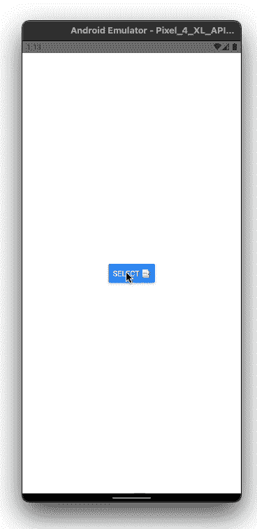
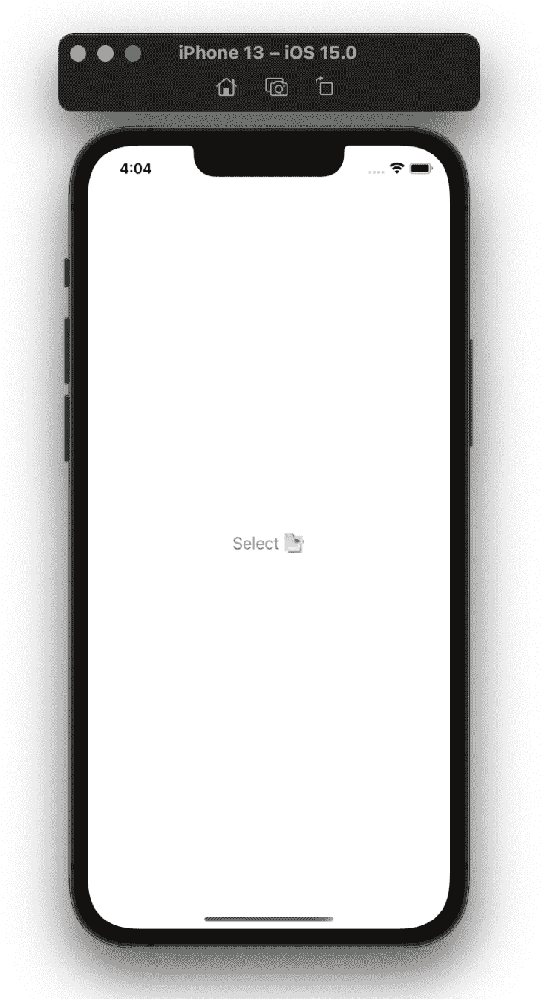
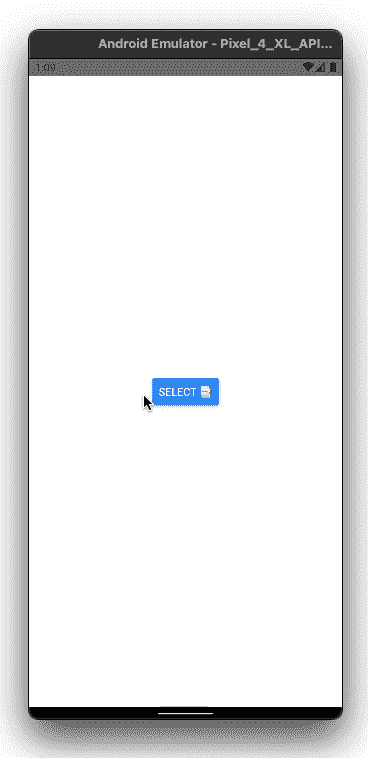
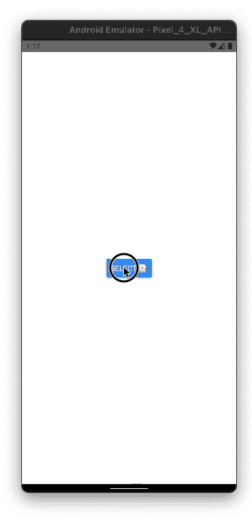

# 使用 React-Native-document-picker-log rocket 博客在 React 原生应用中挑选文件

> 原文：<https://blog.logrocket.com/picking-files-react-native-apps-using-react-native-document-picker/>

在本文中，您将了解如何在一个适用于 iOS 和 Android 的 React 原生应用程序中从用户的设备中挑选任何格式的文档和文件。因为 React Native 不提供任何开箱即用的特性，我们将使用第三方库[React-Native-document-picker](https://www.npmjs.com/package/react-native-document-picker)来实现这一点。

## 什么是反应式本地文档拾取器？

库内部使用 iOS 的`UIDocumentPickerViewController`，Android 的`Intent.ACTION_GET_CONTENT`。它也适用于 Windows，但是在本文中我们将只关注移动应用程序。

`[UIDocumentPickerViewController](https://developer.apple.com/documentation/uikit/uidocumentpickerviewcontroller)`是 iOS 提供的视图控制器，用于在用户设备上选取文档，而在 Android 中，`[ACTION_GET_CONTENT](https://developer.android.com/reference/android/content/Intent#ACTION_GET_CONTENT)`是用于从用户设备上选取任何类型数据的`Intent`。

React-native-document-picker 在原生层包装`[UIDocumentPickerViewController](https://developer.apple.com/documentation/uikit/uidocumentpickerviewcontroller)`和`[ACTION_GET_CONTENT](https://developer.android.com/reference/android/content/Intent#ACTION_GET_CONTENT)` `Intent`。我们只需要将它作为一个依赖项安装在我们的项目中，然后直接在 JavaScript 层使用它，而不需要接触本机代码。

我们将建造这个:




你可以在这里查看这个项目的完整代码。

## 创建 React 本机项目

为了理解我们如何在 React Native 中挑选文档，让我们创建一个简单的 React Native 项目，该项目将有一个按钮，当按下该按钮时，将打开 native document picker 视图。在选择一个或多个文档后，它将返回一个结果，该结果将包含用户所选文档的不同元数据。

我们将从创建一个新的 React 本地项目开始。要初始化 React 本地项目，请转到您首选的终端窗口并键入以下命令:

```
react-native init <Project_Name_Here>

```

> 注意:在撰写本文时，React Native 的最新版本是 0.67，所以我将使用这个版本

一旦创建了项目，在您喜欢的代码编辑器中打开它，并删除`App.js`中的所有占位符代码，它现在应该看起来像这样:

```
import { StyleSheet, Text, SafeAreaView } from 'react-native';
import React from 'react';
const App = () => {
  return (
    <SafeAreaView>
      <Text>Document Picker</Text>
    </SafeAreaView>
  );
};
export default App;
const styles = StyleSheet.create({});

```

让我们添加一些样式并构建一个简单的按钮来触发我们的文档选择逻辑。添加这些更改后，`App.js`将如下所示:

```
import { StyleSheet, Text, SafeAreaView, Button } from 'react-native';
import React from 'react';

const App = () => {
  return (
    <SafeAreaView style={styles.container}>
      <StatusBar barStyle={'dark-content'} />
      <Button title="Select 📑"/>
    </SafeAreaView>
  );
};

export default App;

const styles = StyleSheet.create({
  container: {
    flex: 1,
    backgroundColor: '#fff',
    alignItems: 'center',
    justifyContent: 'center',
  }
});

```

我们的用户界面现在看起来像这样:



## 设置 react-native-文档选取器

现在我们的 UI 代码差不多完成了，让我们实现这个功能，这样当用户点击 **Select 时📑**，出现原生文档选取器窗口。然后用户从设备中选择一个文档，所选文件的本地`URI`显示在屏幕上。

要实现这一点，通过安装`npm`依赖项来安装 react-native-document-picker 库。对于 iOS，我们需要安装`pod`依赖项。

打开项目根目录下的终端，编写以下代码:

```
yarn add react-native-document-picker 

------------ OR --------------

npm i react-native-document-picker

```

一旦安装了 JS 依赖项，安装 iOS 的`pod`依赖项:

```
cd iOS
pod install

```

现在库已经安装好了。接下来，我们需要重新构建我们的 iOS 和 Android 项目来编译依赖文件。运行以下命令来重建它们:

```
npx react-native run-ios
npm react-native run-android

```

## 从移动设备中挑选文档

现在我们需要实现打开文档选择器并选择一个文件的逻辑。为此，将下面的代码添加到您的`App.js`文件中。

```
const App = () => {
  const [fileResponse, setFileResponse] = useState([]);

  const handleDocumentSelection = useCallback(async () => {
    try {
      const response = await DocumentPicker.pick({
        presentationStyle: 'fullScreen',
      });
      setFileResponse(response);
    } catch (err) {
      console.warn(err);
    }
  }, []);

  return (
    <SafeAreaView style={styles.container} >
      <StatusBar barStyle={'dark-content'} />
      {fileResponse.map((file, index) => (
        <Text
          key={index.toString()}
          style={styles.uri}
          numberOfLines={1}
          ellipsizeMode={'middle'}>
          {file?.uri}
        </Text>
      ))}
      <Button title="Select 📑" onPress={handleDocumentSelection} />
    </SafeAreaView>
  );
};

```

> **注意:**如果你使用的是 iOS 模拟器> /= iOS v15，你可能无法从`PickerView`中选择任何文件，因为这个库使用的一些 API 已经被弃用。
> 
> 在 iOS 15 中，你可以尝试运行等于或低于 iOS v13.7 的模拟器，或者看看这个[未决问题](https://github.com/rnmods/react-native-document-picker/issues/498)。否则，这种方法在运行 iOS 15 的设备上运行良好。

这里，我们添加了一个状态变量`fileResponse`，它将存储我们在选择任何文件后从`Document Picker`视图获得的所有响应。

我们添加了助手函数`handleDocumentSelection`，当用户点击**选择时会调用该函数📑**按钮。我们将对`DocumentPicker`的调用包装在`try...catch`块中，因为如果模块抛出任何错误，那么我们可以简单地将它记录在控制台中。

我们还调用了`DocumentPicker.pick`方法，该方法用于从设备中选取文件并返回一个`DocumentPickerResponse`。你也可以看到我们使用了`presentationStyle: 'fullScreen'`。这是一个我们可以在 iOS 中使用的选项，所以它知道打开`UIDocumentPickerViewController`。该属性的可能选项有:

*   `fullScreen`
*   `pageSheet`
*   `formSheet`
*   `overFullScreen`

默认值是`pageSheet`，但是我们使用了`fullScreen`以全屏模式打开视图。一旦我们收到来自模块的响应，我们将相同的`DocumentPickerResponse`设置为我们的`fileResponse`状态。

最后，我们迭代`fileResponse`数组，并在`<Text>`组件中呈现文件的`URI`。

我们的项目应该是这样的:




## 使用 react-native-document-picker 选择 pdf

我们现在已经实现了选择任何文件扩展名的单个文件。但是假设您希望用户只能选择特定的文件格式，比如 PDF 文件。

在`pick`方法的`config`对象中，我们有一个名为`type`的属性，它接受一个`[DocumentPicker.types](https://github.com/rnmods/react-native-document-picker#typestringarraystring)`数组。我们可以让`PickerController`知道哪些类型的文件可以选择。

如果我们希望用户只能选择 PDF 文件，那么我们传递下面的代码:

```
type: [DocumentPicker.types.pdf]

```

我们可以从这个库中只导入`types`对象:

```
import DocumentPicker, { types } from 'react-native-document-picker';

```

那么我们可以直接写成:

```
type: [types.pdf]

```

我们还可以在这里传递多种文件格式，因为它是一个数组，就像这样:

```
type: [types.pdf, types.docx]

```

所以，让我们更新我们的`pick`方法的`config`,看看这是否有效。

```
const response = await DocumentPicker.pick({
  presentationStyle: 'fullScreen',
  type: [types.pdf],
});

```

现在，我们的用户将只能选择 PDF 文件。




## 用 react-native-document-picker 选择多个文件

现在我们只允许用户选择一个 PDF 文件，假设您希望用户能够一次选择多个 PDF 文件。

为此，我们有一个名为`allowMultiSelection`的`boolean`属性，它让选择器知道用户可以一次选择多个文件。

将它添加到我们的配置对象中，我们的方法调用将如下所示:

```
const response = await DocumentPicker.pick({
  presentationStyle: 'fullScreen',
  type: [types.pdf],
  allowMultiSelection: true,
});

```

就是这样！通过添加该属性，我们使用户能够一次选择多个文档。这个调用的响应将是一个`DocumentPickerResponse`数组，就像之前一样。不同的是，现在这个数组可能包含多个值。因为我们的响应结构是相同的，所以我们不需要更改处理程序代码。

它看起来是这样的:


我们现在已经在 React 本地应用中实现了文档拾取功能。现在我们有了文件`URI`，我们可以根据我们的业务需求在应用程序中显示文档，或者将它上传到我们的后端或 S3 桶。

## 结论

由于出色的开源工作和库[react-Native-document-picker](https://www.npmjs.com/package/react-native-document-picker)，很容易将文件拾取功能集成到我们的 React 本地应用程序中。感谢您的阅读！

## [LogRocket](https://lp.logrocket.com/blg/react-native-signup) :即时重现 React 原生应用中的问题。

[](https://lp.logrocket.com/blg/react-native-signup)

[LogRocket](https://lp.logrocket.com/blg/react-native-signup) 是一款 React 原生监控解决方案，可帮助您即时重现问题、确定 bug 的优先级并了解 React 原生应用的性能。

LogRocket 还可以向你展示用户是如何与你的应用程序互动的，从而帮助你提高转化率和产品使用率。LogRocket 的产品分析功能揭示了用户不完成特定流程或不采用新功能的原因。

开始主动监控您的 React 原生应用— [免费试用 LogRocket】。](https://lp.logrocket.com/blg/react-native-signup)