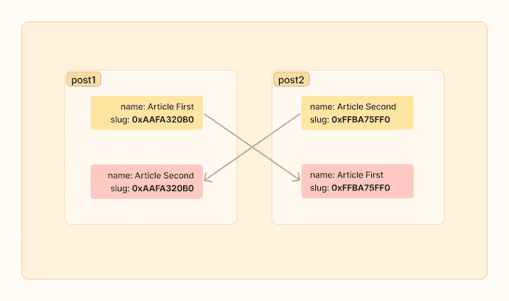

# 固定 Rust 异步数据类型以实现内存安全

> 原文：<https://blog.logrocket.com/pinning-rust-async-data-types-memory-safety/>

实现异步编程可以帮助您的应用程序运行得更快，并处理高流量。但是，Rust 中异步编程的挑战是确保多个任务访问的数据是一致和安全的。

[并发是防止这个问题](https://blog.logrocket.com/deep-dive-concurrency-rust-programming-language/)的一种策略，因为它在内存使用方面提供了好处。然而，对于 Rust 中异步数据类型的内存安全，钉住是最好的解决方案。

Pinning 是 Rust 中的一个特性，它允许将一个异步数据类型固定或“固定”到内存中的一个特定位置，这样当它被多个任务使用时就不能被移动。

在本文中，我们将研究在 Rust 中实现锁定的不同方法。我们还将了解如何安全地访问固定数据。

*向前跳转:*

## 在 Rust 中为异步数据类型使用`Future`特征

当在 Rust 中处理异步数据时，我们有一个叫做`Future`的特性来帮助我们。任何使用这个特征的函数或结构都将处于两种状态之一:`Pending`或`Ready`。

我们使用`await`关键字来等待`Future`特征完成并给我们一个值。挺顺手的！

下面是如何将`Future`特征实现到一个结构中:

```
impl Future for MyFutureStruct {
    type Output = ();
    fn poll(self: Pin<&mut Self>, _cx: &mut Context<'_>) -> Poll<()> {
        Poll::Ready(())
    }
}

```

下面是如何将`Future`特征实现到一个函数中:

```
impl MyFutureStruct {
    fn get_something_async(&self) -> impl Future<Output = String> + '_ {
        async {
            "Something".to_string()
        }
    }
}

```

任何 Rust 数据类型都可以在 async 中使用，只要它实现了`Future`特征。

## 理解异步数据类型和内存安全的问题

让我们来看看我们是如何在 Rust 中实现异步的。语言本身并没有为我们提供一个运行器来进行异步编程，但是幸运的是，有一个社区包`tokio`，可以帮助我们处理异步运行器。让我们将它安装在我们的 Rust 项目中:

```
cargo add tokio --features full

```

用`tokio`创建异步运行器有两种方法，一种是用宏，另一种是用`tokio`运行时构建器。

下面是如何用宏创建异步运行时:

```
#[tokio::main(flavor = "current_thread")]
async fn main() {
   // your code here
}

```

下面是如何使用`tokio`运行时构建器创建异步运行时:

```
fn main() {
    let rt = tokio::runtime::Builder::new_current_thread()
        .build()
        .unwrap();
    rt.block_on(/* your async code or function here */);
}

```

对于本教程，我们将使用宏版本，因为它更简单。

在 Rust 中，我们有可以用来存储自定义值的`struct`数据类型——就像 Java 中的类一样。

我们可以像这样创建一个`struct`:

```
#[derive(Debug)]
struct Post {
    name: String,
    slug: *const String
}

```

但是，我们不能直接使用这个结构来执行异步过程。首先，我们需要为这个结构实现一个`Future`特征。这将告诉我们的异步运行时，来自该结构的值`slug`将在以后被填充，使我们能够运行异步进程来获取该结构的值。

让我们给我们的结构添加一个方法，这样我们就可以填充`name`和`slug`属性的值:

```
impl Post {
    pub fn new(name: String) -> Self {
        Self { 
            name,
            slug: std::ptr::null()
        }
    }
    fn collect_slug(&mut self) {
        let ref_slug = &self.name as *const _;
        self.slug = ref_slug;
    }
    fn get_slug(&self) -> String {
        unsafe { &*(self.slug) }.replace(" ", "-").to_lowercase()
    }
}

```

现在，让我们为我们的结构实现一个`Future`特征:

```
use std::future::Future;
use std::pin::Pin;
use std::task::Context;
use std::task::Poll;

impl Future for Post {
    type Output = ();
    fn poll(self: Pin<&mut Self>, _cx: &mut Context<'_>) -> Poll<()> {
        println!("Post:::poll {}", self);
        Poll::Ready(())
    }
}

```

让我们也实现一个`Display`来使我们更容易读取我们的结构中的值:

```
impl Display for Post {
    fn fmt(&self, f: &mut std::fmt::Formatter<'_>) -> std::fmt::Result {
        write!(f, "name:`{}` slug:`{}`",self.name self.get_slug()).unwrap();
        Ok(())
    }
}

```

现在让我们尝试使用这个结构:

```
#[tokio::main(flavor = "current_thread")]
async fn main() {
    let mut post1 = Post::new("Article First".to_string());
    let mut post2 = Post::new("Article Second".to_string());
    post1.collect_slug();
    post2.collect_slug();
    post1.await;
    post2.await;
}

```

我们得到了我们想要的一切！以下是输出结果:

```
Post:::poll name:`Article First` slug:`article-first`
Post:::poll name:`Article Second` slug:`article-second`

```

但是，在移动`Post`结构的值时，我们会遇到一个问题。看看下面的代码:

```
#[tokio::main(flavor = "current_thread")]
async fn main() {
    let mut post1 = Post::new("Article First".to_string());
    let mut post2 = Post::new("Article Second".to_string());
    post1.collect_slug();
    post2.collect_slug();
    std::mem::swap(&mut post1, &mut post2);
    post1.await;
    post2.await;
}

```

通过这种内存交换，我们期望得到如下值:

```
Post:::poll name:`Article Second` slug:`article-second`
Post:::poll name:`Article First` slug:`article-first`

```

相反，这是我们的结果:

```
Post:::poll name:`Article Second` slug:`article-first`
Post:::poll name:`Article First` slug:``

```

为什么会这样？为了进一步研究，让我们使用`println`添加一些简单的跟踪:

```
println!("Before swap");
println!("post1: {:?} => {:p}, {:?}", post1.name, &post1.name, post1.get_slug());
println!("post2: {:?} => {:p}, {:?}\n", post2.name, &post2.name, post2.get_slug());
std::mem::swap(&mut post1, &mut post2);
println!("After swap");
println!("post1: {:?} => {:p}, {:?}", post1.name, &post1.name, post1.get_slug());
println!("post2: {:?} => {:p}, {:?}\n", post2.name, &post2.name, post2.get_slug());

```

如果我们打印内存中的值，我们会得到下面的输出。奇怪的是，即使我们使用了一个`Future`特征，我们也没有为`post2`得到一个交换的`slug`值:

```
Before swap
post1: "Article Firstd" => 0x16af320b0, "article-firstd"
post2: "Article Second" => 0x16af320d0, "article-second"

After swap
post1: "Article Second" => 0x16af320b0, "article-firstd"
post2: "Article Firstd" => 0x16af320d0, "article-second"

```

我们成功地为`name`变量交换了内存，但是原始的`slug`地址仍然是相同的——没有任何改变。

下图可能有助于理解交换的工作原理:



在 Rust 中，如果一个类型包含指向自身的指针，移动该类型的值是不安全的，因为指针不会被更新，仍然指向旧的内存位置。

例如，如果我们试图将`post1`的值移动到`post2`，那么`post1`中的 slug 指针仍然会指向内存中的旧位置，而`post2`中的 slug 指针不会被更新。

这将导致`post1`和`post2`都有无效指针，这是不安全的。交换`post1`和`post2`的值需要改变 slug 字段，这是不可能的，因为它是自引用的。

让我们看看锁定如何帮助我们解决这个问题。

## 理解和实现 Rust 中的锁定

`[Pin]([https://github.com/rust-lang/rfcs/blob/master/text/2349-pin.md](https://github.com/rust-lang/rfcs/blob/master/text/2349-pin.md))` [是 Rust](https://github.com/rust-lang/rfcs/blob/master/text/2349-pin.md) 中的引用类型；引入它是为了处理不应该移动或不能安全移动的数据。例如，异步访问的数据可以固定在内存中，以防止它被 Rust 运行时移动或修改。

通过钉住，我们可以确保异步数据被可预测地、一致地访问，避免数据竞争等并发问题。在 Rust 中实现 pinning 有两种方法；我们可以固定在堆栈上，也可以固定在堆上。

让我们仔细看看！

### 固定到堆栈

将`PhantomPinned`特征添加到`Post`结构允许它被固定在内存中，这意味着它在内存中的位置是固定的，不会被程序移动。

* * *

### 更多来自 LogRocket 的精彩文章:

* * *

为了实现这一点，我们首先需要将`PhantomPinned`导入到我们的项目中，然后将它添加到`Post` struct！取消固定:

```
use std::marker::PhantomPinned;
#[derive(Debug)]
struct Post {
    name: String,
    slug: *const String,
    _marker: PhantomPinned,
}

```

现在，我们可以创建一个`Post`结构的新实例，如下所示:

```
impl Post {
    pub fn new(name: String) -> Self {
        Self {
            name,
            slug: std::ptr::null(),
            _marker: PhantomPinned,
        }
    }
}

```

接下来，我们需要改变我们改变结构值的方式:

```
impl Post {
    pub fn collect_slug(self: Pin<&mut Self>) {
        let ref_slug = &self.name as *const String;
        let this = unsafe {
            self.get_unchecked_mut()
        };
        this.slug = ref_slug;
    }
    pub fn get_slug(self: Pin<&Self>) -> String {
        unsafe { &*(self.slug) }.replace(" ", "-").to_lowercase()
    }
    fn get_name(&self) -> &str {
        &self.name
    }
}

```

我们还需要更改到`Display` trait 实现:

```
impl Display for Post {
    fn fmt(&self, f: &mut std::fmt::Formatter<'_>) -> std::fmt::Result {
        let this = unsafe { Pin::new_unchecked(self) };
        write!(f, "name:`{}` slug:`{}`", this.as_ref().get_name(), Post::get_slug(this)).unwrap();
        Ok(())
    }
}

```

最后，我们可以使用结构的固定值:

```
#[tokio::main(flavor = "current_thread")]
async fn main() {
    let mut post1 = Post::new("Article Firstd".into());
    let mut post2 = Post::new("Article Second".into());
    let mut post1 = unsafe { Pin::new_unchecked(&mut post1) };
    let mut post2= unsafe { Pin::new_unchecked(&mut post2) };
    Post::collect_slug(post1.as_mut());
    Post::collect_slug(post2.as_mut());
    post1.await;
    post2.await;
}

```

这是运算的结果。它很有效，给了我们预期的价值:

```
Post:::poll name:`Article Second` slug:`article-second`
Post:::poll name:`Article Firstd` slug:`article-firstd`

```

但是，当我们以这种方式使用交换时，Rust 编译器会“抱怨”,因为这不是内存安全的:

```
std::mem::swap(post1.get_mut(), post2.get_mut());

```

***注意，**如果要对数据进行变异，当你的数据实现`PhantomPinned`时一定要使用`.get_mut()`。这一特性保证了该结构在可变引用的生存期内不会在内存中移动，并且可以防止在使用固定数据***** 时可能出现的某些类型的错误

### 固定到堆

存储在堆栈上的数据可以在内存中移动。但是当数据被“钉”在堆上时，意味着它在内存中的位置是固定的，不会被程序移动。只要程序在运行，固定在堆上的数据就在一个位置，并且易于访问和使用。

为了在堆中存储数据，我们将使用`Box`数据类型:

```
impl Post {
    pub fn new(name: String) -> Pin<Box<Self>> {
        let post = Self {
            name,
            slug: std::ptr::null(),
            _marker: PhantomPinned,
        };
        let mut boxed = Box::pin(post);
        let self_ptr = &boxed.name as *const String;
        unsafe { boxed.as_mut().get_unchecked_mut().slug = self_ptr }
        boxed
    }
    fn get_slug(&self) -> String {
        unsafe { &*(self.slug) }.replace(" ", "-").to_lowercase()
    }
    fn get_name(&self) -> &str {
        &self.name
    }
}

```

为了显示数据的值，我们将使用来自`Box`的`as_ref`函数:

```
impl Display for Post {
    fn fmt(&self, f: &mut std::fmt::Formatter<'_>) -> std::fmt::Result {
        write!(f, 
          "name:`{}` slug:`{}`", 
          self.as_ref().get_name(), self.as_ref().get_slug()
        ).unwrap();
        Ok(())
    }
}

```

以下是我们获取价值的方式:

```
#[tokio::main(flavor = "current_thread")]
async fn main() {
    let post1 = Post::new("Article Firstd".into());
    let post2 = Post::new("Article Second".into());
    post1.await;
    post2.await;
}

// Post:::poll name:`Article Firstd` slug:`article-firstd`
// Post:::poll name:`Article Second` slug:`article-second`

```

## 使用管脚投影访问数据值

引脚投影使我们能够访问一个`Pin<P>`的内部值(即类型`P`的值)，同时将它固定在内存中。

要访问一个`Pin<P>`的内部值，我们可以使用`.as_ref()`或`.as_mut()`方法来获取内部值的引用或可变引用。这允许我们像处理常规值一样处理内部值，同时确保它不会被移动。

例如，我们可以创建一个`Pin`，像这样:

```
let mut post1 = Post::new("Article Firstd".into());

```

然后，我们可以使用`as_ref`来访问内部值:

```
println!("post1: {:?} => {:?}", post1.as_ref().get_name(), post1.as_ref().get_slug());

```

这在我们处理实现了`Future`特征的嵌套结构时很有用。假设我们想要为我们的`post`结构实现一些跟踪:

```
struct TraceDuration<Fut: Future> {
    start: Option<time::Instant>,
    child: Fut
}

```

我们不能像这样直接使用`child`:

```
impl<Fut: Future> Future for TraceDuration<Fut> {
    type Output = (Fut::Output, Duration);
    fn poll(self: Pin<&mut Self>, cx: &mut Context<'_>) -> Poll<Self::Output> {
        let start = self.start.get_or_insert(time::Instant::now());
        let post_poll = self.child.poll(cx);
        let elapsed = start.elapsed();
        match post_poll {
            Poll::Ready(res) => Poll::Ready((res, elapsed)),
            Poll::Pending => Poll::Pending,
        }
    }
}

```

相反，我们需要从`self`对象中提取该字段，如下所示:

```
impl<Fut: Future> Future for TraceDuration<Fut> {
    type Output = (Fut::Output, Duration);
    fn poll(self: Pin<&mut Self>, cx: &mut Context<'_>) -> Poll<Self::Output> {
        let (mut start, child) = unsafe {
            let this = self.get_unchecked_mut();
            (
                Pin::new_unchecked(&mut this.start),
                Pin::new_unchecked(&mut this.child),
            )
        };
        let start = start.get_or_insert(time::Instant::now());
        let post_poll = child.poll(cx);
        let elapsed = start.elapsed();
        match post_poll {
            Poll::Ready(res) => Poll::Ready((res, elapsed)),
            Poll::Pending => Poll::Pending,
        }
    }
}

```

幸运的是，有一个名为`pin-project`的箱子使我们的代码更加简洁，这样我们就不需要手动进行管脚投影了:

```
cargo add pin-project

```

下面是我们使用`pin-project`访问`child`时代码的样子:

```
impl<Fut: Future> Future for TraceDuration<Fut> {
    type Output = (Fut::Output, Duration);
    fn poll(self: Pin<&mut Self>, cx: &mut Context<'_>) -> Poll<Self::Output> {
        let this = self.project();
        let start = this.start.get_or_insert(time::Instant::now());
        let post_poll = this.child.poll(cx);
        let elapsed = start.elapsed();
        match post_poll {
            Poll::Ready(res) => Poll::Ready((res, elapsed)),
            Poll::Pending => Poll::Pending,
        }
    }
}

```

## 结论

通过在异步编程中使用 pinning，我们可以确保多个任务访问的数据总是一致的，并且没有数据竞争的情况。

当使用自引用结构和锁定 Rust 时，要知道有时使用不安全的代码是必要的。一个例子是遵从存储在`slug`变量中的指针。以这种方式使用点数可能会很危险。如果使用不当，会导致内存安全问题，如数据竞争或空指针取消引用。

理解你的代码的安全级别是非常重要的，并且谨慎地使用不安全的代码。此外，确保结构在被单个或多个任务访问时不会在内存中移动也很重要，否则会导致数据争用或未定义的行为。

## [log rocket](https://lp.logrocket.com/blg/rust-signup):Rust 应用的 web 前端的全面可见性

调试 Rust 应用程序可能很困难，尤其是当用户遇到难以重现的问题时。如果您对监控和跟踪 Rust 应用程序的性能、自动显示错误、跟踪缓慢的网络请求和加载时间感兴趣，

[try LogRocket](https://lp.logrocket.com/blg/rust-signup)

.

[](https://lp.logrocket.com/blg/rust-signup)

LogRocket 就像是网络和移动应用程序的 DVR，记录你的 Rust 应用程序上发生的一切。您可以汇总并报告问题发生时应用程序的状态，而不是猜测问题发生的原因。LogRocket 还可以监控应用的性能，报告客户端 CPU 负载、客户端内存使用等指标。

现代化调试 Rust 应用的方式— [开始免费监控](https://lp.logrocket.com/blg/rust-signup)。