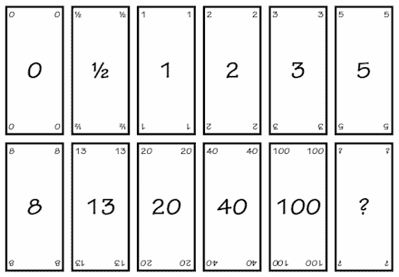
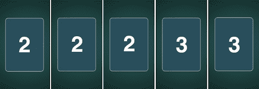
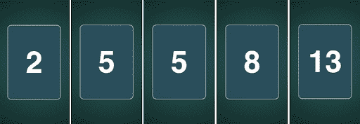

# 规划扑克:scrum 团队评估的敏捷方法

> 原文：<https://blog.logrocket.com/product-management/planning-poker-agile-estimation-scrum/>

计划扑克听起来是一个奇怪的概念:人们围坐在一张桌子前，讨论工作，然后翻牌和比较扑克牌，以确定工作有多复杂。

信不信由你，这很像它的声音。但是不要低估这种游戏化的仪式对你估计实现你的冲刺目标所需工作的能力的影响(并相应地[计划](https://blog.logrocket.com/product-management/what-are-five-types-of-scrum-meetings/#sprint-planning))。

规划扑克在敏捷软件开发中是如何工作的，它真正带来了什么？

* * *

## 目录

* * *

## 什么是规划扑克？

规划扑克(又名 scrum poker)是一种在[敏捷软件开发](https://blog.logrocket.com/product-management/12-agile-manifesto-principles-how-to-adopt-them/)中最常用的技术，用来帮助 scrum 团队估计完成产品待办事项中的任务所需的工作量。

## 策划扑克的目的是什么？

不管你在哪个行业或部门工作，也不管你在做什么样的项目——在评估工作时，你几乎肯定会遇到障碍。三个最常见的障碍是:

1.  缺乏共享知识
2.  某些团队成员左右其他人的意见
3.  无法确定与总体想法相关的细节

2002 年， [James Grenning 创建了 planning poker](https://wingman-sw.com/articles/planning-poker) 作为当时流行的项目评估过程的替代方法，因为他认为它们并没有很好地解决这些问题。当 Mountain Goat Software 的 Mike Cohn 将他的想法写进他非常受欢迎的书时，他的想法变得流行起来。

当我们看一下上面提到的评估挑战时，我们就会明白为什么找到一个准确的评估对 Grenning 来说是一个问题:

*   如果你问在一个网站上引入一个新产品搜索需要多少努力，一个产品经理会给出一个答案，而一个软件工程师会给出另一个答案，一个 UX 设计师会给出另一个答案，等等
*   如果你坐在团队前面询问技术负责人的评估，团队可能会受到技术负责人的影响，可能没有勇气或倾向表达任何不同意见
*   如果您处于确定解决方案的早期阶段，您可能没有进行详细评估所需的所有细节。但是对即将到来的工作的计划需要一些评估来决定它是否适合 sprint 或者季度路线图

Grenning 认识到需要一种方法:

*   考虑到不同的人有不同的知识和参考框架
*   让所有 scrum 团队成员毫无顾虑地分享他们的观点
*   表示工作的规模，而不需要确定每项任务的小时数和天数

这就是策划扑克的用武之地。

## 为什么在规划扑克的时候要用到斐波那契数列？

玩规划扑克，你从一副牌开始，但不是你的标准扑克牌。规划扑克是用一组卡片来玩的，这些卡片显示的数字大致遵循[斐波纳契数列](https://www.mountaingoatsoftware.com/blog/why-the-fibonacci-sequence-works-well-for-estimating) (0，1，2，3，5，8，13……)，然后急剧增加(20，40，100)，最后以无穷大结束(在一些牌组中，数字确实会发生变化)。

Examples of cards used in planning poker

这些数字名义上用于表示所讨论工作的预期规模，范围从零到无穷大，零表示没有工作要做，无穷大表示工作根本无法完成。

例如，如果请求的东西已经存在，就不需要工作。另一方面，你不能建造技术尚不存在的东西。在这两个极端之间，规划扑克需要根据对该工作的感知努力逐渐增加数字。

这些数字本身与现实世界的时间价值无关。例如，1 不等于一小时或一天；它代表了你所做的最简单的工作。在某些情况下，此任务可能需要几天时间。

这里重要的是作品与其他作品的关系。比那个大吗？如果是的话，是稍微大一点还是大很多？

## 为什么刻度不是线性的？

随着时间的推移，scrum 团队对他们如何作为一个整体工作以及完成给定项目或任务所需的努力和时间有了更清晰的理解。团队成员可以利用这种理解来确保参照系保持不变。

要记住的是，数字不会以线性方式增加，你工作的复杂性也不会增加。有时候，一项工作可能会变得相当复杂。

举个简单的例子，假设我们正在考虑在电子商务网站的购物篮中增加一行。

我们可以认为这个任务是 1；如果我们要添加两行，我们可能会把它看作一个 2，因为它需要更多的工作。当我们增加 5 条线时，规划扑克分数可能会跳到 8，因为这将涉及重新设计篮子本身，以允许所有额外的线。

## 策划扑克是怎么做的？

在开始计划扑克游戏之前，向每个参与评估练习的人分发一系列完整的牌，你就可以开始了。

当第一件工作被描述给小组时，成员们有机会提问并阐明需求。一旦每个人都对正在讨论的工作感到满意，小组就被要求提供他们的评估。

成员通过翻开一副牌来提交他们的估价。为了避免上面提到的第二个评估挑战——一个人对其他人的影响——所有玩家必须同时亮出他们的牌。

至此，您应该有一系列卡片展示在桌子周围，代表各方的努力评估。例如，您可能有一组标记为 2、2、2、3、3 的卡片。这告诉我们什么？

Example of scores resulting from a planning poker session in which there is consensus

这个顺序表明有一个共同的理解——工作并不复杂，任务定义明确，每个人都知道他们应该交付什么。

现在我们来看另一个例子:2，5，5，8，13。

Example of scores resulting from a planning poker session in which there is little consensus

在这里，范围更加多样。这表明，一些相关方认为这项工作比在座的其他人更复杂。下一步将是确定是什么导致了这种意见分歧。

从极端数字开始，我们需要理解这些团队成员分数背后的基本原理。为什么他们认为这项工作要么非常简单，要么非常复杂？他们知道哪些别人不知道的事情？或者，他们不知道其他人知道什么？

* * *

订阅我们的产品管理简讯
将此类文章发送到您的收件箱

* * *

也许给任务 a 13 打分的团队成员认为我们是从零开始构建工作，因此它带有很多风险和不确定性。也许选择 2 的团队成员知道他们已经在两年前建立了这个功能，只是重新部署它。这些都是在讨论中可能不会出现的事情。

这种阅读评分范围的方法通过强调知识的这种变化并抓住机会分享信息来解决上述第一个挑战。

此阶段的目标是讨论任何差异，并就给定工作的单一分数达成共识，以代表团队的集体努力评估。

## 解读分数

假设我们已经在 10 个工作项目上执行了规划扑克，我们最终得到了以下分数:2，2，2，5，5，13，1，3，8，2。我们的下一个目标是了解这些项目中有多少可以在下一个工作周期内完成。

如果我们[用两周冲刺](https://blog.logrocket.com/product-management/what-is-sprint-planning-guide-meeting-agenda-cheat-sheet/)来计划我们的工作，我们认为这 43 点中有多少能在这段时间内完成？我们能全部做到吗，或者只是其中的一部分？

当我们开始走这条路时，很难知道我们可能会完成多少工作。但是随着时间的推移，团队会建立一个表现和理解的记录。最终，你会对自己在给定时间内大概能达到多少分有一个共同的理解。

假设我们平均每两周 30 分左右。我们可以使用这种对潜在能力的估计(30 分)来专注于确定我们的 10 个工作项目中的哪些可以在下一段时间内实际完成。也许这些是由分数 2，2，5，5，13，3 代表的工作项，但是它们也可能是 5，5，13，8。重要的是你知道在有限的时间里你能实际做些什么。

请记住，规划扑克的最终目标是有一个估计，而不是 100%准确的预测。随着时间的推移，您的团队的潜在能力会发生变化，其评估能力也是如此。但是进行规划扑克的行为使你能够消除一些与其他形式的评估相关的限制。

## 什么时候应该使用规划扑克？

规划扑克适用于任何需要对即将到来的工作进行评估的过程，而不仅仅是软件开发。你可以用它来估计重新装修你的家，美化你的院子，组织办公室搬迁所需的工作——规划扑克的潜在应用列表是无穷无尽的。

如果你有一份工作清单，并且需要大致了解它有多复杂，规划扑克会有所帮助。

虽然规划扑克解决了与工作评估相关的挑战，但它并不完美。

这是完全可能的，例如，小组可能达成一个错误的共识。团队成员可能都遗漏了一些会增加或减少复杂性的重要信息。如果你有不完善的信息，规划扑克不会为你解决这个问题。

随着时间的推移，团队有时会倾向于改变他们的参考框架。以前被认为是 1 的现在可能被认为是 3，这将影响所需工作的总体估计。

最终，评估团队之外的利益相关者并不关心这个分数系统；他们只关心在日期 X，特性 Y 将被交付。很难阻止大多数业务领域考虑单位时间内的努力，规划扑克的内在模糊性会让他们发疯。

## 结论

当该说的都说了，该做的都做了，我们希望实现的是对未来的更好理解。我们希望对我们将要交付的内容以及何时交付有更多的确定性。

如果你的 scrum 团队正在努力估算以敏捷方式交付产品或功能所需的时间和工作量，为什么不试试规划扑克呢？你没什么可失去的。

## [LogRocket](https://lp.logrocket.com/blg/pm-signup) 产生产品见解，从而导致有意义的行动

[LogRocket](https://lp.logrocket.com/blg/pm-signup) 确定用户体验中的摩擦点，以便您能够做出明智的产品和设计变更决策，从而实现您的目标。

使用 LogRocket，您可以[了解影响您产品的问题的范围](https://logrocket.com/for/analytics-for-web-applications)，并优先考虑需要做出的更改。LogRocket 简化了工作流程，允许工程和设计团队使用与您相同的[数据进行工作](https://logrocket.com/for/web-analytics-solutions)，消除了对需要做什么的困惑。

让你的团队步调一致——今天就试试 [LogRocket](https://lp.logrocket.com/blg/pm-signup) 。