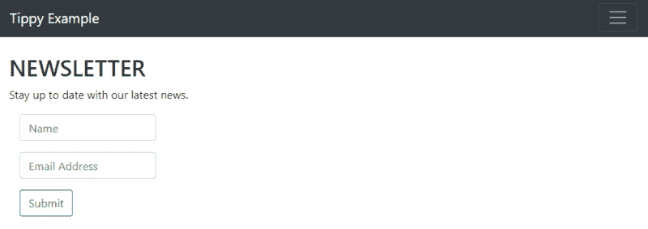
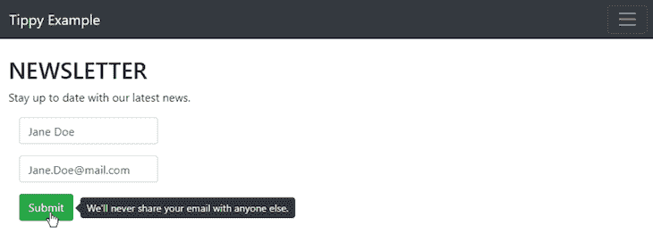
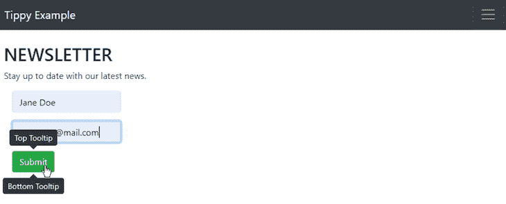
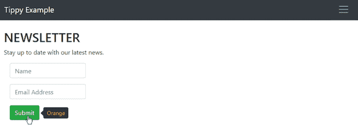
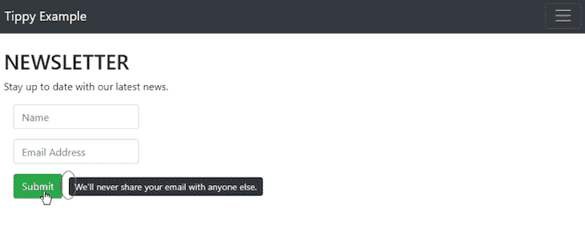

# 使用 Tippy - LogRocket 博客在 React 中定位工具提示

> 原文：<https://blog.logrocket.com/positioning-a-tooltip-in-react-using-tippy/>

工具提示是当光标悬停在应用程序中的元素上时出现的文本框，对于显示用户可能需要的附加信息非常有用。

Tippy.js 是一个轻量级、易于使用的库，它提供了工具提示解决方案，以及其他弹出式 GUI 工具。Tippyjs-react 是 Tippy 库的一个组件，它允许开发者在 react 项目中集成工具提示、弹出窗口、下拉菜单和其他元素。

本教程将向您展示如何使用 Tippy 在 React 项目中创建和定位工具提示。

## 先决条件

首先确保你在上手之前安装了 [React 16.8+](https://reactjs.org/versions) 、 [Node.js](https://nodejs.org/) ，以及 [npm](https://www.npmjs.com/) 或者 [Yarn](https://classic.yarnpkg.com/en/) 。为了充分利用本指南，我们建议您熟悉以下内容:

*   Java Script 语言
*   超文本标记语言
*   反应
*   像函数、对象、数组和类这样的编程概念

## 入门指南

通过从命令行运行以下命令之一来安装 tippyjs-react:

```
npm i @tippyjs/react
//OR
yarn add @tippyjs/react
```

打开或[创建一个 React 项目](https://reactjs.org/docs/getting-started.html),包含一个类和你想要添加提示工具的元素。

在本教程中，我们将使用新闻稿申请表作为示例。具体来说，我们将着重于向表单的**提交**按钮添加一个工具提示。



A basic newsletter request form. We will add a tooltip to the **Submit** button.

## 向 React 项目添加提示工具提示

使用以下命令导入 Tippy 组件和核心 CSS:

```
import Tippy from '@tippyjs/react';
import 'tippy.js/dist/tippy.css';
```

`tippy.css`导入语句是可选的。这将使工具提示看起来很好，几乎不需要额外的努力。这被称为“默认 Tippy”如果你想从头开始创建自己的 Tippy 元素或“tippies”，你可以导入并使用[无头 Tippy](https://github.com/atomiks/tippyjs-react#headless-tippy) 而不是`tippy.css`:

```
import Tippy from '@tippyjs/react/headless';
```

这里，我们将使用默认的 Tippy 和`tippy.css`来创建和定位一个 Tippy React 工具提示。

导入 Tippy 组件后，在要添加工具提示的元素周围插入 Tippy 包装:

```
   <Tippy content="We'll never share your email with anyone else.">
   <Button variant="outline-success" >Submit</Button>
   </Tippy>
```

这些命令将显示一个**提交**按钮。每当光标悬停在按钮上时，就会出现一个工具提示，并显示文本“我们永远不会与他人共享您的电子邮件。”

## 定位倾斜反应工具提示

到目前为止，我们还没有指定相对于我们的**提交**按钮，我们想要在哪里放置 Tippy React 工具提示。如果没有指定工具提示位置，Tippy 会自动将它们放置在元素上方。如果一个元素在页面的顶部，并且上面没有空间，Tippy 会自动将工具提示放在这个元素的下面。

我们当前的代码将显示一个页面元素，它的工具提示出现在它的上方。


By default, Tippy places tooltips above associated elements, which isn’t always ideal. Here, the Email element is being covered by the tooltip when all fields and information should be visible.

Tippy 的默认工具提示位置并不总是理想的。在大多数情况下，有必要指定位置来防止工具提示掩盖重要的页面元素。

Tippy 使得在 React 项目中重新定位工具提示变得很容易。放置选项包括:

在我们的例子中，我们希望不受阻碍地看到**电子邮件**字段，所以让我们将工具提示移动到`button`元素的右边:

```
  <Tippy placement='right' content="We'll never share your email with anyone else.">
  <Button variant="outline-success" >Submit</Button>
  </Tippy>
```



We’ve set the tooltip placement to “right.” This position is better because the Email element is no longer covered by the tooltip.

通过嵌套 Tippy 命令，可以在一个元素上放置多个 Tippy:

```
  <Tippy placement='top' content="Top Tooltip">
  <Tippy placement='bottom' content="Bottom Tooltip">
  <Button variant="outline-success" >Submit</Button>
  </Tippy>
  </Tippy>
```

这些命令将在关联元素上方插入一个“顶部工具提示”工具提示，并在同一元素下方插入另一个“底部工具提示”工具提示。

在单个元素上插入多个 Tippy 包装器时，一定要指定不同的工具提示位置，否则，一个工具提示会覆盖该元素的所有其他工具提示。



The Submit button has two Tippy wrappers around it. One is positioned above the button and the other is below.

## React 中提示工具提示的其他提示和技巧

您可以在 Tippy 命令中添加 HTML 块来改变和样式化工具提示。例如，我们可以添加一个`span`标签来将工具提示的文本颜色改为橙色:

```
  <Tippy placement='right' content={<span style={{color: 'orange'}}>Orange</span>}>
  <Button variant="outline-success" >Submit</Button>
  </Tippy>
```



You can add HTML code to customize the Tippy React tooltip.

要删除工具提示边缘上指向该元素的小箭头，请将`arrow`属性设置为 false:

```
  <Tippy placement='right' arrow={false} content="We'll never share your email with anyone else.">
  <Button variant="outline-success" >Submit</Button>
  </Tippy>
```



The arrow on the tooltip that previously pointed to the element has been removed.

您还可以向 Tippy 包装器添加一个 delay 属性，在光标悬停在元素上和工具提示出现之间创建一个时间延迟。延迟以毫秒为单位，因此将延迟属性设置为 1000 会导致一秒钟的延迟。

```
  <Tippy placement='right' delay={1000} content="We'll never share your email with anyone else.">
  <Button variant="outline-success" >Submit</Button>
  </Tippy>
```

## 结论

现在，您已经了解了如何在 React 项目中创建和定位 Tippy 工具提示的基本知识，包括如何使用 Tippy 的 placement 属性在元素周围定位工具提示。您还可以添加 HTML、移除工具提示的箭头或添加时间延迟来自定义工具提示。

[本教程使用的项目和编写的代码](https://github.com/sneadsd/tippy-tooltip)可以在 GitHub 上找到。完整的项目使用了 [react-bootstrap 框架](https://react-bootstrap.github.io/getting-started/introduction/)和 [react-dom-router 模块](https://www.npmjs.com/package/react-router-dom)，但是这些对于本文中严格包含的信息来说并不是必需的。

## 额外资源

要了解更多关于使用 Tippy.js 和 React 的信息，请查看以下优秀资源:

## [LogRocket](https://lp.logrocket.com/blg/react-signup-general) :全面了解您的生产 React 应用

调试 React 应用程序可能很困难，尤其是当用户遇到难以重现的问题时。如果您对监视和跟踪 Redux 状态、自动显示 JavaScript 错误以及跟踪缓慢的网络请求和组件加载时间感兴趣，

[try LogRocket](https://lp.logrocket.com/blg/react-signup-general)

.

[ ](https://lp.logrocket.com/blg/react-signup-general) [](https://lp.logrocket.com/blg/react-signup-general) 

LogRocket 结合了会话回放、产品分析和错误跟踪，使软件团队能够创建理想的 web 和移动产品体验。这对你来说意味着什么？

LogRocket 不是猜测错误发生的原因，也不是要求用户提供截图和日志转储，而是让您回放问题，就像它们发生在您自己的浏览器中一样，以快速了解哪里出错了。

不再有嘈杂的警报。智能错误跟踪允许您对问题进行分类，然后从中学习。获得有影响的用户问题的通知，而不是误报。警报越少，有用的信号越多。

LogRocket Redux 中间件包为您的用户会话增加了一层额外的可见性。LogRocket 记录 Redux 存储中的所有操作和状态。

现代化您调试 React 应用的方式— [开始免费监控](https://lp.logrocket.com/blg/react-signup-general)。