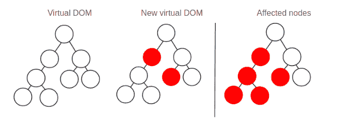

# 后挂钩指南反应调用顺序-日志火箭博客

> 原文：<https://blog.logrocket.com/post-hooks-guide-react-call-order/>

自从 React 16.8 引入钩子后，开发人员编写组件的方式发生了变化。钩子可以改善开发人员的体验，并帮助您节省编写不必要的代码和样板文件的时间。

但是为了达到这样的伟大，一些突然的变化是必需的。公认的类组件范例被抛弃了，语义上很有意义的生命周期挂钩也被移除了。

理解旧的生命周期挂钩和新的 React 挂钩之间不存在 1:1 的映射是至关重要的。的确，你可以利用它们来达到同样的效果，但最终，它们不是一回事。

除了强调编写钩子需要不同于编写类组件的思维方式之外，本文的目的是让您更好地了解整个 React 组件生命周期的工作方式。也就是说，代码在你的应用中是以什么顺序执行的。

即使你认为你知道答案，请耐心听我说。你可能会在这篇文章中发现令人惊讶的结果。

## 基础知识

一如既往，让我们从基础开始。React，顾名思义，是对变化的反应——也就是说，对其道具或状态的变化作出反应。道具是传递给组件的外部变量，状态是在多次渲染中持续存在的内部变量。

道具和状态变量在改变时都会导致重新渲染；由此可见，状态和引用之间的唯一区别是引用更改不会导致重新呈现。[这里有更多关于裁判的信息](https://rafaelquintanilha.com/the-complete-guide-to-react-refs/)。

考虑下面的例子:

```
const CustomButton = () => {
  console.log("I'm always called");
  return <button>Click me</button>;
}
```

上面的组件没有 props(函数的参数，即组件)和状态。这意味着，按照现在的情况，它将只渲染一次。

现在，考虑带有道具的版本:

```
const CustomButton = ({color}) => {
  console.log("I'm called with color", color);
  return <button style={{color}}>Click me</button>;
}
```

如果你渲染`<CustomButton color="red" />`，然后把它改成`<CustomButton color="blue" />`，你会看到两个日志，每次调用函数(组件)都会有一个日志。

现在让我们引入状态的概念。考虑下面的整个应用程序:

```
const App = () => {
  const [count, setCount] = useCount(0);
  const buttonColor = count % 2 === 0 ? "red" : "blue";
  console.log("I'm called with count", count);
  return (
    <div>
      <CustomButton color={buttonColor} onClick={() => setCount(count + 1)} />
      <p>Button was clicked {count} times</p>
    </div>
  );
}

const CustomButton = ({color, onClick}) => {
  console.log("I'm called with color", color);
  return <button style={{color}} onClick={onClick}>Click me</button>;
}
```

现在我们有了一个嵌套组件。我们将研究它在几种情况下的反应，但是现在，让我们看看当我们挂载`<App />`时会发生什么，也就是说，当应用程序被呈现时:

```
I'm called with count 0
I'm called with color "red"
```

如果单击该按钮一次，请注意控制台输出将包括:

```
I'm called with count 1
I'm called with color "blue"
```

第二次点击:

```
I'm called with count 2
I'm called with color "red"
```

发生了什么事？嗯，每次你点击按钮，你就改变了`App`的状态。因为状态发生了变化(`count`增加)，组件重新呈现(函数再次运行)。

在这个新的执行中，一旦`count`发生变化，`buttonColor`也会发生变化。但是请注意，`buttonColor`是作为道具传递给`CustomButton`的。一旦道具发生变化，`CustomButton`也会重新渲染。

在我们深入研究钩子之前，考虑一下这个扩展版本:

```
const App = () => {
  const [count, setCount] = useState(0);
  const buttonColor = count % 2 === 0 ? "red" : "blue";
  console.log("I'm called with count", count);
  render (
    <div>
      <CustomButton color={buttonColor} onClick={() => setCount(count + 1)} />
      <CustomButton color="red" onClick={() => setCount(count + 1)} />
      <p>Button was clicked {count} times</p>
    </div>
  );
}

const CustomButton = ({color, onClick}) => {
  console.log("I'm called with color", color);
  return <button style={{color}} onClick={onClick}>Click me</button>;
}
```

你认为现在会发生什么？

一个合理的观察是，只有第一个颜色可变的`CustomButton`会改变。然而，这不是我们在实践中看到的:两个按钮都将重新呈现。在这个特殊的例子中，`onClick`随着`count`的改变而改变，正如我们看到的，道具的改变会触发重新渲染。

然而，我们将会看到，仅有静态道具和状态并不足以防止重新渲染。

## 理解再现

考虑下面的例子:

```
const App = () => {
  const [count, setCount] = useCount(0);
  console.log("I'm called with count", count);
  render (
    <div>
      <button onClick={() => setCount(count + 1)}>Increment</button>
      <p>Button was clicked {count} times</p>
      <StaticComponent />
    </div>
  );
}

const StaticComponent = () => {
  console.log("I'm boring");
  return <div>I am a static component</div>;
}
```

注意`StaticComponent`既没有道具也没有状态。考虑到我们到目前为止所学的内容，人们可能会认为它只会渲染一次，即使父级`App`发生变化也不会重新渲染。同样，在实践中，不会发生这种情况，每次点击按钮时,`I'm boring`都会被记录在控制台中。这是怎么回事？

事实证明，React 会重新渲染树中父组件发生变化的每个子组件。换句话说，如果 A 是 B 的父，并且 B 是 C 的父，则 B 中的改变(例如，状态变量被更新)将使 A 免于改变，但是将重新呈现 B 和 C

Ornella Bordino 的这篇[文章中的图片很好地展示了这一效果:](https://blog.10pines.com/2018/08/27/reactjs-virtual-dom/)



如果你对实现细节感兴趣，可以参考上面的帖子。

天真的读者现在会问:这是防止这种行为的方法吗？正如你所料，答案是肯定的。React 有一个名为`memo` 的[内置函数，它基本上是记忆组件的结果，并在道具和状态都没有改变的情况下防止重新渲染。](https://reactjs.org/docs/react-api.html#reactmemo)

我们可以将前面的示例更新为:

```
...
const StaticComponent = React.memo(() => {
  console.log("I'm boring");
  return <div>I am a static component</div>;
});
```

…瞧！我们的`StaticComponent`将只渲染一次，永远不会重新渲染，不管树中发生了什么。

提醒一句:React.memo 应该谨慎使用。事实是，你可能永远都不需要使用它！它的好处只会在大型组件(因此经常不需要重新渲染)和大部分静态组件(因为您不希望每次都进行肤浅的比较)中显现出来。明智地使用`React.memo()`是一篇很好文章，它准确地描述了何时应该或不应该使用这种技巧。

下面的 CodeSandbox 总结了我们关于重新渲染的讨论。请注意，使用`React.memo()`只会在道具不能重新渲染时阻止重新渲染:

> **注意**:在撰写本文时，CodeSandbox 中有一个 bug，当有状态改变时，组件被调用两次。在生产环境中，这种情况不会发生。

## 呼叫订单

既然我们已经清楚地了解了 React 中组件(函数)的呈现(执行)时间，我们就可以研究它们的调用顺序了。考虑下面的例子:

```
const Internal = () => {
  console.log("I'm called after")
  return <div>Child Component</div>
}

const App = () => {
  console.log("I'm called first");
  return (
    <Internal />
  );
}
```

如您所料，控制台将记录:

```
I'm called first
I'm called after
```

现在，我们知道`useEffect`钩子是在组件挂载后调用的([更多关于`useEffect`这里](https://rafaelquintanilha.com/how-to-reuse-logic-with-react-hooks/#useeffect))。您希望以下内容的日志是什么？

```
const Internal = () => {
  console.log("I'm called after")

  const useEffect(() => {
    console.log("I'm called after Internal mounts");
  });
  return <div>Child Component</div>
}

const App = () => {
  console.log("I'm called first");

  const useEffect(() => {
    console.log("I'm called after App mounts");
  });
  return (
    <Internal />
  );
}
```

令人惊讶的是:

```
I'm called first
I'm called after
I'm called after Internal mounts
I'm called after App mounts
```

发生这种情况是因为`useEffect`是以自底向上的方式调用的，所以效果首先在子元素中解析，然后在父元素中解析。

如果我们增加一个回调 ref，你认为会发生什么？

* * *

### 更多来自 LogRocket 的精彩文章:

* * *

```
const Internal = () => {
  console.log("I'm called after")

  const useEffect(() => {
    console.log("I'm called after Internal mounts");
  });
  return <div>Child Component</div>
}

const App = () => {
  console.log("I'm called first");

  const useEffect(() => {
    console.log("I'm called after App mounts");
  };
  return (
    <Internal ref={ref => console.log("I'm called when the element is in the DOM")} />
  );
}
```

结果是:

```
I'm called first
I'm called after
I'm called when the element is in the DOM
I'm called after Internal mounts
I'm called after App mounts
```

这很棘手但很重要:它告诉我们何时可以访问 DOM 中的元素，答案是在组件呈现之后但在效果运行之前。

## `useEffect`订单

我们已经看到`useEffect`在组件挂载之后运行。但是它们是按什么顺序被调用的呢？

```
const App = () => {
  console.log("I'm called first");

  const useEffect(() => {
    console.log("I'm called third");
  };

  const useEffect(() => {
    console.log("I'm called fourth");
  };

  console.log("I'm called second");

  return (
    <div>Hello</div>
  );
}
```

这里没有惊喜。效果之外的所有东西都会先运行，然后按顺序调用效果。注意`useEffect` [接受一个依赖数组](https://reactjs.org/docs/hooks-effect.html#tip-optimizing-performance-by-skipping-effects)，当组件第一次挂载和任何依赖关系改变时，它将触发效果。

```
const App = () => {
  const [count, setCount] = useState(0);
  const [neverIncremented, _] = useState(0);
  console.log("I'm called first");

  const useEffect(() => {
    console.log("I'm called second on every render");
  };

  const useEffect(() => {
    console.log("I'm called only during the first render");
  }, [];

  const useEffect(() => {
    console.log("I'm called during the first render and whenever count changes");
  }, [count];

  const useEffect(() => {
    console.log("I'm called during the first render and whenever neverIncremented changes");
  }, [neverIncremented];

  return (
    <div>
      <p>Count is {count}</p>
      <button onClick={() => setCount(count + 1)}>
        Click to increment
      </button>
    </div>
  );
}
```

如果运行上述代码，输出将是:

```
I'm called first
I'm called second on every render
I'm called only during the first render
I'm called during the first render and whenever count changes
I'm called during the first render and whenever neverIncremented changes
```

最后，如果你点击按钮:

```
I'm called first
I'm called second on every render
I'm called during the first render and whenever count changes
```

## 回调引用时要小心

回调引用可能会出现意外行为。我们之前已经看到它们在组件渲染和效果运行之间被调用。但是当组件更新时有一种特殊情况:

```
const App = () => {
  const [count, setCount] = useState(0);

  console.log("I'm called first");

  return (
    <div>
      <p>Count is {count}</p>
      <button 
        onClick={() => setCount(count + 1)}
        ref={ref => {
          console.log("I'm called second with ref", ref);
        }}>
        Click to increment
      </button>
    </div>
  );
}
```

当组件第一次呈现时，输出将是:

```
I'm called first 
I'm called second with ref <button>Click to increment</button>
```

这正是你所期望的。现在看看当你点击按钮并触发重新渲染时会发生什么:

```
I'm called first 
I'm called second with ref null
I'm called second with ref <button>Click to increment</button>
```

回调执行两次，最糟糕的是第一次执行时 ref 是`null`！当用户想通过编程在状态改变时触发一些 DOM 交互(例如，调用`ref.focus()`)时，这是一个常见的错误来源。[点击这里查看更详细的解释](https://rafaelquintanilha.com/the-complete-guide-to-react-refs/#deciding-between-callback-refs-and-createref)。

下面的 CodeSandbox 总结了前面几节中解释的内容:

结论

## React 钩子很棒，并且它们的实现很简单。然而，掌握一个组件的生命周期并不简单，尤其是因为旧的生命周期挂钩已经过时了。然而，只要有耐心，人们就可以准确地理解 React 树中正在发生的事情，甚至可以在出现问题时进行优化。

就我个人而言，自从 Hooks API 第一次发布以来，我就一直在专门使用它，但仍不时会感到困惑。希望这篇文章不仅对我有指导作用，而且对你也有指导作用，因为你对钩子的神奇之处越来越熟悉和有经验了。

[LogRocket](https://lp.logrocket.com/blg/react-signup-general) :全面了解您的生产 React 应用

## 调试 React 应用程序可能很困难，尤其是当用户遇到难以重现的问题时。如果您对监视和跟踪 Redux 状态、自动显示 JavaScript 错误以及跟踪缓慢的网络请求和组件加载时间感兴趣，

.

[try LogRocket](https://lp.logrocket.com/blg/react-signup-general)

LogRocket 结合了会话回放、产品分析和错误跟踪，使软件团队能够创建理想的 web 和移动产品体验。这对你来说意味着什么？

[ ](https://lp.logrocket.com/blg/react-signup-general) [](https://lp.logrocket.com/blg/react-signup-general) 

LogRocket 不是猜测错误发生的原因，也不是要求用户提供截图和日志转储，而是让您回放问题，就像它们发生在您自己的浏览器中一样，以快速了解哪里出错了。

不再有嘈杂的警报。智能错误跟踪允许您对问题进行分类，然后从中学习。获得有影响的用户问题的通知，而不是误报。警报越少，有用的信号越多。

LogRocket Redux 中间件包为您的用户会话增加了一层额外的可见性。LogRocket 记录 Redux 存储中的所有操作和状态。

现代化您调试 React 应用的方式— [开始免费监控](https://lp.logrocket.com/blg/react-signup-general)。

Modernize how you debug your React apps — [start monitoring for free](https://lp.logrocket.com/blg/react-signup-general).