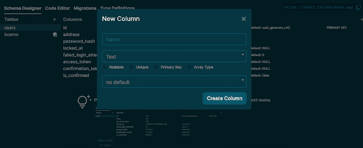
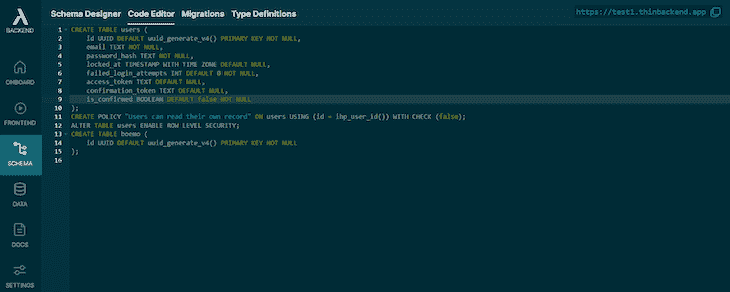
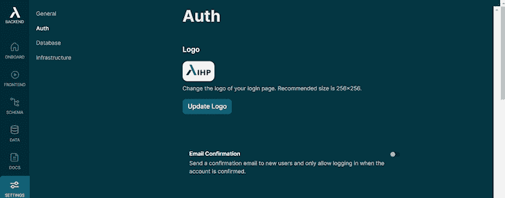
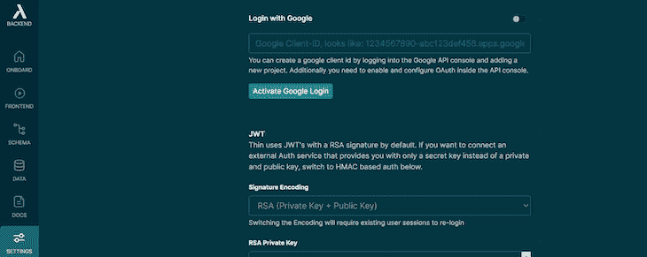
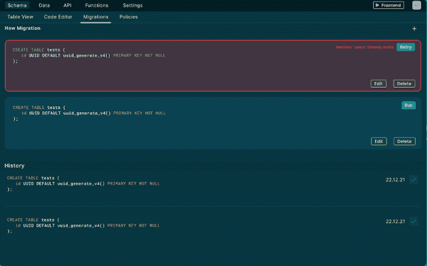
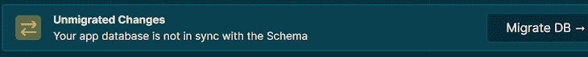
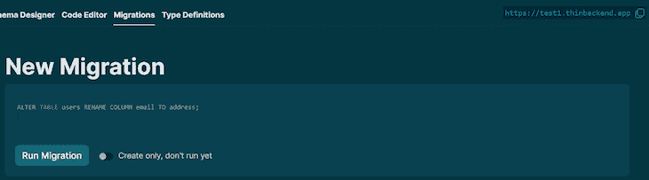
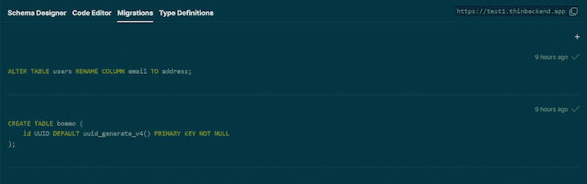
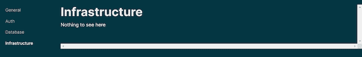
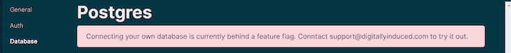

# Prisma vs 瘦后端

> 原文：<https://blog.logrocket.com/prisma-vs-thin-backend/>

最近，GraphQL 因满足开发人员的确切需求而没有过度抓取而受到称赞。许多开发人员已经开始在 REST API 上使用 GraphQL，这比 GraphQL 更容易出错。然而，使用 GraphQL 和 REST API 的问题是，您必须掌握一种不同的语言，如 REST API 语法或 GraphQL 语法，才能与数据库进行交互。

幸运的是，新技术，如[瘦后端](https://thin.dev/)，允许你使用 Next.js 等框架直接与数据库交互，而不必切换语言。

瘦后端是一个与你的 PostgreSQL 数据库交互的 API，它是 REST API 和 GraphQL 的竞争对手。瘦后端优于 REST API 和 GraphQL，因为它使您能够从 JavaScript 框架(如 Angular 或 React 库)直接与数据库交互。使用瘦后端，您不必编写 REST API 端点或 GraphQL 解析器，这迫使您学习 GraphQL 语法和[graph QL](https://www.gatsbyjs.com/docs/how-to/querying-data/running-queries-with-graphiql/)IDE。

使用瘦后端，你可以创建像 WhatsApp 和 Signal 这样的应用程序，因为瘦后端可以立即从你的数据库中检索数据。在使用瘦后端之前，您需要了解的只是 Typescript 或 JavaScript 框架以及大部分关系数据库概念。

另一方面，我们有 [Prisma](https://www.prisma.io/) ，它是一个将应用程序连接到数据库的数据库客户端:

```
datasource db {
  provider = "postgres"
  url      = env("DATABASE_URL")
}

```

与瘦后端不同，Prisma 使用较少的 SQL 与您的 SQL 数据库进行交互。最好的特性是 Prisma 是类型安全的——这意味着如果你使用了错误的数据类型，它将抛出一个错误。

瘦后端和 Prisma 正在彻底改变我们查询和与数据库交互的方式。

在本文中，我们将比较瘦后端和 Prisma 的特性，包括模式设计和建模，以便为您的项目选择最佳的 ORM 技术。

向前跳:

## Prisma 是什么？

[Prisma](https://www.prisma.io/) 使你能够直接从 Node.js 访问你的数据库，并键入脚本应用程序代码。Prisma 与 Node.js 一起广泛用于从数据库中提取数据，并具有以下产品:

*   Prisma 客户端:这个客户端将您的应用程序连接到您的数据库
*   Prisma Studio:该产品用于建模 Prisma 模式
*   Prisma Migrate:该产品帮助您在添加更改后迁移数据

Prisma 是编写普通 SQL 的替代方案。它支持以下数据库技术:

*   一种数据库系统
*   关系型数据库
*   SQL Server
*   SQLite
*   MongoDB
*   CockroachDB

Prisma 最大的优点是它有全面的文档，清晰地指导您如何安装和集成其他工具。Prisma 也有一个比 Thin Backend 更大的社区。 [Prisma GitHub 库](https://github.com/prisma/prisma)有 25000 多颗星，被分叉 899 次，而[瘦后端 GitHub 库](https://github.com/digitallyinduced/thin-backend)只有 897 颗星左右，被分叉 18 次。当有更多的人使用和你一样的工具时，总是很容易得到帮助。

## 什么是瘦后端？

Postgres 数据库因其先进的数据库和可扩展性越来越受欢迎。由[数字诱导](https://www.digitallyinduced.com/)创建的[瘦后端](https://thin.dev/)通过为用户提供一个后端服务器来简化 Postgres，该服务器具有与 Postgres DB 连接的 API。您可以将瘦后端与以下产品集成:

*   以打字打的文件
*   Next.js
*   React.js
*   苗条的
*   法令
*   vue . j

如果你想创建一个单页面的应用程序，从你的数据库中实时获取数据，瘦后端是一个很好的选择，因为它具有较低的延迟。

### 瘦后端功能

数据流功能非常重要，因为必须尽可能快地做出决定。瘦后端为您提供了一个`useQuery`钩子，允许您订阅特定的表，这允许您的应用程序获取实时数据并保持最新。

瘦后端通过提供可以使用节点包管理器安装的组件，使创建、读取、更新和删除记录变得更加容易。该包将使用以下代码片段呈现表格:

```
npm install thin-backend-components

```

您可以在[瘦后端存储库](https://github.com/digitallyinduced/thin-backend/tree/master/components/crud)中找到更多组件。

瘦后端具有允许您选择谁可以在您的数据库上做什么的访问策略。它还使用 Postgres 政策来加强数据隐私。

## 模式设计和建模功能

Thin Backend 为你提供了一个具有自定义业务逻辑和无服务器功能的 IDE，而 Prisma 则为你提供了一个名为 [Prisma Studio](https://www.prisma.io/studio) 的可视化数据库浏览器。在这一节中，我们将深入探讨这些数据库技术如何帮助我们设计和建模数据库模式。

### 用 Prisma 进行模式设计和建模

Prisma 有一个对象关系映射(ORM)客户端，使您能够编写和设计查询。Prisma client 是一个类型安全的查询生成器，是对 [Sequelize](https://sequelize.org/) 和 [TypeORM](https://typeorm.io/) 的替代。

对于模式建模，Prisma 为您提供了一种友好的领域特定语言(DSL)。通用语言往往很麻烦，但 DSL 使完成特定任务变得容易。

下面是一个 Prisma 模式文件的例子。该文件陈述了生成器、数据库源和模型用户。您将在下面了解这些术语。

```
generator client {
  provider = "prisma-client-js"
}

datasource db {
  provider = "postgresql"
  url      = env("DATABASE_URL")
}

model User {
  id       Int @id @default(autoincrement())
  firstName String
  lastName String  
  email String  
  createdAt DateTime @default(now())
  updatedAt DateTime @updatedAt
}

```

Prisma 模式文件有以下组成部分:

1.  数据源:表示您要连接的数据库
2.  生成器:说明应该生成哪些客户端
3.  数据模型定义:陈述您的应用程序模型

与 TypeORM 相比，Prisma 模型更精确，更简洁。您可以在 [Prisma 文档](https://www.prisma.io/docs/concepts/components/prisma-schema)中了解更多关于 Prisma 模式模型的信息。

为了减少延迟，Prisma 使用 SQL DDL 语句，使您能够连接到您的应用程序。

使用以下命令安装 Prisma:

```
npm install prisma --save-dev

```

接下来，使用以下命令执行 Prisma:

```
npx prisma

```

### 使用瘦后端建模

瘦后端不同于 Prisma，因为它直接从 JavaScript 框架访问数据库，不需要 GraphQL。因此，您将使用更瘦的后端 JavaScript 函数，而不是模式。然而，瘦后端有一个 GUI，允许您重新设计底层模式。

使用瘦后端，您可以使用模式设计器单击一个按钮来创建列和表。使用架构设计器创建的表架构将显示在代码编辑器中。



在 Thin Backend 的**代码编辑器中，**您可以编辑您在模式设计部分创建的表。



为了控制用户如何登录，悬停到瘦后端平台底部的**设置**选项卡，并点击**验证**文本。



**认证**页面将向您展示用户如何登录的不同选项。



## 数据迁移

### 使用 Prisma 进行数据迁移

Prisma 自动编写数据迁移模式，您可以用它来转换您的数据。Prisma 在数据迁移方面做得很好，因为它为您提供了直观的 CLI 和样板文件，向您展示了迁移的蓝图。将现有项目导入 Prisma 也很容易。

下面是 Prisma 中数据迁移的一个例子。下面的代码片段显示了一个 Prisma 模式，它创建了一个名为`User`的模型:

```
model User {
 id    Int    @id @default(autoincrement())
  name  String
  posts Post[]
}

```

如果您使用以下命令来执行创建上述模型时所做的更改…

```
prisma migrate dev --name init

```

…您将获得以下迁移模式:

```
 -- CreateTable
CREATE TABLE "User" (
    "id" SERIAL,
    "name" TEXT NOT NULL,

    PRIMARY KEY ("id")
);

```

执行命令时,`prisma migrate`命令会自动为您创建迁移模式，如上所示。

### 使用精简后端进行数据迁移

相比之下，瘦后端只会在您执行迁移功能时执行迁移。当您仍在编辑和处理数据库时，它不会执行迁移。迁移的工作方式就像 Git 一样——只有在提交时才会发生变化。



在代码编辑器中更改模式后，瘦后端会提示您将模式更改与数据库同步。通过点击如下所示的 **Migrate DB** ，您将使您的模式与您的应用程序数据库同步。



然后，瘦后端会给你两个选择:要么你可以运行迁移，或者只是创建它。如果您想要同步所做的更改，请运行迁移，但是如果您仍在使用模式，请创建它，而不要运行它。



您创建的所有迁移将显示在如下所示的 **Migrations** 部分，以及它们的模式和创建时间。默认情况下，精简后端将指示迁移是在九个小时前创建的。



瘦后端直接从您的应用程序连接到您的数据库是令人兴奋的，但知道一些瘦后端功能不起作用是令人痛苦的——一些按钮只会抛出错误。例如，**基础设施**部分看起来是这样的:



使用瘦后端时可能会遇到的另一个错误示例如下所示:



Thin Backend 仍处于早期阶段，所以让我们希望上述错误将在未来的更新中得到解决。

## 结论

瘦后端听起来像是最新最酷的产品，因为它允许您使用 Vue.js 等框架查询数据库。另一方面，Prisma 为您提供了类型安全的功能。这些不同 ORM 的特性都很有用，但是选择最好的一个将取决于您的应用程序的特定需求。

## 使用 [LogRocket](https://lp.logrocket.com/blg/signup) 消除传统错误报告的干扰

[](https://lp.logrocket.com/blg/signup)

[LogRocket](https://lp.logrocket.com/blg/signup) 是一个数字体验分析解决方案，它可以保护您免受数百个假阳性错误警报的影响，只针对几个真正重要的项目。LogRocket 会告诉您应用程序中实际影响用户的最具影响力的 bug 和 UX 问题。

然后，使用具有深层技术遥测的会话重放来确切地查看用户看到了什么以及是什么导致了问题，就像你在他们身后看一样。

LogRocket 自动聚合客户端错误、JS 异常、前端性能指标和用户交互。然后 LogRocket 使用机器学习来告诉你哪些问题正在影响大多数用户，并提供你需要修复它的上下文。

关注重要的 bug—[今天就试试 LogRocket】。](https://lp.logrocket.com/blg/signup-issue-free)