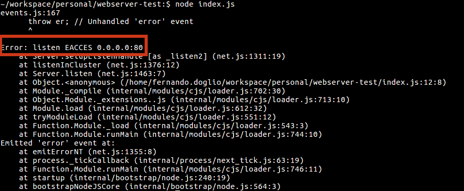

# Pro Node.js 技巧

> 原文：<https://blog.logrocket.com/pro-node-js-tips-378a1f86a896/>

从一门新的编程语言开始可能是一项艰巨的任务。以 Node.js 为例，即使你来自前端后台，使用 JavaScript，也可能很难。

从 Node.js 开始，需要学习整个 npm 生态系统，习惯 JavaScript 的怪癖，了解并爱上异步逻辑。当你是新人时，这些都需要时间，如果你不小心的话，会让你离疯狂更近一步。

在本文中，我将向您提供一些“新手”技巧，以减轻 Node.js 的一些痛苦。

### 序列化 JavaScript 对象

让我们从一个简单但非常受欢迎的技巧开始:如何在 Node.js 中序列化 JavaScript 对象(或者换句话说，如何将 JSON 转换成可以通过网络发送给另一个进程的东西)。

基本上，序列化的意思是把一个实体变成你可以传输的东西。这主要适用于对象，因为它们可能很难在服务之间转移，对象具有非常特定的属性，如方法、继承的行为和到其他复杂对象的链接(仅举几个主要问题)。

幸运的是，JSON 元素消除了我刚才提到的大部分困难，因为它们是一种特殊的对象:

*   您不能将 JSON 对象相互关联，或者换句话说，JSON 中没有继承
*   JSON 规范在设计时就考虑到了数据传输，因此它非常适合序列化
*   JSON 的属性可以有任何值，除了“Function ”,所以默认情况下方法是不碍事的

同样重要的是要注意，JSON 只是一个标准，它不是 JavaScript 脚本的属性。你可能不得不用 C#之类的语言来处理这个问题(尽管它与 JavaScript 非常不同)。有一些库允许您使用几乎每一种主要语言的 JSON 文件，但是它们之间的主要区别是，现在您正在使用 Node.js(因此也是 JavaScript)，您不必将它们翻译成您的语言中的“适当结构”。在 Node.js 中，您可以简单地加载它并开始操作它。这是我最喜欢在 Node.js 中使用 JSON 文件的一点。

现在让我们看看 Node.js 中这些实体的序列化有哪些选项。

[](https://logrocket.com/signup/)

### 使用 JSON.stringify 来序列化对象

Node.js 将为您提供对 JSON 对象的访问。有了它，您可以轻松地解析和序列化您可能需要的任何 JSON。

本质上， *stringify* 方法将把你的对象(因为你在 JavaScript 中，一切都可以被认为是 JSON)转换成它的字符串版本。

但是有一个警告: *stringify* 将忽略一些属性，因为您试图将复杂的对象转换成一种语言不可知的格式(我知道 JSON 代表 JavaScript 对象表示法，但话说回来，它意味着可以在任何想要支持它的语言上工作，所以对您可以序列化到其中的内容有一些限制)。

具体来说， *stringify* 方法将忽略:

*   值为*未定义*的属性
*   以函数为值的属性(也称为方法)

下面是一个如何在代码中使用该方法的快速示例，请注意，我们不需要任何特殊的东西就可以使用它:

```
let testObj = {
  name: "Fernando",
  age: 35,
  speak: function() {
    console.log("Hello world!")
  },
  address: undefined
}
let serializedObj = JSON.stringify(testObj)
testObj.speak()
console.log(serializedObj)
console.log(typeof serializedObj)
```

通过执行上述代码，您将获得以下输出:

```
Hello world!
{“name”:”Fernando”,”age”:35}
string
```

换句话说，正如我提到的，两个属性由于它们的内容而被忽略，我添加了最后一行以向您显示序列化版本的实际类型是字符串，即使在将它写出到 stdout(标准输出/您的终端窗口)时看起来不像。

### 复杂物体的 toJSON 方法

如果你来自另一种更面向对象的语言，比如 JAVA 或者 C#(仅举两个例子)你现在就会错过 *toString* 方法。在这些语言中，每当您尝试序列化一个对象时都会调用该方法，并允许您自定义该操作产生的字符串。

就 JavaScript 而言，当您使用 *stringify* 方法时，您可以使用特殊的 *toJSON* 方法来定制对象的 JSON 表示。只要记住，如果你定义了那个方法，你必须返回一些东西，否则，序列化你的对象的输出将是*未定义的。*

让我们看另一个例子:

```
let testObj = {
  name: "Fernando",
  age: 35,
  speak: function() {
    console.log("Hello world!")
  },
  toJSON: function() {
    console.log("toJSON called")
  },
  address: undefined
}
let testObj2 = {
  name: "Fernando",
  age: 35,
  speak: function() {
    console.log("Hello world!")
  },
  toJSON: function() {
    console.log("toJSON called")
    return '{ "name": "' + this.name + '", "age": ' + this.age + ' }'
  },
  address: undefined
}
let serializedObj = JSON.stringify(testObj)
let serializedObj2 = JSON.stringify(testObj2)
testObj.speak()
console.log(serializedObj)
console.log(typeof serializedObj)
console.log(" - - - - - - - - - - - - - ")
console.log(serializedObj2)
console.log(typeof serializedObj2)
```

现在，当您执行这段代码时，您会得到以下输出:

```
toJSON called
toJSON called
Hello world!
undefined
undefined
— — — — — — — — — — — — —
“{ ”name”: ”Fernando”, ”age”: 35 }”
string
```

注意那两行*未定义的*行——它们指的是第一个对象，这个对象的 *toJSON* 方法被定义了，但是没有返回值。不过，最后两行表示序列化过程的输出。我想在这里强调的最后一点是，这一次，我们必须手动忽略方法和未定义的属性。但是，如果我们想要显示它们，我们需要在 JSON 标准中为它们找到一个正确有效的映射。

### 高级模块(以防你需要额外的果汁)

对于您通常的 JSON 序列化需求， *stringify* 方法应该足够了。然而，在一些不常见的情况下，这不是真的。我想到的两个特定场景是:希望足够安全地序列化方法以便反序列化它们，以及在目的地使用它们。另一个古老的 *stringify* 方法不起作用的例子是当你处理 JSON 中的大量数据时(我指的是 Gb 大小的 JSON)。

您可能会遇到上述两种解决方案都不起作用的其他情况，这只是在您的流程中添加正确的逻辑或为其找到正确的模块的问题(如果问题足够常见，可能已经有一个 npm 模块来处理它)。

如果你想实现方法序列化，你可能想看看 [*节点序列化*](https://www.npmjs.com/package/node-serialize) ，它让你很容易做到这一点。然而，请注意，通过网络发送要在目的地执行的代码是一个很大的安全风险，因为攻击者可以[提供自执行功能](https://github.com/luin/serialize/issues/4)，并导致恶意代码的意外执行。

让我向您展示如何使用这个模块来序列化和执行一个方法:

```
const serialize = require("node-serialize")
var obj = {
  name: 'Bob',
  say: function() {
    return 'hi ' + this.name; 
  }
};

var objS = serialize.serialize(obj);
console.log(typeof objS === 'string');
console.log(objS)
console.log(serialize.unserialize(objS).say() === 'hi Bob')
```

这样的输出应该是:

```
true
{“name”:”Bob”,”say”:”_$$ND_FUNC$$_function() {n return ‘hi ‘ + this.name;n }”}
true
```

剧本写的三行告诉我们三件事:

1.  事实上，我们将对象序列化为字符串
2.  此函数的序列化方式。基本上，它被翻译成一个字符串，稍后 *eval* 可以对其求值并转换成正确的语句集。这是安全问题的主要原因( *eval* 并不真正安全)
3.  当然，除了调用 *unserialize* 之外，您不需要做任何特殊的事情来执行序列化方法

最后，如果你正在处理的是一个非常大的 JSON，你不能仅仅用 *JSON.stringify，*来解析或序列化，那么你可能想看看 [JSONStream](https://www.npmjs.com/package/JSONStream) 模块。

有了这个，您可以使用流来处理序列化过程，也就是说，您可以打开一个流并逐渐向其中写入项目。因此，它不是将千兆字节大小的内存结构转换成一个巨大的字符串(这可能需要太多的内存，会压垮您的脚本)，而是允许您逐项写入一个文件(当然是字符串格式)。

下面是一个如何使用这个库和流机制的基本示例:

```
var fileSystem = require( "fs" );
var JSONStream = require( "JSONStream" );
var books = [
  {name: "The Philosopher's Stone", year: 1997},
  {name: "The Chamber of Secrets", year: 1998},
  {name: "The Prisoner of Azkaban", year: 1999},
  {name: "The Goblet of Fire", year:2000},
  {name: "The Order of the Phoenix", year:2003},
  {name: "The Half-Blood Prince", year:2005},
  {name: "The Deathly Hallows", year:2007}
];

var transformStream = JSONStream.stringify();
var outputStream = fileSystem.createWriteStream( __dirname + "/hpdata.json" );

transformStream.pipe( outputStream );

books.forEach( transformStream.write );
  transformStream.end();
  outputStream.on(
    "finish",
    function handleFinish() {
      console.log( "JSONStream serialization complete!" );
    }
  );
 outputStream.on(
  "finish",
  function handleFinish() {
    var transformStream = JSONStream.parse( "*" );
    var inputStream = fileSystem.createReadStream( __dirname + "/data.json" );
    inputStream
      .pipe( transformStream )
      .on(
        "data",
        function handleRecord( data ) {
          console.log( "Record (event):" , data );
        }
        )
      .on(
        "end",
        function handleEnd() {
          console.log( "JSONStream parsing complete!" );
        }
      );
   }
);
```

实际的编写只需要一行(*books . foreach(transform stream . write)；*)，剩下的只是流设置和事件配置。

该脚本的输出如下:

```
JSONStream serialization complete!
Record (event): { name: ‘The Philosopher’s Stone’, year: 1997 }
Record (event): { name: ‘The Chamber of Secrets’, year: 1998 }
Record (event): { name: ‘The Prisoner of Azkaban’, year: 1999 }
Record (event): { name: ‘The Goblet of Fire’, year: 2000 }
Record (event): { name: ‘The Order of the Phoenix’, year: 2003 }
Record (event): { name: ‘The Half-Blood Prince’, year: 2005 }
Record (event): { name: ‘The Deathly Hallows’, year: 2007 }
JSONStream parsing complete!
```

最终，处理这些任务的方式取决于您，这些模块只是隐藏了 Node.js 提供的本机工具，如果您想避免依赖第三方库，您最终可以自己使用这些工具。

### 读取 Node.js 脚本的命令行参数

由于 Node.js 提供了无数的好处，它往往被认为是一种专门用于开发微服务的语言。但是需要注意的是，每次执行代码时，您只是从终端运行一个脚本。好吧，要么是你，要么是你设置的自动化过程，但是无论哪种情况，无论你键入什么来执行它，最终都会有东西运行这样的命令:

```
$ node yourscript.js
```

就是这么简单，当发生这种情况时，您脚本能够接收参数，就像任何其他命令行工具一样(见鬼，就像 *node* 命令，它接收您脚本的文件名作为参数)。

* * *

### 更多来自 LogRocket 的精彩文章:

* * *

这不仅仅与你开发命令行工具有关，你可以在启动一组微服务的主脚本上接受命令行参数，或者仅仅是你的主 API 文件。您在 Node 中做的任何事情都可以从中受益，您可以接收配置覆盖，甚至根据您接收到的属性有不同的行为。

最棒的是，读取这些参数非常简单，这里有一个快速示例代码可以说明这一点:

```
process.argv.forEach( (val, index) => {
  console.log(index + ': ' + val);
});
```

就是这样！将它复制到您的测试文件中并执行它。这里有一个例子:

```
$ node cliparams.js test test2 test 3
```

它的输出是:

```
0: /path/to/node.js/bin/node
1: /path/to/your/script/cliparams.js
2: test
3: test2
4: test
5: 3
```

请注意我们是如何向脚本传递三(3)个参数的，但是我们看到的是五(5)个参数。这是因为第一个参数是正在执行的解释器(在本例中是我的节点解释器)，第二个参数是正在执行的脚本的完整路径，从这里开始，您将看到您传递的实际参数。

这是标准行为，因此您可以再添加一行来规范化列表并删除(通常)不必要的参数:

```
let args = process.argv.slice(2);
args.forEach( (val, index) => {
  console.log(index + ': ' + val);
});
```

输出如下:

```
1: test
2: test2
3: test
4: 3
```

此外，请注意，很明显，但默认情况下，空格字符是用于理解参数何时开始和何时结束的分隔符。如果我们希望我们的值也有空格，那么您只需用双引号将值括起来，就像这样:

```
$ node cliparams.js “test test2 test 3”
```

现在，同一个脚本的输出将是:

```
0: /path/to/your/bin/node
1: /path/to/your/script/cliparams.js
2: test test2 test 3
```

如您所见，在您的脚本中捕获 CLI 参数非常容易，并且是一个非常强大的工具，可以添加到您的工具箱中。

### 查找当前脚本的文件路径

这是一个快速的方法，但是非常有趣和有用。通常，脚本语言为开发人员提供了一些捕捉当前执行脚本路径的方法。在处理相对路径时，它可以派上用场，因为根据您试图实现的目标，开发环境中的条件可能不一样，比如生产环境。这可能会导致真正的问题。因此，你应该使用一个完整的有效路径，从那里开始，移动到你想去的任何地方。

通过这一步，你可以确保你确切地知道你站在哪里，然后从那里，你可以移动到你可能需要移动的任何地方。

获取该信息有两种方法，要么获取完整路径，包括脚本的文件名，要么只获取文件所在文件夹的路径，而不获取文件名。

获取这些信息的方法是使用名为 *__dirname* 和 *__filename，*的全局变量，其中第一个变量包含文件夹的路径，第二个变量，正如您可能已经猜到的，也包含使用它的脚本的实际文件名。

这些只是全局变量，所以为了使用它们，你只需要这样做:

```
console.log(__dirname)
console.log(__filename)
```

注意这些变量可以被你修改，所以确保你不要修改，否则，你会失去引用。此外，这些变量在节点的 REPL 中是不可访问的，所以如果您试图使用 REPL 来验证这一点，您将无法做到。

### 迭代一个对象的属性，就像你迭代数组元素一样

这是我过去不得不查找几次的东西，因为我倾向于使用 JavaScript 中的对象作为地图(这来自于我们在语言中访问实际地图之前)。能够做这样的事情有点令人沮丧:

```
yourArray.forEach( iteratorFn )
```

但不是，像这样:

```
yourMap.forEach( iteratorFn )
```

或者甚至:

```
yourMap.keys().forEach( iteratorFn )
```

这是因为变量 yourMap 实际上包含了一个 JSON，就是这样。所以，在这里唱反调一下，没有方法可以解决我们的问题是有道理的。

然而，有几个快速的解决方法:被形象地称为“object”的全局对象给我们提供了对 *keys* 方法的访问，该方法实际上做了我们想要做的事情，它返回了我们的对象的属性列表。我们还可以使用 for 循环的变体，它可以根据我们的需要迭代对象的属性。

下面是一个简单的代码示例来说明我的意思:

```
class Obj {
  constructor() {
    this.a = 1
    this.b = 1
    this.c = 1
  }
  method(st){
  }
}

let obj = new Obj()

for(m in obj) {
  console.log(m)
}
console.log(Object.keys(obj))
```

输出如下:

```
a
b
c
[ ‘a’, ‘b’, ‘c’ ]
```

请注意这两个选项都忽略了方法名，但是如果我们将对象定义为一个简单的 JSON，如下所示:

```
let obj = { 
  a: 1,
  b: 2,
  test: function() { return 0}
}
for(m in obj) {
  console.log(m)
}
console.log(Object.keys(obj)) 
```

这一次的输出是:

```
a
b
c
test
[ ‘a’, ‘b’, ‘c’, ‘test’ ]
```

这一次，方法被返回，这可能是也可能不是您正在寻找的。因此，在使用之前，一定要检查属性内容的类型。我的意思是，做这样的事情:

```
or(m in obj) {
console.log(typeof obj[m]) //should print number, number, function
}
```

### 将 Nginx 设置为 Node.js 服务器的反向代理

假设使用 Node.js，您通常会构建自己的 web 服务器，而不是使用已经构建好的服务器(就像您使用 PHP 或 JAVA 一样)。在将 web 应用程序部署到远程服务器时，尤其是在生产环境中部署时，可能会有一些限制。

具体来说，web 服务器需要侦听特定的端口，以便接收标准的 web 流量，例如 80 代表正常的 HTTP 流量，443 代表安全流量(即 HTTPS)。问题？如果你的用户没有足够的权限，你不能简单地启动一个监听这些端口的程序。

这里有一个简单的例子来说明我的意思，如果您试图在没有足够权限的情况下运行它，下面的代码将会出错(通常，除非您是系统的 root 或管理员，否则您将不能这样做)。

下面是我在 Linux 机器上得到的错误(Windows 可能会抛出一个稍微不同的错误，但要点应该是相同的):



为了解决这个问题，您通常希望设置另一个 web 服务器，或者特别是一个反向代理，它将处理传入的流量，并在内部将其重定向到您的应用程序的端口。实际上，您仍然会在一个非标准的端口上监听，但是外界永远不会知道。

由于 Nginx 使用异步 I/O 来处理请求，因此作为 web 服务器，甚至作为反向代理，nginx 都是一个很好的选择。它允许在不增加资源消耗的情况下扩展到数万个请求(不像其他服务器，比如 Apache WebServer，它为每个新请求生成一个新进程)。

对于这篇特别的文章，我不会讨论如何安装 Nginx 本身，如果你也在研究这个问题，你可能想看看其他文章，然后再回到这里。

至于实际的配置，您只需要编辑位于*/etc/nginx/conf . d/sysmon . conf*的配置文件，并添加以下代码:

```
server {
listen 80;
server_name www.example.com;
location / {
proxy_set_header X-Forwarded-For $remote_addr;
proxy_set_header Host $http_host;
proxy_pass http://127.0.0.1:5000;
}
}
```

之后，您只需重启服务器，就大功告成了。上述代码所做的基本上是确保 web 服务器在端口 80 上监听，接收对 www.example.com 上的 URL 的请求，无论它接收到什么，它都重定向到您在 T2 的 proxy_pass 属性上配置的 IP，这基本上应该是您启动 Node.js 服务器的 IP 和端口。

一个快速提示，如果您想用一个假的 URL(比如[www.example.com](http://www.example.com))来测试这个，您可以将下面一行添加到您的 */etc/hosts* 文件中:

```
127.0.0.1 www.example.com
```

当该行保留在文件中时，当使用该 URL 时，您将总是被重定向到您的本地主机。

### 遍历异步函数列表并返回结果(不使用额外的库)

当处理异步代码时，您可能会试图寻找一些外部库来帮助您减轻必须跟踪它们的行为的痛苦。如果你的代码严重依赖它们，没人会责怪你。但是，如果您只是在这里或那里添加一些调用，那么添加整个库及其对几行代码的依赖可能会被认为是多余的。

一个特殊的情况是处理一组需要在循环中执行的异步调用。用一个简单的 *for* 循环，如何收集所有这些调用的输出并确保代码的正确执行呢？这种结构并不意味着处理异步调用(考虑到 Node.js 当时的主要卖点实际上是对异步 I/O 的支持，这是一种讽刺)。

这实际上并不难，真的，你只需要看看其他人添加的语法糖，如 [Async.js](https://github.com/caolan/async) 并考虑异步调用是如何工作的。

本质上，您要做的是构建一个函数，它将充当循环的*，接收要进行的调用列表，并在所有事情都完成后执行一个回调函数(或者最终，一旦其中一个出错)。*

例如，下面的代码会解决这个问题:

```
function asyncLoop(list, callback) {
    let results = []
    list.forEach( fn => {
      fn( (err, result) => {
      if(err) return callback(err)  
    results.push(result)
  if(results.length == list.length) { 
      callback(null, results)
  }     
  })
})  
}
```

当第一个异步调用返回错误时，我们的 *asyncLoop* 函数也会这样做。否则，它会收集所有的结果，直到所有的调用都结束。一旦发生这种情况，我们调用最后的回调来继续逻辑流。

您可以使用上面的代码，如下所示:

```
const req = require("request")
let calls = [
function (cb) {
  req.get('http://www.google.com', cb)
},
function (cb) {
  req.get('http://www.yahoo.com', cb)
},
function (cb) {
  req.get('http://www.msdn.com', cb)
}
]

asyncLoop(calls, (err, results) => {
  if(err) { 
    return console.log("There was a problem executing one of the calls: ", err)
  }
  console.log("There are ", results.length, "sets of results")
})
```

基本上，您循环通过三个不同的 HTTP 调用并收集它们的结果，而不必为此使用任何外部库(除了用 *request* 来简化请求代码)。

### 类固醇控制台

我想介绍的最后一个技巧很简单，但是非常方便，尤其是在调试或者将错误信息记录到日志文件中的时候。

*控制台*对象可能是 Node.js 中最常用的对象之一(如果不是最常用的),因为它非常简单和有用，但是我们，尤其是刚开始使用这种语言时，倾向于只使用*日志*方法，这很好，但是有太多很少用到的东西，让我解释一下。

### 标准输出和误差

通常，您的终端有两个不同的流可以写入。你，作为一个用户，将会看到两者都写在你的屏幕上，但是使用正确的命令行魔术，你可以重定向到任何你想要的地方。但是你如何选择给他们中的任何一个写信呢？

*log* 方法写入 **stdout，**和 *error* 方法是您将用来写入 **stderr** (或者标准错误，如果您愿意的话)的方法。

```
console.error("Test error")
```

```
console.log("Test standard out")
```

如果执行该代码，它将只在屏幕上打印两个字符串，彼此没有区别，但是如果您像这样执行脚本:

```
$ node script.js 1> out.log 2> err.log
```

现在，那是一个不同的故事，现在你把每个流的输出重定向到一个不同的文件。

### 打印堆栈跟踪

记录日志时要做的另一件有用的事情是打印堆栈跟踪，这将让您了解错误发生时发生了什么。在其他语言中，这样做非常简单。在 Node.js 中也很简单，只是不是每个人都知道。

```
function triggerTrace() {
   console.trace(“Error log”)
}
triggerTrace()
```

通过执行这段代码，您将得到类似如下的输出:

```
Trace: Error log
at triggerTrace (/path/to/your/project/node-tips/console-tips.js:7:10)
at Object.<anonymous> (/path/to/your/project/node-tips/console-tips.js:10:1)
at Module._compile (internal/modules/cjs/loader.js:702:30)
at Object.Module._extensions..js (internal/modules/cjs/loader.js:713:10)
at Module.load (internal/modules/cjs/loader.js:612:32)
at tryModuleLoad (internal/modules/cjs/loader.js:551:12)
at Function.Module._load (internal/modules/cjs/loader.js:543:3)
at Function.Module.runMain (internal/modules/cjs/loader.js:744:10)
at startup (internal/bootstrap/node.js:240:19)
at bootstrapNodeJSCore (internal/bootstrap/node.js:564:3)
```

请注意，您是如何获得触发跟踪的函数名、行号和文件名的。你不会用一个简单的 *console.log.* 得到这个

### 记录函数调用花费的时间

这在分析您自己的代码时非常有用。如果您想了解一个函数调用(或者任何一段代码)需要多长时间，您通常会这样做:

```
let start = (new Date()).getTime()
setTimeout(function() {
  let end = (new Date()).getTime()  
  console.log(end - start )
}, 1000)
```

这样，您将看到类似 1002 的输出(顺便注意，这也证明了当超时过期时，setTimeout 并不执行代码 ***确切地说是*** )，而是试图尽快执行)。

现在，代替这样做，你也可以使用*控制台*对象来创建一个定时器，而不必担心变量、减法或任何其他你可能想要/需要添加的额外代码。

就像这样:

```
console.time("timer")
setTimeout(function() {
  console.timeEnd("timer")
}, 1000)
```

您可以看到我们是如何做同样的事情的，但是代码更少(也更干净)。事实上，您可以使用其他名称，并保持几个计时器同时工作。

额外的好处是，在这种情况下，输出的格式更好:

```
timer: 1002.814ms
```

### 结论

这就是 Node.js 新手的一组技巧，我希望它们有用，即使你不是技术新手，你也能学到一些东西。

如果你有任何我遗漏的建议，想分享或随意扩展我添加的建议，请在下面留下你的评论。

直到下一个！

## 200 只显示器出现故障，生产中网络请求缓慢

部署基于节点的 web 应用程序或网站是容易的部分。确保您的节点实例继续为您的应用程序提供资源是事情变得更加困难的地方。如果您对确保对后端或第三方服务的请求成功感兴趣，

[try LogRocket](https://lp.logrocket.com/blg/node-signup)

.

[](https://lp.logrocket.com/blg/node-signup)[https://logrocket.com/signup/](https://lp.logrocket.com/blg/node-signup)

LogRocket 就像是网络和移动应用程序的 DVR，记录下用户与你的应用程序交互时发生的一切。您可以汇总并报告有问题的网络请求，以快速了解根本原因，而不是猜测问题发生的原因。

LogRocket 检测您的应用程序以记录基线性能计时，如页面加载时间、到达第一个字节的时间、慢速网络请求，还记录 Redux、NgRx 和 Vuex 操作/状态。

[Start monitoring for free](https://lp.logrocket.com/blg/node-signup)

.