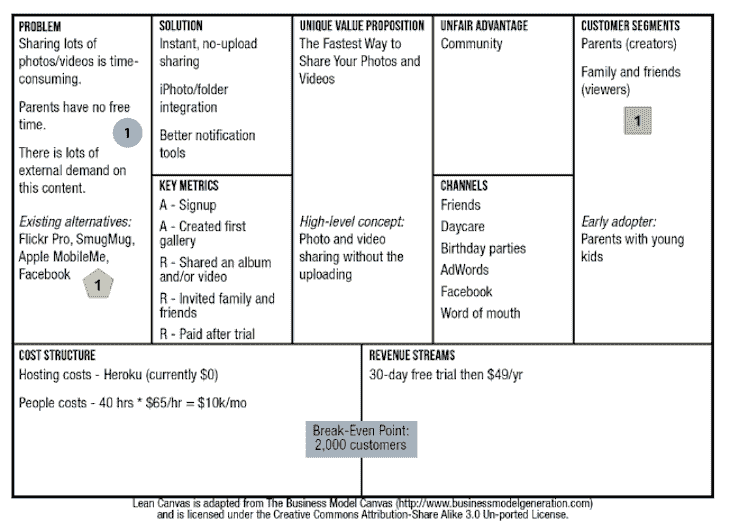

# 产品画布:如何在 9 个步骤中构建一个(有例子)

> 原文：<https://blog.logrocket.com/product-management/product-canvas-how-to-build-9-steps-examples/>

产品失败的最常见原因是因为关注的焦点是产品中使用的技术，而不是它所解决的问题。

为了避免落入这个陷阱，你需要确保你清楚产品的范围和实际应用。一旦你明白做什么和怎么做，剩下的过程就变得容易了。

产品画布可以帮助你做到这一点。

* * *

## 目录

* * *

## 什么是产品画布？

产品画布是一个设计用来构建产品和生成功能开发的框架。它遵循[精益](https://blog.logrocket.com/product-management/what-is-lean-product-management-how-to-apply/)和[敏捷](https://blog.logrocket.com/product-management/12-agile-manifesto-principles-how-to-adopt-them/)方法论的原则。它的主要目的是在一个文档中呈现产品的完整视图，然后可以用来创建[产品路线图](https://blog.logrocket.com/product-management/how-to-build-product-roadmap-overview-examples/)。

产品画布主要有九个区块，每个区块专注于产品规划和开发的特定部分。当放在一起时，产品画布提供了产品愿景和范围的 360 度视图。

## 产品画布是用来做什么的？

使用产品画布是确保技术团队和业务团队在产品上保持一致，并对您要构建的内容有共同理解的好方法。

有了产品画布，团队可以绘制出产品的从头到尾的[生命周期，](https://blog.logrocket.com/product-management/product-managers-role-each-product-lifecycle-stage/)通常包括问题、解决方案、目标客户和 KPI 等内容，以便在单一视图中衡量成功。

通常，团队由于在开发方面做得过多而无法专注于产品的业务目标，从而导致产品的失败。产品画布可以帮助团队确定他们的产品所增加的战略价值，以及衡量产品所产生的影响的[性能指标](https://blog.logrocket.com/product-management/what-product-management-metrics-matter-most-to-pms/)。这一点至关重要，因为不理解这些可能会导致[产品开发周期](https://blog.logrocket.com/product-management/what-is-product-development-lifecycle-stages-examples/)中的问题。

下面是 CloudFire(一个面向父母的媒体共享平台)的产品画布的示例:

[O’Reilly Library](https://learning.oreilly.com/library/view/running-lean-2nd/9781449321529/ch07.html#formulate_falsifiable_hypotheses)

## 如何构建产品画布

构建产品画布涉及以下步骤和注意事项:

1.  [从问题开始](#begin-with-the-problem)
2.  [思考解决方案](#think-about-the-solution)
3.  您的解决方案有何独特之处？
4.  你的客户群是什么？
5.  你接触客户的渠道是什么？
6.  [成本结构](#cost-structure)
7.  [收入流](#revenue-streams)
8.  [衡量成功的关键指标](#key-metrics-to-measure-success)
9.  你的不公平优势是什么？

### 1.从问题开始

作为产品经理，你的主要任务之一是引导[产品发现](https://blog.logrocket.com/product-management/dual-track-agile-continuous-discovery/)去发现产品最重要的部分——它所解决的问题。如果做得不好，很有可能你会为一个错误的问题创建一个解决方案，或者更糟的是，为一个根本不存在的问题创建一个解决方案。

拥有一个清晰的、定义明确的问题可以防止团队偏离，并使其能够找到一个清晰的解决方案。

填补“问题”块的一个好方法是问几个关键问题:

*   你想解决的问题是什么？
*   为什么会有问题？
*   谁面临这个问题？
*   处理这个问题的现有替代方案是什么？

看到这四个问题如何能够理清问题的这么多东西，是非常令人惊讶的。虽然这些是一个很好的起点，但接下来还会有更多。用户的回答阐明了接下来要问哪些问题。确保记录下受访者给出的答案，并清楚地强调每个答案的含义。

### 2.思考解决方案

当考虑解决方案时，填满画布的最有效方法是考虑解决问题的最简单方法。

很容易陷入专注于花哨的术语和方法的陷阱，如深度学习、神经网络、大数据、AI 等。，但要记住精益方法论的原则:“快速测试，快速失败，快速调整。”因此，从最客观的解决方案开始，并以此为基础。

这里要问的关键问题是:

*   我们要构建什么样的解决方案？
*   我们期望解决方案做什么？
*   我们解决方案的输入和输出是什么？

### 3.您的解决方案有何独特之处？

在填补这一空白时，考虑一下使您的解决方案优于市场上现有解决方案的[差异化因素](https://blog.logrocket.com/product-management/what-is-product-differentiation-definition-strategies-examples/)。这可能是构建解决方案的方式、解决方案背后的算法、解决方案的输出格式等。

这里要问的关键问题是:

*   为什么客户会购买我们的产品而不是其他产品？
*   我们的解决方案是否更快/更安全/更高效/更安全/更方便？
*   有没有帮助客户省下什么？(时间、金钱、努力等。)

### 4.你的客户群是什么？

您正在构建的解决方案可能由两种不同的客户使用，他们有两种完全不同的应用程序。重要的是要识别这些不同的客户群，并决定产品针对哪个客户群。

专注于单个客户细分可以更清楚地识别问题。此外，决定谁是你的[早期采用者](https://blog.logrocket.com/product-management/why-product-adoption-strategy-crucial-b2b-scenarios/#what-is-product-adoption)也很重要，这样你就可以在早期阶段相应地营销产品。

一个类似市场的平台是一个产品有两个客户群的很好的例子:一个买家和一个卖家。两者都使用相同的产品，但用于两种完全不同的目的。

### 5.你接触顾客的渠道是什么？

任何产品要取得成功，都需要被客户使用。为了把产品送到顾客手中，你必须决定接触他们的途径。

虽然任何产品的最初目标都是学习而不是扩展，但有一个将产品展示在用户面前的计划是很有帮助的。根据可用资源的不同，与客户的沟通渠道可以是免费的口碑传播，也可以是付费的 Google Adwords。

### 6.费用结构

当开始开发一个产品时，了解你将会产生的成本是有益的。这不一定要非常详细和准确，但一个大概的费用数字将有助于你计划预算，并相应地分配资源。

成本可能包括服务器成本、数据存储成本、人力资源成本等。一些有帮助的关键问题是:

*   建立第一个 MVP 要花多少钱？
*   我们的可变成本和固定成本是什么？
*   我们的持续燃烧率是多少？
*   前 12 个月的烧伤率是多少？

### 7.收入来源

当你有一个新的产品或服务时，获得顾客很可能是你的目标。最终你将不得不弄清楚你将如何从产品中赚钱，谁将是付费用户。

需要注意的是，并非所有用户都会付费，这意味着并非所有用户都会成为客户。此外，你不需要很多用户来支持一个产品早期阶段的发展——只要几个好客户就可以了！

### 8.衡量成功的关键指标

根据《的作者 Norm Brodsky 和 Bo Burlingham 的说法，衡量成功的关键指标的定义是“在你得到销售报告之前，实时告诉你你的业务做得如何的关键数字。”

每个产品或业务都有一些关键数字，可以帮助他们衡量他们的产品是否做得很好，客户是否喜欢它。这些数字对于确定产品进度和识别客户生命周期中的关键部分至关重要。

一些最常见的指标是客户获取率和成本、客户保持率、收入、利润、客户激活点和推荐率。

关键指标的概念本质上是回答以下重要问题:

*   用户是如何找到你的？
*   他们的第一次经历好吗？
*   他们第一次使用产品后会回来吗？
*   赚钱的途径有哪些？
*   谁是你的客户或向你付费的客户群？
*   用户会告诉其他潜在用户你的产品或服务吗？

### 9.你的不公平优势是什么？

这通常是最难填充的块。填写此栏时最常犯的错误是混淆产品的优势和特点。

* * *

订阅我们的产品管理简讯
将此类文章发送到您的收件箱

* * *

不公平优势是你获得的一种优势，它不容易被其他产品或竞争对手复制。不公平优势的一些例子有:

*   你的梦之队
*   全球事件
*   SEO 排名
*   社区
*   个人权威
*   产品的专利方面

最初开始时，可以将产品画布的这一部分留为空白，但这一部分的想法是让作为产品经理的你思考自己的不同之处，以及如何让它们发挥作用。

*精选图片来源:[icon scout](https://iconscout.com/icon/box-738)*

## [LogRocket](https://lp.logrocket.com/blg/pm-signup) 产生产品见解，从而导致有意义的行动

[LogRocket](https://lp.logrocket.com/blg/pm-signup) 确定用户体验中的摩擦点，以便您能够做出明智的产品和设计变更决策，从而实现您的目标。

使用 LogRocket，您可以[了解影响您产品的问题的范围](https://logrocket.com/for/analytics-for-web-applications)，并优先考虑需要做出的更改。LogRocket 简化了工作流程，允许工程和设计团队使用与您相同的[数据进行工作](https://logrocket.com/for/web-analytics-solutions)，消除了对需要做什么的困惑。

让你的团队步调一致——今天就试试 [LogRocket](https://lp.logrocket.com/blg/pm-signup) 。

[Advait Lad Follow](https://blog.logrocket.com/author/advaitlad/) Graduate Student @ UC Berkeley (Product Management) | Product enthusiast who loves to talk about features and workflows that drive people toward products.