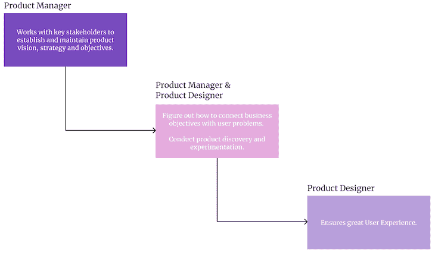
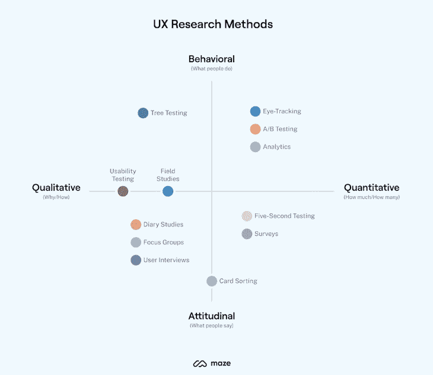
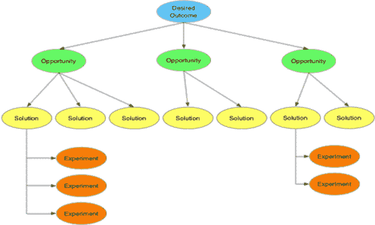
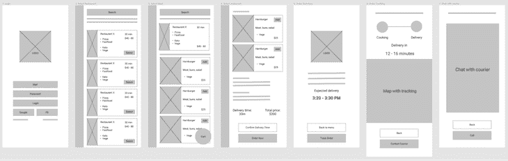
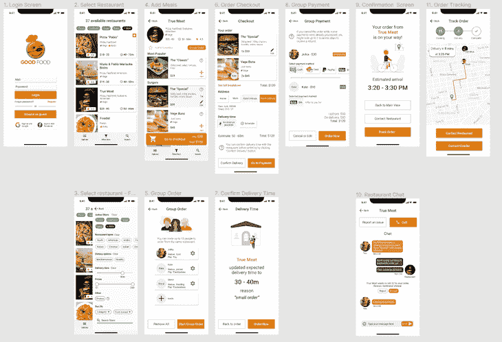
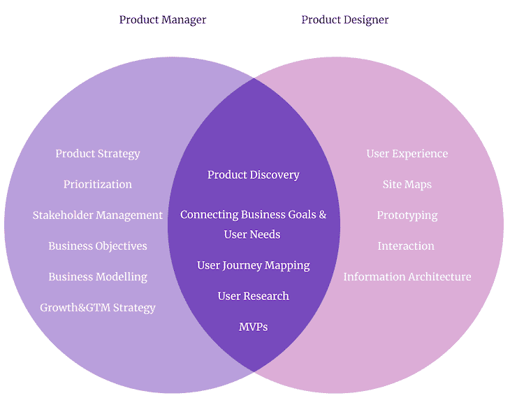

# 产品设计师(PD)与产品经理(PM):有什么区别？

> 原文：<https://blog.logrocket.com/product-management/product-designer-vs-product-manager/>

关于产品角色之间的区别有很多混淆——即[产品经理](https://blog.logrocket.com/product-management/what-does-a-product-manager-do-role-responsibilities/)、[产品负责人](https://blog.logrocket.com/product-management/product-manager-vs-product-owner/)、[产品营销经理](https://blog.logrocket.com/product-management/product-marketing-manager-job-description-role-skills/)和[项目经理](https://blog.logrocket.com/product-management/product-manager-vs-project-manager/)。

产品经理和产品设计师的区别也不例外。在本指南中，我们将看看这些角色如何适应[产品开发生命周期](https://blog.logrocket.com/product-management/what-is-product-development-lifecycle-stages-examples/)。

请记住，我所说的产品设计师是指一个真正面向产品的产品人员，而不仅仅是一个 UI 或 UX 设计师。理解 UI、UX 和产品设计之间的区别是另一篇文章的主题。

* * *

## 目录

* * *

## 产品开发生命周期:3 个阶段

为了更好地理解产品经理和产品设计师之间的区别，让我们回顾一下产品是如何制造的。我将把这个过程简化为三个阶段:

1.  **—建立高层次的产品愿景、战略和目标**
***   [**产品发现**](#product-discovery-product-designer-and-product-manager) —进行产品发现，将用户需求与目标相匹配*   [**产品体验**](#product-experience-product-designer) —打造人性化产品**

 **产品经理在第一步中起主导作用，建立愿景和战略。这两个角色对产品发现的贡献或多或少是平等的，当涉及到构建一个可用的、用户友好的产品时，产品设计师会大放异彩:

让我们更深入地看看产品经理和设计师是如何对每一步做出贡献的。

## 产品战略(产品经理)

产品战略是产品经理的主要职责。产品经理必须全面了解:

*   产品愿景及其与公司使命的契合度
*   实现产品愿景的高级战略
*   有助于产品战略的具体产品目标

产品战略是产品开发的核心。各种活动有助于形成产品战略，例如:

### 市场调查

产品经理花很多时间做市场调研。

首先，项目经理必须了解目标受众及其痛苦和问题。这样做使您能够建立一个不仅与业务相关而且与用户相关的策略。

这也包括竞争分析。好的产品战略考虑到竞争格局和[差异化战略](https://blog.logrocket.com/product-management/what-is-product-differentiation-definition-strategies-examples/)。

理解趋势、市场规则和经济学也是市场研究的一部分。

### 业务规划

我们制造产品来推动业务成果。一个好的产品策略反映了这一点。

这就是为什么产品经理花大量时间与内部业务利益相关者在一起——例如，来自市场、销售、财务等。

毕竟，产品必须符合公司的商业模式。它利用公司可以提供的资源，利用其分销渠道和关系，在大多数情况下，为公司提供收入。你不能简单地把产品和商业模式分开。

一天结束时，产品经理要对积极影响业务负责——而不是负责[生产数百个功能](https://blog.logrocket.com/product-management/what-is-feature-creep-how-to-avoid/)。

### 组织调整

较大的组织有[多种产品](https://blog.logrocket.com/product-management/what-is-product-portfolio-management/)。这导致依赖性、同类相食和对公司资源的竞争。

项目经理必须共同努力，确保产品协调一致并相互支持。如果没有这种一致性，公司将被拉向许多不同的方向。

在健康的组织中，整个产品团队都参与战略规划。产品设计师也可能在这里发挥作用。然而，在建立、维护和沟通[产品方向](https://blog.logrocket.com/product-management/build-consensus-product-direction-5-tips/)时，产品经理拥有最终决定权。

## 产品发现(产品设计师和产品经理)

[产品发现](https://blog.logrocket.com/product-management/dual-track-agile-continuous-discovery/)意味着寻找机会将用户问题与商业目标联系起来。在这个阶段，您需要决定用什么解决方案来解决什么问题。

在某种程度上，产品发现是产品成型的一个阶段。

因为产品发现是关于连接战略目标和用户需求，它需要产品和设计之间强有力的协作。

其中，产品阶段包括:

### 发现用户需求

产品经理和产品设计师都采用各种技术来了解他们的用户:

Source: [Maze](https://maze.co/guides/ux-research/ux-research-methods/)

项目经理和项目开发人员可以合作或分开，专注于个人研究活动。最后，为了构建一个可行的、可行的、令人满意的产品，他们都必须对最终用户有很强的理解，包括他们的痛点、需求和他们使用产品的环境。

### 映射机会

有了清晰的产品策略和关于最终用户的信息，是时候定义产品本身了。

连接用户需求和业务成果的方式总是不止一种。我们通常称这些交叉点为“机会”

[机会解决方案树(OST)](https://blog.logrocket.com/product-management/dual-track-agile-continuous-discovery/#what-is-continuous-discovery) 是帮助可视化这些机会的技术之一:

Source: [Product Frameworks](https://www.product-frameworks.com/Opportunity-Solution-Tree.html)

产品经理的商业敏锐性、产品设计师的 UX 专业知识以及用户对这两者的集体理解，对于区分好机会和坏机会、选择适当的解决方案以及计划合理的实验都是至关重要的。

这可能是构建产品最关键的部分之一；这是你做基本决定的地方，比如解决什么问题，构建什么解决方案。它通常涉及多个人(一个人很少具备足够的知识和专业技能来独自完成这个过程)，产品经理和产品设计师都是这个连续过程的关键驱动者。

### 定义 MVP

您已经选择了想要关注的机会，并定义了想要发布的实验和解决方案，以利用这些机会。现在是时候详细说明最终解决方案的本质细节了。

定义一个 MVP 是一个棘手的过程。一方面，你希望它越小越好。另一方面，太初级的 MVP 不会帮助你验证你的假设，甚至可能使你的客户疏远这个品牌。

在这个阶段，你需要一个产品经理和一个产品设计师，因为你需要商业和 UX 的专业知识。

通过不断地问自己，试着让你的 MVP 尽可能的小:

*   删除 X 会对我们的业务产生负面影响吗？
*   移除 X 会对我们的用户产生负面影响吗？
*   删除 X 会对我们的目标产生负面影响吗？

坚持下去，直到你定义了一个小而可行的 MVP。

* * *

订阅我们的产品管理简讯
将此类文章发送到您的收件箱

* * *

具体如何划分工作取决于特定的环境。有时候，产品经理和产品设计紧密合作；其他时候，他们执行稍微独立的活动，并经常结盟。

在不同的组织中，不同的人可能负责不同的发现元素。有一点是不变的:你需要两顶帽子来发现健康的产品。

## 产品体验(产品设计师)

在建立了产品策略并发现了遵循它的最佳方式之后，是时候生产实际的产品了。

然而，在团队开始编码之前，他们需要知道具体要编码什么。这就是产品设计师发挥作用的地方。

构建一个伟大的[产品体验](https://blog.logrocket.com/product-management/what-is-product-experience-examples-how-to-improve-px/)不仅仅是在 Figma 中模仿一些好看的图形。在一个设计良好的产品中，一切都是有意的，从按钮的颜色和位置到页面结构。

产品设计师活动的确切范围取决于公司的设计结构。有时候，一个产品设计师也是一个全栈 UI/UX 设计师。一些公司区分产品设计师和交互设计师。更成熟的团队甚至可能有独立的信息架构师、UX 研究员等。

概括地说，活动范围包括:

### 线框和实体模型

产品设计师利用他们的用户体验和可用性专业知识来设计应用程序计划。他们给出在哪里放置信息、按钮等的指示。

屏幕结构的微小变化可能会对产品的整体感觉和易用性产生巨大影响，产品设计师完全知道应该注意什么:

产品设计师也意识到各种心理影响和偏见。他们以一种道德上利用这些现象的方式来规划产品。

根据团队的不同，有时产品设计师会给出一个粗糙的黑白线框图。其他时候，他们提供一个成熟的、可实现的用户界面:

### 信息架构规划

大多数产品包含大量的信息。考虑一个典型的电子商务站点，它可能包含各种信息，如:

*   制品
*   类别和子类别
*   促销
*   产品评论
*   卖家评论
*   传递选项
*   支付选项
*   证明书
*   联系方式
*   退货政策
*   担保信息
*   条件
*   账户信息
*   过去的订单
*   当前订单
*   通知

…这可能只是冰山一角。

我们如何能够无缝地浏览这些网站而不会不知所措？

这是因为一个产品设计师花费了无数个不眠之夜来研究、计划、测试和迭代各种方法来将这些信息连接成一个有凝聚力的整体。这被称为信息架构:

Source: [Envato Tuts](https://webdesign.tutsplus.com/tutorials/what-is-information-architecture-ux-tips-and-examples--cms-40064)

您可以将信息架构视为站点或应用程序的分层地图。根据研究，它将相似的类别分组，同时将不太相关的信息隐藏在容易找到的部分下。信息架构帮助最终用户直观地找到他们正在寻找的东西。

如果没有信息架构，在一个给定的网站上找到你需要的信息将会花费你更多的时间。更实际的是，在几次搜索失败后，你会把键盘扔出窗外。

### 可用性测试

可用性衡量用户使用产品实现目标的难易程度。

高度可用的产品感觉就像是轻而易举的事情:你没有任何摩擦或问题就获得了想要的结果。另一方面，一个有可用性问题的产品是不直观的，错误百出的，并且使用起来不愉快。

为了构建一个高度可用的产品，在头脑中怀着最好的意图构建第一个版本，然后与用户一起测试并迭代。虽然有通用的最佳实践，但不同的产品在不同的环境中面向不同的用户，因此需要不同的解决方案。快速实验是实现高可用性的唯一途径。

Source: [Usability Geek](https://usabilitygeek.com/remote-usability-testing-best-practices/)

产品设计师通常是与最终用户一起计划、实施和分析测试的人。他们专注于使最终产品尽可能无摩擦。

## 产品经理与产品设计师:主要区别

产品经理和设计师紧密合作来交付优秀的产品，没有其中一个就交付一个产品是很有挑战性的。

尽管职责和责任的确切组合各不相同，但总的来说，产品经理更关注产品战略，而产品设计师则主要关注用户体验。

这两个角色在产品发现过程中都扮演着重要的角色；您需要从两个角度来正确塑造产品方向:

说到底，谁做什么没多大关系；产品经理和产品设计师是跨学科产品团队的一部分。

PMs 和 PDs 有着相同的目标:发布一个连接用户问题和商业目标的出色产品。具体来说，他们如何做到这一点是次要的。毕竟这就是[自组织](https://blog.logrocket.com/product-management/four-agile-manifesto-values-explained/#individuals-and-interactions-over-processes-and-tools)的意义所在。

*精选图片来源:[icon scout](https://iconscout.com/icon/people-network-2863988)*

## [LogRocket](https://lp.logrocket.com/blg/pm-signup) 产生产品见解，从而导致有意义的行动

[LogRocket](https://lp.logrocket.com/blg/pm-signup) 确定用户体验中的摩擦点，以便您能够做出明智的产品和设计变更决策，从而实现您的目标。

使用 LogRocket，您可以[了解影响您产品的问题的范围](https://logrocket.com/for/analytics-for-web-applications)，并优先考虑需要做出的更改。LogRocket 简化了工作流程，允许工程和设计团队使用与您相同的[数据进行工作](https://logrocket.com/for/web-analytics-solutions)，消除了对需要做什么的困惑。

让你的团队步调一致——今天就试试 [LogRocket](https://lp.logrocket.com/blg/pm-signup) 。

[Bart Krawczyk Follow](https://blog.logrocket.com/author/bartkrawczyk/) Learning how to build beautiful products without burning myself out (again). Writing about what I discovered along the way.**