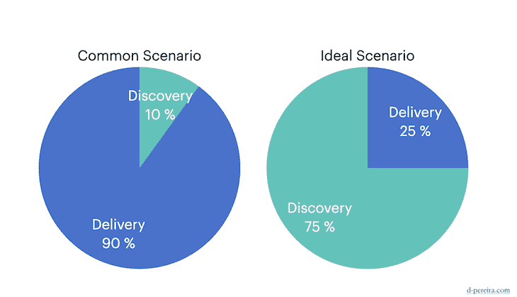

# 产品发现与交付:如何发现用户的需求

> 原文：<https://blog.logrocket.com/product-management/product-discovery-vs-delivery/>

你花多少时间谈论功能？

您花了多少时间来了解最终用户的问题？

如果几年前你问我这些问题，我会说我至少 90%的时间都在谈论特性。令人尴尬的是，我几乎不理解终端用户的问题。

团队受到来自组织所有层面的压力。每个人都有一个绝妙的想法，他们确信这个想法会永远改变这个行业。其他人有紧急和重要的问题要解决。而你正处于这一团乱麻之中，试图找出如何创造价值。

做别人想做的事很容易。很难做到他们所需要的。

如果在发现和交付之间没有一个有意义的平衡，你更有可能创造垃圾而不是价值。可悲的是，许多团队投入了太多的时间来交付，而很少的时间来发现什么是重要的。

让我详细说明一些我认为对产品团队稳定地创造价值是可持续的发现和交付策略。

* * *

## 目录

* * *

## 产品发现和产品交付有什么区别？

尽管差异可能很明显，但我在企业界观察到的情况让我感到困惑。

我看到太多的团队把精力放在交付上，却不知道他们最终解决的是哪个问题。同时，我看到很少有团队在提出解决方案之前努力理解问题。

敏捷产品宣言支持“理解问题胜于思考解决方案”下面是我对发现和交付这一原则的简单解释:

*   **产品发现**意味着发现创造价值的东西
*   **产品交付**意味着生产创造价值的东西

现在，在我们继续之前，我必须澄清一些问题:

*   **职责** —不要在不同的团队之间分割发现和交付。这将导致责任缺失、不必要的交接、混乱，并最终淡化结果
*   **阶段** —不要将发现和交付视为不同的阶段。两者都是连续且重叠的。发现使有意义的交付成为可能，而交付为更清楚地理解问题创造了证据
*   **学习** —发现不会确保你知道什么创造价值；它会产生增加你成功机会的知识。发现也减少了开发无意义功能的机会。这不是银弹，而是一种更快创造价值的方式

## 平衡发现和交付

我们当前的挑战是应对增加产量的压力。

交付更多的功能并不意味着创造更多的价值；你必须找出是什么创造了价值。

正如阿尔伯特·爱因斯坦曾经说过的，“如果我有一个小时来解决一个问题，我会花 55 分钟思考问题，花 5 分钟思考解决方案。”

这句话有变化——有时是 50 分钟思考，或者 59 分钟——但是你明白了🙂

奇怪的是，在数字产品世界中，发现和交付之间的平衡似乎颠倒了。我通常发现团队在发现上投入的时间和精力不超过 10%。我想知道他们如何在没有准确理解问题的情况下创造价值。这让我很困惑。

更可持续的平衡应该是 75%的发现和 25%的交付。你认为我在夸大其词吗？不完全是。我只是怕制造扯淡。我想增加成功的几率。

Common vs. ideal product delivery to discovery ratio (source: [d-pereira.com](https://d-pereira.com/))

发现是持续的。发现的魔力在于揭开你不知道的东西。

你会不可避免地意识到你的大部分想法都是行不通的。这很好，因为它帮助你避免创造一些没人需要的东西。

* * *

订阅我们的产品管理简讯
将此类文章发送到您的收件箱

* * *

鉴于你的大部分想法都行不通，你需要不断投入时间去了解你的用户，测试不同的想法。这就是为什么适当关注发现是至关重要的。

> “严酷的现实是，产品战略不会发生在解决方案领域。”
> 
> *特里萨托雷斯*

## 产品发现和交付过程中会发生什么？

要创造出优秀的产品，你需要同时掌握发现和交付。我不会深入探讨你是如何做到每一个的，但是我会分享每个阶段的伟大成果是什么样的。

### 产品发现

许多人认为产品发现是关于验证想法的。我不同意这一点。产品发现就是了解最终用户的问题，然后发现创造业务成果的机会。

理解产品发现发生在问题空间是很重要的。然而，很容易滑入解决方案空间并到处乱搞。

一个问题可以用多种方法解决。如果你在谈论你只能用一种方式解决的事情，那是一个解决方案，而不是一个问题。后退一步，回到问题空间。

那么，在产品发现过程中会发生什么呢？

#### 用户研究

努力理解你的用户的场景，什么对他们重要，他们想要完成什么工作，他们的痛苦和他们的愿望。这一切都是为了了解您的用户关心什么，并找出改善他们生活的机会。

#### 问题框架

你越了解你的用户，他们的问题就越清晰。

例如，您知道用户如何关注 it，有多少用户受到影响，他们面临此问题的频率，以及这如何能够实现[业务价值](https://blog.logrocket.com/product-management/what-is-business-value-how-to-measure-it/)。

好的问题框架使决定哪些问题值得解决变得容易。

#### 实验

进行产品实验[以了解什么可行，什么不可行](https://blog.logrocket.com/product-management/what-is-a-b-testing-optimizely-demo-examples/)。

实验又快又短。你说的是几小时或几天，不是几周。实验有预期的结果，你根据它们决定是否扩大、改变或放弃它。

#### 避免常见陷阱

好的产品发现不会证实你的假设，但它会揭示未知。

伪造思维是创造知识的强大力量。你的目标不是努力验证假设，而是证明自己是错的。有了这样的开放性，你可以避免确认偏差和承诺升级。

### 产品交付

产品发现不仅仅是产品交付的投入。它们重叠并平行发生。

将交付视为发现后的一个阶段会产生瀑布效应，困住团队。

它不是关于接收需求和实现解决方案。这是关于建立学习和扩大基于证据。

在一次成功的发现之后，你可能会对你发现的解决方案感到兴奋。小心:仅仅因为它对较小的用户群有效并不意味着它对较大的群体也有效。

在整个旅程中保持学习的心态。

为了使产品发现工作取得成功，您应该:

#### 频繁发布

你的发布周期越短，你学得越快。优秀的产品公司一天做几个发布。当然，你需要理解你的场景。你不能把三个月的假期改为每天。但是你可以改为每月一次，每两周一次，每周一次，每天一次。

#### 测量结果

永远不要假设影响。衡量结果。这不是衡量你花了多长时间得到一个解决方案，而是理解它如何创造价值。为学习而构建。

#### 逐渐扩展

在过去，团队通常会花几个月的时间来实现解决方案，然后一次性发布给所有人。这种方法是危险的。如果出了问题，会影响到你的所有观众。一个更好的方法是从更小的受众开始，基于证据逐步扩展。

> “成功的产品来自于对用户需求的深刻理解，以及对当前可能性的深刻理解。”
> 
> *——[马蒂·卡甘](https://www.goodreads.com/author/quotes/1405323.Marty_Cagan#:~:text=%E2%80%9CWinning%20products%20come%20from%20the,of%20what's%20just%20now%20possible.%E2%80%9D&text=%E2%80%9CProduct%20management%20is%20about%20insights,%2C%20it%20is%20not%20sufficient.%E2%80%9D)*

## 保持好奇和谦逊

数字产品世界因其复杂性而充满挑战。好奇心和谦逊是让你成功的重要品质。

你应该有好奇心去发现未走过的路，当你知道你的想法对你的听众毫无意义时，你应该谦虚地放弃你的想法。

伟大的产品团队坚持不懈地解决问题。他们创造最先进的解决方案，尽管这是达到目的的手段。只有当人们能够利用解决方案来改善生活时，解决方案才是有价值的。否则，它们毫无价值。

你必须仔细挑选哪些问题值得解决。做到这一点的方法是掌握产品发现。没有有效的发现，你会陷入无尽的陷阱，并最终受挫。

做正确的事，不要做容易的事

交付解决方案非常简单。创造有价值的解决方案很难。

## [LogRocket](https://lp.logrocket.com/blg/pm-signup) 产生产品见解，从而导致有意义的行动

[LogRocket](https://lp.logrocket.com/blg/pm-signup) 确定用户体验中的摩擦点，以便您能够做出明智的产品和设计变更决策，从而实现您的目标。

使用 LogRocket，您可以[了解影响您产品的问题的范围](https://logrocket.com/for/analytics-for-web-applications)，并优先考虑需要做出的更改。LogRocket 简化了工作流程，允许工程和设计团队使用与您相同的[数据进行工作](https://logrocket.com/for/web-analytics-solutions)，消除了对需要做什么的困惑。

让你的团队步调一致——今天就试试 [LogRocket](https://lp.logrocket.com/blg/pm-signup) 。

[David Pereira Follow](https://blog.logrocket.com/author/davidpereira/) Product Leader with 15+ years of experience. Partner at Value Rebels and interim CPO at omoqo. Almost every product team is trapped somehow; untrapping them is what drives me.