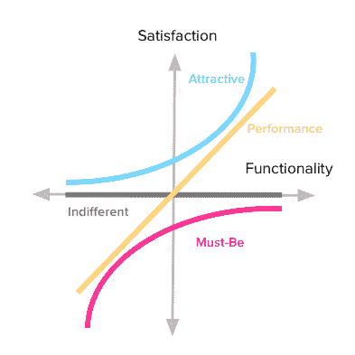
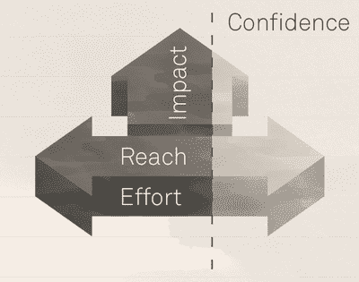
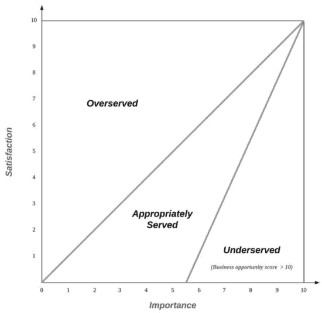

# 5 产品特性优先级框架和策略

> 原文：<https://blog.logrocket.com/product-management/product-feature-prioritization-frameworks-strategies/>

产品经理必须做出的最大决定之一是如何确定要构建的特性的优先级。这就是特性优先级策略和框架的用武之地。

优先级框架是产品经理工具箱的重要组成部分，因为它们有助于促进清晰的沟通和做出高效的产品决策。

* * *

## 目录

* * *

## 什么是产品功能优先级？

产品功能优先级是根据客户需求、总体业务目标、团队资源和其他因素确定团队将首先构建哪些功能的过程。

在任何给定的时间，都有许多功能、想法和待办事项要构建，但是产品开发团队只有这么多的时间和带宽。当选择优先项目时，产品经理还需要权衡员工、高管、利益相关者和客户的不同意见。让我们不要忘记预算和提供具有高投资回报率的功能。

当涉及到特性优先级时，做出正确的决定会有很大的压力。理解优先考虑产品最佳特性的策略对于推动成功的[产品路线图](https://blog.logrocket.com/product-management/how-to-build-product-roadmap-overview-examples/)至关重要。

## 如何区分产品特性的优先级

产品经理的主要[职责之一是成为客户的拥护者，这意味着优先考虑以客户为中心的产品特性。虽然有时这可能是一种直觉，但如果您有数据支持您的路线图，您可以与高管和其他利益相关者达成共识。](https://blog.logrocket.com/product-management/what-does-a-product-manager-do-role-responsibilities/)

[特性优先级框架](https://blog.logrocket.com/product-management/6-product-management-frameworks-you-should-know/#prioritization-frameworks)可以为您提供做出明智产品决策所需的数据。当涉及到筛选意见和想法以关注对客户真正重要的东西时，框架尤其有用。

## 产品经理的 5 个特性优先级框架

让我们来评估几个最常用的特性优先级框架。选择正确的框架将取决于您的资源和您组织的工作方式。

### 1.卡诺模型

卡诺模型理论认为，客户满意度是根据产品的功能或特性满足其需求的程度来预测的。

第一步是将功能分为以下三类:定义这些特征有助于稍后构建模型:

*   **必备** *—* 顾客期望你的产品具备的特性。例如，社交媒体日程安排工具应该有存储空间来保存帖子
*   **性能** *—* 有助于提升产品整体使用体验的特性。例如，一个容易找到的联系客户支持的按钮
*   **令人兴奋的** *—* 功能旨在取悦你的客户，但不是核心功能。例如，客户忠诚度计划



Source: [Flying Burritos](https://foldingburritos.com/blog/kano-model)

客户会收到一份调查问卷，并被要求分享他们喜欢或不喜欢某个产品功能的程度。这有助于产品经理[确定客户认为什么对产品有价值](https://blog.logrocket.com/product-management/what-is-product-market-fit-measure-examples/)。

一旦调查问卷完成，结果将被制成表格，沿纵轴和横轴显示。X 轴代表功能。该量表衡量职能执行的好坏，并从“做得差”到“做得好”进行评分

同时，Y 轴表示客户满意度。同样，客户满意度也是按照“非常不喜欢”到“非常喜欢”的等级来评估的

Kano 模型非常适合希望了解客户期望什么功能，并随后根据他们的需求做出产品决策的产品团队。然而，从您的调查中获得准确的结果是至关重要的。通过选择熟悉产品特性的客户，他们可以给出明智的意见。

### 2.赖斯模型

[RICE 模型](https://blog.logrocket.com/product-management/6-product-management-frameworks-you-should-know/#rice-scoring-model)关注四个方面，它们一起评估，产生一个旨在影响优先级的分数。这四个领域是:

*   **到达** —有多少客户受到影响？
*   **影响** —该功能预计会如何影响客户体验？这是从 0.25 到 3 的分数)
*   **信心** —你对这种影响有多大信心？这表示为百分制的百分比分数
*   **工作量** —构建该特性需要多少工作量？努力程度用 1-5 来衡量

一旦你确定了每个领域的分数，你可以使用下面的公式来发现你的大米分数:

> ```
> (Reach * Impact * Confidence) / Effort 
> ```



Source: [Intercom](https://www.intercom.com/blog/rice-simple-prioritization-for-product-managers/)

饭分越高，优先级越高。理想情况下，您应该将重点放在影响大、工作量小的特性上，尤其是当它们的可信度很高的时候。

RICE 框架有一些缺点。例如，影响和信心分数很少是 100%准确的。

### 3.莫斯科方法

莫斯科是必须拥有、应该拥有、可能拥有和不会拥有的缩写。它旨在帮助利益相关者理解产品特性的优先级。这也是产品经理决定客户优先考虑哪些功能的一种方式。

功能被评估并标记为四个类别之一:

*   **必备** —不可协商的关键特征。这种特性可能是[最小可行产品(MVP)](https://blog.logrocket.com/product-management/what-is-minimum-viable-product-mvp-how-to-define/) 的先决条件，否则产品可能不安全或不合法
*   **应该具备** —重要但非关键的特性。去掉应有的特性可能很痛苦，但是没有它，产品仍然是有效的
*   **可能拥有的** —理想的特性，但不如应该拥有的特性重要。只有在有剩余时间和预算的情况下，才能实现这些功能
*   **不会拥有**——低优先级、低影响的功能，位于愿望列表的底部。由于缺乏预算或时间，这些功能首先会被废弃

莫斯科为利益相关者和产品团队提供了一种简单的方式来[就产品方向](https://blog.logrocket.com/product-management/build-consensus-product-direction-5-tips/)达成共识，并据此确定优先级。这也有助于将重点放在可用资源上，以创造产品和任何阻碍执行的限制。

然而，你应该小心不要把一个特性放在它不属于的地方。作为产品经理，您应该更好地处理某样东西是必须具备的特性还是应该具备的特性。注意清楚地传达差异，以确保优先级不会倾斜。

莫斯科有助于将重点放在什么应该首先发布，但它不一定决定一个类别中的哪些功能应该优先。比方说，应该拥有的类别包含多个特性。莫斯科方法没有机制来帮助确定该类别中的特征应该被开发的顺序。

### 4.购买功能

购买功能是利益相关者和/或客户玩的游戏。游戏的结果有助于产品经理确定产品特性对客户或利益相关者的感知价值。

除了对优先化有用之外，buy-a-feature 还可以帮助提高上述 RICE 框架的置信度得分。玩这个游戏可以提供你需要的证据来支持你的假设，即客户或利益相关者想要一个特性。

以下是如何玩购买功能:

1.  选择特色创意或潜在更新，并为其分配货币价值。该数字应该与实现该功能所需的工作量和资源相对应。建造的时间或成本越密集，货币价值就越高
2.  创建一个代表客户的团队或召集利益相关者。给每个玩家分配一定数量的钱来消费
3.  要求玩家购买他们想要的功能
4.  之后，问玩家为什么他们买了那些功能而忽略了其他的。他们的解释应该对你应该优先考虑哪些特性提供有价值的见解

### 5.机会评分

机会评分，有时也称为差距分析或机会分析，旨在揭示客户认为未充分开发但仍然重要的功能。因为机会评分很大程度上依赖于客户反馈，所以这是在您的产品中发现新机会的绝佳方法。

调查您的客户，让他们根据两个问题从 1 到 2 对特性/结果进行评级:

*   这个结果或特征有多重要？
*   您对当前解决方案的满意度如何？

然后，在图上画出数字，像这样:



Source: [MDPI](https://www.mdpi.com/2071-1050/13/1/391/htm)

您应该优先考虑属于服务不足类别的功能。如果某个特性对客户来说非常重要，但是他们目前对当前的解决方案不满意，那么是时候改进这个特性了。

机会评分框架的缺点是，客户很容易高估或低估某项功能的重要性。选择消息灵通的客户将导致更准确的数字。

* * *

订阅我们的产品管理简讯
将此类文章发送到您的收件箱

* * *

## 您应该采用哪种特性优先级策略？

即使有一个有效的优先排序框架，也不总是有明确的答案。虽然[数据可以提供有价值的产品洞察](https://blog.logrocket.com/product-management/what-metrics-kpis-product-managers-track/)，但功能优先化仍然依赖于产品团队和组织内决策者之间的清晰沟通。

产品经理应该始终与他们的目标受众保持联系，以了解客户需要什么，并跟上行业的最新趋势。这将有助于你的团队优先考虑正确的功能，让你的产品脱颖而出。

*精选图片来源:[icon scout](https://iconscout.com/icon/agile-prioritize-2287458)*

## [LogRocket](https://lp.logrocket.com/blg/pm-signup) 产生产品见解，从而导致有意义的行动

[](https://lp.logrocket.com/blg/pm-signup)

[LogRocket](https://lp.logrocket.com/blg/pm-signup) 确定用户体验中的摩擦点，以便您能够做出明智的产品和设计变更决策，从而实现您的目标。

使用 LogRocket，您可以[了解影响您产品的问题的范围](https://logrocket.com/for/analytics-for-web-applications)，并优先考虑需要做出的更改。LogRocket 简化了工作流程，允许工程和设计团队使用与您相同的[数据进行工作](https://logrocket.com/for/web-analytics-solutions)，消除了对需要做什么的困惑。

让你的团队步调一致——今天就试试 [LogRocket](https://lp.logrocket.com/blg/pm-signup) 。

[Sara Nguyen Follow](https://blog.logrocket.com/author/saranguyen/) My greatest career achievement was when I was recognized as "GIF Master" for my GIFs in the company Slack channel. A close second is that I've written over 600,000 words in the past two years.