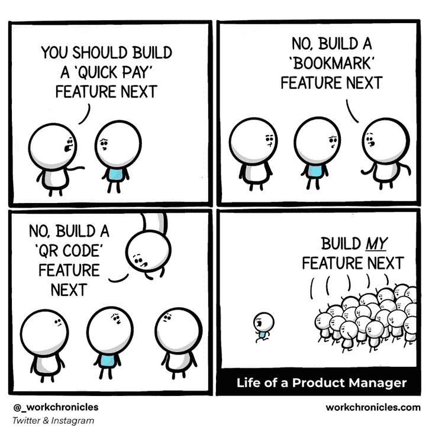
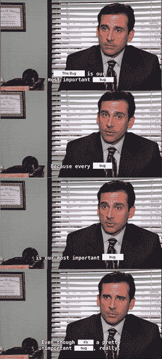
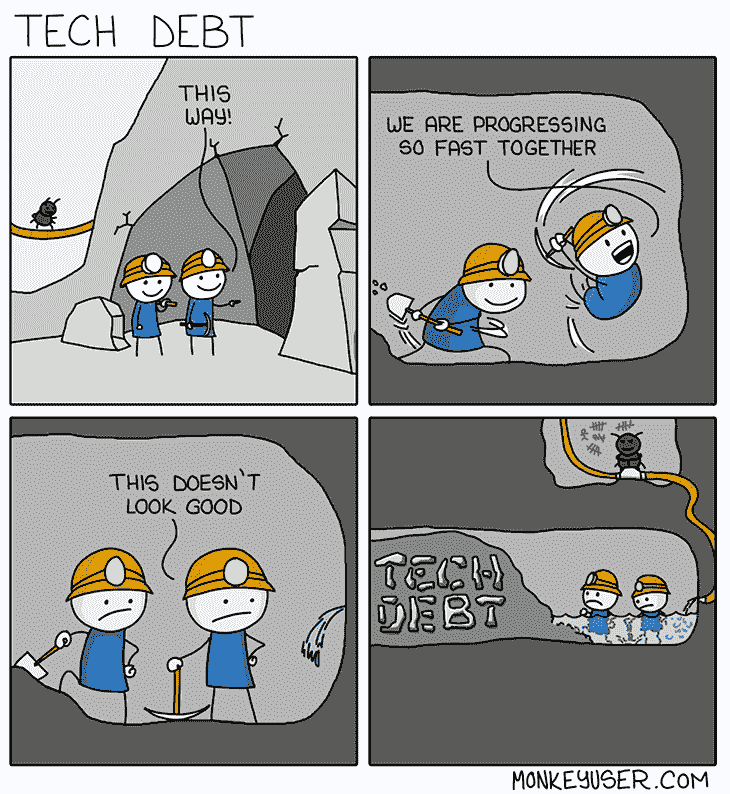
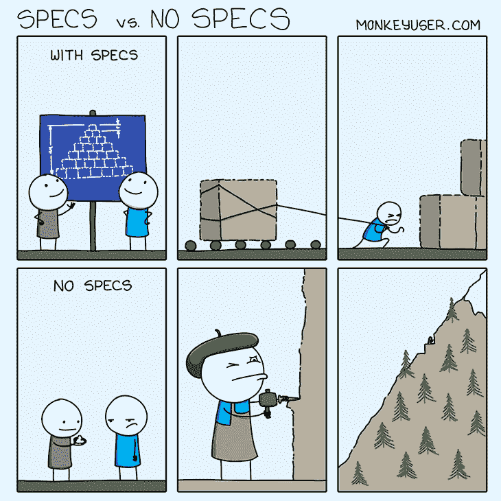
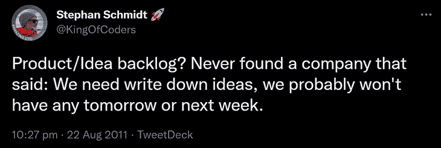
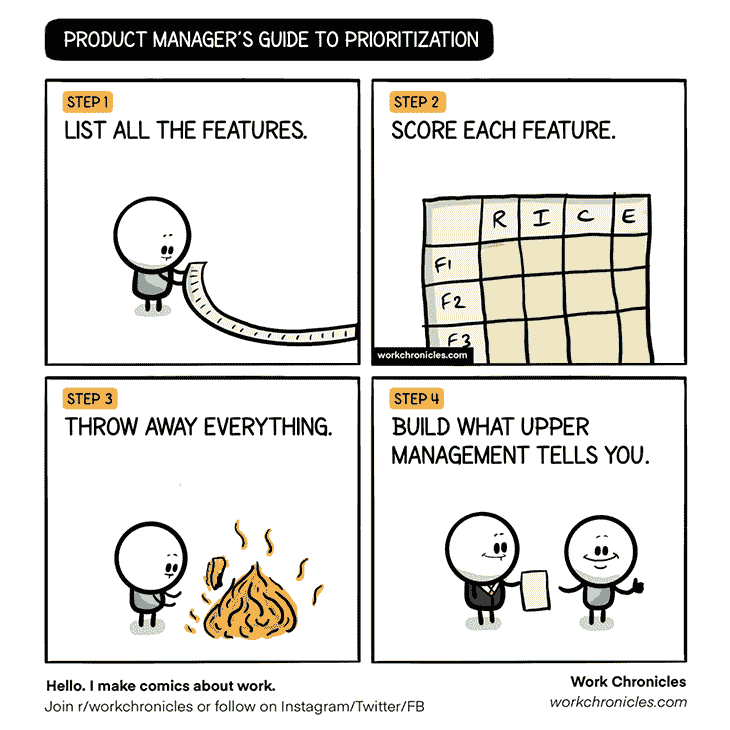
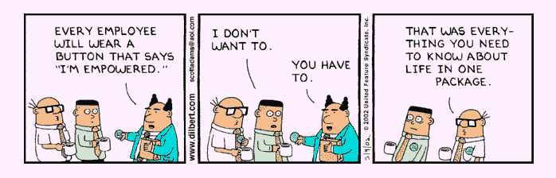

# 产品管理反模式以及如何避免它们

> 原文：<https://blog.logrocket.com/product-management/product-management-anti-patterns-how-avoid-them/>

有好的产品经理，也有不好的产品经理。区分这两者的最好方法是寻找常见的产品管理反模式。

我认为 90%糟糕的产品管理实践的问题都归结于同一个过于熟悉的反模式集。

不惜一切代价避开他们。

在本文中，我们将讨论常见的产品管理反模式以及如何避免它们。

* * *

## 目录

* * *

## 缺乏产品愿景和战略

一个有凝聚力的产品愿景对团队来说就像一颗北极星。它告诉你是否在朝着正确的方向前进，并帮助你区分目标和目的的优先次序。

没有清晰的愿景和相应的战略，就没有下一步该做什么的决策框架。产品路线图成了利益相关者愿望的体现，但往往不会带来任何有意义的结果:

Source: [https://workchronicles.com/comics/](https://workchronicles.com/comics/).

当产品经理没有时间或权力来建立和维护产品方向时，这种反模式经常发生。

缺少时间是一个危险的循环。经前综合症没有时间建立一个愿景，因为他们太忙于做没有结果的工作…因为没有愿景。尽你所能打破这个循环。从长远来看，清晰的愿景可以节省你的时间。

缺乏权威是一个更加严重的问题。如果您只是一个处理来自各种涉众的请求的 backlog 经理，那么您有两个选择。

第一个选择是在组织中传播正确的产品文化。虽然听起来很酷，但这通常非常困难，而且在很多情况下是不可能的。改变组织文化是一项壮举，需要所有人都参与进来，尤其是首席执行官。

然而，还有一个更合理的选择——跑，福雷斯，跑！有更好的地方可以去。

## 一切都是重中之重

伟大的产品经理总是知道他们的首要任务，并保持他们的小。你不能指望团队同时做 20 件事情。

如果一切都是优先的，那么没有什么是优先的:

Source: [https://tinyurl.com/bpr92uzd](https://tinyurl.com/bpr92uzd).

与普遍的看法相反，设定优先级并不是决定什么是重要的。调用重要的或高优先级的东西太容易了。一个五岁的孩子都能做。能够大声说一些不相关的事情，不应该被优先考虑才是最重要的。

专注于你的目标，无情地去除不相关的特征。

## 过多听取客户的意见

客户反馈至关重要，但它不能成为[产品路线图](https://blog.logrocket.com/product-management/how-to-build-product-roadmap-overview-examples/)的主要输入。这是产品管理中另一个极其常见的反模式:

接受每一个客户的愿望并解决他们的每一个问题是一条通向弗兰肯斯坦式产品的单行道，这种产品不为任何人服务。

残酷的事实是，大多数产品并不是为了解决用户问题而存在的。产品的存在是为了通过解决用户问题来推动业务成果。这是一个微妙但重要的区别。

只接受真正符合你的产品愿景并有助于实现你的目标的客户要求。即使有些事情符合你的愿景和目标，也不要只看表面价值。深入挖掘并理解提案背后的“为什么”——它解决了什么问题？—只有这样，你才知道自己是否想解决问题，以及用什么方式解决。

将客户的愿望视为真知灼见，而不是必须尽快满足的要求。

## 忽略技术债务

匆忙构建新的闪亮特性很诱人，但是速度是有代价的。如果不小心的话，这种反模式从长远来看会让您的组织损失很多钱。

* * *

订阅我们的产品管理简讯
将此类文章发送到您的收件箱

* * *

[监控技术债务](https://blog.logrocket.com/product-management/what-is-technical-debt-examples-prioritize-avoid/)的水平，并将其保持在合理的范围内。当建立一个 MVP 或试图满足一些外部期限时，积累更多的债务是可以的，但它需要被还清。宜早不宜迟。

从长远来看，你积累的债务越多，你就越慢。这也让你面临额外的风险:

Source: [https://www.monkeyuser.com/2018/tech-debt/](https://www.monkeyuser.com/2018/tech-debt/)

给团队足够的空间来维护代码库和基础设施。否则它会咬你的屁股。

## 不明确的产品要求

无论是以用户故事、[产品需求文档](https://blog.logrocket.com/product-management/how-to-write-product-requirements-documents-prds/)还是路线图项目的形式，方向对于团队中的每个人来说都必须非常清晰。

给出模糊方向的产品经理会得到模糊的结果。甚至更糟。从长远来看，它会导致范围变更、返工和团队冲突。

永远不要想当然地认为，如果某件事对你来说很清楚，那么对其他人来说也很清楚。这很少是真的:

Source: [https://www.monkeyuser.com/2021/specs-vs-no-specs/](https://www.monkeyuser.com/2021/specs-vs-no-specs/).

确保在你提供的需求中抓住每一个重要的细节。这并不意味着你必须是规定性的。你的团队完全有能力找到解决问题的方法。但是如果你绝对需要某样东西以特定的方式工作，那就把它写下来。

然而，这还不够。写下来的东西并不保证每个人都在同一页上。请队友用自己的话描述需求，或者使用可视化方式。总是仔细检查理解。

将精力花在协调每个人上比花在以后的返工上要好。

## 保持愿望清单积压

每当利益相关者提出一个想法或请求时，将一个新项目放入 backlog 中是很常见的。这背后甚至有一些合理的逻辑，对吗？毕竟，这个想法看起来很有趣，值得以后修改。你不想失去宝贵的洞察力。

问题？总会有比开发团队能力更多的想法:

Source: [https://twitter.com/KingOfCoders/status/105737797008244738?s=20&t=0WpoRZKFm1Dk02xtMQUS8w](https://twitter.com/KingOfCoders/status/105737797008244738?s=20&t=0WpoRZKFm1Dk02xtMQUS8w).

我见过两三年前就有“想法积压”的团队。提出这些想法的人已经不在公司工作了！当一些想法被实现时，并不是因为它们被放在了想法清单的首位，而是有人在更合适的时间提出了同样的想法。

维护愿望清单积压需要时间，增加了组织的复杂性，并且很少带来有意义的结果。

如果一个想法值得在不久的将来实施，就把它计划在路线图上。否则，就放弃吧。如果这是一个真正伟大的想法，它会以某种方式回到你身边。

backlog 应该有助于团队计划和组织工作。不要把它变成垃圾桶。保持干净。

## 缺乏勇气

因为想法总是比能力多，所以产品经理必须善于说不。

这往往是最具挑战性的部分。当某个比你优越的人带来一个 [super-duper-uber 重要特征要求](https://blog.logrocket.com/product-management/what-is-feature-creep-how-to-avoid/)时，我们的人性往往会想讨好那个人。但是做一个取悦大众的人不会让产品走得太远:

Source: [https://vincentdnl.com/drawings/](https://vincentdnl.com/drawings/).

只有符合产品愿景和当前业务目标的功能才应该被删除。句号。

优秀的产品经理知道如何拒绝请求，以便请求者理解并尊重他们的决定。让每个人在产品方向上保持一致是一个很好的开始。

现实检查:如果有人向你提出不符合产品愿景的要求，这通常是产品战略沟通不畅的迹象。这是你的责任。对齐是关键。

## 太多功能了

有一种错误的观念，认为越多意味着越好。产品特性也不例外:

可以理解。产品特征是有形的。交付花哨的功能比从用户研究中发现新的见解或偿还一些技术债务更有吹嘘的资本。

但是从长远来看，特性的数量并不重要。这一切都归结于业务成果。

你愿意成为一个提供 20 项功能并使收入增长 20%的项目经理，还是一个提供两项功能并使收入增长 50%的项目经理？在协商加薪或升职时，收入似乎是一个更有力的理由。

## 没有授权给团队

产品经理经常和令人难以置信的专业团队一起工作。令人失望的是，许多人把他们当成行刑机器:

虽然给团队规定的需求文档并期望他们交付是一种工作方式，但这是一种巨大的浪费。您团队中的专家已经准备好解决最复杂的用户问题，并找到无法解决的问题的解决方案。给他们一个座位，让他们为产品方向出谋划策。

伟大的产品诞生于授权和熟练团队的协作，而不是来自过于详细的产品需求文档。

## 结论

我希望这篇关于产品管理中的反模式的文章对您有所帮助。我们讨论了许多重要的观点，其中许多观点比我们通常记得的更常见。

保重！

*精选图片来源:[icon scout](https://iconscout.com/icon/network-learning-4036243)*

## [LogRocket](https://lp.logrocket.com/blg/pm-signup) 产生产品见解，从而导致有意义的行动

[LogRocket](https://lp.logrocket.com/blg/pm-signup) 确定用户体验中的摩擦点，以便您能够做出明智的产品和设计变更决策，从而实现您的目标。

使用 LogRocket，您可以[了解影响您产品的问题的范围](https://logrocket.com/for/analytics-for-web-applications)，并优先考虑需要做出的更改。LogRocket 简化了工作流程，允许工程和设计团队使用与您相同的[数据进行工作](https://logrocket.com/for/web-analytics-solutions)，消除了对需要做什么的困惑。

让你的团队步调一致——今天就试试 [LogRocket](https://lp.logrocket.com/blg/pm-signup) 。

[Bart Krawczyk Follow](https://blog.logrocket.com/author/bartkrawczyk/) Learning how to build beautiful products without burning myself out (again). Writing about what I discovered along the way.