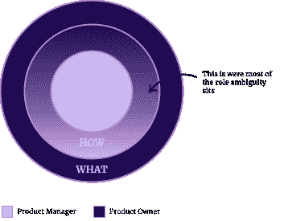
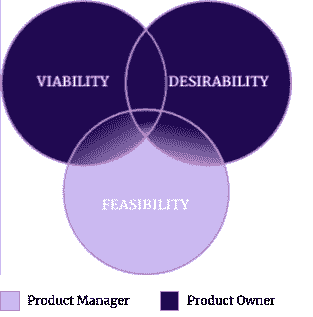

# 产品经理和产品负责人:他们是不可互换的

> 原文：<https://blog.logrocket.com/product-management/product-manager-vs-product-owner/>

认识一下 Janet，她最近被一家新公司聘为首任产品经理。Janet 将承担产品负责人 Noah 的一些责任。

第一天上班，珍妮特遇到了诺亚，两人展开了激烈的对峙。接下来是一段激烈的争斗、困惑、误解、眼泪、喜悦的时期。

不仅 Janet 和 Noah 受到了他们新确立的角色的冲击、规范和形成的影响，所有参与产品开发过程的人也受到了影响，包括客户。

结果呢？没有明确的产品方向，对用户及其需求的理解不完整，解决用户痛点的模糊需求，意想不到的成本，以及未使用的功能。

要是有办法避免这种情况就好了。

* * *

## 目录

* * *

## 产品经理和产品负责人:他们可以互换吗？

[产品经理](https://blog.logrocket.com/product-management/what-does-a-product-manager-do-role-responsibilities/)和[产品负责人](https://blog.logrocket.com/product-management/3-scrum-roles-agile/#product-owner)都对产品的成功至关重要。这两个角色的定义经常引起争论，有时这两个术语可以互换使用。这会给这些角色带来大量的困惑和压力。

更令人困惑的是，在一些公司，两个职位都由同一个人担任。

产品经理和产品所有者的角色都很重要，但又截然不同。他们紧密合作以实现他们共同的最终目标，那就是为他们的客户创造有意义的价值。

为了避免模糊，角色清晰是关键。没有什么比角色模糊更糟糕的了，尽管总会有一些。

那么每个角色都需要什么呢？责任是什么，要执行的关键任务是什么，成功所需的技能是什么？

## 产品经理和产品负责人有什么区别？

在深入每个角色之前，让我们先来鸟瞰一下产品经理和产品所有者角色之间的根本区别。

尽可能简单地说:

***产品经理专注于打造合适的产品。产品负责人专注于建立正确的产品。***

看起来很简单，对吧？没那么快。虽然在产品生命周期的某些阶段很容易划分 PM 和 PO 的角色，但在其他领域，职责重叠，界限模糊。

为了说明产品经理和产品负责人之间的区别，我们将看看[黄金圈](https://www.smartinsights.com/digital-marketing-strategy/online-value-proposition/start-with-why-creating-a-value-proposition-with-the-golden-circle-model/)和[创新](https://isaacjeffries.com/blog/2016/3/9/three-lenses-of-innovation)模型的三个镜头。

### 为什么，如何，什么

根据西蒙·西内克的著作 *[从为什么](https://simonsinek.com/books/start-with-why/)* 开始，黄金圈模型完全适用于产品管理。我们从[为什么](#why)开始，继续到[如何](#how)，最后是[什么](#what)，回答每一步的问题:

#### 为什么

*   我们为什么要开发这个产品？
*   为什么是这个产品？
*   为什么解决这个问题对用户很重要？
*   为什么与[产品策略](https://blog.logrocket.com/product-management/product-strategy-frameworks-examples/)相关？
*   为什么这将是我们公司的可行产品？

#### 怎么

*   我们如何验证其重要性和可取性？
*   我们如何验证价值？
*   我们如何在交付方面与众不同？
*   构建这个产品有多复杂？我们创造它是否可行？

#### 什么

*   产品会是什么样子？
*   我们将使用什么技术来交付期望的结果？

产品经理专注于回答“为什么”和“如何”,而产品负责人则致力于“如何”和“什么”。

产品经理和产品所有者在 how 中扮演着重要的角色。这是问责辩论最常发生的战场。一种是更灵活的，责任各不相同。

### 合意性、生存力和可行性

由 IDEO 在 21 世纪初提出的概念,“创新的三个镜头”是一种设计思维方法，有助于区分每个角色的侧重点。三个透镜定义如下:

1.  [**合意性**](#desirability) 衡量客户是否真正需要解决方案
2.  [**生存能力**](#viability) 判断是否应该构建解决方案
3.  [**可行性**](#feasibility) 决定了方案能否建成

产品经理必须掌握平衡这三个方面的微妙艺术。为了回答可行性问题，产品经理依赖于产品所有者的建议，产品所有者与开发团队一起定义如何构建正确的产品。

## 责任

既然我们已经定义了产品经理和产品所有者角色之间的区别，那么让我们更深入地了解责任、要管理的任务以及完成这些任务所需的技能。

| *产品经理与产品负责人:角色与职责* |
| [产品经理](#responsibilities-of-a-product-manager) | [产品负责人](#responsibilities-of-a-product-owner) |
| *核心业务功能* | *分配到一个团队* |
| *外部焦点* | *内部焦点* |
| *战略* | *战术* |
| *长期关注* | *短期活动* |
| *市场和客户需求* | *开发和实施* |

### 产品经理的职责

[产品经理的角色](https://blog.logrocket.com/product-management/product-managers-role-each-product-lifecycle-stage/)是一项战略业务职能。项目经理负责阐明原因，并理解所有提出的好想法和机会的可行性、可取性和可行性。

产品经理促进对新市场和产品机会的更快响应，并且是客户服务的单一联系人。

* * *

订阅我们的产品管理简讯
将此类文章发送到您的收件箱

* * *

该角色长期关注并负责了解市场、用户需要什么以及他们为什么需要它。项目经理对预期的结果进行优先排序，并确定下一步要做什么，向利益相关者传达目标和计划，并围绕[产品路线图](https://blog.logrocket.com/product-management/how-to-build-product-roadmap-overview-examples/)。

### 产品所有者的责任

另一方面，产品负责人被分配到一个团队(或多个团队)，并在战术层面上运作。PO 旨在通过创建和管理[产品积压](https://blog.logrocket.com/product-management/product-vs-sprint-vs-release-backlog/)并充当客户的代言人来实现价值最大化。

产品所有者角色通过短期活动关注开发和实现，并帮助产品开发团队理解需要做什么。基本上，PO 的工作是组建团队来创建一个可靠的、可伸缩的、安全的和可维护的解决方案。

## 要管理的任务

进一步放大，让我们在每个角色管理的各种任务的上下文中检查这些职责。

| *产品经理与产品负责人:需要管理的任务* |
| [产品经理](#tasks-managed-by-the-product-manager) | [产品负责人](#tasks-managed-by-the-product-owner) |
| *拥有与业务和客户的关系* | *代表客户的声音* |
| *拥有产品愿景和路线图* | *为产品愿景和路线图做出贡献* |
| *拥有程序积压* | *拥有团队待办事项* |
| *定义特性并发布* | *定义迭代和故事* |
| *跟踪市场变化和趋势* | *接受迭代增量* |

### 由产品经理管理的任务

产品经理关注外部，是管理与业务和客户关系的单一联系人。

在战略层面上，产品经理拥有[产品愿景](https://blog.logrocket.com/product-management/what-is-a-product-vision-statement-examples/)和路线图，发现用户需要什么，决定下一步追求什么结果，并在计划待办事项中相应地对功能和发布进行优先级排序。

为了确保团队追求带来最大价值的正确结果，产品经理的任务是[跟踪市场变化和趋势](https://blog.logrocket.com/product-management/what-is-product-market-fit-measure-examples/)并持续关注竞争以发现威胁和机遇。

此外，产品经理负责[建立和跟踪产品指标](https://blog.logrocket.com/product-management/what-metrics-kpis-product-managers-track/)，以验证预期结果或在需要时进行调整。

### 由产品所有者管理的任务

产品负责人有一个内部焦点，并向开发团队代表客户的声音。

虽然产品经理拥有愿景和路线图，但产品负责人是建立这两者的关键合作伙伴和贡献者。

产品经理负责项目的积压工作，而产品负责人监督开发团队的积压工作。产品负责人对解决方案有最完整的理解，因此最有资格评估可行性，并对故事进行优先排序以实现输出。

由[优先的团队 backlog](https://blog.logrocket.com/product-management/why-you-need-perfectly-groomed-backlog-sprint-planning/) 授权，产品负责人定义迭代以实现故事，跟踪交付的进度，并接受迭代增量。

## 所需技能

要成为一名优秀的产品经理或产品负责人，需要软硬技能的结合，包括精通以下领域:

| ***产品经理与产品负责人:所需技能及每项技能的重要性*** |
| **技能** | [**产品经理**](#product-manager-skills) | [**产品负责人**](#product-owner-skills) |
| *商业头脑* | ⏺⏺⏺⏺⏺ | ⏺⏺⏺⏺ |
| *决策* | ⏺⏺⏺⏺◖ | ⏺⏺⏺⏺ |
| *分析* | ⏺⏺⏺⏺⏺ | ⏺⏺⏺⏺◖ |
| *技术* | ⏺⏺⏺⏺◖ | ⏺⏺⏺◖ |
| *通信* | ⏺⏺⏺⏺⏺ | ⏺⏺⏺⏺⏺ |
| *项目管理* | ⏺◖ | ⏺⏺◖ |
| *协作* | ⏺⏺⏺◖ | ⏺⏺⏺⏺◖ |

尽管以上所有相关技能都是这两个角色所必需的，但是产品经理和产品负责人应用这些技能的方式可能会有所不同。

### 产品经理技能

#### 商业头脑

产品经理需要有非凡的商业头脑，才能理解客户需要从产品中得到什么，同时为公司带来最大价值。这个人需要对产品、市场和目标客户有一种亲切感，并有不断争取产品优势的动力。

#### 分析学

产品经理[受数据影响](https://blog.logrocket.com/product-management/how-to-communicate-product-strategy/)，实验驱动，以客户为中心。最重要的是，产品经理的目标是尽可能正确，并需要了解达到预期结果需要什么。

如果项目经理不熟悉数据分析和性能监控，他们很可能会失败。

#### 协作和交流

将会有很多机会，商业利益相关者和客户将会试图[影响产品方向](https://blog.logrocket.com/product-management/build-consensus-product-direction-5-tips/)。产品经理需要具备出色的协作技能(例如，情绪控制、行为描述、影响力和利益相关者管理)和出色的沟通技能(例如，同理心、表现出理解，以及让他人轻松失望的能力)。

#### 决策

为了确保建立正确的东西并实现预期的结果，产品经理需要有很好的决策技巧。决策应该由围绕创新、战略和市场条件的数据支持。

#### 技术的

对于一个产品经理来说，拥有技术技能是很好的，但是这更多的是产品所有者的领域。对于项目经理来说，良好的协作和沟通技巧以及提出棘手问题的能力可以弥补技术敏锐度的不足。

#### 项目管理

产品经理受益于拥有项目管理技能——换句话说，成为一个结构化的思考者并意识到风险，检查计划并跟踪进展，在需要的地方做出改变，具有组织意识，并追求创造最大价值的东西(商业案例)。

### 产品所有者技能

#### 商业头脑

产品负责人应该有一些商业意识，比如理解市场和用户需求的能力，但是 PO 不需要完全精通商业。

#### 分析学

产品所有者的任务是创造产品权利。因此，他们需要知道如何创建可伸缩的、可靠的、安全的和可重用的组件。在这项工作中，拥有很强的分析能力是很重要的。

#### 协作和交流

产品负责人代表客户的声音，必须与产品经理和开发团队密切合作。对于产品负责人来说，能够用业务和技术的术语来说话是很重要的。

#### 决策

为了确保事情被正确构建，传递个人价值，并以更少的资源提供更多，产品所有者需要有很好的决策技能。

#### 技术的

产品负责人不一定是技术大师，但是熟悉架构、编码语言、软件交付生命周期和交付方法是一个巨大的优势。

#### 项目管理

比产品经理更重要的是，产品所有者从拥有项目管理技能中受益。结构化并意识到风险，检查计划并跟踪进展，在需要的地方做出改变，具有组织意识，以及交付高质量的特性，这些对产品所有者来说都是至关重要的。

## 概括起来

这就是为什么产品经理和产品负责人角色对产品成功至关重要的全面概述，他们各自关注的重点，他们如何为产品带来价值，以及每个角色成功所需的技能列表。

产品经理负责发现用户需要什么以及为什么需要，确定下一步构建什么的优先级，并围绕产品路线图召集团队。

产品所有者负责通过创建和管理交付来最大化产品的价值。

延伸阅读:

*精选图片来源:[icon scout](https://iconscout.com/icon/manager-boss-ceo-center-employee-worker-command)*

## [LogRocket](https://lp.logrocket.com/blg/pm-signup) 产生产品见解，从而导致有意义的行动

[LogRocket](https://lp.logrocket.com/blg/pm-signup) 确定用户体验中的摩擦点，以便您能够做出明智的产品和设计变更决策，从而实现您的目标。

使用 LogRocket，您可以[了解影响您产品的问题的范围](https://logrocket.com/for/analytics-for-web-applications)，并优先考虑需要做出的更改。LogRocket 简化了工作流程，允许工程和设计团队使用与您相同的[数据进行工作](https://logrocket.com/for/web-analytics-solutions)，消除了对需要做什么的困惑。

让你的团队步调一致——今天就试试 [LogRocket](https://lp.logrocket.com/blg/pm-signup) 。

[Klaas Hermans Follow](https://blog.logrocket.com/author/klaashermans/) Lifetime in digital and innovation, ensuring value delivery. I enjoy energizing and motivating teams that create and exceed product expectations.