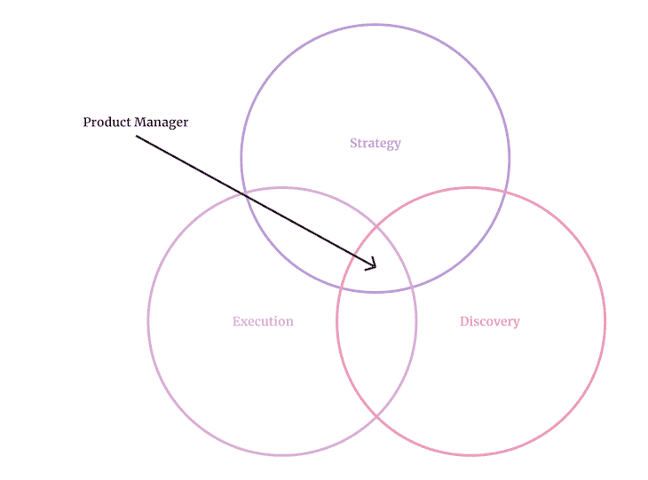
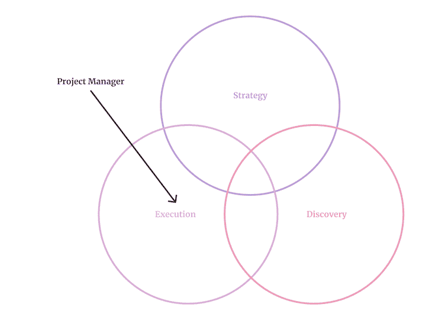
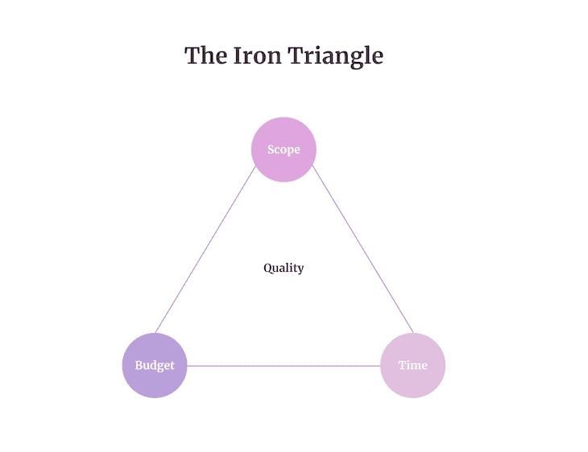
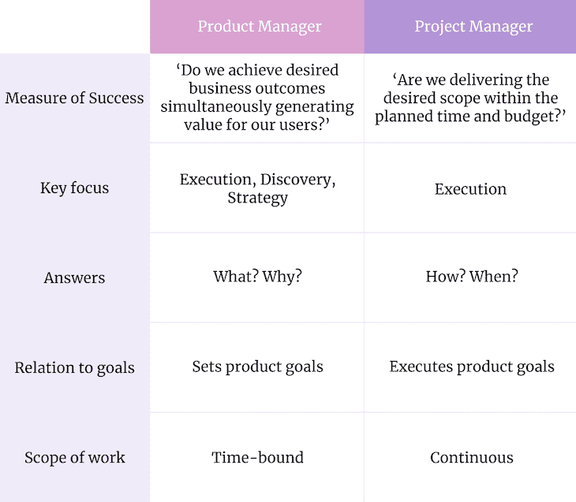
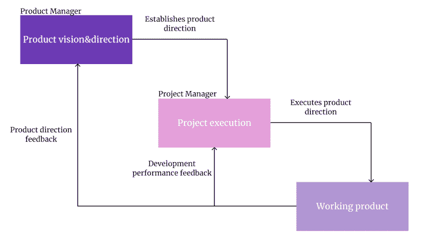

# 产品经理 vs 项目经理:有什么区别？

> 原文：<https://blog.logrocket.com/product-management/product-manager-vs-project-manager/>

项目管理和产品管理这两个领域经常被错误地互换使用。它的从业者甚至倾向于使用同一个缩写:PM。

甚至软件开发行业的人有时也会混淆产品管理和项目管理之间的区别，这导致了许多误解。

想象一下，你被要求招聘一名新的团队成员，招聘经理会说，“是的，产品或项目经理。”信不信由你，那真的发生了。

让我们来分析一下这两个角色有什么不同。

* * *

## 目录

* * *

## 产品与项目

在我们讨论产品经理和项目经理之间的区别之前，让我们了解一下产品和项目实际上是什么。

产品是价值的载体。可以是软件，可以是硬件，甚至可以是无形的服务。

产品的目的是通过向用户传递价值来推动业务成果。因为[业务目标](https://blog.logrocket.com/product-management/what-are-okrs-how-to-write-templates-examples/)和用户随着时间的推移而发展，一个产品永远不会完整；只要有需要，它就存在。

**项目是一个执行工具**。换句话说，这是实现目标的一种方式。

项目旨在在设定的约束条件(如预算、时间)内实现特定的目标(范围)。你可以把[scrum sprint](https://blog.logrocket.com/product-management/what-are-five-types-of-scrum-meetings/#what-are-sprints)看作是短项目。

当我们管理一个产品时，我们管理的是一个长期的、不断发展的价值载体。管理项目就是实现特定的、受约束的目标。

解释完差异之后，让我们来看看产品和项目经理到底是做什么的。

## 什么是产品经理？

产品经理的确切[角色在很大程度上依赖于具体环境，并且根据环境的不同而有很大的不同。一个在早期创业公司工作的产品经理和一个在成熟产品上工作的公司产品经理有着完全不同的工作描述。](https://blog.logrocket.com/product-management/what-does-a-product-manager-do-role-responsibilities/)

### 产品经理的角色

如果我们必须将产品经理的所有职责浓缩成一句口号，那应该是“尽一切努力确保产品成功”

产品经理通过关注三个主要领域来促进成功:

*   **[战略](#strategy-pdm)** —建立和理解[产品方向](https://blog.logrocket.com/product-management/product-strategy-frameworks-examples/)和目标
*   **[发现](#discovery-pdm)** —发现实现战略的机会，了解下一步要做什么
*   **[执行](#execution-pdm)**——确保我们学习和交付的速度很高，并且我们构建的方式是有效的

#### 战略

产品经理的战略活动通常包括:

#### 发现

产品经理在发现方面的职责包括:

#### 执行

在执行阶段，产品经理负责:

执行、发现和战略之间的努力分配取决于经理的背景、角色和资历。例如，公司任务中的初级项目经理可能更关注执行和发现，而初创公司的高级产品经理可能会花大部分时间做战略工作。

### 成功的衡量标准

"我们是否在为用户创造价值的同时实现了预期的业务成果？"

### 产品经理的关键技能

要在这个角色上取得成功，产品经理应该具备以下技能:

*   用户研究
*   战略思维
*   系统考虑
*   技术和设计
*   领导力
*   利益相关者管理
*   研究和分析
*   战略思维
*   沟通

## 什么是项目经理？

产品经理的职责范围很广，而项目经理则更加专注和专业。pjm 对战略和发现领域的贡献不大；死刑是他们的生计。

项目经理有技能和时间真正深入执行和提高效率。例如，产品经理没有时间监控和改进粒度指标，如首次评审时间。这就是为什么我们有项目经理。

### 项目经理的角色

伟大的项目经理能给最混乱和最复杂的任务带来秩序和组织。

与产品经理相比，项目经理在产品开发的[战略](#strategy-pjm)和[发现](#discovery-pjm)阶段扮演的角色要小得多，但却是[执行](#execution-pjm)的组成部分。

项目经理的一些活动包括以下内容。

#### 战略

*   围绕愿景召集关键利益相关方

#### 发现

*   协调发现活动，并确保它们与交付活动保持一致
*   帮助记录重要的学习成果

#### 执行

*   管理预算
*   共同创造并努力[在截止日期](https://blog.logrocket.com/product-management/how-to-meet-product-deadlines/)前交付
*   监控和改进交付进度指标
*   消除团队的障碍
*   建立和改进交付流程
*   在充分沟通和不分散团队注意力之间取得平衡
*   确保开发团队拥有高效工作所需的一切
*   将大功能分解成[可开发的工作块](https://blog.logrocket.com/product-management/what-is-scrumban-methodology-how-to-implement/)
*   协调依赖性并与利益相关者合作
*   解决团队内部的冲突
*   与工程部门合作导致[管理技术债务](https://blog.logrocket.com/product-management/what-is-technical-debt-examples-prioritize-avoid/)
*   围绕[范围、预算和时间表](https://blog.logrocket.com/logrocket-interviews-is-scoping-more-trouble-than-its-worth/)与利益相关方(包括产品经理)协商

虽然项目管理的重点是深入执行领域，但项目经理也为战略和发现工作做出贡献。然而，与产品经理相比，他们的贡献通常是有限的。

* * *

订阅我们的产品管理简讯
将此类文章发送到您的收件箱

* * *

### 成功的衡量标准

"我们是否在计划的时间和预算内交付了期望的范围？"

### 项目经理的关键技能

要取得成功，项目经理应该精通:

*   [敏捷框架](https://blog.logrocket.com/product-management/agile-roadmaps-examples-how-to-create/)
*   冲突解决
*   最佳处理
*   技术流畅度
*   谈判
*   把…编入预算
*   时间线管理
*   利益相关者管理
*   团队领导
*   沟通
*   风险管理

## 产品经理与项目经理:主要区别

下表描述了产品经理和项目经理角色之间的主要区别:

## 项目经理只是初级产品经理吗？

一个常见的误解是，你首先成为项目经理，一旦你有足够的经验和技能，你就可以被“提升”为产品经理。

虽然许多项目经理最终成为产品经理是事实，但这更多的是一个职业支点，而不是阶梯上的另一个台阶。高压力和低产品拥有感会很快耗尽项目经理的精力。

但是产品和项目管理是分开的职业道路。一个有多年经验的熟练项目经理可以轻松管理十几个复杂的、相互依赖的、预算和时间表不切实际的项目——同时管理最困难的利益相关者。一个多面手产品经理可能一想到这么做就会流汗。

的确，项目经理只分担产品经理全部责任的一小部分。但作为回报，他们是真正的执行专家。这项工作越复杂，就越需要这样的专家。

产品经理是多面手，他们经常为执行做出贡献，但当他们致力于建立产品方向时，他们提供了最高的价值。当项目经理关注微小的执行细节时，他们会交付最大的价值。在一定规模下，两者都需要。

## 一个危险的趋势:伪装的项目经理

产品管理热。近年来，人们对这个角色的兴趣直线上升。

这就提出了一个大问题:突然每个人都想[成为产品经理](https://blog.logrocket.com/product-management/product-manager-interview-questions-how-to-answer/)。头衔更花哨，工资往往更高，总体职位描述往往比项目经理更有趣。谁不想成为下一个史蒂夫·乔布斯？

因此，那些努力招聘项目经理的公司采取了一个巧妙的策略:他们干脆把头衔从项目经理改成了产品经理！更糟糕的是，它似乎正在工作。

考虑到进入产品管理领域有多难，在简历上获得这个头衔的机会很诱人，即使实际的职位描述要求 100%的执行力，仅此而已。

这种趋势进一步模糊了角色之间的界限。我最后一次查看招聘信息时，实际上这些伪装的项目经理的职位比真正的产品经理多。

从长远来看，这一趋势将进一步模糊这些角色之间的界限。在某种程度上，我们可能会完全停止称人们为项目经理。专注于执行的产品经理的新时代似乎即将到来。

*精选图片来源:[icon scout](https://iconscout.com/icon/people-network-2863988)*

## [LogRocket](https://lp.logrocket.com/blg/pm-signup) 产生产品见解，从而导致有意义的行动

[LogRocket](https://lp.logrocket.com/blg/pm-signup) 确定用户体验中的摩擦点，以便您能够做出明智的产品和设计变更决策，从而实现您的目标。

使用 LogRocket，您可以[了解影响您产品的问题的范围](https://logrocket.com/for/analytics-for-web-applications)，并优先考虑需要做出的更改。LogRocket 简化了工作流程，允许工程和设计团队使用与您相同的[数据进行工作](https://logrocket.com/for/web-analytics-solutions)，消除了对需要做什么的困惑。

让你的团队步调一致——今天就试试 [LogRocket](https://lp.logrocket.com/blg/pm-signup) 。

[Bart Krawczyk Follow](https://blog.logrocket.com/author/bartkrawczyk/) Learning how to build beautiful products without burning myself out (again). Writing about what I discovered along the way.