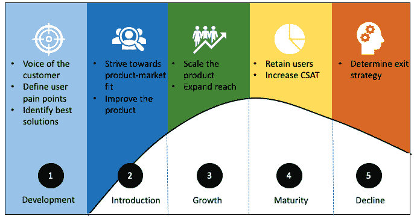

# 产品经理在产品生命周期每个阶段的角色

> 原文：<https://blog.logrocket.com/product-management/product-managers-role-each-product-lifecycle-stage/>

在本指南中，我们将定义产品生命周期的五个阶段(开发、引入、成长、成熟、衰退)，并探讨产品经理在每个阶段的角色。

* * *

## 目录

* * *

## 什么是产品生命周期？

产品生命周期是指一个产品从介绍给用户到退出市场所经历的阶段。

一个产品在推向市场之前，要经过一个[开发周期](https://www.twi-global.com/technical-knowledge/faqs/what-is-a-product-life-cycle)，这个周期由[四个阶段](#4-stages-of-product-development)组成:

1.  思维能力
2.  发展
3.  测试
4.  释放；排放；发布

在产品开发周期之后，产品被引入市场，然后(理想情况下)在达到成熟之前经历一段增长期，最终在市场中的地位下降。

## 产品生命周期的 5 个阶段是什么？

产品生命周期的五个阶段是:

1.  [开发](#development)
2.  [简介](#introduction)
3.  [成长](#growth)
4.  [到期日](#maturity)
5.  [拒绝](#decline)

有些人认为只有后四个阶段(引入到衰落)是产品生命周期的一部分。但在我看来，开发是产品生命周期中同样重要的阶段，因为它为后续阶段奠定了基础。

这五个阶段完成了产品的生命周期。

## 在产品生命周期的每个阶段，产品经理的角色是什么？

[产品经理](https://blog.logrocket.com/product-management/what-does-a-product-manager-do-role-responsibilities/)在整个产品生命周期中扮演重要角色。每个阶段都需要不同的技能和心态来带领团队走向成功，并把产品引向正确的方向。

在每个阶段，产品经理必须[评估 KPI 和指标](https://blog.logrocket.com/product-management/what-metrics-kpis-product-managers-track/)以支持一系列重要决策。

## 1.发展

开发新产品的过程由许多步骤组成，从创意产生到原型制作、构建和测试，再到产品上市。

在这些阶段中，产品经理充当客户的代言人，进行市场研究和调查，了解用户的痛点，并确定解决这些问题的解决方案。

产品经理[定义产品愿景和战略](https://blog.logrocket.com/product-management/what-is-a-product-vision-statement-examples/)以帮助产品团队理解他们为什么以及如何构建他们正在构建的东西。

在这个阶段，目标是构建合适的产品来吸引早期采用者。在产品开发过程的每个阶段，产品经理确保团队的决策围绕客户的痛点。

### 产品开发的 4 个阶段

让我们进一步细分产品开发阶段，探索产品经理在每个阶段的角色:

1.  **想法产生和筛选** —产品经理与团队一起集思广益，评估产品可以提供的解决用户痛点的各种解决方案。PM 的工作是调查所有可用的想法，然后最终确定要构建的功能
2.  **设计和发现** —产品经理定义用户角色，进行市场调查，分析竞争对手的产品。他们与设计师一起定义用户旅程，以及如何建立一流的用户体验
3.  **开发和测试** —一旦团队确定要构建哪些功能，产品经理就与开发团队合作，帮助他们详细理解这些功能，并澄清任何疑问。PM 还与 QA 团队合作，以确保实现的功能向用户交付价值
4.  **产品发布会** —在产品营销经理的帮助下，项目经理努力在[产品发布会](https://blog.logrocket.com/product-management/what-is-a-product-launch-plan-how-to-create/)之前制造市场轰动

### 监控预发布的指标

在这个阶段很难衡量性能，因为产品仍在开发中。然而，产品经理可能会进行焦点小组或调查，以获得更多关于用户痛点的信息，并验证他们的假设。

在发布之前，产品经理可以考虑查看以下内容:

#### 市场尺寸

了解潜在的目标市场规模，并在产品推出时设定市场份额是很好的。

#### 潜在注册用户

如果有一个网站或一个[最低可行产品(MVP)](https://blog.logrocket.com/product-management/what-is-minimum-viable-product-mvp-how-to-define/) 推出，你可以衡量潜在注册人数。注册人数越多，表明兴趣越高，成功的可能性越大。

在预发布阶段，营销团队经常试图在社交媒体上制造声势，以吸引早期用户。参与度可以帮助你追踪用户对你产品的持续兴趣。

#### 产品开发

产品经理的主要职责是跟踪特性的进展，以及它们是否是根据用户需求定制的。

## 2.介绍

介绍阶段指的是一个产品投放市场的时期，无论它是同类产品中的第一个，还是你将一个产品介绍到一个新的市场。在这个阶段，销售量很低，需求逐渐增加。

产品经理与营销团队合作，帮助早期用户了解使用该产品的好处。产品经理是产品的主题专家，因此他们应该能够向内部团队(如营销、工程、支持、销售和设计)解释产品的核心价值。

通常，收集了足够的数据来支持产品发布和它将填补的市场空白，但产品经理在产品发布后验证产品在市场上的需求。

总而言之，产品经理在此阶段的角色是:

*   与营销、销售、支持和设计团队合作，帮助他们理解产品的核心价值
*   在发布前验证假设，并评估客户购买产品的意愿
*   分析用户角色，并根据产品的采用情况添加新的角色
*   跟踪使用指标并验证用户旅程流程
*   将产品推向[产品市场契合度](https://blog.logrocket.com/product-management/what-is-product-market-fit-measure-examples/)
*   根据不断变化的用户需求制定战略以改进产品

### 测量产品性能

一旦产品推出，产品经理必须衡量其性能。在此阶段需要关注的一些关键产品指标包括:

#### 产品激活率

[激活率](https://blog.logrocket.com/product-management/what-metrics-kpis-product-managers-track/#activation)是达到激活点的用户与注册用户总数的比率。激活点指的是指示对该特征的参与的用户动作。

#### 功能采用

[采用指标](https://www.interaction-design.org/literature/topics/product-adoption)表明用户是否真正在使用某个功能或产品。可以使用以下公式计算:

> *采用率=功能 MAU /每月登录次数* 100*

较高的特性采用率表明用户喜欢该特性，并从中获取价值。

#### 客户获取成本

[客户获取成本](https://blog.logrocket.com/product-management/what-metrics-kpis-product-managers-track/#acquisition)代表组织获取一个用户所花费的成本。这可以通过将营销和销售上花费的总额除以给定时间段内获得的客户总数来计算。重点应该是降低这个数字，这样你就可以用更少的支出获得更多的用户。

#### 收入

如果你的产品是可销售的，收入是一个重要的指标。衡量每月和每年产生的收入以及收入增长率至关重要。

## 3.增长

成长期是产品已经证明有市场，需求开始上升的时候。随着销售量的增加，其他竞争者通常会进入市场。知名度、利润、市场份额和竞争的增加表明产品正处于成长阶段。

* * *

订阅我们的产品管理简讯
将此类文章发送到您的收件箱

* * *

营销活动旨在建立品牌价值，以获得竞争优势。作为产品经理，你必须引导产品走向增长。

在成长阶段，产品经理应该:

*   通过添加新功能和服务来保持或提高客户满意度
*   与营销和销售部门合作，确保产品价格具有竞争力
*   在建立品牌价值的同时，努力实现收入和市场份额的最大化

### 衡量增长和范围

在此阶段，随着销售额的增加，跟踪衡量产品增长和覆盖范围的指标非常重要。

此阶段需要关注的一些指标包括:

#### 收入增长率

显然，收入随着销售额的增长而增长，但是[跟踪收入的增长率](https://blog.logrocket.com/product-management/what-metrics-kpis-product-managers-track/#revenue)是很重要的。收入增长率下降令人担忧，可能表明该产品正进入成熟期。

#### 扩张收入

扩张收入是通过向现有用户追加销售获得的额外收入。这是在现有用户基础上增加收入的一个好方法。

#### 参考

[活跃用户的推荐](https://blog.logrocket.com/product-management/what-metrics-kpis-product-managers-track/#referral)确实有助于增加用户群。你也许可以通过向现有用户提供小奖励来增加推荐，这可以带来更多的增长。

#### 客户满意度

用户继续使用你的产品的可能性取决于他们有多开心。通过定期收集用户反馈来衡量客户满意度是至关重要的。[净推介值](https://www.netpromoter.com/know/)是另一个衡量客户满意度和忠诚度的指标。

#### 粘性

粘性是你的产品因为其提供的价值而能够留住用户的能力。

使用以下公式计算粘性:

> *粘性= DAU / MAU*

高粘性意味着产品有能力一次又一次地吸引用户。

## 4.成熟

在一个产品的生命周期中，总会有一段时间，当销售达到顶峰时，你已经最大化了你的顾客群，而收入是不变的。这是一个很好的时间来总结过去的错误，以改善产品和提高保留率。

销售停滞、客户增长下降和竞争加剧都是产品成熟度的指标。在这个阶段，产品经理的重点是保留现有的市场份额。这可以通过将产品与竞争对手区分开来来实现。

目标总是引导产品回到成长阶段，例如，通过尝试进入新的市场。留住客户并保持较高的客户满意度是延长这一阶段的关键。

每个产品都会经历成熟期。诀窍是尽量减少它在那里的时间。

### 衡量成熟度

成熟阶段侧重于保持已经取得的成果，并找出新的方法将产品推回到增长阶段。为此，产品经理应该跟踪以下指标:

#### 流失率

[流失率](https://www.salesforce.com/resources/articles/how-calculate-customer-churn-and-revenue-churn/)是用户停止使用产品的比率——例如，取消订阅。客户流失率可以通过将上一季度流失的客户数除以该季度获得的客户数来计算。目标应该是降低流失率，留住现有用户。

#### 保留率

[保留率](https://blog.logrocket.com/product-management/what-metrics-kpis-product-managers-track/#retention)衡量在给定时间内有多少用户继续使用该产品。留存率越高，用户对产品越满意。

流失率和保留率是齐头并进的。留存率越高，流失率越低。

## 5.下降

不可避免的是，由于各种各样的原因，所有的产品都会进入衰退期。这可能是由于新技术的出现、竞争的加剧、更廉价解决方案的出现以及各种其他因素造成的。

传统的衰退指标包括市场份额下降、销售额下降和客户兴趣减弱。产品经理必须评估下降背后的原因。

### 管理衰退中的产品

应对衰落的一个方法是试图利用现有的品牌价值，进入新的市场。这就是所谓的支点法。或者，您可以通过与营销团队密切合作，将重点转移到重新吸引不活跃的用户上。

如果产品的衰落是不可避免的，产品经理的最终责任是促进现有客户的顺利下线。当你用尽所有其他方法来恢复产品时，情况可能会要求你将产品撤出市场。

在这一阶段，你至少可以做的是尽量减少客户投诉，并尽快解决它们。跟踪客户投诉数量并与支持团队合作解决问题可能会有所帮助。

## 结论

开发新产品并将其推向市场是一场过山车:每个人在发布前后都很兴奋，在增长和成熟阶段势头达到高潮，肾上腺素水平在下降期间开始正常化。

产品生命周期的每个阶段都有自己的挑战和需求。产品经理在每个阶段都扮演着重要的角色，提供指导和支持，并全程衡量进度。

*精选图片来源:[icon scout](https://iconscout.com/icon/implementation-3026663)*

## [LogRocket](https://lp.logrocket.com/blg/pm-signup) 产生产品见解，从而导致有意义的行动

[LogRocket](https://lp.logrocket.com/blg/pm-signup) 确定用户体验中的摩擦点，以便您能够做出明智的产品和设计变更决策，从而实现您的目标。

使用 LogRocket，您可以[了解影响您产品的问题的范围](https://logrocket.com/for/analytics-for-web-applications)，并优先考虑需要做出的更改。LogRocket 简化了工作流程，允许工程和设计团队使用与您相同的[数据进行工作](https://logrocket.com/for/web-analytics-solutions)，消除了对需要做什么的困惑。

让你的团队步调一致——今天就试试 [LogRocket](https://lp.logrocket.com/blg/pm-signup) 。

[Monica Dhiman Follow](https://blog.logrocket.com/author/monicadhiman/) I am passionate about solving business problems by bringing the team together and removing impediments. I started my career as a business analyst before moving into product management. I am a Certified Scrum Master and I also write my thoughts about product management at [MonicaDhiman.com](http://monicadhiman.com).