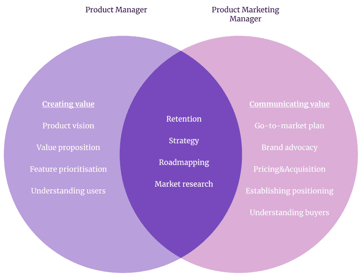
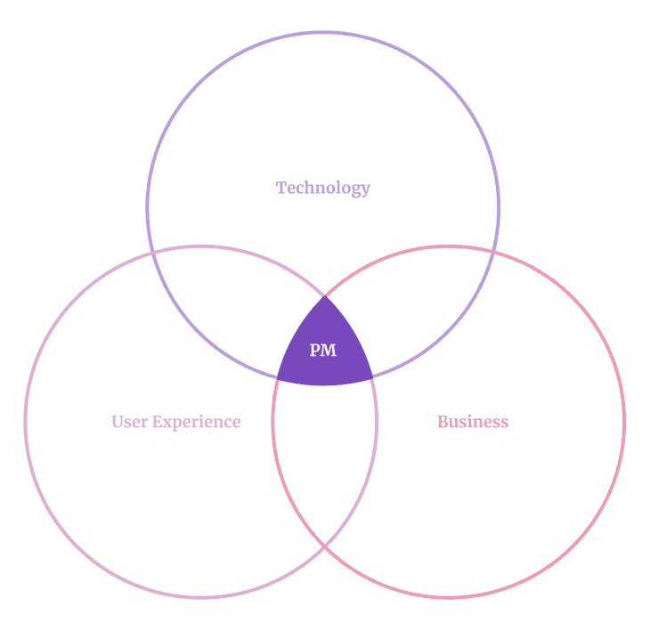
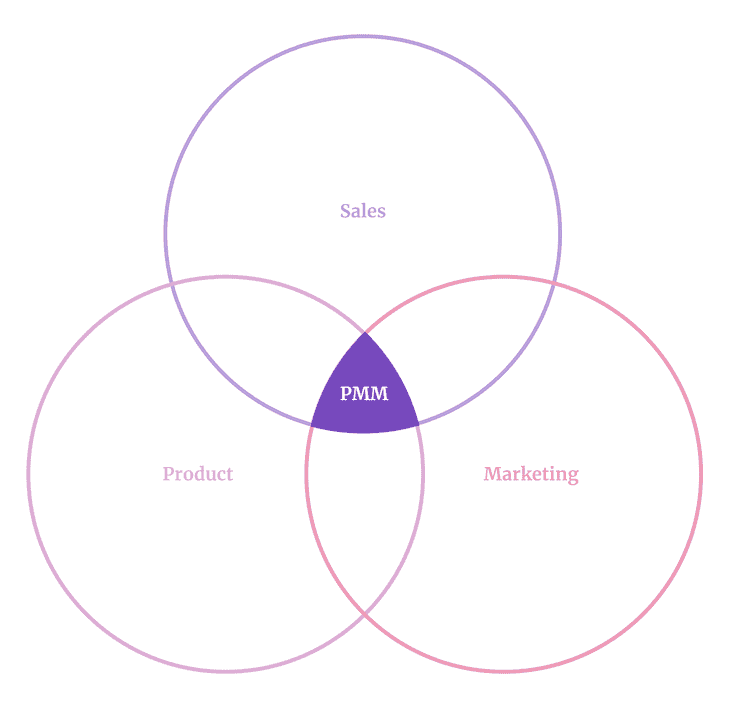
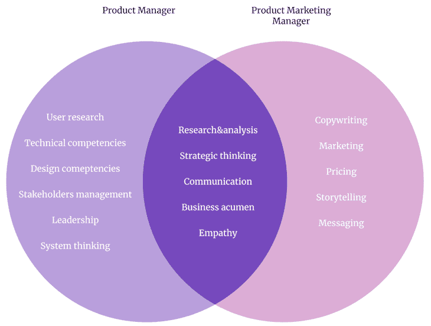
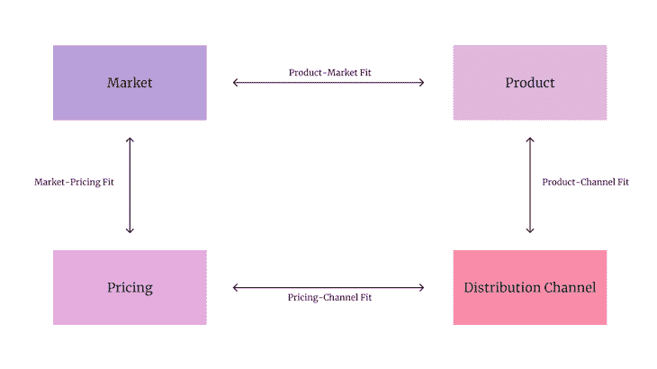

# 产品营销经理是做什么的？职位描述和技能-博客

> 原文：<https://blog.logrocket.com/product-management/product-marketing-manager-job-description-role-skills/>

构建成功的产品是团队的努力。产品越大越成功，团队就越专业化。对于一个人来说，挑战太多了。

虽然在早期阶段你可以和一个多面手产品经理相处，但你会很快达到当地的最高水平。在某种程度上，你将需要更多的专业化来释放进一步的增长。

产品营销经理是你需要加入的首批专家之一。让我们来看看产品营销经理的角色，以及它与标准的产品经理职位描述有何不同。

* * *

## 目录

* * *

## 产品经理与产品营销经理

产品经理(PM)和产品营销经理(PMM)的主要区别在于他们与产品价值的关系。

产品经理专注于**为企业和用户创造**价值。产品营销经理专注于*传达和分配*对购买者的价值。

你两者都需要。一方面，没有强大的价值主张，就没有产品。但是，如果没有人知道它的存在，即使是最有价值的产品也是无用的。

产品经理和产品营销经理的角色对于创造成功的产品都是至关重要的。

### 产品经理职位描述

产品经理的主要目标是为企业和用户创造价值。这个角色就是通过将业务目标与用户需求和痛点联系起来，实现[产品与市场的契合](https://blog.logrocket.com/product-management/what-is-product-market-fit-measure-examples/)。

产品经理的工作涉及以下几个方面:

*   技术(能做什么？)
*   业务(对我们有什么好处？)
*   用户(对用户有什么好处？)

通过结合这些领域，产品经理确保团队构建一个对用户和业务都有效的、可行的、令人满意的解决方案。

| 

#### 职责

 | 

#### 技能

*   用户研究
*   战略思维
*   系统考虑
*   技术和设计
*   领导力
*   利益相关者管理
*   研究和分析
*   沟通

 |

### 产品营销经理职位描述

产品经理创造价值，而产品营销经理将价值带给市场。他们确保价值主张到达他们的目标客户。

产品营销经理工作在以下几个方面的交汇点

*   产品(我们提供什么价值？)
*   销售(我们如何将其货币化？)
*   营销(我们怎样才能到达我们的目标市场？)

通过结合产品、销售和营销，他们确保产品在市场上竞争，并推动我们寻求的业务影响。

| 

#### 职责

*   沟通价值
*   走向市场计划
*   了解买家角色
*   建立最优定价
*   市场调查
*   简化采购
*   保持所需的位置

 | 

#### 技能

*   研究和分析
*   商业头脑
*   营销
*   文案
*   定价
*   讲故事
*   信息发送

 |

## 为什么产品营销经理和产品经理是不同的角色

在早期阶段，[产品经理通常身兼多职](https://blog.logrocket.com/product-management/product-managers-role-each-product-lifecycle-stage/)，包括产品营销经理。

然而，当产品获得牵引力，团队扩大时，可能是时候雇佣一个专门的产品营销经理了。这是因为快速增长的产品需要专注和多样化的技能组合。

### 专注

构建产品是一个复杂的过程，大量的活动让人应接不暇。

产品开发流程包括客户研究、业务分析、市场营销、销售、利益相关者管理、执行、目标设定、团队领导和商业模式创建——仅举几例。

同时关注所有这些领域是不可能的。我们越专注于一项具体的活动，就越会忽略其他方面。你不能鱼与熊掌兼得。

这就是为什么，在一定的规模下，开始专业化是至关重要的。一个人再也不能独自处理所有事情了。

产品管理和产品营销至少都是全职工作。

* * *

订阅我们的产品管理简讯
将此类文章发送到您的收件箱

* * *

### 多样化的技能组合

虽然产品经理和产品营销经理角色所需的技能有所重叠，但他们仍然是不同的专业。同时处理这两个领域是一回事；掌握它们是另一回事。

在某种程度上，当涉及到价值创造和价值分配时，你会做得不够好。你必须完全抓住这些领域来发展和保持成功。

一个人不可能同时是创造产品和发行产品的大师。这两个领域都需要多年的专门实践和专业知识。

归根结底，问题不是你是否应该将产品管理和产品营销的职责分配给多个专业的专家。真正的问题是，你能承受不这样吗？

## 经前综合症、pmm 和四个适合

我们已经确立了为什么我们应该把产品管理和产品营销管理当作两个不同的专业。然而，它们仍然紧密交织在一起。

为了更好地理解它，我们来看一下[四适合框架](https://medium.com/ceoquest/the-four-way-fit-chapter-2-introduction-to-the-four-way-fit-framework-part-1-bc2959f9f817):

产品开发中有四个关键的契合点。产品要想成功，这四个要素都必须具备，缺少其中任何一个都足以扼杀最好的创意。

这四种适合是:

*   **产品-市场契合度** —我们开发的产品是我们的目标市场所需要的
*   **产品-渠道匹配** —产品经过优化，可有效利用特定的分销渠道
*   **定价-渠道契合度** —我们的收入和客户获取成本处于最佳平衡状态
*   **市场定价契合度** —我们的目标市场有足够高的支付意愿来接受我们的价格

产品经理的主要关注点是产品与市场的契合度。产品营销经理关注定价-渠道匹配。

剩下的两个合适的呢？这些是共享的——它们需要首相和 PMM 之间的合作。

## 为什么在筒仓里工作不好

为了说明这个想法，让我们看看当产品管理和产品营销管理是独立的筒仓时会发生什么。

#### 产品与渠道不匹配

产品是为适应特定渠道的规则而制造的。

例如，让我们说，我们想把我们的收购集中在搜索引擎优化。在这种情况下，我们必须在考虑 SEO 的情况下构建产品及其价值。我们应该考虑博客、UGC 或其他 SEO 友好的功能。否则，我们的收购策略就无法奏效。

同样，如果产品本身不鼓励任何形式的病毒式传播，我们也不会培养口碑。

如果我们要发挥任何分销渠道的全部潜力，PMs 产品方向和 PMMs 采购战略必须保持一致。

#### 不符合市场定价

要让定价策略发挥作用，市场必须愿意支付我们要求的价格。然而，只有当产品以特定的价格点提供市场所寻求的特定价值时，我们才会得到报酬。

现在想象一种情况:

*   PMM 需要每个客户的高收入来弥补他们的客户获取成本
*   项目经理认为优先考虑低端大众市场的功能最有价值

就是不行。要么首相应该关注一个更小、更富有的利基市场，要么 PMM 需要重新考虑他们的收购计划

## 为什么 PM-PMM 和谐至关重要

一个产品要想成功，你需要四个匹配，而实现这些匹配需要 PM 和 PM 之间的紧密配合。

产品是按照特定的渠道构建的。渠道产生各种成本，需要用收入来覆盖。

要让定价模型发挥作用，市场必须愿意支付我们要求的价格。只有当我们以他们愿意接受的价格提供他们寻求的价值时，他们才会这样做。

然而，如果一个项目经理和一个 PMM 一起工作，他们可以达到这四个契合点，结果，创造出一个强大的、有竞争力的产品。

*精选图片来源:[icon scout](https://iconscout.com/icon/people-network-2863988)*

## [LogRocket](https://lp.logrocket.com/blg/pm-signup) 产生产品见解，从而导致有意义的行动

[LogRocket](https://lp.logrocket.com/blg/pm-signup) 确定用户体验中的摩擦点，以便您能够做出明智的产品和设计变更决策，从而实现您的目标。

使用 LogRocket，您可以[了解影响您产品的问题的范围](https://logrocket.com/for/analytics-for-web-applications)，并优先考虑需要做出的更改。LogRocket 简化了工作流程，允许工程和设计团队使用与您相同的[数据进行工作](https://logrocket.com/for/web-analytics-solutions)，消除了对需要做什么的困惑。

让你的团队步调一致——今天就试试 [LogRocket](https://lp.logrocket.com/blg/pm-signup) 。

[Bart Krawczyk Follow](https://blog.logrocket.com/author/bartkrawczyk/) Learning how to build beautiful products without burning myself out (again). Writing about what I discovered along the way.