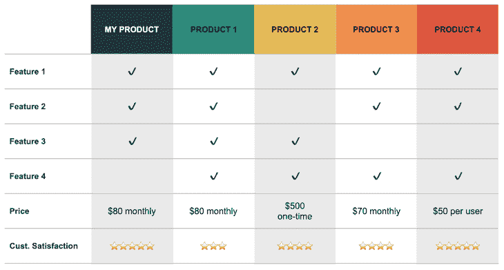
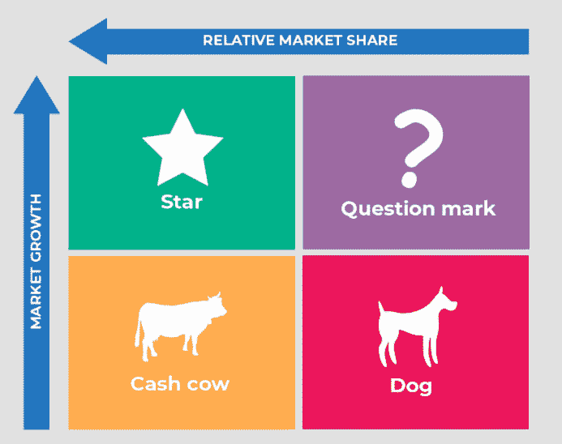
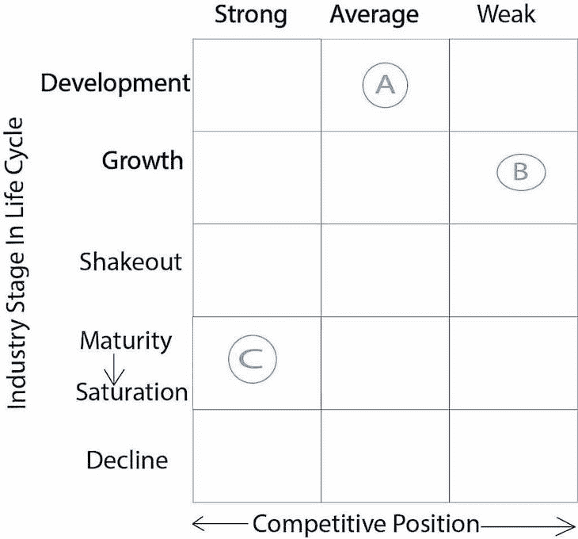
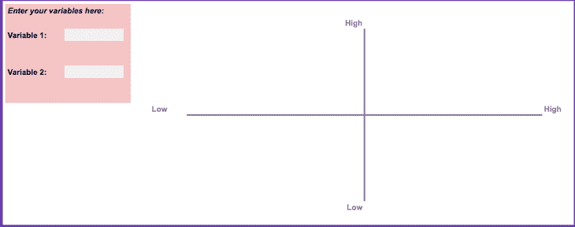

# 如何使用产品矩阵进行决策(模板)

> 原文：<https://blog.logrocket.com/product-management/product-matrix-decision-making-template/>

[Emma Burt Follow](https://blog.logrocket.com/author/emmaburt/) Helping product teams to succeed through consultancy and training. www.playinthegrey.co.uk

# 如何使用产品矩阵进行决策(模板)

## 

2022 年 11 月 29 日 3 min 读 897

你有没有计算过你每天做多少个决定？这个数字可能令人震惊。早餐吃什么，穿什么，穿哪双鞋——这只是一天的第一个小时。

作为[产品经理](https://blog.logrocket.com/product-management/how-nail-first-90-days-product-manager/)，做决策是[工作描述](https://blog.logrocket.com/product-management/what-does-a-product-manager-do-role-responsibilities/)不可或缺的一部分。下一步做什么？要检验哪个假设？如何组织[路线图](https://blog.logrocket.com/product-management/how-to-build-product-roadmap-overview-examples/)？这样的例子不胜枚举。

有些决定很容易做，有些则困难得多。这就是为什么有很多工具和框架来帮助你做决定。如果你决策的障碍是信息的数量，产品矩阵可以帮助你想象和理解信息。

* * *

## 目录

* * *

## 什么是产品矩阵？

产品矩阵将多个产品的各个方面与另一个维度或多个维度进行比较。概括地说，有两种类型的产品矩阵:

最合适的矩阵将取决于您需要做出的决策类型。当你理解你所拥有的信息时，你可能需要尝试不同的类型。

让我们看看每种类型的产品矩阵，了解如何构建一个矩阵，并探索使用这种方法可以做出的决策类型的一些示例。

## 产品特征矩阵

要创建产品特性矩阵，在一个轴上创建所有产品的列表，在另一个轴上创建特性列表。然后，映射哪些产品具有哪些功能。

下面是一个产品特性矩阵的示例:

Source: [Feature Upvote](https://featureupvote.com/blog/product-comparison-template/)

当你在思考[产品组合中的产品如何相互补充或重叠](https://blog.logrocket.com/product-management/what-is-product-portfolio-management/)时，产品特征矩阵非常有用。

就其本身而言，矩阵对决策的用途可能有限。但是，如果你将这些数据与其他数据和来自客户的反馈结合起来，那就非常有用了。这种方法可以帮助您回答以下问题:

*   两个或两个以上的产品是否有太多的重叠？
*   为什么一个产品卖得好，而一个类似的产品卖得不好？
*   为什么你功能最丰富的产品不如其他更基本的产品卖得好？

## 产品市场矩阵

追溯到 20 世纪 60 年代，产品市场矩阵被用来推动营销和战略决策的例子不胜枚举。

产品市场矩阵有助于产品经理[根据市场条件](https://blog.logrocket.com/product-management/what-is-product-market-fit-measure-examples/)查看您的产品组合。反过来，这可以帮助您确定产品的战略和机会。

随着当今市场变化速度的加快，为了在竞争中领先一步，市场状况值得重新审视。

产品市场矩阵的类型包括以下几种:

### 波士顿矩阵(又名增长份额矩阵)

这种类型的经典矩阵，几乎任何学过商业的人都熟悉，是波士顿咨询集团(BCG)矩阵，或[增长份额矩阵](https://www.bcg.com/about/overview/our-history/growth-share-matrix)。

要构建这个矩阵，创建一个 2×2 的网格，一边是产品增长(高/低)，另一边是市场增长(高/低)。然后，将您的产品映射到每个象限，确定符合以下四个类别的产品:

*   摇钱树
*   后起之秀
*   宠物(或狗)
*   问号

从成长型股票矩阵中获得的洞察力可以帮助你决定未来投资的策略。

Source: [EdrawMind](https://www.edrawmind.com/article/best-10-bcg-matrix-examples-for-students.html)

### 霍弗的产品市场演变矩阵

另一个值得了解的产品市场矩阵是霍费尔的产品市场演化矩阵。

为此，您需要根据行业成熟度和竞争地位来设计您的产品。鉴于[产品通过生命周期](https://blog.logrocket.com/product-management/what-is-product-development-lifecycle-stages-examples/)的速度越来越快，这种类型的分析尤其有价值。

Source: [Thekeepitsimple](https://www.thekeepitsimple.com/portfolio-analysis/)

上述两种产品市场矩阵都有助于回答以下问题:

*   你应该继续投资这个产品吗？
*   你应该在产品开发或营销上花多少钱？
*   这个产品的实验成功了吗？

## 产品矩阵模板

产品矩阵的核心原则是绘制出信息，以帮助围绕产品开发和管理做出决策。当您确定了需要检查的参数后，您可以创建一个矩阵来绘制任何内容。

你可以使用这个免费的[产品矩阵模板](https://docs.google.com/spreadsheets/d/18RaBMcURDVFNt1DeK8cpwFzGXEF4azf-WNqe1jb-6Os/edit#gid=0)来构建你自己的决策矩阵。要定制模板，首先[访问电子表格](https://docs.google.com/spreadsheets/d/18RaBMcURDVFNt1DeK8cpwFzGXEF4azf-WNqe1jb-6Os/edit#gid=0)，然后从菜单栏中选择**文件>制作副本**:

Download this [product matrix template](https://docs.google.com/spreadsheets/d/18RaBMcURDVFNt1DeK8cpwFzGXEF4azf-WNqe1jb-6Os/edit#gid=0) (**File > Make a copy** to customize)

## 摘要

作为产品经理，找到合适的工具来帮助你做决定是你成功所需的众多技能之一。做决定时需要考虑很多信息，产品矩阵可以成为战略规划的宝贵工具。

虽然决策矩阵对于比较多种产品最有用，但只要您能够定义需要分析的矩阵的各个方面，基本概念也可用于围绕单个产品做出决策。使用上面的[免费模板](https://docs.google.com/spreadsheets/d/18RaBMcURDVFNt1DeK8cpwFzGXEF4azf-WNqe1jb-6Os/edit#gid=0)进行尝试。

*精选图片来源:[icon scout](https://iconscout.com/icon/graph-217)*

## [LogRocket](https://lp.logrocket.com/blg/pm-signup) 产生产品见解，从而导致有意义的行动

[LogRocket](https://lp.logrocket.com/blg/pm-signup) 确定用户体验中的摩擦点，以便您能够做出明智的产品和设计变更决策，从而实现您的目标。

使用 LogRocket，您可以[了解影响您产品的问题的范围](https://logrocket.com/for/analytics-for-web-applications)，并优先考虑需要做出的更改。LogRocket 简化了工作流程，允许工程和设计团队使用与您相同的[数据进行工作](https://logrocket.com/for/web-analytics-solutions)，消除了对需要做什么的困惑。

让你的团队步调一致——今天就试试 [LogRocket](https://lp.logrocket.com/blg/pm-signup) 。

[Emma Burt Follow](https://blog.logrocket.com/author/emmaburt/) Helping product teams to succeed through consultancy and training. www.playinthegrey.co.uk