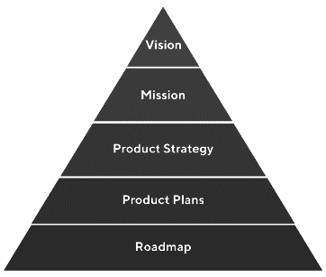

# 产品策略指南:框架和例子

> 原文：<https://blog.logrocket.com/product-management/product-strategy-frameworks-examples/>

你是一个正在寻找方法来引导和激励你的团队的产品领导者吗？或者也许你是一名[产品经理](https://blog.logrocket.com/product-management/what-does-a-product-manager-do-role-responsibilities/),正在寻找有效传播你的计划的方法。你甚至可能是一个想要为即将到来的许多关键决策建立基础的创始人或企业家。

无论你在哪里，你都不会孤单。对许多人来说，产品战略感觉像一个谜，没有标准的定义或方法。

在本指南中，我将尽我所能去揭开产品战略的神秘面纱，并概述一个产品战略框架来帮助你引导你的团队走向成功。

* * *

## 目录

* * *

## 什么是产品战略？

产品战略是一个持久而动态的决策框架，旨在引导商业模式、团队、个人和整个组织文化走向长期成功。

一个好的产品战略从一个很少改变的高层次目标开始，并缩小到自组织团队的日常敏捷执行，这将经常改变。一个好的策略激励团队，并为团队提供清晰的思路。

### 传统产品战略金字塔

描绘产品战略的传统方式是使用[金字塔](https://www.productplan.com/learn/guide-to-product-strategy/)。

在我看来，这个模型并没有有效地说明一个产品策略是做什么的，或者如何定义它。

首先，金字塔从底部开始，而不是顶部。大概，愿景和使命位于金字塔的顶端，因为它们是最重要的——但是基础难道不是金字塔结构中最重要的部分吗？为什么像[路线图](https://blog.logrocket.com/product-management/how-to-build-product-roadmap-overview-examples/)这样的战术步骤会被描绘成任何事情的基础或起点？

不管怎样，好消息是这些年来我们已经学到了很多关于数字产品开发的知识。今天，我们知道路线图和策略不是一个产品或公司战略的良好基础。

### 产品战略漏斗

一个健全的产品战略不像一个金字塔，它不断地推动建设越来越多，而是一个漏斗，在每个阶段逐步清晰地指导团队。

没错——产品战略不是做事情。这是关于知道什么该做，什么不该做。

马丁·埃里克森(Martin Eriksson)从《关注产品》(Mind the Product)中给了我很大的启发，他谈到了一个他称之为[决策堆栈](https://martineriksson.com/the-decision-stack)的模型，其中类似[产品愿景](https://jordanlamborn.medium.com/7-point-checklist-for-a-better-vision-f0d77a53fb45)和目标等熟悉的元素只是帮助我们缩小选择范围的决策。

[https://www.youtube.com/embed/h2dEX2o7cvw?start=225](https://www.youtube.com/embed/h2dEX2o7cvw?start=225)

视频

正如史蒂夫·乔布斯曾经说过的那样，“事实上，我为我们还没有完成的事情和我已经完成的事情感到骄傲。创新就是对 1000 件事情说不。”

## 敏捷团队的现代产品战略框架

那么现代产品战略框架是什么样的呢？该模型包括六个层次:目的、使命、愿景、战略、目标和策略。

在提出这些想法时，要简洁(1-3 句话)，大胆，积极，有启发性。特别是对于更高层次的陈述，传达你的产品将如何为了你的团队成员、合作伙伴和客户的利益而使世界变得更美好。

让我们用例子详细探讨这个产品策略框架的每一层。

### 目的陈述

目标声明是在公司层面上制定的。它是业务的最高层次的“为什么”:为什么业务或产品存在？它应该足够宽泛，能够将自己与具体的“是什么”(即解决方案)区分开来，但又足够狭窄，能够准确反映公司如何看待自己。

目的陈述不应该超过一句话。理想情况下，目的永远不会改变。

#### 目的陈述示例

> 我们在这里帮助人们实现他们的梦想。

尽管这个目的很广泛，我们仍然有无尽的空间去探索和发展。

在这个例子中，我们已经缩小了我们要追求的东西的范围。为了忠实于目标陈述，我们需要对许多事情说不。

### 宗旨

如果目的是最高层次的“为什么”，那么使命是我们最高层次的“如何”:我们计划如何追求我们的目的？

这一使命可能永远不会改变，但它可能会随着重大的客户需求或技术变化而改变。

#### 使命陈述示例

> 我们将提供解决方案，帮助所有人进步、成长，并在工作中找到满足感。

在这个例子中，我们承诺提供“解决方案”，但是语言故意含糊不清。这些可以是规模化的技术解决方案，也可以是更加个性化的解决方案。

“工作”一词也有意模糊。这种说法表明，我们认为人们希望在他们的活动中找到价值，即使这不是传统的职业或有偿服务，无论他们的年龄、地点或经济地位如何。

### 愿景陈述

在这一点上，我们已经做了一些决定。我们知道*为什么*我们存在(目的)，并且，广义地说，*我们计划如何*采取行动(使命)。现在，我们将定义*如果我们实现了我们的目标和使命，我们的产品应该是什么样子。*

你的[产品愿景陈述](https://blog.logrocket.com/product-management/what-is-a-product-vision-statement-examples/)是最高层次的“什么”，旨在给团队持续的方向和动力。一个愿景可能会持续几年，并随着时间的推移而略有变化。

一份好的产品愿景声明是令人向往的。一个伟大的愿景似乎几乎无法实现。

* * *

订阅我们的产品管理简讯
将此类文章发送到您的收件箱

* * *

#### 愿景陈述示例

> 我们将建立世界上最积极、最有帮助、最多样化的人际网络，在实现目标和提高技能的过程中相互支持。

这种愿景可能吗？谁知道呢，但我们会找到答案的！

这个产品愿景陈述的例子足够具体，它*可以*被测量和证明。我们避免使用“最好”和“领先”这样的通用语言，因为这并不意味着任何具体的东西，因此，不能为我们的团队提供任何真正的方向。每一步都应该缩小我们的选择范围，帮助我们集中注意力。

### 战略声明

战略陈述是目标的总结，我们接下来会谈到。如果有三个目标(或目标或主题)，策略应该是一个描述所有目标的简洁陈述。

产品战略陈述应该有 1-3 句话长。虽然战略陈述应该主要放在“如何做”的部分，但是对“为什么”点头和对“做什么”的一点暗示可能是有帮助的。

你的策略应该比愿景更频繁地改变(例如，一年两次，等等)。对于单一产品，策略可能一年完全改变一次，也可能每隔几个月就稍有变化。如果是在公司层面或大型复杂产品上，它会更耐用。

### 目标

无论你选择什么样的目标设定框架，都要把目标当作一个占位符。你可能有一些战略主题、OKRs、BHAGs、工作流、SMART 或其他东西。

无论你选择关注什么样的[产品指标](https://blog.logrocket.com/product-management/what-metrics-kpis-product-managers-track/)，它们都应该是可衡量的和深思熟虑的。这套战略目标是你战略的核心。

目标对于向客户传递价值至关重要，但如果它们与你的产品愿景、使命和目的没有联系，它们就毫无意义。

### 策略

这是授权产品团队正在交付的工作，以移动度量标准并朝着他们的目标前进。

例如，任何 [scrum 工件或仪式](https://blog.logrocket.com/product-management/what-are-five-types-of-scrum-meetings/)都生活在这里。其他例子包括团队操作程序、[每日站立](https://blog.logrocket.com/product-management/the-daily-scrum-meeting-overview-best-practices-anti-patterns/)、演示、迭代、路线图、发现、实验、史诗、用户故事、用户研究和头脑风暴。这些是日常的[敏捷活动](https://blog.logrocket.com/product-management/four-agile-manifesto-values-explained/)产品开发团队承担交付有价值的软件和特性。

这对团队意味着什么？团队追求的每个项目、史诗、实验或客户问题都应该支持产品或公司目标。这通知了优先级，并给团队一个基础来挑战无助于公司实现其目标的请求。

## 产品战略框架的好处是什么？

上述产品战略框架旨在促进以下内容:

### 焦点

这个框架是关于切断选择。每一层都缩小了我们的选择范围，有助于我们专注于向客户提供价值，而不会分心。

### 模块性

这个策略模型的每一部分都很小，都有特定的用途。这些元素可以拆分并用于不同的演示、商业案例等。

另一方面，可以将这些陈述组合在一起显示，用几个句子就可以提供公司战略的全面视图。

### 简洁

要遵守的最重要的规则是那些规定每个语句长度的规则。如果你团队中的人和其他利益相关者不能回忆或清楚地说出你的愿景是什么，那么你就没有愿景。如果人们记不住战略，就没有战略。

毕竟，如果没有人真正去阅读，那么目标、使命和愿景白皮书又有什么用呢？

### 目的的定义

大多数战略框架没有将目标和使命分开，许多公司没有区分愿景和使命。将目的、使命和愿景定义为不同的决策强制语句是该模型的一个主要优点。

## 去创造有意义的东西吧！

我的希望是，这种结构可以帮助一个人开始重新规划他们的战略，并给至少一个团队带来新的目标感。

如果你已经做到了这一步，这里有一些你可能会喜欢的资源:

*精选图片来源:[icon scout](https://iconscout.com/icon/frame-corners-3603471)*

## [LogRocket](https://lp.logrocket.com/blg/pm-signup) 产生产品见解，从而导致有意义的行动

[LogRocket](https://lp.logrocket.com/blg/pm-signup) 确定用户体验中的摩擦点，以便您能够做出明智的产品和设计变更决策，从而实现您的目标。

使用 LogRocket，您可以[了解影响您产品的问题的范围](https://logrocket.com/for/analytics-for-web-applications)，并优先考虑需要做出的更改。LogRocket 简化了工作流程，允许工程和设计团队使用与您相同的[数据进行工作](https://logrocket.com/for/web-analytics-solutions)，消除了对需要做什么的困惑。

让你的团队步调一致——今天就试试 [LogRocket](https://lp.logrocket.com/blg/pm-signup) 。

[Jordan Lamborn Follow](https://blog.logrocket.com/author/jordanlamborn/) Product manager, passionate about understanding customers and helping people with problems that matter to them. Experienced in SQL, experimentation, data analysis, research, no-nonsense SEO. I also invented self-driving vehicles.