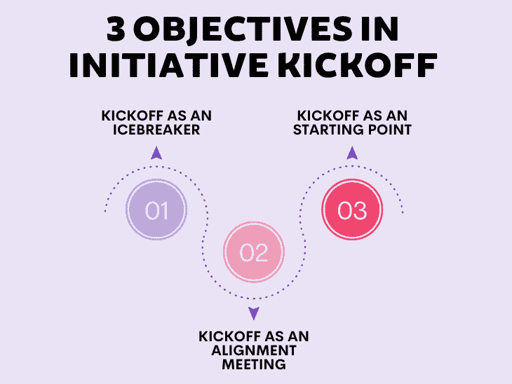
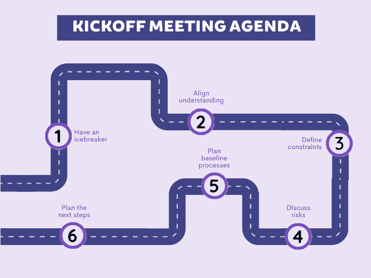

# 如何召开适当的项目启动会议(议程示例)

> 原文：<https://blog.logrocket.com/product-management/project-kickoff-meeting-sample-agenda/>

项目启动是产品开发中的一个关键事件。

做好它，你将启动整个过程，增加成功的几率。如果做得不好，最好的情况是，你会有一个缓慢的开始。

开球有很多种。它们是:

*   [产品团队内部会议](https://blog.logrocket.com/product-management/5-mistakes-product-teams-make-how-to-avoid/)
*   开发团队的技术会议
*   与外部产品负责人召开协调会议
*   与客户的正式会面
*   与主题专家的首次研讨会

出于本文的考虑，我将假设最常见类型的动员会——由产品经理或团队外部的利益相关者/发起人完成。

* * *

## 目录

* * *

## 为什么您应该召开项目启动会？

谈到开会，我是一个怀疑论者。大多数产品经理参加或组织了太多的会议，而许多会议是不必要的。

但是，倡议启动不在其中。会议的好处很容易超过它的成本。

典型的动员会有三个目标:

1.  [开始破冰](#kickoff-as-an-icebreaker)
2.  [启动校准会议](#kickoff-as-an-alignment-meeting)
3.  [以开球为起点](#kickoff-as-a-starting-point)

### 作为破冰的开始

如果整个团队已经互相了解并一起工作，那是很好的，但是大多数团队没有。

不同的计划需要不同的技能和专业知识。即使团队的大多数成员保持不变，一个新的涉众和一个新的主题专家也足以改变团队的动态。

动员会为人们提供了一个正式的机会来相互了解，(重新)定义他们的工作和沟通方式，并了解新的团队设置如何协同工作。

### 作为协调会议启动

动员会是让所有人达成共识的绝佳机会。

你可能在会议前分享了一些文档、业务目标和建议的路线图。但是，让我们实话实说；团队中的大多数人要么没有阅读，要么只是简单浏览了一下。

即使他们更深入地挖掘计划的细节，他们也经常会有疑问，用他们的假设填补空白，并可能形成与你不同的观点。

动员会允许每个人分享他们的观点，提出问题，并澄清所有的细节。利益相关者可以提供额外的背景和叙述，每个人都可以澄清他们的疑虑。

每个人都应该保持一致，清楚地理解该计划背后的“原因”。启动有助于做到这一点。

### 以开球为起点

开始总是最难的。backlog 是空的，范围没有细化，接下来的步骤也不清楚。

开球有助于突破这一点。

动员会的目标之一是留下一个明确定义的后续步骤列表，这应该会引出进一步的后续步骤。它就像一个引发火灾的火花。

## 启动准备

动员会通常是不完全了解对方的人聚在一起讨论他们不完全理解的计划的会议。

* * *

订阅我们的产品管理简讯
将此类文章发送到您的收件箱

* * *

为了确保它不会变成一个无组织的、浪费的会议，一定要做好准备。会前 30 分钟的总结是不够的。

有几个方面是你最应该关注的:

1.  [浏览所有已知的文档和资源](#go-through-all-known-documentation-and-resources)
2.  [列出问题、疑问和假设](#list-questions-doubts-and-assumptions)
3.  [在会议前会见关键人物](#meet-key-people-before-the-meeting)

### 浏览所有已知的文档和资源

整个团队应该尽可能多地获取背景信息。这将允许他们提出更好的问题，参与讨论，并更好地理解各种主题。没有这些，你所能做的就是 PPT 讲解器演示，这不是开始。

### 列出问题、疑虑和假设

在浏览所有资源时，你可能会有一些疑问和问题。那很好；列出来，但不要就此打住。花些时间有意识地寻找你的理解或概念中的任何缺口。你在开始时澄清得越多越好。

### 在会议前会见关键人物

在启动前，与主要利益相关方、您的技术主管以及在该计划中担任领导角色的任何人会面。阐明会议的目标，并尝试解决他们的任何疑问。如果你已经有了问题和疑惑，就和他们分享吧。这会帮助他们更好地为会议做准备。

你准备得越充分，你从会议中得到的就越多。

## 启动会议议程

在启动期间，您应该确保:

在每个项目上花多少时间，启动会应该持续一个小时还是两天，在很大程度上取决于具体的环境。

你准备得越多，你就越清楚应该为每一部分预留多少时间。

### 有破冰船吗

确保房间里的每个人都明白谁是谁。对于新团队，我甚至会考虑用便签贴上他们的角色，或者把他们作为昵称添加进去(例如，“Bart–PM”)。它有助于将新知识置于更好的环境中。

当有人提出一个想法，指出一个风险，或不同意某人的观点时，如果你知道他们在这个计划中的角色，就更容易理解他们的想法或想法。

另外，留出一些时间进行非正式的热身活动，比如[即兴社交](https://www.liberatingstructures.com/2-impromptu-networking/)。这将帮助人们从其他环境中转变过来，激励他们，并帮助他们相互了解。

### 统一理解

要进行富有成效的讨论，你必须让每个人都达成共识。不过，保持高水平。最好把更详细的问题和讨论留到以后，一旦每个人都有了相同的最终想法。

您应该寻求回答的问题包括:

*   你到底想达到什么目的？最终愿景是什么？
*   你为什么想实现这个目标？
*   你为谁这么做？哪个用户角色/客户？
*   成功的标准是什么？你将如何衡量它？
*   这个想法是怎么产生的？你在什么样的背景下经营？

### 定义约束

既然您已经了解了该计划背后的内容、原因和方式，那么让我们来讨论一下它的局限性。总有一些。

通常有三种类型的限制:

1.  [范围](#scope)
2.  [时间](#time)
3.  [预算](#budget)

#### 

#### 范围

在理想的场景中，团队应该能够定义他们认为合适的计划范围，以满足预期的结果，但是情况并不总是这样。

可能会有一个适当的合同来固定范围的某些部分，或者安全/隐私需求可能会使某些事情不可协商。

虽然 100%固定范围是导致特性工厂的反模式，但也很少有完全的灵活性。确保你们在团队能力范围内的定义和不可协商的内容上保持一致。

此外，要明白如果您没有交付范围的某个部分会发生什么。这会帮助你更好地管理风险。有时，不提供一个“必须具备”的特性意味着一个大客户会在以后加入这项服务。有时，它会使整个产品不符合法律规定，使其无法使用。这两者在严重程度上有很大区别。

#### 时间

你有多少时间来实现最初的目标？

试着理解计划应该在什么时候完成，最重要的是，为什么？

如果你穿越时间线会发生什么？

“截止日期”在谈论以下内容时是完全不同的意思:

*   高管们设定的一些梦幻约会
*   限时[市场机会](https://blog.logrocket.com/product-management/what-is-market-share-definition-formula-how-to-grow/#total-market-opportunity)
*   监管或合同相关义务

#### 预算

在资源方面，你有多灵活？

如果需要可以添加新人吗？或者外包一部分工作？

此外，还要讨论长期维护成本。我知道这很难预测，但是你需要一些基本的假设。当他们必须将云成本保持在每月 500 美元以下时，团队将优先考虑不同的解决方案，而不是当可扩展性是重中之重时。

### 讨论风险

现在，您已经了解了全局和约束，是时候讨论风险了。有些你可能在准备工作中发现了，有些来自前面的章节。

做风险预测练习有不同的方法。例如，你可以试着验尸。也就是说，你认为这个计划完全失败了，并试图列出所有导致失败的原因。这也是一个非常有趣的练习。

目标不是描绘所有可能的[风险](https://blog.logrocket.com/product-management/what-is-porters-five-forces-analysis/#understand-corporate-risk)。风险管理是一个持续的过程。目标是确定可能破坏整个计划的最大问题，并且应该从第一天起就进行监控和解决。

### 规划基线流程和沟通

动员会是奠定一些合作基础的机会。这里需要回答的一些问题包括:

*   您计划使用什么样的[框架](https://blog.logrocket.com/product-management/6-product-management-frameworks-you-should-know/)来交付该计划？
*   你想什么时候见面进行计划、改进和评审？
*   您计划使用哪些[沟通渠道](https://blog.logrocket.com/product-management/what-is-pert-chart-how-to-make/#how-to-make-a-pert-chart)？
*   你打算如何管理计划、[路线图](https://blog.logrocket.com/product-management/what-is-a-project-roadmap-overview-how-to-template/)和预算？

同样，这里的目标不是发现一种完美的工作方式。一个团队需要几个月的时间来找出最适合他们的系统。

目标是有足够的基础知识来开始。

### 计划接下来的步骤

如果人们不仅理解这个计划，而且知道他们下一步应该做什么，你知道你的开始是很棒的。

它不一定是一个非常详细或长期的计划。接下来的步骤可以是，例如:

1.  更新计划文档
2.  为明天的提炼做准备
3.  使用细化结果使第二天的第一个冲刺计划足够好

请记住，这不一定是一次会议。可能是一系列的小型会议。

你可以在一次会议上召集大家，然后让他们准备在第二次会议上讨论风险和限制，然后给他们时间提出一个你将在第三次会议上确认的行动计划。

## 包裹

如果做得好，动员会帮助每个人达成共识，更好地理解问题，并在良好的氛围中开始工作。

这是一次如此重要的会议，每个人都应该做好充分的准备。会议的有效性取决于准备工作的质量。

动员会的目标是打破僵局，团结所有人，讨论约束、风险、流程和期望，并留下清晰的后续步骤。

不过，不要太担心。虽然有些人认为启动仪式是一个超级正式、严肃的仪式，但在一个随意、友好的气氛中进行效果最好。把它想象成一群同事在谈论一个共同的话题。

## [LogRocket](https://lp.logrocket.com/blg/pm-signup) 产生产品见解，从而导致有意义的行动

[LogRocket](https://lp.logrocket.com/blg/pm-signup) 确定用户体验中的摩擦点，以便您能够做出明智的产品和设计变更决策，从而实现您的目标。

使用 LogRocket，您可以[了解影响您产品的问题的范围](https://logrocket.com/for/analytics-for-web-applications)，并优先考虑需要做出的更改。LogRocket 简化了工作流程，允许工程和设计团队使用与您相同的[数据进行工作](https://logrocket.com/for/web-analytics-solutions)，消除了对需要做什么的困惑。

让你的团队步调一致——今天就试试 [LogRocket](https://lp.logrocket.com/blg/pm-signup) 。

[Bart Krawczyk Follow](https://blog.logrocket.com/author/bartkrawczyk/) Learning how to build beautiful products without burning myself out (again). Writing about what I discovered along the way.