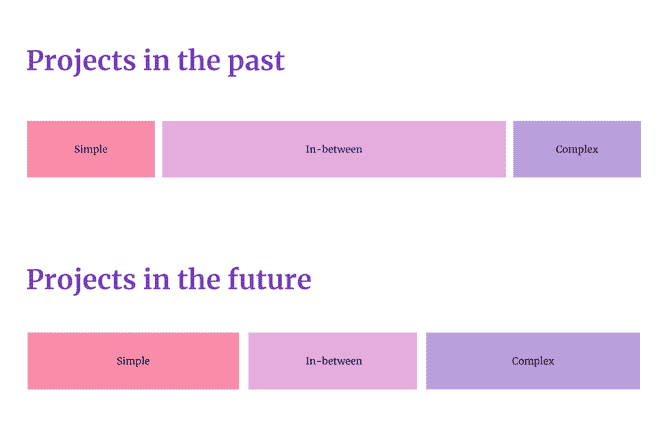

# 2023 年要监控的 4 个项目管理趋势

> 原文：<https://blog.logrocket.com/product-management/project-management-trends/>

项目管理是世界上最古老的职业之一。仔细想想，即使是建造罗马竞技场也需要有人监督整个过程。

同时，它也是发展最快的学科之一。

今天的项目管理与 10 年前大不相同。如今，我们看到许多[产品经理](https://blog.logrocket.com/product-management/)也在承担传统的项目管理责任。

让我们看看 2022 给这门学科带来了什么，它将如何进一步进化。以下是对项目管理未来的四个预测。

* * *

## 目录

1.  [混合交付管理](#hybrid-delivery-management)
2.  [优化和生产力将再次成为潮流](#optimization-and-productivity-will-become-trendy-again)
3.  [更加关注产品和商业价值](#increased-focus-on-product-and-business-value)
4.  [复杂项目和简单项目之间的差距越来越大](#a-growing-gap-between-complex-and-simple-projects)

* * *

## 1.混合交付管理

在项目管理的早期，瀑布方法是王者。这很自然。你开始一件事，完成它，然后添加另一件事，重复这个过程。在建造纪念碑、桥梁之类的东西时，它工作得很好。

随着时间的推移，项目的性质发生了变化。不断增长的信息技术行业开始从可预测的简单项目转向更复杂和不可预测的项目。每个人都想变得敏捷。

Scrum 到处都是。它很快成为所有问题的默认解决方案。无论你问谁，他们都声称在 scrum 工作。事实上，它往往远离真相是一个不同的话题。

但是最近几年，对 scrum 的大肆宣传开始消失。

时间已经证明，没有完美的解决方案，创造价值不仅仅是遵循预先定义的框架。

看板重新受到我们的青睐，新的方法如[塑造](https://blog.logrocket.com/product-management/what-is-shape-up-methodology/)出现了。对[产品管理](https://blog.logrocket.com/product-management/)的日益关注也产生了重大影响。

产品宣传提醒人们，这一切都是为了确保团队交付尽可能多的商业价值。它从来都不是关于一个特定的框架。

人们不再那么关心一个项目是如何管理的，只要它能交付令人满意的结果。

这种思维的转变导致了混合项目管理的兴起，在混合项目管理中，项目团队创建了他们自己定制的交付结果的方法。

混合项目管理框架的一个例子可能包括:

*   [Gannt 图表](https://blog.logrocket.com/product-management/gantt-charts-step-by-step-guide-modern-teams/)用于规划史诗交付
*   在这些史诗中进行实验的 Scrum 和构建-测量-学习循环
*   处理 bug、技术债务和附带请求的看板

有些人可能会说我刚刚列出的方法充满了反模式。也许吧。

但如果成功了，就成功了。做一个纯粹主义者很难有所帮助。

随着时间的推移，越来越多的人会从无条件地遵从 Scrum 指南，转向在特定情况下做最有效的事情。

## 2.优化和生产力将再次成为潮流

让我们面对现实:多年的牛市和快速增长的 it 行业已经让这个行业变得有些懒惰。

过去几年，公司董事会成员过多比过少更为常见。当你在截止日期前遇到问题时，很容易投入更多的人去解决，购买第三方解决方案，或者完全外包给软件公司。

从科技公司获得更多资金很容易，这使得通过向它们投入资源来解决问题变得很普遍。

然后科技泡沫破裂了。2022 年的危机给许多人敲响了警钟。

融资变得更加困难，维持债务变得更加昂贵，而不断上升的通货膨胀改变了消费者的消费习惯。

项目经理将不得不用更少的资源交付同样的结果。看看最近的裁员:20 人的团队突然变成了 8 人的团队。

项目经理的重点将从协调大团队转移到最大化团队的单位经济效益。

* * *

订阅我们的产品管理简讯
将此类文章发送到您的收件箱

* * *

要明确的是，这并不意味着剥削人，让他们更努力地工作；这是关于让每一个微小的 1%的进步都有价值。

为了在新的现实中保持速度，项目经理将不得不挑战每一个不必要的会议，排除干扰，并寻求最小的低效。

团队动力也将发挥重要作用。小型高绩效团队将再次流行。你可能会说，回到基础。

## 3.更加关注产品和商业价值

有一种强烈的关注结果而不是产出的趋势，这将对项目经理产生重大影响。

虽然做项目经理和做产品经理有区别，但是这个行业的发展方向是让每个人都对产品的成功负责，而不仅仅是产品经理。

人们已经期望项目经理更加关注价值，考虑用户需求和业务影响。实际上，许多项目管理角色正在转变为[产品负责人](https://blog.logrocket.com/product-management/product-manager-vs-product-owner/)角色，以反映这种演变。

衡量成功的标准已经改变。越来越多的公司发现，根据项目对底线的影响与交付时间以及是否在预算内来衡量项目的成功更有帮助。

这个成功的新定义也将导致我们评估项目经理的新方法。

## 4.复杂项目和简单项目之间越来越大的差距

简单的项目变得越来越简单，而复杂的项目变得更加困难。

一方面，无代码/低代码解决方案有所增加。

几年前，如果你想建立一个小型电子商务网站，你需要一个专门的设计师，[前端开发人员](https://blog.logrocket.com/)，后端开发人员，QA，DevOps，以及至少几周的工作。如今，一个开发人员可以用定制的 web 流前端层来设置 Shopify 的后端，以实现类似的结果。

需要 10 个人完成一个季度的项目变成了一个三人小组，在一次冲刺中完成类似的结果。

另一方面，新技术，如区块链、AI、AR/VR、元宇宙等。，呈现出新的复杂性。

注意到你的新预测算法中的一个小错误了吗？很好，现在你需要在你的时间表上再增加一个月来适当地重新训练它。

虚拟现实的 bug 不需要几个小时就能修复——它们需要几天。毫不夸张地说，以太坊智能合约中的一个小错误可能会造成数十亿美元的损失。

项目曾经介于简单和复杂之间。

久而久之，我们将会看到简单项目和复杂项目之间的差别越来越大，中间环节越来越少。

它也可能影响项目管理专业化。

这将是专门从事具体、复杂项目的项目经理(如区块链项目经理)，以及可以同时处理大量简单项目的章鱼。

## [LogRocket](https://lp.logrocket.com/blg/pm-signup) 产生产品见解，从而导致有意义的行动

[LogRocket](https://lp.logrocket.com/blg/pm-signup) 确定用户体验中的摩擦点，以便您能够做出明智的产品和设计变更决策，从而实现您的目标。

使用 LogRocket，您可以[了解影响您产品的问题的范围](https://logrocket.com/for/analytics-for-web-applications)，并优先考虑需要做出的更改。LogRocket 简化了工作流程，允许工程和设计团队使用与您相同的[数据进行工作](https://logrocket.com/for/web-analytics-solutions)，消除了对需要做什么的困惑。

让你的团队步调一致——今天就试试 [LogRocket](https://lp.logrocket.com/blg/pm-signup) 。

[Bart Krawczyk Follow](https://blog.logrocket.com/author/bartkrawczyk/) Learning how to build beautiful products without burning myself out (again). Writing about what I discovered along the way.