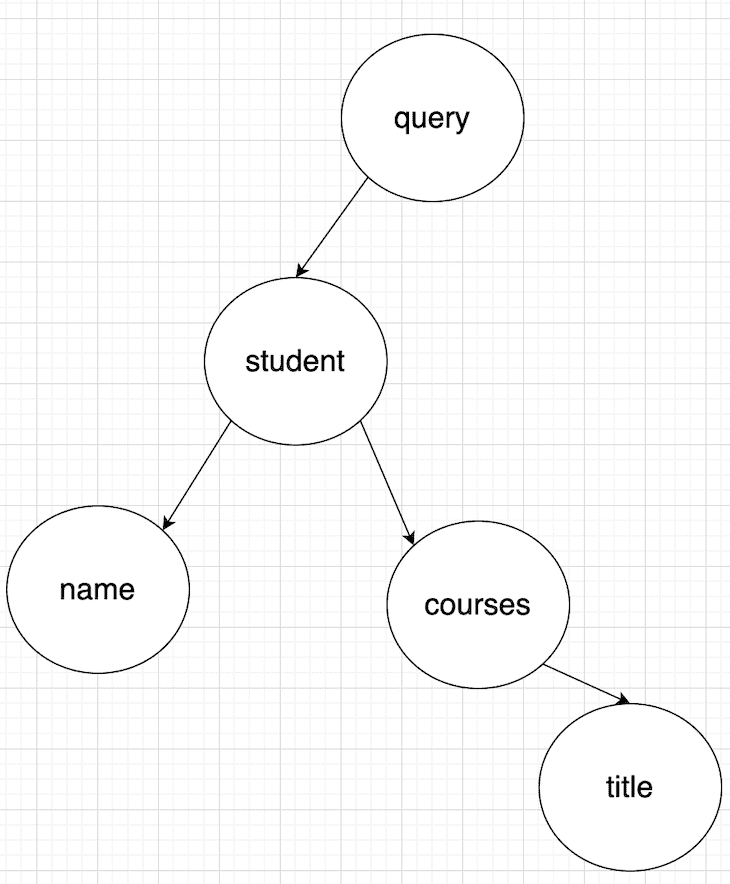
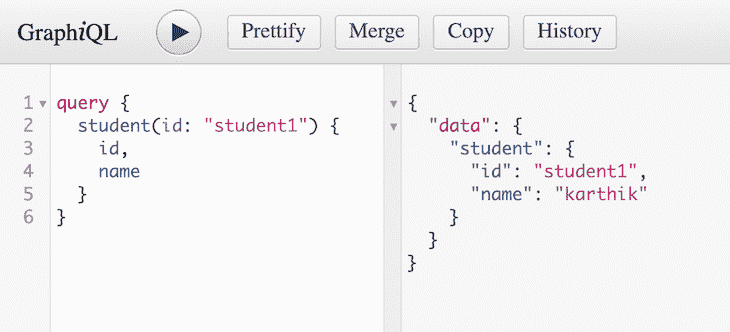
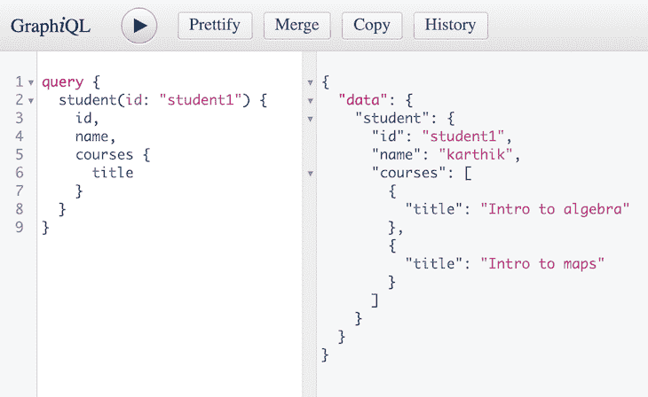

# 避免过度使用正确设计的 GraphQL 解析器

> 原文：<https://blog.logrocket.com/properly-designed-graphql-resolvers/>

## 介绍

如果您正在阅读这篇文章，那么我假设您对 GraphQL 带来的好处深信不疑。您可能听说过，GraphQL 解决了 REST 的一个基本问题，即数据的过提取和欠提取。

当您为移动优先应用构建服务器时，这些问题会变得更加明显。在 REST 中，有两种方法可以构建和设计新的需求:

*   创建新的端点
*   通过获取现有端点的额外信息来重用现有端点

这两种方法都有自己的权衡:第一种选择将导致更多的往返，如果移动用户处于不稳定的网络条件下，这是不理想的；第二种选择会不必要地浪费带宽。

我们可以用 GraphQL 很好地解决这两个问题，因为它承诺给我们所要求的。但是如果你不了解 GraphQL 解析器的特性，即使使用 GraphQL 也可能会遇到过度提取的问题。设计良好的解析器是获得 GraphQL 好处的基础。

## 查询的简要回顾

简单地说，解析器是解析 GraphQL 类型的值或 GraphQL 类型的字段的函数。然而，在我们进入解析器设计过程之前，让我们简要地看一下 GraphQL 查询类型。

真正让 GraphQL 查询成功的是它们看起来像 JSON，并且每个人都非常了解 JSON。为了便于解释，让我们设计一个 GraphQL API，用于从学校数据库中获取数据，该数据库中有学生和课程信息。

假设您正在编写一个如下所示的查询:

```
query {
  student(id: "student1") {
    name,
    courses {
      title
    }
  }
}
```

在这个查询命中相应的解析器之前，它被解析成树/图。您可能已经知道，查询是一种根类型。这意味着查询将是树的根节点，如下所示:



如您所见，query 是根节点，而 student、name、courses 和 title 是子节点。在到达解析器之前，GraphQL 查询被解析成这样的树。这种可视化查询的方式很有用，因为高效的解析器是基于查询的实际结构设计的。

继续前进。现在我们知道了如何将查询可视化为树，让我们继续编写解析器。GraphQL 中的解析器具有以下结构:

```
const resolvers = {
  Query: {
    student: (root, args, context, info) => { return students[args['id']] }
  }
}
```

*   `root`–表示来自父类型的结果
*   `args`–传递给解析器的参数
*   `context`–一个可变对象，可用于存储/传递会话数据、req (in Express)等常见配置。
*   `info`–包含`fieldName`、`fieldNodes`、`returnType`等字段信息。

就像我之前提到的，解析器可以为每种类型和每种字段编写。让我们继续为`Student`类型编写一个解析器。我们的模式文件如下所示:

```
  type Query {
    student(id: String!): Student
  }

  type Course {
    id: String!
    title: String
  }

  type Student {
    id: String!
    name: String
    courses: [Course]
  }
```

我喜欢将解析器保存在一个单独的文件中。为了这个例子，我将数据存储在全局变量中。我的`resolvers.js`文件是这样的:

```
var students = {
  'student1': {
    id: 'student1',
    name: 'karthik',
    courses: ['math101', 'geography201']
  },
  'student2': {
    id: 'student2',
    name: 'john',
    courses: ['physics201', 'chemistry103']
  },
};

var courses = {
  'math101': {
    id: 'math101',
    title: 'Intro to algebra',
  },
  'geography201': {
    id: 'geography201',
    title: 'Intro to maps',
  },
  'physics201': {
    id: 'physics201',
    title: 'Intro to physics',
  },
  'chemistry103': {
    id: 'chemistry103',
    title: 'Intro to organic chemistry',
  },
};

const resolvers = {
  Query: {
    student: (root, args, context, info) => { 
      return students[args['id']]
    }
  }
}

module.exports = resolvers

```

正如我们所见，`student`的解析器在其`args`中接受一个`id`，并从`students`对象中返回相应的学生:



好了，我们刚刚看到了传递的参数 ID`"student1"`是如何通过解析器的参数`"args"`命中解析器的。让我们探讨一下其他论点。

### `root`

每个 graphQL 类型都有一个默认的解析器。当您没有为类型或字段编写解析器时，GraphQL 会自动在根中查找与字段或类型同名的属性。默认的解析器如下所示:

```
const resolvers = {
  Query: {
    student: (root, args, context, info) => { 
      return students[args['id']]
    },
  },
  Student: {
    name: (root, args, context, info) => {
      return root.name;
    }
  }
}

module.exports = resolvers
```

在第 8–9 行，我基本上实现了默认的`name` 字段解析器的功能。如果你想测试理论，返回一个静态字符串，而不是`root.name`。您会注意到它将所有查询的静态字符串返回给`student(id)`。

### `context`

`context`可用于在解析器之间传递信息。例如，如果您想将`req` 对象传递给所有字段，您可以简单地通过添加`req`来改变`context`。

好吧！最基本的东西。让我们看看设计旋变器时可能会不知不觉地遇到的一些潜在问题，以及如何克服这些问题。

## 解决方案的问题

### 过度蚀刻

是啊！你没看错。这不正是我们远离休息的原因吗？绝对的！但是，由于我们设计解析器的方式，有些情况下我们可能会经历过蚀刻。

例如，如果您想为`student`类型的`"courses"` 编写一个解析器，并通过`student`查询获取课程，我们可以这样做:

```
const resolvers = {
  Query: {
    student: (root, args, context, info) => {
      const studentCourses = students[args['id']]['courses'].map(id => {return courses[id]})
      return {
        ...students[args['id']],
        "courses": studentCourses
      }
    },
  },
  Student: {
    name: (root, args, context, info) => {
      return root.name;
    }
  }
}

```



#### 问题 1:如果我们编写一个只询问学生`id`和`name`的查询，会发生什么？

我们仍然会不必要地执行第 4 行中的操作。在现实世界中，这甚至可能是一个昂贵的 API 调用。但是当 GraphQL 解析查询时，它会将多余的数据丢弃。

从表面上看，我们似乎仍然只是得到了我们想要的。但是在幕后，由于我们设计解析器的方式，我们已经迫使我们的服务器过度提取。

**解决方案:**将`courses`解析器移动到`courses`字段。

```
const resolvers = {
  Query: {
    student: (root, args, context, info) => {
      return students[args['id']];
    },
  },
  Student: {
    name: (root, args, context, info) => {
      return root.name;
    },
    courses: (root, args, context, info) => {
      return root.courses.map(id => courses[id]);
    }
  }
}
```

请注意我是如何利用`root` 论点为我所用的。这就是为什么将查询可视化为树并理解根节点以及如何使用它很有用的确切原因。现在，如果我们只查询`id`和`name`，我们没有不必要的解析课程的风险。

太好了！那么采用这种模式能解决我们所有的问题吗？可惜没有！

#### 问题 2:如果我们编写一个查询，只获取课程的数据，会发生什么？

你可能认为它只会解析`courses`解析器。但是，再一次，想想树——首先解决的是什么？`student`解析器！

`student`节点是`courses`节点的父节点，GraphQL 以[广度优先搜索](https://en.wikipedia.org/wiki/Breadth-first_search)的方式解析，这意味着在`courses`节点之前解析`student`节点，以便填充`courses`节点的`root` 参数。

再次，我们遇到过度蚀刻。现在该怎么办？

让我们将`student`解析器移到它的字段中，并分别解析这些字段。

* * *

### 更多来自 LogRocket 的精彩文章:

* * *

```
const resolvers = {
  Query: {
    student: (root, args, context, info) => {
      return args['id'];
    },
  },
  Student: {
    id: (root, args, context, info) => {
      return students[root]['id'];
    },
    name: (root, args, context, info) => {
      return students[root]['name'];
    },
    courses: (root, args, context, info) => {
      return students[root]['courses'].map(id => courses[id]);
    }
  }
}

```

注意我是如何从`student`解析器返回`id` 并将关注点转移到各个字段的。各个字段现在负责解析其值。

好的，太好了！那么这是否解决了我们现在过度蚀刻的问题呢？的确如此，但有一个警告。

#### 问题 3:如果我们查询`id`、`name`和`courses`，会发生什么？

`student`对象被提取两次，分别用于`id` 和`name`。但是`courses`对象只取了一个。如果我们以这样一种更清晰、更易测试的方式编写代码，那么这种重复请求的问题就更容易解决了。

通过简单地查看在解析器中使用这个 API 的类型的字段数量，我们可以清楚地看到一个特定的 API 将被调用多少次。幸运的是，有一些解决方案可以帮助解决请求重复问题:

这个问题在 GraphQL 中也被称为 N + 1 问题，因为我们调用一次来解析 student，调用 N 次来解析嵌套在根类型(`student`)中的 N 个类型。

#### 有必要在我的 GraphQL 服务器中使用这些解决方案吗？

看情况！如果您已经拥有用于与底层数据库对话的丰富的数据库 API(或 ORM)代码库，并且如果您怀疑其中一些调用将被重用来解析您的 GraphQL 模式中的不同字段，那么采用如上所述的重复数据删除解决方案来充分实现 GraphQL 的性能优势是一个很好的实践。

您可能已经注意到，我们在第 9 行和第 12 行重复地做类似的操作。在现实世界的项目中，这可能是一个 API 调用，多次调用 API 来解析不同的字段可能表面上看起来很糟糕，并诱使您重构它。

但是理解它所解决的问题要重要得多。当您设置了重复数据删除解决方案时，可能只进行一次 API 调用，然后缓存起来供重用。

## 数据库调用

到目前为止，我们已经看到了在编写解析器时如何避免一些常见的问题。现在，让我们看看如何构建数据库调用，以及有哪些选项可供我们使用。

### MySQL/PostgreSQL

如果你使用的是 SQL 数据库，你可能已经使用了类似于 [sequelize](https://sequelize.org/master/) 或 [sqlalchemy](https://www.sqlalchemy.org/) 的 ORM 从你的数据库中获取数据。如果是这样的话，在解析器函数中调用序列化 API 是最理想的。这样，您可以确定特定于该特定字段的呼叫范围。

使用解析器的`context` 字段传递数据库配置通常也是一个好主意。

### MongoDB

对于 MongoDB，您可以在解析器中直接使用 Mongo[CRUD](https://docs.mongodb.com/manual/crud/)API。

## 结论

我希望你喜欢阅读这篇关于 GraphQL 解析器的文章，也希望你觉得它有用。请随意留下任何问题或反馈。🙂

## 监控生产中失败和缓慢的 GraphQL 请求

虽然 GraphQL 有一些调试请求和响应的特性，但确保 GraphQL 可靠地为您的生产应用程序提供资源是一件比较困难的事情。如果您对确保对后端或第三方服务的网络请求成功感兴趣，

[try LogRocket](https://lp.logrocket.com/blg/graphql-signup)

.

[](https://lp.logrocket.com/blg/graphql-signup)[https://logrocket.com/signup/](https://lp.logrocket.com/blg/graphql-signup)

LogRocket 就像是网络和移动应用的 DVR，记录下你网站上发生的每一件事。您可以汇总并报告有问题的 GraphQL 请求，以快速了解根本原因，而不是猜测问题发生的原因。此外，您可以跟踪 Apollo 客户机状态并检查 GraphQL 查询的键值对。

LogRocket 检测您的应用程序以记录基线性能计时，如页面加载时间、到达第一个字节的时间、慢速网络请求，还记录 Redux、NgRx 和 Vuex 操作/状态。

[Start monitoring for free](https://lp.logrocket.com/blg/graphql-signup)

.