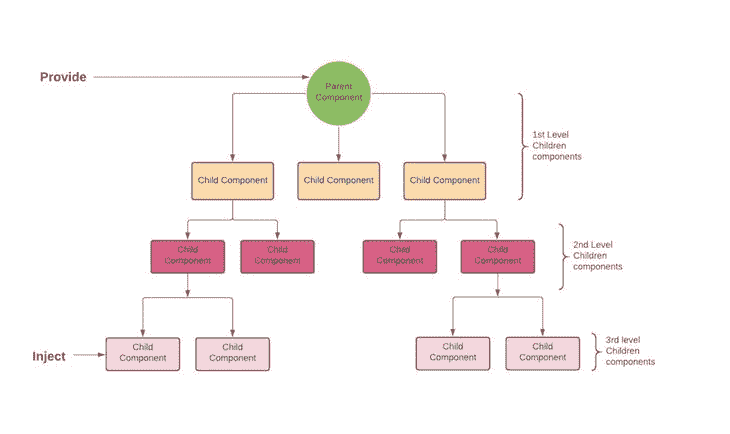

# 在 Vue.js 3 中使用 provide/inject 与组合 API 

> 原文：<https://blog.logrocket.com/provide-inject-vue-js-3-composition-api/>

通常，当我们想要将数据从父组件传递到子组件时，我们使用 props。Vue.js 让这变得简单明了。但是，当我们需要将数据从父级组件传递到深层嵌套的子组件时，我们可能会遇到挫折。

如果我们使用 props，我们最终会将数据传递给 Vue 组件树的每一层上的每个组件，以便数据到达其最终目的地。这就是所谓的道具演练，可能会导致我们的应用程序看起来比实际更复杂。如果它是一个简单状态的应用程序，那么在其中使用 Vuex 就有些过分了。

对我们来说幸运的是，Vue 有`provide` / `inject` API，随着 Vue 3 中 Composition API 的引入，它变得前所未有的好。

使用`provide`和`inject`对，父组件可以向它们的子组件发送数据，而不管组件层次有多深。父组件有一个`provide`函数来提供数据，子组件有一个`inject`函数来开始使用这些数据。



在上图中，我们有三个级别的子组件。我们要传递的数据包含在父组件中，数据的预期目的地深深地嵌套在组件树的第三层中。我们可以使用 props 来实现这一点，但代价是代码的简单性和可读性。让我们看看如何在不牺牲这两者的情况下做到这一点。

首先，我们需要用下面的命令安装最新版本的 [Vue CLI v4.5](https://github.com/vuejs/vue-cli) :

```
yarn global add @vue/[email protected]
#OR
npm install -g @vue/[email protected]

```

运行以下命令创建新的 Vue 应用程序:

```
vue create provide-inject-tutorial

```

## 使用`provide` API

`provide` API 是一个函数，我们用它来定义我们想要传递给子组件的数据。

当在`setup()`中使用`provide`函数时，我们从从`vue`显式导入函数开始。这允许我们在调用`provide`时定义每个属性。

`provide`函数接受两个参数:

1.  属性的名称(字符串)
2.  属性值(包含多个值的字符串或对象)

```
<!-- src/components/MyMap.vue -->
<template>
  <MyMarker />
</template>

<script>
import { provide } from 'vue'
import MyMarker from './MyMarker.vue

export default {
  components: {
    MyMarker
  },
  setup() {
    provide('location', 'North Pole')
    provide('geolocation', {
      longitude: 90,
      latitude: 135
    })
  }
}
</script>
```

在上面的代码中导入了`provide`函数后，我们在`setup`函数中调用它。接下来，我们传递第一个`provide`函数的参数如下:属性名`'location'`和一个值`'North Pole'`。

对于第二个`provide`函数，我们传递一个包含`latitude`和`longitude`值的对象，并将其属性名设置为`'geolocation'`。

## 使用`inject` API

`inject` API 是我们用来从我们的提供者组件接收数据的函数。

正如我们对`provide`函数所做的那样，我们也必须从`vue`导入`inject`函数。这让我们可以在组件中的任何地方调用和使用该函数。

`inject`函数有两个参数:

1.  被注入的属性的名称
2.  可选的默认值

让我们看看下面的代码:

```
<!-- src/components/MyMarker.vue -->
<script>
import { inject } from 'vue'

export default {
  setup() {
    const userLocation = inject('location', 'The Universe')
    const userGeolocation = inject('geolocation')

    return {
      userLocation,
      userGeolocation
    }
  }
}
</script>

```

首先，我们将`inject`函数导入到我们的`MyMarker`组件中。然后，在我们的`setup`函数中，我们将第一个属性名为`'location'`的`provide`函数赋给了`userLocation`变量。我们还提供了一个可选的默认回退值`'The Universe'`。

接下来，我们将属性名为`'geolocation'`的第二个`provide`函数赋给`userGeoLocation`变量。我们`return`了`userLocation`和`userGeoLocation`变量，之后我们可以在`MyMarker`组件的任何地方自由使用它们的值。

## 使`provide` / `inject`对反应

遗憾的是，开箱后，`provide` / `inject`对没有反应。谢天谢地，有一种方法可以让[通过使用 Vue API 提供的`ref`或`reactive`函数来实现这一点](https://blog.logrocket.com/how-to-make-provide-inject-reactive/)。

我们首先必须从`vue`导入它们，然后调用`ref`或`reactive`函数。我们将把它的参数设置为要传递给所需子组件的值，并将函数存储在一个变量中。然后我们调用`provide`函数并传递属性名及其值。

现在，如果任何一个属性发生变化，`MyMarker`组件也会自动更新！

我们现在可以如下更新我们的代码:

```
<!-- src/components/MyMap.vue -->
<template>
  <MyMarker />
</template>

<script>
import { provide, reactive, ref } from 'vue'
import MyMarker from './MyMarker.vue

export default {
  components: {
    MyMarker
  },
  setup() {
    const location = ref('North Pole')
    const geolocation = reactive({
      longitude: 90,
      latitude: 135
    })

    provide('location', location)
    provide('geolocation', geolocation)
  }
}
</script>

```

在导入`ref`和`reactive`函数后，我们调用`ref`函数并给它一个参数(值`'North Pole'`，然后将`ref`函数赋给`location`变量。

对于`reactive`函数，我们调用它并以对象的形式给它传递一个参数。然后我们将`reactive`函数赋给`geolocation`变量。完成这些之后，我们可以调用`provide`函数，并向它传递我们想要传递的数据的属性名和值。

在第一个`provide`函数中，我们将属性名设置为`'location'`，并将其值设置为等于`location`，这是我们分配给`ref`函数的值。

而在第二个`provide`函数中，我们将其属性名设置为`'geolocation'`，其值等于`geolocation`，这是我们分配给`reactive`函数的值。

## 何时使用`provide` / `inject`函数对

*   如果应用程序有一个相当简单的状态，使用 Vuex 将是大材小用
*   如果您的应用程序有太多的组件级别，并且中间的组件在将数据传递给所需的组件之前不使用数据
*   如果数据仅由少数组件使用。但是如果数据将被更多的组件使用，Vuex 将是一个更好的解决方案

我们已经学习了如何使用组合 API 使用`provide` / `inject`函数对在 Vue.js 3 中深度嵌套的组件之间传递数据。我们已经介绍了如何使它具有反应性，以及何时应该使用它的不同用例。要了解更多关于`provide` / `inject`函数对的信息，请访问[官方文档](https://v3.vuejs.org/guide/composition-api-provide-inject.html)。

## 像用户一样体验您的 Vue 应用

调试 Vue.js 应用程序可能会很困难，尤其是当用户会话期间有几十个(如果不是几百个)突变时。如果您对监视和跟踪生产中所有用户的 Vue 突变感兴趣，

[try LogRocket](https://lp.logrocket.com/blg/vue-signup)

.

[](https://lp.logrocket.com/blg/vue-signup)[https://logrocket.com/signup/](https://lp.logrocket.com/blg/vue-signup)

LogRocket 就像是网络和移动应用程序的 DVR，记录你的 Vue 应用程序中发生的一切，包括网络请求、JavaScript 错误、性能问题等等。您可以汇总并报告问题发生时应用程序的状态，而不是猜测问题发生的原因。

LogRocket Vuex 插件将 Vuex 突变记录到 LogRocket 控制台，为您提供导致错误的环境，以及出现问题时应用程序的状态。

现代化您调试 Vue 应用的方式- [开始免费监控](https://lp.logrocket.com/blg/vue-signup)。