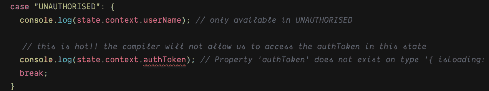

# 把类型脚本枚举和布尔值放在一边

> 原文：<https://blog.logrocket.com/put-the-typescript-enums-and-booleans-away/>

我最喜欢 TypeScript 这个美丽新世界的一点是 TypeScript 枚举。我以前在 C#中使用过它们，感觉很熟悉。

枚举是一组命名的常量，可以采用数字或字符串形式。我一直使用基于字符串的枚举，我将在本文的所有示例中使用它:

```
enum State {
  on = 'ON',
  off = 'OFF,
};
```

## 不当使用

我在各种不合适的地方使用了枚举，比如在 Redux actions 中的`string`类型在[之前，@reduxjs/toolkit](https://github.com/reduxjs/redux-toolkit) 帮助减轻了臭名昭著的 Redux 样板文件:

```
enum AuthActionTypes {
  SetForcePasswordChange = "SET_PASSWORD_CHANGE"
}

interface ForcePasswordChange {
type: AuthActionTypes.SetForcePasswordChange;
}

export const forcePasswordChange = (): ForcePasswordChange => ({
  type: AuthActionTypes.SetForcePasswordChange
});
```

我的动机是避免令人讨厌的字符串输入错误，对于这个需求，这是可行的。

## 用一把新锤子，所有东西看起来都像钉子

随着我对这个在构建时和运行时都存在的新的诱人的弗兰肯斯坦构造的信心增加，我变得更加敢于冒险。

枚举似乎是在有限状态机中建模状态的绝佳选择。

我当时不知道的是，我错过了 TypeScript 最突出的特性之一，它不仅仅是确保我有一组互斥的常数:

```
enum AuthenticationStates {
  unauthorised = "UNAUTHORISED",
  authenticating = "AUTHENTICATING",
  authenticated = "AUTHENTICATED",
  errored = "ERRORED",
  forcePasswordChange = "FORCE_PASSWORD_CHANGE"
}
```

在上面的例子中，我有一个`AuthenticationStates`枚举来模拟认证工作流。

用户在转换到`AUTHENTICATING`之前从`UNAUTHENTICATED`状态开始，等等。我精心制作的 enum 确保用户在任何时候都不会处于一个以上的矛盾状态。例如，他们不能是`AUTHENTICATED`和`AUTHENTICATING`。

## 我需要更多的果汁

然后我意识到我需要额外的数据，例如，如果发生错误，我需要知道实际的`Error`对象是什么。

我最初对新需求建模如下:

```
enum AuthenticationStates {
  unauthorised = "UNAUTHORISED",
  authenticating = "AUTHENTICATING",
  authenticated = "AUTHENTICATED",
  errored = "ERRORED",
}

type State = {
  current: AuthenticationStates;
  isLoading: boolean;
  authToken?: string;
  error?: Error;
};

const current: State = {
  kind: AuthenticationStates.authenticated,
  isLoading: false,
  authToken: 'token',
  error: undefined
};
```

我努力确保每个身份验证状态可以有相同类型的字段。

这种方法的问题是，每个州都有相同的字段，这可能是一个很大的错误来源，因为我可能会变得懒惰，开始复制和粘贴。

然后我发现了有区别的联合，也称为代数数据类型。

## 区别联合也称为代数数据类型

如果您想在聚会上给人们留下深刻印象，那么告诉他们您每天都使用代数数据类型是一个保证的全垒打！

在 TypeScript 中，我们可以创建一个与我们的`Authentication`枚举非常相似的字符串联合:

```
type AuthenticationStates =
  | "UNAUTHORISED"
  | "AUTHENTICATING"
  | "AUTHENTICATED"
  | "ERRORED";
```

我可以用它作为一个更强大的字符串参数类型，更好地保证什么值是允许的。

TypeScript 中的联合可以是许多事物的联合，而不仅仅是基本类型。我们可以通过创建一个只需要与联合中的每个元素具有相同的`kind`字段的联合来使世界变得更美好。`kind`字段将作为鉴别器:

```
export type AuthenticationStates =
  | {
      kind: "UNAUTHORISED";
      context: {
        isLoading: false
      };
    }
  | {
      kind: "AUTHENTICATING";
      context: {
        isLoading: true;
      };
    }
  | {
      kind: "AUTHENTICATED";
      context: {
        isLoading: false;
        authToken: string;
      };
    }
  | {
      kind: "ERRORED";
      context: { isLoading: false; error: Error };
    };
```

上面的类型既是漂亮的可执行文档，我们一眼就能看到工作流中所有可用的状态。

上例中的鉴别器是`kind`字段，编译器使用它来`type narrow`或应用更具体的规则，因为它确定变量可能是 union 的哪个确切元素。

这里关键的一点是，每种类型只有适当的数据可用。

如果我们当前不处于`AUTHENTICATED`状态，我们就没有尝试访问`authToken`的权利。

最令人兴奋的是，与在 JVM 上花了太多时间的程序员相比，编译器可以更好地执行这种正确性顺序。

## 有区别的联合上的类型收缩

下面是 TypeScript 如何在 union 的鉴别器上键入 narrow 的示例:

```
const transition = (state: AuthenticationStates) => {
  switch (state.kind) {
    case "UNAUTHORISED": {
      console.log(state.context.userName); // only available in UNAUTHORISED

      // this is hot!! the compiler will not allow us to access the authToken in this state
      console.log(state.context.authToken); // Property 'authToken' does not exist on type '{ isLoading: false; userName: string; password: string; }'
      break;
    }
    case "AUTHENTICATING":
      console.log(state.context.userName); // Property 'userName' does not exist on type '{ isLoading: true; }'.
      // Type 'false' is not assignable to type 'true'
      state.context.isLoading = false;
      // The only assignable value is true in this state
      state.context.isLoading = true;
      break;
    case "AUTHENTICATED":
      // here and only here do we have an authToken
      console.log(state.context.authToken);
      break;
    case "ERRORED":
      console.log(state.context.error);
      break;
  }
};
```

你也可以在这里查看 code sandbox。

当编译器通过使用`kind`鉴别器字段缩小类型时，我们只能访问特定的数据。

最好的例子是:



如果我们试图在错误的状态下使用`authToken`，编译器将会出错。

## 布尔值不模拟状态

任何用布尔来建模状态的尝试都会失败，导致矛盾变量的激增和紧张的开发人员。

例如，如果我们尝试这种方法:

```
const isAuthenticated: boolean = false;
const isErrored: boolean = false;
const isLoading: boolean = false;
```

用不了多久，我们就会开始把这些笨蛋组合成一堆不断旋转的混乱逻辑。

```
if (isErrored &&. isAuthenticated === false) {
  // do this
} else if (isLoading && is isErrored) {
  // do something else
```

## 代数在哪里？

这些听起来很花哨的代数数据类型只不过是一种方式，说明一种类型是由其他类型组成的。就是这样。一点也不花哨。

## 收场白

联合作为漂亮的可执行文档，也让误入歧途的程序员走上正轨，这在过去 JavaScript 编程的西部荒原中尤为普遍。

代数数据类型在函数式语言(如 Haskell)中已经存在了一段时间，令人兴奋的是，TypeScript 将它们带给了非常无知的前端开发人员。

## [LogRocket](https://lp.logrocket.com/blg/typescript-signup) :全面了解您的网络和移动应用

[](https://lp.logrocket.com/blg/typescript-signup)

LogRocket 是一个前端应用程序监控解决方案，可以让您回放问题，就像问题发生在您自己的浏览器中一样。LogRocket 不需要猜测错误发生的原因，也不需要向用户询问截图和日志转储，而是让您重放会话以快速了解哪里出错了。它可以与任何应用程序完美配合，不管是什么框架，并且有插件可以记录来自 Redux、Vuex 和@ngrx/store 的额外上下文。

除了记录 Redux 操作和状态，LogRocket 还记录控制台日志、JavaScript 错误、堆栈跟踪、带有头+正文的网络请求/响应、浏览器元数据和自定义日志。它还使用 DOM 来记录页面上的 HTML 和 CSS，甚至为最复杂的单页面和移动应用程序重新创建像素级完美视频。

[Try it for free](https://lp.logrocket.com/blg/typescript-signup)

.