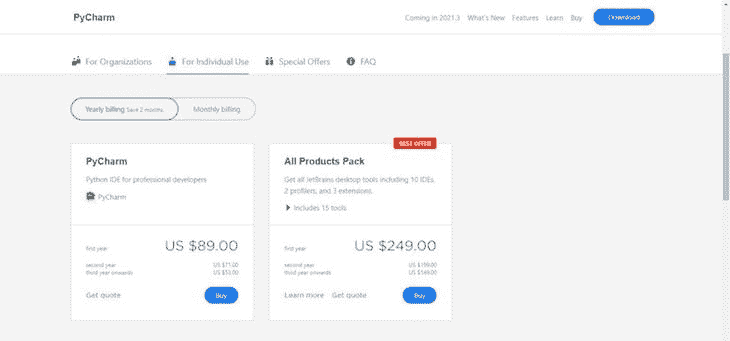
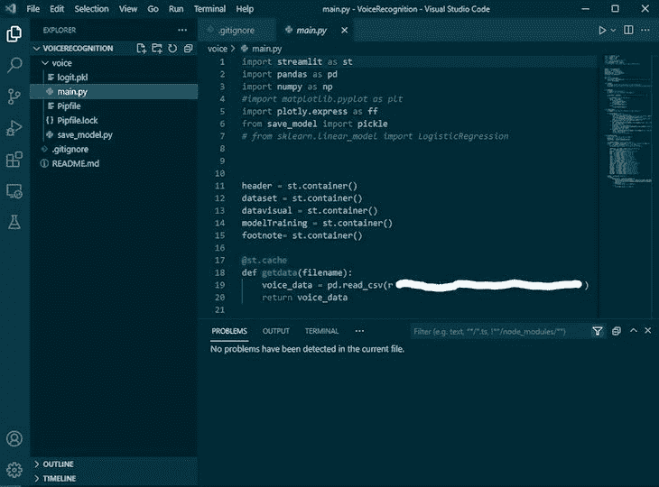
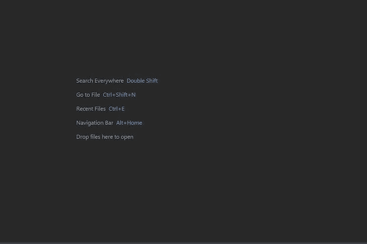
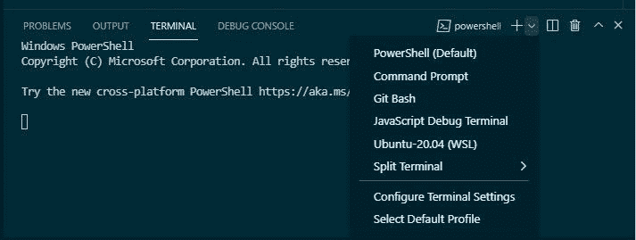

# PyCharm vs. VS Code:选择最好的 Python IDE - LogRocket 博客

> 原文：<https://blog.logrocket.com/pycharm-vs-vscode/>

Python 是全球最流行的编程语言之一，据说非常容易学习。因此，很多人开始用 Python 编程并不奇怪，包括我自己。Python 是初学者友好的，具有相对简单的语法，受其社区的支持，有许多库和框架，并且非常通用。

然而，初学者经常要问自己使用什么集成开发环境(IDE)或编辑器。我也面临着这个挑战，虽然有几个可用于 Python 的 ide 和代码编辑器，但是这些年来， [PyCharm](https://www.jetbrains.com/pycharm/) 和 [VS Code](https://code.visualstudio.com/download) 仍然是 Python 开发人员的最爱。

PyCharm 和 VS Code 都是编写 Python 代码的优秀工具。然而，重要的是要注意，虽然 PyCharm 是一个 IDE，但 VS Code 是一个代码编辑器，它通过扩展提供了与 IDE 类似的体验。

在本文中，我们将使用以下指标来比较 PyCharm 和 VS 代码:价格、内存消耗、设置过程、代码管理、扩展和 Git 集成。我们开始吧！

## 价格

### PyCharm 价格

JetBrain 的 PyCharm 有三个版本。首先，个人专业版第一年的费用是 89 美元，第二年是 71 美元，第三年以后是 53 美元。面向组织的专业版第一年 199 美元，第二年 159 美元，随后几年 119 美元。

PyCharm 社区和 [Edu 版](https://www.jetbrains.com/pycharm-edu/)都是免费的开源项目。然而，这两个版本都缺少某些特性，比如对远程开发的支持、Python profiler、重复代码检测、数据库支持和一些 web 开发工具。

### VS 代码价格

另一方面， [VS Code 是一个开源项目](https://blog.logrocket.com/top-10-vs-code-extensions-2021/)，可以免费用于商业和私人用途。像版本控制、第三方集成和 bug 跟踪这样的特性都是 VS 代码自带的，不管你打算用什么类型的项目或语言来编写。

VS 代码没有预装任何插件，所以您必须为您的 Python 项目手动安装必要的插件。你可以根据需要安装任意数量的插件，全部免费。

## 内存消耗

您希望选择一个占用空间最小、使用 RAM 最少、能够在您的计算机系统上平稳运行而不会导致延迟的工具。

### PyCharm 内存消耗

下载社区版 PyCharm 需要 372MB 左右，可能看起来不算多。然而，当我在我的系统上运行 PyCharm 时，它消耗了大约 400MB 的内存，在我看来，这是一个很大的问题。

### VS 代码内存消耗

另一方面，VS 代码非常轻量级，下载只需要 76.2MB，在我的电脑上只消耗 40MB 的内存。

可能是因为大小的不同，PyCharm 在我的机器上加载和打开需要三到五分钟，而 VS 代码会立即启动。在我看来，区别很明显。如果管理计算机资源是最重要的，VS 代码是更好的选择。

## 初始设置

### 设置 PyCharm

设置 PyCharm 和 VS 代码相当容易。然而，PyCharm 显然是为 Python 开发的，而微软则为多语言用户开发了 VS 代码。因此，在您的机器上安装 PyCharm 之后，开始编写代码并不需要太多时间。

### 设置 VS 代码

要设置 VS 代码，你必须花一些时间来定制你的 Python 需求，这需要你查看并下载各种扩展，比如 [Python](https://marketplace.visualstudio.com/items?itemName=ms-python.python) 、 [Python Indent](https://marketplace.visualstudio.com/items?itemName=KevinRose.vsc-python-indent) 、[Python snippet](https://marketplace.visualstudio.com/items?itemName=frhtylcn.pythonsnippets)等等。但是，这样做可以让您更好地控制工作区的外观、内容和功能。

除了设置之外，我发现 VS 代码更容易导航、理解和使用，因为它的界面对初学者友好、友好，并且易于导航。它不会显得杂乱，你可以通过搜索很容易地找到你需要的任何功能或特性。

## 代码管理

代码管理包括代码完成、语法突出显示、代码格式化和林挺等功能。正确的选择取决于每种工具帮助您编写和理解 Python 代码的难易程度。总的来说，我认为这两个工具包含了相似的特性，提供了一个优秀的代码管理系统。

### 使用 VS 代码进行代码管理

VS 代码自动用红色突出显示潜在错误的区域，使您更容易找到并修复错误。VS 代码甚至更进了一步，它包含了一个问题标签，在一个地方列出了所有潜在的错误，让你更容易检查它们，如下图所示:

注意，要在 VS 代码中使用 Python，您需要为 Python 安装一个格式化程序和 linter。

### PyCharm 代码管理

PyCharm 的一个关键特性是 [Search Everywhere 特性](https://www.jetbrains.com/help/pycharm/searching-everywhere.html)，它允许您在项目范围之外进行搜索。您可以找到文件、类、符号和 UI 元素等，即使它们不在您的当前项目中:

## 扩展ˌ扩张

### VS 代码扩展

PyCharm 和 VS Code 都提供了重要的扩展和插件，使每个开发者的体验尽可能无缝。扩展和插件是向工具或应用程序添加更多功能的好方法。

### VS 代码扩展

VS 代码不仅仅是为 Python 而构建的。因此，您可能需要几个扩展来使代码编辑器更类似于非常适合 Python 的 IDE。

VS 代码的一个好处是，它可以检测您正在处理的项目的类型，然后为该项目建议并启用必要的扩展。例如，如果你的项目是基于云的或者需要云插件，你可以[期望 VS 代码基于项目的范围和你已经安装在你的计算机上的插件来建议插件](https://blog.logrocket.com/writing-vs-code-extensions-in-javascript/)。

你可以在应用中安装并启用一个扩展，或者你可以访问 [VS 代码市场](https://marketplace.visualstudio.com/vscode)来搜索你需要的。在 2020 年初，大约有 16，000 个扩展可用于 VS 代码。不断开发和添加新的扩展来改善开发人员的体验。

### PyCharm 扩展

PyCharm 是在考虑 Python 的情况下构建的，通过查看适用于改进 PyCharm 的可用扩展，这一点很清楚。有超过 3000 个 [JetBrains 插件](https://www.jetbrains.com/help/idea/discover-intellij-idea.html)可用，PyCharm 与它们都兼容。

## 数据库集成

根据您的项目类型，您可能需要也可能不需要连接到数据库。

### PyCharm 数据库集成

PyCharm 使用一个名为 [Database Navigator](https://plugins.jetbrains.com/plugin/1800-database-navigator) 的插件，允许你连接到 MySQL、Oracle、PostgreSQL 等数据库，所有这些都在应用程序中。使用 PyCharm Database Navigator，您可以创建数据库连接、向数据库发出查询、接收数据库对象等等。但是，这仅适用于您必须购买的专业版。

### VS 代码数据库集成

通过使用名为 [SQLTools](https://www.sqltools.net) 的扩展，数据库集成也可以在 VS 代码上实现。然而，VS Code 的集成仍然留有更多的空间。初学者可能会发现它很难使用或导航，并且容易出现错误。另一方面，PyCharm 的数据库集成似乎更彻底。

## Git 集成

对于每个开发人员来说，版本或源代码控制系统对于存储和更改他们的项目是必不可少的。

毫不奇怪，PyCharm 和 VS 代码都提供了 Git 集成。您可以创建一个新的 Git 存储库，克隆一个现有的存储库，打开一个现有的存储库，暂存更改，未暂存的更改，提交更改，签出到一个不同的分支，创建一个拉请求，等等，所有这些都可以在应用程序中完成。

这两个工具都为 GitHub 提供了出色的支持，老实说，我不能说哪一个更好。

## VS 代码终端仿真器

终端模拟器是我最喜欢的 VS 代码特性之一，因为它允许你在任何安装在你系统上的 shell 中工作，而不用离开应用程序。

我能够运行 Linux 命令、Windows 命令、Git 命令等等:

## 结论

你可能知道，我是 VS 代码的忠实粉丝。但是，在选择 IDE 时，您必须首先考虑您的需求。

如果您想要一些成熟的、特定的、配置良好的 Python 语言，那么 PyCharm 是一个不错的选择。然而，如果您更喜欢能够自由定制的轻量级代码，那么 VS 代码是更好的选择。

两者都是很好的工具，可以服务于不同的目的，这取决于你如何选择使用它们。我希望你喜欢这个教程。