# PyScript 简介:在 browser 中运行 Python

> 原文：<https://blog.logrocket.com/pyscript-run-python-browser/>

长期以来，JavaScript 一直是前端开发中的主导语言，因为它能够在浏览器中本地运行，并通过 DOM API 与 HTML 和 CSS 进行交互。随着 WebAssembly 的出现，事情开始慢慢改变。诸如 Go、Rust、C、C++和许多其他语言现在可以在浏览器中以接近本地的速度运行，Python 也没有落后。

随着 PyScript 的引入，前端开发人员现在可以用 Python 构建丰富的前端。此外，他们还可以利用 Python 生态系统，其中有有用的科学模块，如 [NumPy](https://numpy.org/) 、 [Matplotlib](https://matplotlib.org/) 等等。
在本教程中，我们将讲述以下内容:

## 先决条件

要充分利用本教程，您需要:

*   对 HTML、CSS 和 JavaScript 有基本的了解
*   熟悉 Python 语法
*   网络服务器。我们将使用 Python 创建一个简单的服务器，所以请确保您的系统上安装了 Python
*   网络浏览器；PyScript 文档目前推荐 Chrome

## PyScript 是什么？

PyScript 是一个开源的 web 框架，允许您使用 Python 创建前端 web 应用程序。使用 PyScript，您可以在 HTML 中嵌入 Python 代码，或者链接到 Python 文件，代码将在浏览器中执行——无需在后端运行 Python。

PyScript 由 Anaconda 创建，并于 4 月 30 日在 PyCon US 2022 上公开发布。在撰写本文时，PyScript 处于 alpha 状态，并且正在积极开发中，因此由于它尚未稳定发布，因此可以预期会有突破性的变化和更新的功能。

## PyScript 是如何工作的？

PyScript 构建于 [Pyodide](http://pyodide.org/) 之上，它将 CPython 移植到 WebAssembly。WebAssembly 是一种低级二进制格式，允许您用其他语言编写程序，然后在浏览器中执行。通过 WebAssembly 中的 CPython，我们可以在浏览器中安装和运行 Python 包，而 PyScript 抽象了大部分 Pyodide 操作，让你可以专注于在浏览器中用 Python 构建前端应用。

## 你什么时候想使用 PyScript？

*   **将 Python 后端移至前端**:如果你有一个 Python 应用程序在后端运行，你可以使用 PyScript 将其移至前端，从而节省你的虚拟主机费用
*   **利用 Python 的库生态系统**:scikit-learn、numpy、pandas 等科学包仅在 Python 中可用，在前端中不可用。但是使用 PyScript，您可以在前端使用这些包，甚至可以使用您自己的 Python 模块
*   **与本地文件系统交互**:浏览器中的 JavaScript 没有读取或写入文件系统中文件的 API。使用 PyScript，您可以读取文件系统中的文件，操作数据，并将其注入 DOM

## 为 PyScript 设置项目文件夹

在我们开始使用 PyScript 之前，让我们创建代码所在的目录。

为此，打开您的终端，在您选择的位置使用`mkdir`命令创建项目目录:

```
mkdir pyscript_demo

```

接下来，使用`cd`命令进入刚刚创建的目录:

```
cd pyscript_demo

```

通常，前端开发人员在他们的文本编辑器中使用自动格式化工具，如[appearlier](https://prettier.io/)来格式化保存的代码。虽然这对于 HTML、CSS 和 JavaScript 很有效，但这可能会在 Python 代码中引起问题，因为 Python 对缩进有严格的要求。

目前，像 Prettier 这样的自动格式化工具不能识别 PyScript 语法，在撰写本文时，PyScript 语法才刚刚出现两个月。这些工具像 JavaScript 一样自动格式化 Python 代码，打破了代码缩进。为了解决这个问题，我们现在将禁用这个目录的自动格式化。

假设您使用的是 VS 代码，我们可以如下禁用自动格式化。

在您的项目目录中，创建一个`.vscode`目录，并使用以下命令导航到该目录:

```
mkdir .vscode && cd .vscode

```

接下来，创建一个`settings.json`文件并添加以下内容:

```
{
  "editor.formatOnSave": false
}

```

这个代码片段在 VS 代码中禁用了这个目录的“保存时”自动格式化特性。

现在我们准备开始使用 PyScript 了！

## 入门指南

现在我们的目录已经为 PyScript 设置好了，我们将首先在 HTML 页面的`<head>`部分添加到由 CSS 文件和 JavaScript 文件组成的 PyScript 资产的链接。

添加资产后，您可以通过以下两种方式之一在 HTML 文件中使用 PyScript:

*   **内部 PyScript** :你可以在 HTML 文件的`<py-script>`标签中编写并放置你的 Python 代码；根据您手头的任务，可以将`<py-script>`标签添加到`<head>`或`<body>`标签中
*   **外部 PyScript** :这是您在以`.py`扩展名结尾的文件中编写 Python 代码的地方，然后您可以使用`src`属性在`<py-script>`标签中引用它

## 内部 PyScript

开始使用 PyScript 最简单、最快速的方法是在 HTML 文件中嵌入 Python 代码。就这么办吧！

打开您喜欢的文本编辑器，创建`hello-world.html`文件，并添加以下内容:

```
<!DOCTYPE html>
<html lang="en">
  <head>
    <meta charset="utf-8" />
    <meta name="viewport" content="width=device-width, initial-scale=1" />
    <title>Hello World!</title>
    <!-- linking to PyScript assets -->
    <link rel="stylesheet" href="https://pyscript.net/releases/2022.12.1/pyscript.css" />
    <script defer src="https://pyscript.net/releases/2022.12.1/pyscript.js"></script>
  </head>
  <body>
  <!-- Put Python code inside the the <py-script> tag -->
    <py-script>display("Hello World!")</py-script>
  </body>
</html>

```

在`<head>`部分，我们链接到`pyscript.css`文件，该文件包含 PyScript 可视组件、REPL、PyScript 加载器等的样式。接下来，我们链接到`pyscript.js`文件，它为使用 PyScript 设置了必要的特性，比如创建像`<py-script>`这样的标签，您可以在这里编写 Python 代码。

请注意，我们链接到了发布版`2022.12.1`中的 PyScript 静态资产，这是撰写本文时 PyScript 的最新版本。这是因为 PyScript 仍在大量开发中，并在不断增加和减少功能。

为了避免新版本破坏我们的代码，我们使用固定版本来代替`/latest/pyscript.js`。请务必查看 [PyScript GitHub 页面](https://github.com/pyscript/pyscript/releases)以跟踪新发布的版本。

接下来，在`<body>`标签中，让我们将 Python 代码嵌入到`<py-script>`标签中。我们现在保持事情简单，所以我们只使用 PyScript 的`display()`方法将`Hello World`打印给用户，该方法将给定值嵌入页面。

确保将文件保存在项目目录的根目录下，并在 Chrome 中打开`hello-world.html`文件。加载需要几秒钟的时间，一旦页面加载完毕，它将如下所示:

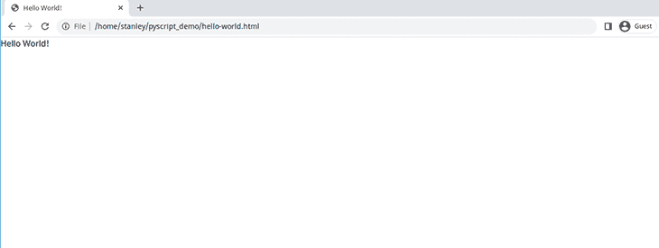

## 外部 PyScript

虽然将 Python 代码放在`<py-script>`标签中是可行的，但是更好且更具可伸缩性的方法是将代码添加到外部文件中，并在创建更多 HTML 页面或脚本变大时在 HTML 文件中引用它。

以下是您应该考虑在外部文件中使用 PyScript 代码的一些原因:

*   浏览器可以缓存该文件，从而提高性能
*   您可以在多个页面中引用该文件，从而减少重复
*   你的 Python 代码可以用像 [black](https://github.com/psf/black) 或者 Python linters 这样的工具格式化。这些工具目前不能处理嵌入在 HTML 文件中的 Python 代码

为了在外部使用 PyScript，我们将创建一个`index.html`文件，一个以`.py`扩展名结尾的包含我们的 Python 代码的 Python 文件，最后在`index.html`文件中引用 Python 文件。

### 创建`index.html`文件

创建一个`index.html`文件并链接到 PyScript 资源:

```
<!DOCTYPE html>
<html lang="en">
  <head>
    <meta charset="utf-8" />
    <meta name="viewport" content="width=device-width, initial-scale=1" />
    <title>Greetings!</title>
    <!-- linking to PyScript assets -->
    <link rel="stylesheet" href="https://pyscript.net/releases/2022.12.1/pyscript.css" />
    <script defer src="https://pyscript.net/releases/2022.12.1/pyscript.js"></script>
  </head>
  <body>
  </body>
</html>

```

文件没做什么；我们只是链接到 PyScript 资源。为了让它更有用，我们将创建一个`main.py`文件，Python 代码将驻留在其中。

### 创建`main.py`文件

让我们创建一个打印问候消息的 Python 函数。

在您的文本编辑器中，创建`main.py`文件并添加以下代码:

```
def greetings(name):
    print(f'Hi, {name}')

greetings('John Doe')

```

`greetings()`函数采用一个`name`参数。在该函数中，我们使用`print()`方法在`<py-terminal>`终端中打印一条问候消息。当我们用`John Doe`作为参数调用`greetings()`函数时，它打印`hi, John Doe`。

* * *

### 更多来自 LogRocket 的精彩文章:

* * *

### 在 HTML 文件中链接`main.py`文件

现在您已经创建了 Python 代码，您将在`index.html`文件中引用`main.py`文件。

打开`index.html`并在`<body>`标签内添加该行:

```
<!DOCTYPE html>
<html lang="en">
  <head>
    <meta charset="utf-8" />
    <meta name="viewport" content="width=device-width, initial-scale=1" />
    <title>Greetings!</title>
   <link rel="stylesheet" href="https://pyscript.net/releases/2022.12.1/pyscript.css" />
   <script defer src="https://pyscript.net/releases/2022.12.1/pyscript.js"></script>
  </head>
  <body>
   add the following line
  <py-script src="./main.py"></py-script>
  </body>
</html>

```

`<py-script>`标签有一个`src`标签，它接受 Python 文件的文件路径。

### 在浏览器中打开`index.html`文件

现在一切就绪，我们将在浏览器中打开`index.html`。

但是，由于[跨源资源共享(CORS)](https://blog.logrocket.com/the-ultimate-guide-to-enabling-cross-origin-resource-sharing-cors/) 策略错误，浏览器会拒绝加载和执行外部 Python 文件。为了解决这个问题，我们需要使用服务器。好在 Python 附带了一个我们可以使用的 web 服务器！服务器不需要由 Python 创建，你可以使用[的实时服务器](https://www.npmjs.com/package/live-server)或者任何你选择的服务器。

要创建服务器，请在项目的根目录下打开终端并运行以下命令:

```
python -m http.server

```

接下来，打开 Chrome，访问`[http://0.0.0.0:8000/]([http://0.0.0.0:8000/](http://0.0.0.0:8000/))`。服务器将自动加载`index.html`文件，您将看到以下内容:

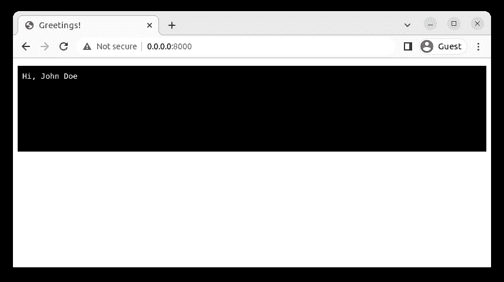

如你所见，文本`Hi, John Doe`已经被打印在`<py-terminal>`中，这是页面上的黑色区域。`<py-terminal>`为您的代码产生类似终端的输出。

对于本教程的其余部分，我们将引用外部 Python 文件，这将要求我们使用服务器来避免 CORS 错误，有时为了简洁起见，我们将在 HTML 中嵌入 Python 代码。

## 使用 PyScript REPL

PyScript 附带了一个读取-评估-打印循环(REPL)，您可以使用它来试验和尝试 Python 代码。

要使用 REPL，请在您的`index.html`文件的`<body>`标签中添加`<py-repl>`标签:

```
<!DOCTYPE html>
  ...
  <body>
   <!-- comment out the following line -->
  <!-- <py-script src="./main.py"></py-script> -->
  <!-- add the following line -->
  <py-repl> </py-repl>
  </body>
</html>

```

我们注释掉对`main.js`文件的引用，只在页面上显示 REPL。

在服务器仍在运行的情况下，访问`[http://0.0.0.0:8000/]([http://0.0.0.0:8000/](http://0.0.0.0:8000/))`。您将看到一个新的部分，您可以在其中输入 Python 代码。

您可以导入模块、计算表达式、创建函数，以及做更多的事情。要查看表达式的计算结果，您需要单击绿色的 **Play** 图标。

下图显示了您可以执行的一些操作:

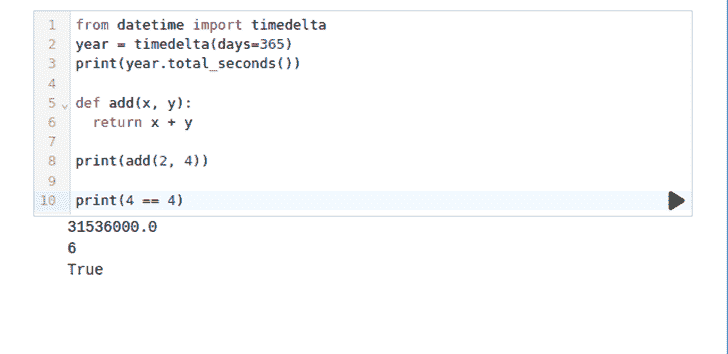

现在您已经知道了如何使用 REPL，让我们看看如何在 PyScript 中创建和使用模块。

## 在 PyScript 中使用 Python 模块

在本节中，我们将创建一个自定义 Python 模块，并在我们的代码中使用它。我们还将使用 Python 标准库中的模块，以及第三方模块。

为了使用模块，我们将引入一个新标签`<py-config>`，它允许我们引用模块或模块文件路径。

### 创建自定义模块

让我们创建一个包含两个函数的本地模块。

首先，在项目目录中创建一个`mathslib.py`文件，并添加下面的代码:

```
def add(num1, num2):
    return num1 + num2

def subtract(num1, num2):
    return num1 - num2

```

这里我们创建了两个做加法和减法运算的函数。

接下来，创建一个`modules.html`文件，并添加以下内容:

```
<!DOCTYPE html>
<html lang="en">
  <head>
    <meta charset="utf-8" />
    <meta name="viewport" content="width=device-width, initial-scale=1" />
    <title>local modules</title>
    <!-- linking to PyScript assets -->
    <link rel="stylesheet" href="https://pyscript.net/releases/2022.12.1/pyscript.css" />
    <script defer src="https://pyscript.net/releases/2022.12.1/pyscript.js"></script> 
  </head>
  <body>
      <py-config>
        [[fetch]]
        files = ["./mathslib.py"]
      </py-config>
      <py-script>
from mathslib import subtract
print(subtract(8, 4))
      </py-script>
  </body>
</html>

```

在`<body>`标签中，我们使用`<py-config> [[fetch]]`，它可以远程或本地获取一个或多个文件。为了导入`mathslib.py`文件，我们将`files`设置为一个数组，该数组包含定制模块相对于`modules.html`文件的文件路径。一旦指定了自定义模块的路径，PyScript 将在文件中导入该模块。

接下来，在`<py-script>`标签中，我们从`mathslib.py`导入`subtract()`函数，并使用参数`8`和`4`调用该函数。

在服务器运行的情况下，访问`[http://0.0.0.0:8000/modules.html]([http://0.0.0.0:8000/modules.html](http://0.0.0.0:8000/modules.html))`,您将看到一个类似如下的页面:

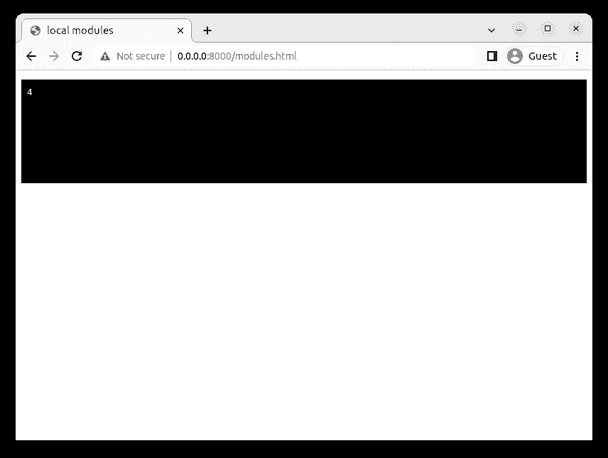

在这里，您可以看到代码的输出已经记录在`<py-terminal>`中。

### 从 Python 标准库中导入模块

PyScript 在 Pyodide 的帮助下，提供了对 Python 标准库中许多可用模块的访问，这些模块随时可供您使用，但以下模块除外:

访问[化脓文档](https://pyodide.org/en/stable/usage/wasm-constraints.html#python-standard-library)查看完整列表。此外，请注意包含的但不起作用的模块，如多处理、线程和套接字模块。

默认情况下，标准库中的模块在 PyScript 命名空间中可用；您只需要导入它们就可以在文件中使用它们。

仍然在`modules.html`文件中，修改`<py-script>`标签中的 Python 代码，使用`random`模块生成一个随机数:

```
from mathslib import subtract
import random
print(subtract(8, 4))
print("random number generated: ")
print(random.randint(1, 12))

```

现在访问`[http://0.0.0.0:8000/modules.html]([http://0.0.0.0:8000/modules.html](http://0.0.0.0:8000/modules.html))`页面，您会看到每次刷新页面时都会生成一个随机数:

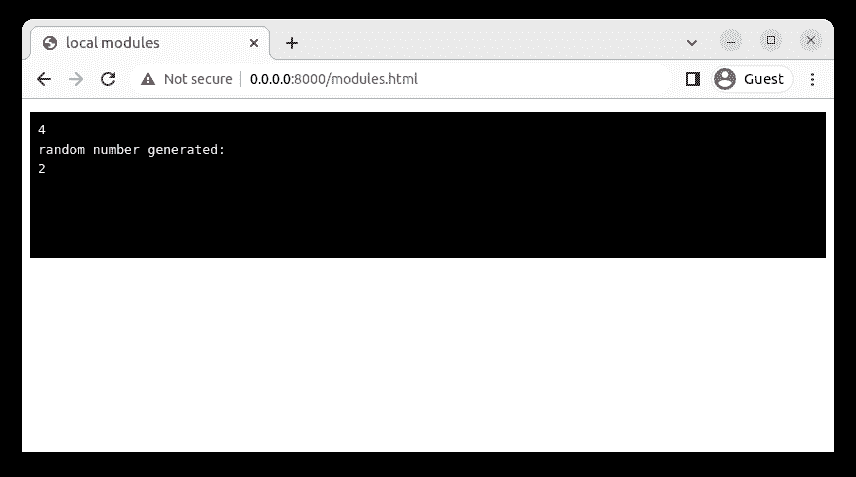

### 使用第三方包

除了使用内置的 Python 模块，您还可以使用 Pyodide 附带的第三方库，例如:

有关受支持的第三方软件包的完整列表，请访问 [Pyodide 文档](https://pyodide.org/en/stable/usage/packages-in-pyodide.html)或密切关注 Pyodide [GitHub repo](https://github.com/pyodide/pyodide/tree/main/packages) 。

要添加第三方包，请创建一个新的 HTML 文件`third-party.html`，并添加以下代码:

```
<!DOCTYPE html>
<html lang="en">
  <head>
    <meta charset="utf-8" />
    <meta name="viewport" content="width=device-width, initial-scale=1" />
    <title>Third Party</title>
    <!-- linking to PyScript assets -->
    <link rel="stylesheet" href="https://pyscript.net/releases/2022.12.1/pyscript.css" />
    <script defer src="https://pyscript.net/releases/2022.12.1/pyscript.js"></script>
  </head>
  <body>
    <div id="graph"></div>
    <!-- Add third-party dependencies here -->
      <py-config>
        packages = ["numpy", "matplotlib"]
      </py-config>
      <py-script>
import numpy as np
import matplotlib.pyplot as plt
arr = np.array([1, 2, 3, 4, 5])
plt.plot(arr)
plt
display(plt, target="graph")
      </py-script>
  </body>
</html>

```

在`<py-config>`标签中，我们将`packages`设置为我们希望在项目中使用的第三方包列表，它们是 NumPy 和 Matplotlib 包。接下来，在`<py-script>`标签中，我们导入 NumPy 作为`np`，Matplotlib 作为`plt`。

接下来，我们调用 NumPy 的`array`方法，它创建一个数组，然后存储在`arr`变量中。接下来，我们用数组`arr`作为参数调用 Matplotlib 的`plot()`方法来绘制图形。

确保您的文件已保存，并访问`[http://0.0.0.0:8000/third-party.html]([http://0.0.0.0:8000/third-party.html](http://0.0.0.0:8000/third-party.html))`页面。您应该会看到类似于下图的图形:

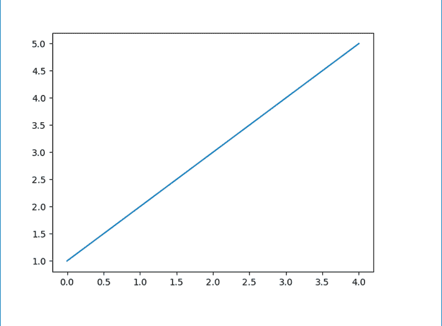

现在您已经了解了如何使用定制的内置模块和第三方包，我们将在下一节学习如何访问和操作 HTML 元素。

## 使用 PyScript 访问和操作 HTML 元素

在本节中，我们将学习如何使用 ID 或 CSS 类选择 HTML 元素，修改元素，将事件附加到元素，以及使用 PyScript 创建新元素。

### 使用`Element`类

PyScript 附带了`Element`类，该类允许您使用 ID 选择 HTML 元素。

要查看它是如何工作的，创建一个`elements.html`文件并插入以下内容:

```
<!DOCTYPE html>
<html lang="en">
  <head>
    <meta charset="utf-8" />
    <meta name="viewport" content="width=device-width, initial-scale=1" />
    <title>Element class</title>
    <link rel="stylesheet" href="https://pyscript.net/alpha/pyscript.css" />
    <script defer src="https://pyscript.net/alpha/pyscript.js"></script>
  </head>
  <body>
  <ul id="navigation">
    <li class="home">home</li>
    <li class="about">about</li>
    <li class="services">services</li>
    <li class="contact">contact</li></ul>
  </div>
  <div id="output"></div>
  <py-script src="./access-elements.py"></py-script>
  </body>
</html>

```

在`<body>`标签中，我们有一个 ID 为`navigation`的`<ul>`元素。我们将使用 ID 和`Element`类来选择这个元素。选定的实例将为我们提供一些方法，我们可以使用这些方法来选择后代并操纵它们。

我们将使用的另一个标签是 ID 为`output`的`<div>`。我们将修改它的`innerHTML`来写一个新值。最后，在`<div>`标签之后，我们链接到将包含我们的 Python 代码的`access-elements.py`文件。它还不存在，所以让我们继续创建它。

一旦创建了`access-elements.py`文件，向其中添加以下代码:

```
ul_element = Element("navigation")
first_element = ul_element.select('.home').add_class('first')
second_element = ul_element.select('.about').remove_class('about')
div_element = Element("output")
div_element.write("Value set from PyScript")

```

在前面的代码中，我们使用`Element`类通过`navigation` ID 访问`<ul>`元素。

当使用`Element`类选择一个元素时，您可以利用以下一些方法:

```
write(): Sets the innerHTML value
select(): Uses a CSS selector to find descendant elements
add_class(): Adds one or more classes to an element
remove_class(): Removes one or more classes from an element

```

在第二行中，我们使用`select()`方法选择`<ul>`元素的第一个子元素，使用它的类名`home`。选择孩子后，我们调用`add_class()`方法向`<li>`元素添加一个新类`first`。

在第三行中，我们通过类名`about`访问第二个子元素，然后使用`remove_class()`方法移除它的类`about`。

接下来，我们调用 ID 为`output`的`Element`类，它提供了对位于`elements.html`文件中`ul`元素之后的`<div>`元素的引用。最后，我们用字符串`Value set from PyScript`调用`write()`方法。该方法将把`<div>`元素`innerHTML`的值设置为字符串参数。

在服务器仍然运行的情况下，访问`[http://0.0.0.0:8000/elements.html]([http://0.0.0.0:8000/elements.html](http://0.0.0.0:8000/elements.html))`并检查`<ul>`元件。您将看到第一个`<li>`元素现在有了一个额外的类(`first`)，第二个元素没有类，`div`元素现在有了我们在 Python 中设置的文本:

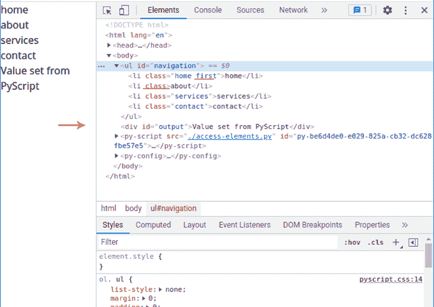

### 将事件附加到元素

我们现在可以选择 HTML 元素并进行一些基本的操作。在本节中，我们将向元素附加一个 click 事件，并在元素被单击时执行 Python 代码。

创建一个`events.html`文件，并编写下面的代码:

```
<!DOCTYPE html>
<html lang="en">
  <head>
    <meta charset="utf-8" />
    <meta name="viewport" content="width=device-width, initial-scale=1" />
    <title>Adding Events</title>
    <link rel="stylesheet" href="https://pyscript.net/releases/2022.12.1/pyscript.css" />
    <script defer src="https://pyscript.net/releases/2022.12.1/pyscript.js"></script>
  </head>
  <body>
  <button id="click-btn"  py-click="handle_click()">Click</button>
  <div id="output"></div>
  <py-script src="./event-handlers.py"></py-script>
  </body>
</html>

```

在`<body>`标签中，我们定义了一个带有`py-click`属性的`<button>`，它将一个`click`事件附加到按钮上。`py-click`属性接受函数名`handle_click`，这将是点击按钮时运行的函数。注意，我们正在调用`handle_click()`函数。

接下来，我们定义 ID 为`output`的`div`元素。我们将使用即将定义的`handle_click`函数来修改元素`innerHTML`。

最后，我们链接到`event-handlers.py`文件，它将包含事件处理函数。

让我们定义`event-handlers.py`并添加以下代码片段:

```
def handle_click():
    display("you clicked the button", target="output")

```

我们定义了点击时运行的`handle_click()`函数。在函数内部，我们调用 PyScript 的`display()`方法，该方法有两个参数:我们想要写入的值`you clicked the button`，以及我们想要写入值的元素的 ID `output`。

确保您的服务器正在运行:

```
python -m http.server

```

然后访问 Chrome 中的网址`[http://0.0.0.0:8000/events.html]([http://0.0.0.0:8000/events.html](http://0.0.0.0:8000/events.html))`。当页面加载时，单击按钮，应该会出现一条消息“您单击了按钮”:

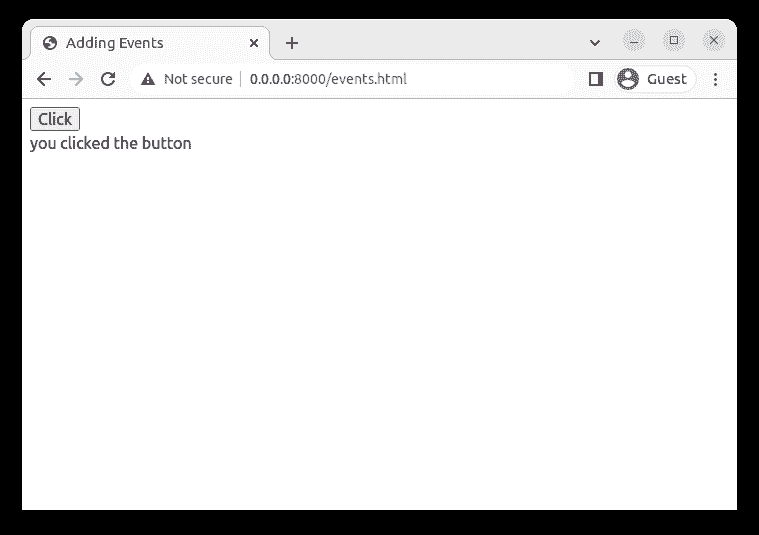

## 使用 JavaScript 访问和操作 DOM

PyScript 附带了一个`js`模块，该模块允许您访问 JavaScript 方法，如`querySelector()`、`createElement()`和`appendChild()`来访问和操作 HTML 元素。

有了这些，您将能够混合 JavaScript 和 Python 来做一些很酷的 DOM 操作。这里有一个例子:

```
import js

print(js.window.innerHeight)

nav = js.document.createElement("div")
js.document.body.prepend(nav)

js.console.log("nav element created")

```

如你所见，我们将像`print()`这样的 Python 代码方法与 JavaScript `window`或`document`属性混合在一起。

在这一节中，我们将主要关注`document`方法。

创建一个`dom.html`文件并添加以下代码:

```
<!DOCTYPE html>
<html lang="en">
  <head>
    <meta charset="utf-8" />
    <meta name="viewport" content="width=device-width, initial-scale=1" />
    <title>Mixing JavaScript and Python</title>
    <link rel="stylesheet" href="https://pyscript.net/releases/2022.12.1/pyscript.css" />
    <script defer src="https://pyscript.net/releases/2022.12.1/pyscript.js"></script>
  </head>
  <body>
  <ul id="navigation">
  </ul>
  <py-script src="./js-dom.py"></py-script>
  </body>
</html>

```

在`<body>`标签中，我们只有一个 ID 为`navigation`的空`<ul>`元素。接下来，我们引用包含 Python 代码的`js-dom.py`。

创建`js-dom.py`文件，添加以下内容:

```
from js import document 
nav_parent = document.querySelector('#navigation')
nav_texts = ["home", "about", "services", "contact"]
for text in nav_texts:
    nav_item = document.createElement("li")
    nav_item.textContent = text
    nav_item.className = "nav_element"
    nav_parent.appendChild(nav_item)

```

在第一行，我们从 PyScript 的`js`模块导入`document`。在第二行中，我们用`#navigation`作为参数调用了`document`模块的`querySelector()`方法。该方法将查找并返回一个 ID 为`navigation`的元素，即`dom.html`文件中的`<ul>`元素。

在第三行中，我们创建了一个导航文本列表，并将其存储在`nav_texts`变量中。之后，我们迭代`nav_texts`列表。在每次迭代中，我们用字符串`li`调用`createElement()`方法来创建一个`<li>`元素。

接下来，我们使用`textContent`属性将文本添加到`<li>`元素，并使用`className`属性将类名`nav_element`添加到`<li>`元素。最后，我们通过使用`nav_item`元素作为参数调用`appendChild()`来将`<li>`元素附加到`<ul>`元素。

确保您的文件已保存，并且服务器仍在运行。访问`[http://0.0.0.0:8000/dom.html]([http://0.0.0.0:8000/dom.html](http://0.0.0.0:8000/dom.html))`，你会看到这样一个页面:

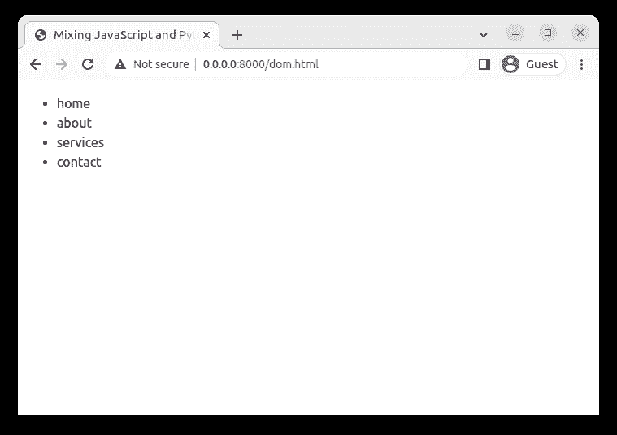

如果您进一步挖掘并检查这些元素，您将会看到`<li>`元素是用类名`nav_element`创建的，这个类名是我们在 Python 中设置的:

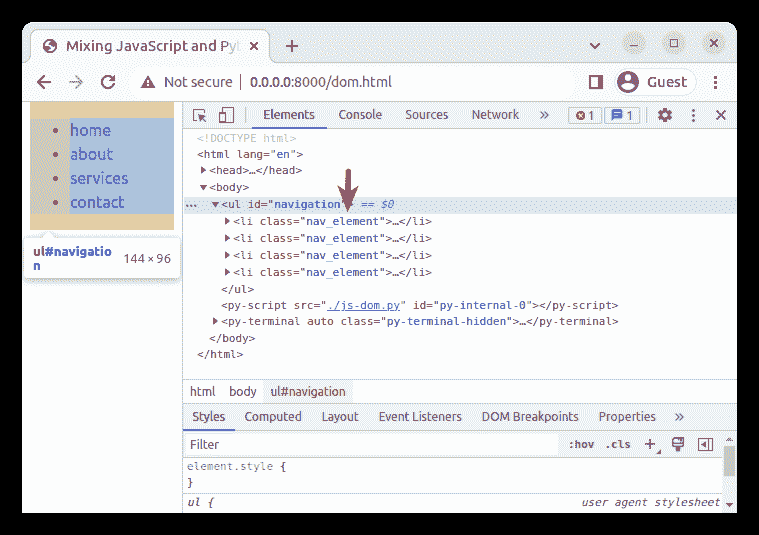

我们现在可以使用`Element`类访问和操作 DOM，将事件附加到元素，并使用 JavaScript 查询和修改 DOM。接下来，我们将使用 PyScript 从 API 获取数据。

## 从 API 获取和呈现数据

在本节中，我们将使用 PyScript 向 API 发送一个`GET`请求来检索数据。我们将使用的 API 是[随机数据 API](https://random-data-api.com/) 。我们将创建一个带有 click 事件的按钮，该事件运行一个函数，该函数在每次单击按钮时调用 API。

在您的目录下创建一个`fetch_data.html`文件，并添加以下内容:

```
<!DOCTYPE html>
<html lang="en">
  <head>
    <meta charset="utf-8" />
    <meta name="viewport" content="width=device-width, initial-scale=1" />
    <title>Fetch data from API</title>
    <link rel="stylesheet" href="https://pyscript.net/releases/2022.12.1/pyscript.css" />
    <script defer src="https://pyscript.net/releases/2022.12.1/pyscript.js"></script>
  </head>
  <body>
  <button id="get-name" py-click="get_random_name()">Generate Random Name</button>
  <div id="output"></div>
  <py-script src="./fetch.py"></py-script>
  </body>
</html>

```

此时，代码应该很熟悉了。最重要的部分是`<button>`标签，它有接受`get_random_name()`函数的`py-click`属性。该功能将驻留在底部链接的`fetch.py`文件中。让我们继续创建文件。

在文本编辑器中，创建一个名为`fetch.py`的新文件，内容如下:

```
from pyodide.http import pyfetch
import asyncio

async def get_random_name(): 
    response = await pyfetch(url="https://random-data-api.com/api/name/random_name", method="GET")
    data = await response.json()
    first_name = data.get('first_name')
    middle_name = data.get('middle_name')
    last_name = data.get('last_name') 
    output =  f"Random name: {first_name} {middle_name} {last_name}"
    pyscript.write('output', output)

```

在第一行中，我们从`pyodide.http`模块导入了`pyfetch`方法，这允许我们发出异步网络请求。在第二行中，我们导入了`asyncio`模块，它是 Python 标准库的一部分，并提供了对创建异步函数有用的`async`和`await`关键字。

接下来，我们通过在前面加上来自`asyncio`模块的`async`关键字来定义一个异步函数`get_random_name()`。在函数中，我们调用接受两个参数的`pyfetch()`方法:

*   `URL`:API 端点
*   `method`:种类你要使用的 HTTP 方法，这里是`GET`方法

当`pyfetch()`运行时，它返回一个对象，然后存储在`response`变量中。在接下来的代码行中，我们调用`response`对象上的`json()`来解析 JSON 并返回一个 Python 字典，然后存储在`data`变量中。

在接下来的几行中，您从`data`字典中提取名字、中间名和姓氏，并将它们存储在各自的变量中。最后，我们使用 Python 的 f 字符串连接名称，并调用`pyscript.write()`方法将数据写入 ID 为`output`的`<div>`元素中。

确保您的服务器正在运行，并访问`[http://0.0.0.0:8000/fetch_data.html]([http://0.0.0.0:8000/fetch_data.html](http://0.0.0.0:8000/fetch_data.html))`页面。一旦页面加载完毕，点击**生成随机名**按钮。您将看到，每次单击按钮时都会生成一个新名称:

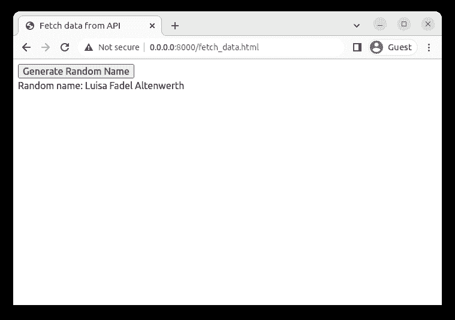

## 使用`localStorage`保存数据

在本节中，我们将使用本地存储来保存和检索数据。本地存储是 web 浏览器中的一个对象，可以存储没有截止日期的数据。Python 可以通过从`js`模块导入本地存储来使用它。

为了使用本地存储，我们将创建一个允许用户输入评论的文本区域。如果他们想要保存评论，他们将点击一个`save`按钮，该按钮将运行一个将数据保存在本地存储器中的功能。每次访问页面时，将从本地存储中检索数据，并将文本区域设置为该数据。

创建一个`storage.html`文件，添加以下内容:

```
<!DOCTYPE html>
<html lang="en">
  <head>
    <meta charset="utf-8" />
    <meta name="viewport" content="width=device-width, initial-scale=1" />
    <title>Store data in local storage</title>
    <link rel="stylesheet" href="https://pyscript.net/releases/2022.12.1/pyscript.css" />
    <script defer src="https://pyscript.net/releases/2022.12.1/pyscript.js"></script>
  </head>
  <body>
  <textarea id="comment" class="block border"></textarea>
  <button id="save" py-click="save_comment()">Save</button>
  <py-script src="./local-storage.py"></py-script>
  </body>
</html>

```

在`<body>`标签中，我们创建了一个 ID 为`comment`的`<textarea>`标签。我们将使用这个 ID 来获取 Python 中文本区域元素的引用。接下来，我们定义一个 ID 为`save`的按钮和一个将调用`save_comment()`的点击事件，我们还没有定义这个事件。最后，我们引用了`local-storage.py`，它将包含我们的 Python 代码。让我们现在创建文件。

创建`local-storage.py`并添加以下内容:

```
from js import localStorage
def save_comment():
    text =  Element("comment").value
    localStorage.setItem("comment", text)
if localStorage.getItem("comment"):
    text_area =  Element("comment")
    text_area.write(localStorage.getItem("comment"))

```

首先，我们从`js`模块导入`localStorage`对象。接下来，我们定义`save_comment()`函数；在函数内部，我们调用 ID 为`comment`的`Element`类来获取文本区域的引用。一旦该方法找到了文本区域，我们就使用`value`属性来获取文本区域的内容，并将值存储在`text`变量中。在下一行中，我们调用`localStorage`对象的`setItem()`方法，在`comment`键下保存`localStorage`对象中的注释文本。

现在，`save_comment()`功能只有在点击`save`按钮时才会运行。然而，在`save_comment()`函数之外，该函数后面的行将只在页面加载期间执行。

当页面第一次加载时，我们使用`if`语句来检查`localStorage`对象在`comment`键下是否有数据。如果为真，我们使用`Element`类引用文本区域，并将它的实例存储在`text_area`变量中。接下来，我们调用`text_area`实例的`write()`方法，用本地存储中的数据更新文本区域内容。

确保您的服务器正在运行，并访问`[http://0.0.0.0:8000/storage.html]([http://0.0.0.0:8000/storage.html](http://0.0.0.0:8000/storage.html))`。输入您喜欢的任何文本并点击**保存**按钮:

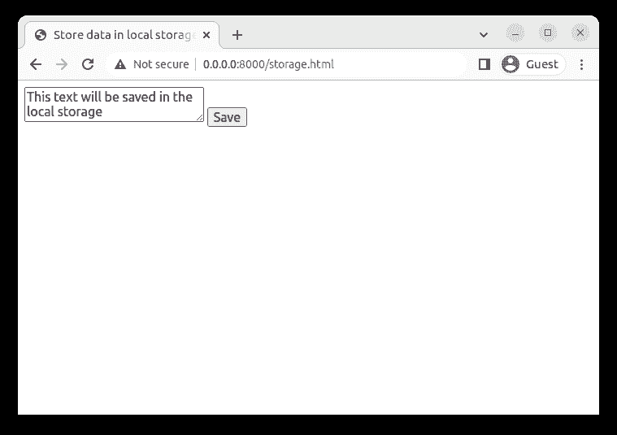

接下来，刷新 URL，您将看到文本区域包含您在初次访问时保存的文本:


至此，您已经知道如何使用 PyScript 来利用`localStorage`。接下来，我们将使用 PyScript 读取文件系统中的一个文件。

## 与文件系统交互

在这一节中，我们将使用 PyScript 从本地文件系统中的明文文件读取数据，并将其内容附加到 DOM 中。

首先，让我们创建一个包含我们想要读取的数据的文件。在主项目目录中，运行以下命令创建并移入一个新目录:

```
mkdir data && cd data

```

接下来，创建一个`names.txt`文件，并添加以下内容，这些内容是 Python web 框架的名称:

```
Django
Flask
FastAPI
web2p

```

保存文件并返回到项目目录的根目录:

```
cd ..

```

创建文件后，在文本编辑器中创建一个`file-system.html`文件，如下所示:

```
<!DOCTYPE html>
<html lang="en">
  <head>
    <meta charset="utf-8" />
    <meta name="viewport" content="width=device-width, initial-scale=1" />
    <title>Read data from file system</title>
    <link rel="stylesheet" href="https://pyscript.net/releases/2022.12.1/pyscript.css" />
    <script defer src="https://pyscript.net/releases/2022.12.1/pyscript.js"></script>
  </head>
  <body>
  <py-config>
    [[fetch]]
    files = ["/data/names.txt"]
  </py-config>
  <ul id="frameworks">
  </ul>
  <py-script src="./read-file.py"></py-script>
  </body>
</html>

```

在`<py-env>`标签中，我们指定了`names.txt`的路径，它是相对于`file-system.html`路径的。接下来，我们创建一个带有`frameworks` ID 的空`<ul>`标签。最后参考一下`read-file.py`，我们很快会定义。

用以下内容创建一个`read-file.py`:

```
from js import document
ul_element = document.querySelector("#frameworks")
with open("data/names.txt") as f:
    for line in f:
        li_element = document.createElement("li")
        li_element.innerText = line
        ul_element.appendChild(li_element)

```

在第一行中，我们用一个 ID 选择器`#frameworks`调用`querySelector()`方法，它获取一个对`<ul>`元素的引用。在第二行中，我们用文件名`names.txt`调用`open()`方法，并将文件对象存储为`f`。在`with`语句中，我们迭代存储在文件对象`f`中的每一行。

在每次迭代中，我们使用`document`对象的`createElement()`方法创建一个`<li>`元素。接下来，我们使用`li_element`实例的`innerText`属性将`<li>`文本内容设置为`line`变量中的值。最后，我们通过使用`li_element`作为参数调用`appendChild()`来将`<li>`元素附加到`<ul>`元素。

再次启动服务器(如果您以前停止过):

```
python -m http.server

```

访问[http://0 . 0 . 0 . 0:8000/file-system . html](http://0.0.0.0:8000/file-system.html)查看页面上显示的明文文件的内容:

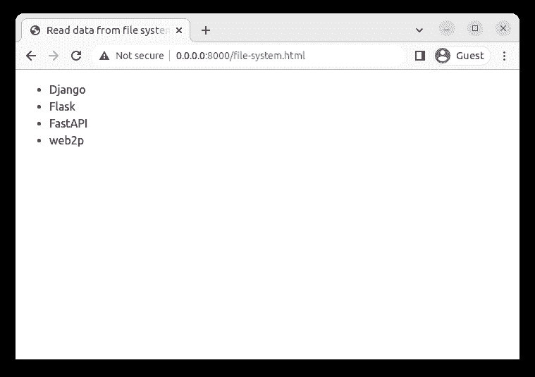

如果您检查这些元素，您会看到有四个`<li>`元素被附加到了`<ul>`元素上。

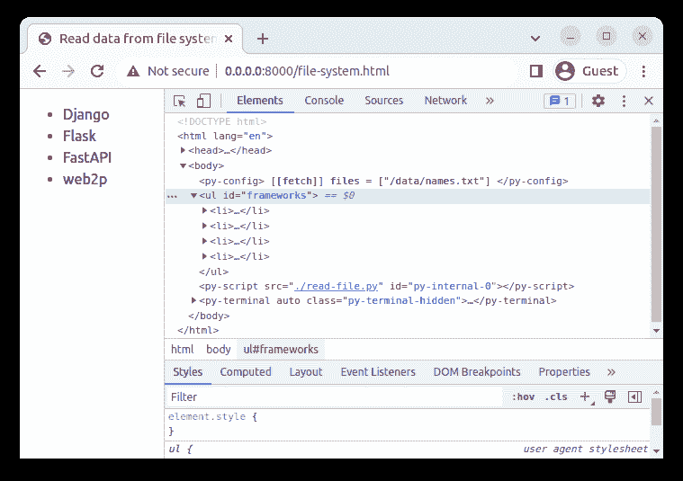

这样，您现在可以读取文件系统中的文件了。您可以使用相同的方法来读取 CSV 文件和许多其他文件格式。

## 结论

在本教程中，我们学习了如何使用 PyScript REPL、创建自定义模块、使用 Python 标准库中的模块以及导入第三方模块。我们还学习了如何使用 PyScript 访问和操作元素，发出 API 请求，使用`localStorage`，以及从文件系统中读取一个明文文件。

要进一步了解 PyScript，请访问 [PyScript 主页](https://pyscript.net/)。此外，参见 [Pyodide 文档页面](https://pyodide.org/)了解更多关于它在浏览器中实现的可能性。

## 您是否添加了新的 JS 库来提高性能或构建新特性？如果他们反其道而行之呢？

毫无疑问，前端变得越来越复杂。当您向应用程序添加新的 JavaScript 库和其他依赖项时，您将需要更多的可见性，以确保您的用户不会遇到未知的问题。

LogRocket 是一个前端应用程序监控解决方案，可以让您回放 JavaScript 错误，就像它们发生在您自己的浏览器中一样，这样您就可以更有效地对错误做出反应。

[](https://lp.logrocket.com/blg/javascript-signup)[https://logrocket.com/signup/](https://lp.logrocket.com/blg/javascript-signup)

[LogRocket](https://lp.logrocket.com/blg/javascript-signup) 可以与任何应用程序完美配合，不管是什么框架，并且有插件可以记录来自 Redux、Vuex 和@ngrx/store 的额外上下文。您可以汇总并报告问题发生时应用程序的状态，而不是猜测问题发生的原因。LogRocket 还可以监控应用的性能，报告客户端 CPU 负载、客户端内存使用等指标。

自信地构建— [开始免费监控](https://lp.logrocket.com/blg/javascript-signup)。