# 用 Bokeh 和 Jupyter 笔记本实现 Python 数据可视化

> 原文：<https://blog.logrocket.com/python-data-visualization-bokeh-jupyter-notebook/>

如果你是数据科学家或分析师，可视化数据可能是你工作中最有趣的部分。可视化可以帮助您和您的利益相关者更好地理解您正在处理的数据。如果您使用 Python 来分析数据，有几个库可供选择。

Python 中最常见的数据可视化库可能是 [Matplotlib](https://matplotlib.org/stable/index.html) 和 [Seaborn](https://blog.logrocket.com/data-visualization-python-seaborn/) ，但是在这篇博文中，我们将介绍另一个名为 [Bokeh](https://docs.bokeh.org/en/latest/index.html) 的伟大库。另外，看完这篇教程，你会知道如何结合 Jupyter 笔记本使用 Bokeh。为了演示，我们将使用一个菱形数据集，您可以从[这里](https://www.kaggle.com/shivam2503/diamonds)获得。

在我们深入研究这些工具之前，我想快速解释一下什么是散景和 Jupyter 笔记本，以及何时使用它们。

## 什么是散景？

在简介中，我提到 Matplotlib 和 Seaborn 是最流行的数据可视化库。所以问题可能会出现，为什么你甚至应该使用散景呢？

嗯，有了像 Matplotlib 这样的工具，你就只能进行静态可视化了。你不能与用户进行任何形式的互动。这就是散景出现的原因！您不仅可以使用散景创建交互式绘图，还可以创建仪表板和数据应用程序。

## 什么是 Jupyter 笔记本？

Jupyter Notebook 是一个开源的网络应用程序，可以托管在你的本地机器上。它支持许多语言，包括 Python 和 R，非常适合数据分析和可视化。说到底，笔记本就是一系列的输入单元格，可以单独执行。幸运的是，散景使得在 Jupyter 笔记本中渲染情节变得相当容易！

## 装置

为了[在您的机器上安装 Jupyter Notebook](https://jupyter.readthedocs.io/en/latest/install/notebook-classic.html) ，您必须安装 Python ≥ 3.3 或 Python 2.7。

### Jupyter 笔记型电脑

装了 Python，其实有两种安装 Juypter Notebook 的方式；建议使用 Anaconda 正确安装 Jupyter 笔记本。

Anaconda 是一个 Python 发行版，它提供了您快速开始数据科学相关任务所需的一切。如果你安装 Anaconda，它会自动安装正确的 Python 版本，100 多个 Python 包，还有 Jupyter。

下载并安装 Anaconda 之后，您可以打开 Anaconda-Navigator 并从那里运行 Jupyter Notebook，或者只需在您的终端上键入以下命令:

```
jupyter notebook

```

或者，你也可以用 pip/pip3 安装 Jupyter 笔记本。请运行以下命令，确保获得最新版本的 pip/pip3:

```
pip3 install --upgrade pip

```

之后，您就可以开始实际安装 Jupyter Notebook 了:

```
pip3 install jupyter

```

### 散景

至此，我们几乎完成了准备工作。现在，只剩下安装散景了。安装 Anaconda 后，运行:

```
conda install bokeh

```

否则，运行:

```
pip install bokeh

```

### 熊猫和熊猫

对于我们数据的一些基本操作，我们还需要安装 Pandas 和 NumPy。如果您使用的是 Anaconda，请安装:

```
conda install numpy pandas

```

同样，如果您使用 pip，您需要运行以下代码:

```
pip install numpy pandas

```

## 入门指南

为了开始，让我们导入所需的库及其相应的别名:

```
from bokeh.plotting import figure, show
from bokeh.io import output_notebook
import pandas as pd
import numpy as np

```

从 1 号线和 2 号线的进口在这里是最重要的。`figure`函数允许我们创建一个基本的绘图对象，在这里我们可以定义高度、网格和工具。

令人惊讶的是，`show`函数让我们渲染实际的情节。与`output_notebook`结合，它使我们能够在 Jupyter 笔记本中输出我们的情节！

要输出 Jupyter 笔记本中的图形，您只需在渲染第一个图形之前调用`output_notebook`。如果你看到下面的成功消息，你应该准备好了！

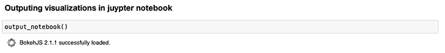

The output_notebook function

## 短数据探索

这篇博客文章旨在解释如何结合 Juypter 笔记本使用散景，因此重点不会放在创建完整的探索性数据分析(EDA)上。不过，在我们继续之前，我们将简要地看一下我们将要处理的数据。

让我们首先加载数据并创建一个更小的样本，以保持简单快速:

```
data = pd.read_csv("diamonds.csv").drop("Unnamed: 0", axis=1)
data = data.sample(3000, random_state=420)

```

我们使用 pandas 的`read_csv`函数来加载数据。列`Unnamed: 0`被删除，因为那里没有相关信息。

如果你想重现和我在这篇文章中得到的完全一样的结果，你还需要将第二行代码中的`random_state`设置为 420。

在下一步中，让我们尝试对数据和数据类型有一个简短的概述:

```
data.info()

```

这会生成以下输出:

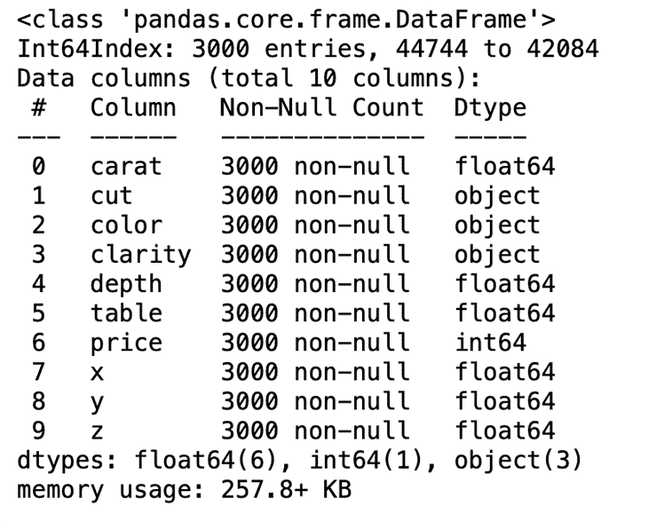

我们可以看到，我们有七个数字变量和三个分类变量。以下是每个变量的简短解释:

*   **克拉**:钻石的重量
*   **切割**:切割质量，有五个可能值(一般、良好、非常好、优质、理想)
*   **颜色**:钻石的颜色，颜色代码从 D(最好)到 J(最差)
*   **净度**:钻石的净度有八种可能值
*   **X** :钻石的长度(毫米)
*   **Y** :钻石的高度(mm)
*   **Z** :钻石的深度(毫米)
*   **深度**:按 Z / `average(X, Y)`计算
*   **表**:钻石的高度与其最宽点的比值
*   **价格**:一颗钻石的美元价格

## 使用字形进行简单绘图

最后，这是我们定义第一个非常简单的散景图的地方！所谓的[字形用于在散景中创建图](https://docs.bokeh.org/en/latest/docs/user_guide/plotting.html)。字形可以是直线、正方形、楔形、圆形等。

在下面的例子中，我们使用了名为`p`的`figure`对象的`circle`方法。在这个函数中，我们定义了 x 轴(`data.carat`)和 y 轴(`data.price`)的值，圆圈的大小和颜色，以及圆圈的透明度。

```
p = figure(width=800, height=400)

# add a circle renderer with a size, color, and alpha
p.circle(data.carat, data.price, size=20, color="navy", alpha=0.2)

# show the results
show(p)

```

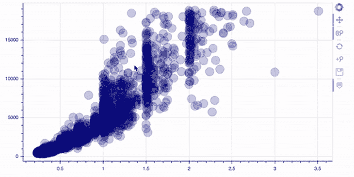

请注意，右边的工具栏是从盒子里出来的！

如你所见，这个情节在某种程度上已经是互动的了。例如，我们可以放大/缩小和重置视图。现在让我们更进一步，给我们的图添加一些注释。

## 向数据图添加注释

首先，没有标题来描述显示内容的绘图不是可视化数据的正确方式。

```
# add a title with providing the title parameter
p = figure(width=800, height=400, title="Distribution of Price")

# compute the histogram of the price variable 
hist, edges = np.histogram(data.price, density=True, bins=50)

# call the quad method on our figure object p
p.quad(top=hist, bottom=0, left=edges[:-1], right=edges[1:], line_color="white")

show(p)

```

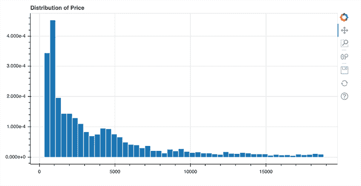

上面，你可以看到给你的散景图添加一个标题是多么容易。在第 2 行，我们只需要通过设置`title`参数来指定标题。在散景中，你首先需要转换你的数据来创建一个直方图。在本例中，我为此使用了 NumPy 方法`histogram()`。该方法返回直方图的实际值(`hist`)和 bin 边缘的实际值(`edges`)，然后我们可以将其传递给第 8 行中`figure`对象`p`的`quad`方法。

但是如果我们想要指定标题的位置，并且我们想要为每个轴指定一个标题呢？嗯，散景也为这个问题提供了一个简单的解决方案:

```
from bokeh.palettes import Spectral7
from bokeh.models import Title

# prepare the colors and their value counts
colors = sorted(list(data.color.unique()))
counts = [i for i in data.color.value_counts().sort_index()]

p = figure(x_range=colors, width=800, height=400)

p.vbar(x=colors, top=counts, width=0.9, color=Spectral7)

p.y_range.start = 0

p.add_layout(Title(text="Colors", align="center"), "below")
p.add_layout(Title(text="Color counts", align="center"), "left")

show(p)

```

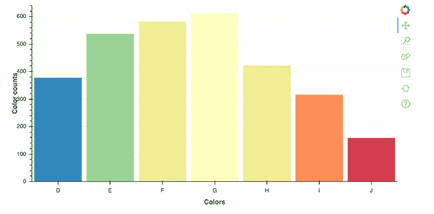

首先，我们再来看看进口。在第一行中，我们导入一个名为`Spectral7`的调色板，它是一个由七个十六进制 RGB 字符串组成的列表，我们可以用它来为我们的绘图着色。

其次，我们导入`Title`对象，它允许我们渲染标题并指定它们的位置。在我们可以绘制每种颜色的数值之前，我们需要准备数据，以便散景可以正确理解它。为此，我将颜色存储在一个名为 colors 的列表中，将相应的值计数存储在一个名为 counts 的列表中。这两个列表用于呈现竖条的`vbar`方法。

不过，有趣的部分在第 14 和 15 行，我们在这里调用了对象`figure`的`add_layout`方法`p`。在那里，我们定义标题和它们的位置。我们将`below`和`left`定义为这里的位置；您也可以使用`top`和`right`作为定位值。

### 向堆栈和图例添加注释

在这一节中，我们将看看一个更高级的带有堆积条形图和图例的图。考虑下面的代码。

```
from bokeh.palettes import GnBu5

# data preparation
colors = list(data.color.unique()) 
cut = list(data.cut.unique())

ideal = [data[(data.cut == "Ideal") & (data.color == colors[i])].shape[0] for i in range(len(colors))]
very_good = [data[(data.cut == "Very Good") & (data.color == colors[i])].shape[0] for i in range(len(colors))]
premium = [data[(data.cut == "Premium") & (data.color == colors[i])].shape[0] for i in range(len(colors))]
good = [data[(data.cut == "Good") & (data.color == colors[i])].shape[0] for i in range(len(colors))]
fair = [data[(data.cut == "Fair") & (data.color == colors[i])].shape[0] for i in range(len(colors))]

data_stacked = {'colors': colors,
                'Ideal': ideal,
                'Very Good': very_good,
                'Premium': premium, 
                'Good': good, 
                'Fair': fair}

p = figure(x_range=colors, width=800, height=400, title="Colors counts by cut")

p.vbar_stack(cut, x='colors', width=0.9, color=GnBu5, source=data_stacked,
             legend_label=cut)

p.y_range.start = 0
p.y_range.end = 1000
p.legend.location = "top_left"
p.legend.orientation = "horizontal"

show(p)

```

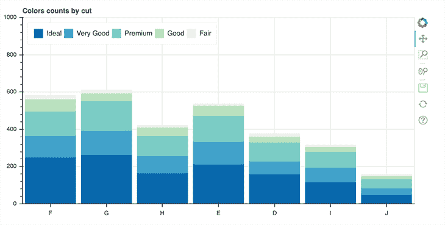

在这个例子中，我们使用调色板`GnBu5` **。**然后，在第 4 行和第 5 行，我们创建了切割和颜色的唯一值列表。第 7 行到第 11 行包含六个列表，我们在其中存储了按切割分组的每种颜色的价值计数。

当应用于下面的例子时，这意味着对于具有值`ideal`的切割，我们迭代所有颜色并将它们的值计数存储在名为`ideal`的列表中。然后，我们对数据集中可用的每个切割重复这一过程。

```
ideal = [data[(data.cut == "Ideal") & (data.color == colors[i])].shape[0] for i in range(len(colors))]

```

这些列表存储在名为`data_stacked`的字典中，将在第 22 行再次使用。在那里，我们将通过调用`figure`对象`p`上的方法`vbar_stack`来创建一个实际的绘图。在这种情况下，需要注意的是`vbar_stack`提供了一个名为`legend_label`的参数，您可以使用它来定义与图例相关的变量。

最后，在第 27 和 28 行，我们指定了图例的位置和方向。

### 向彩色图例添加注释

在注释的上下文中，我们最后要看的是彩色图例:

```
from bokeh.transform import linear_cmap
from bokeh.models import ColorBar, ColumnDataSource
from bokeh.palettes import Spectral6

y = list(data.price.values)
x = list(data.carat.values)

mapper = linear_cmap(field_name="y", palette=Spectral6 ,low=min(y) ,high=max(y))

source = ColumnDataSource(dict(x=x,y=y))

p = figure(width=800, height=400)

p.circle(x='x', y='y', line_color=mapper, color=mapper, fill_alpha=1, size=12, source=source)

color_bar = ColorBar(color_mapper=mapper['transform'], height=300, width=10)

p.add_layout(color_bar, 'right')

show(p)

```

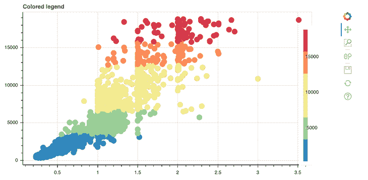

我们在这个情节中引入了一些新的东西。第一个新东西是`linear_cmap()`函数，我们在第 8 行使用它来创建一个颜色映射器。

```
mapper = linear_cmap(field_name="y", palette=Spectral6 ,low=min(y) ,high=max(y))

```

属性`field_name`指定颜色映射到的实际数据，`palette`指定正在使用的颜色，`low`指定颜色映射到的最低值，`max`指定最高值。

第二个新的方面是第 10 行中定义的`ColumnDataSource`对象。这是由散景本身引入的自身数据结构。到目前为止，列表和 NumPy 数组已经被 Bokeh 隐式地转换成了`ColumnDataSource`对象，但是在这里，我们是自己完成的。这很简单，我们只需要以字典的形式提供我们的数据。

```
source = ColumnDataSource(dict(x=x,y=y))

```

最后，我们在第 15 行创建了一个`ColorBar`。在这里，我们使用了一个名为`mapper`的颜色映射器实例。这实际上是一个包含关键字`field`和`transform`的字典；这里，我们只对转换键值感兴趣。这就是为什么我们必须像下面这样编码:

```
color_bar = ColorBar(color_mapper=mapper['transform'], height=300, width=10)

```

然后将变量`color_bar`添加到图右侧第 18 行的布局中！

## 创建布局

在某些情况下，您可能希望渲染几个相邻的地块。这就是散景的布局功能发挥的地方。让我们看看如何创建一个行布局。

```
from bokeh.layouts import row

p1 = figure(width=250, height=200)
hist1, edges1 = np.histogram(data.price, density=True, bins=50)
p1.quad(top=hist1, bottom=0, left=edges1[:-1], right=edges1[1:], line_color="white")

p2 = figure(width=250, height=200)
hist2, edges2 = np.histogram(data.carat, density=True, bins=50)
p2.quad(top=hist2, bottom=0, left=edges2[:-1], right=edges2[1:], line_color="white")

p3 = figure(width=250, height=200)
hist3, edges3 = np.histogram(data.depth, density=True, bins=50)
p3.quad(top=hist3, bottom=0, left=edges3[:-1], right=edges3[1:], line_color="white")

p4 = figure(width=250, height=200)
hist4, edges4 = np.histogram(data.table, density=True, bins=50)
p4.quad(top=hist4, bottom=0, left=edges4[:-1], right=edges4[1:], line_color="white")

show(row(p1, p2, p3, p4))

```

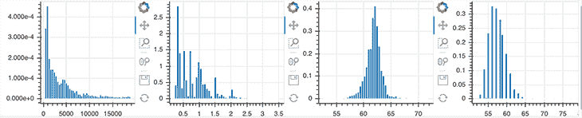

这很简单。首先，从散景和导入`row`函数，而不是做`show(p)`，使用下面的代码:`show(row(p1, p2, p3, p4))`。

如果您想创建一个网格布局，只需将`row`替换为`gridplot`:

```
from bokeh.layouts import gridplot

show(gridplot([[p1, p2], [p3, p4]]))

```

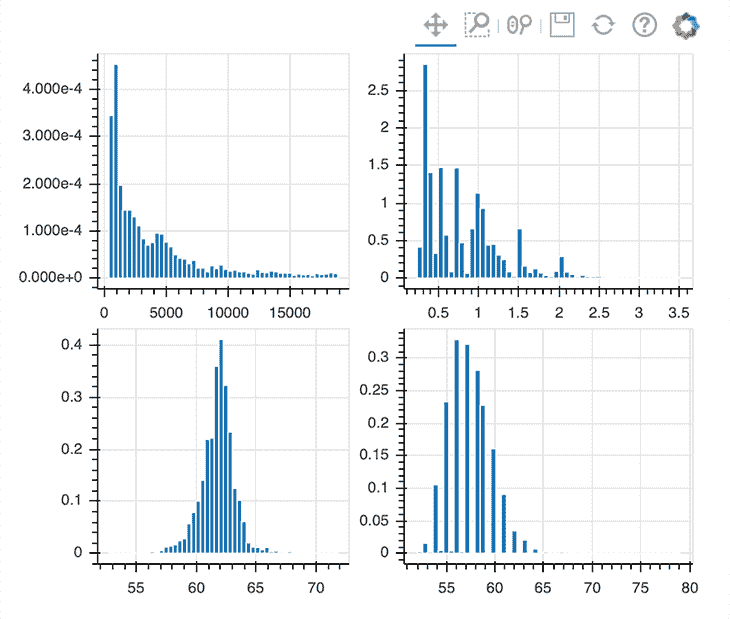

## 在散景中使用主题

在散景中实现主题也是一件非常简单的事情。你可以从散景的内置主题中选择，或者创建自己的主题。为了简单起见，我们使用一个名为`night_sky`的内置主题。

要实现`night_sky`主题，只需执行以下操作:`curdoc().theme = 'night_sky'`

```
from bokeh.io import curdoc

curdoc().theme = 'night_sky'

p = figure(width=800, height=400, title="Distribution of Price")

hist, edges = np.histogram(data.price, density=True, bins=50)

p.quad(top=hist, bottom=0, left=edges[:-1], right=edges[1:], line_color="white")

show(p)

```

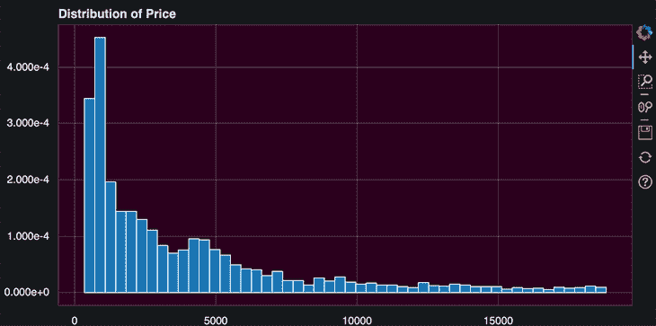

Bokeh’s inbuilt night sky theme

`curdoc`函数返回当前状态的文档。通过调用`curdoc().theme`，你可以改变整个 Jupyter 笔记本的主题。

如果你对创建自己的主题感兴趣，可以随意查看 Bokeh 的文档。

## 使数据图交互

这可能是散景最有趣的部分，因为这是散景的独特之处。我们将从配置绘图工具开始。

```
p = figure(width=800, height=400, tools="hover")

p.circle(data.carat, data.price, size=20, color="navy", alpha=0.2)

show(p)

```


为了添加一个工具，你只需要指定`figure`对象的`tools`参数。在上面的例子中，我们实现了`hover`工具。在这种情况下，散景提供了大量的可能性；我建议[查看他们的文件](https://docs.bokeh.org/en/latest/docs/user_guide/tools.html#freehanddrawtool)以获得一个概览。

```
p = figure(width=800, height=400, tools="reset, hover, zoom_in, wheel_zoom, pan, save")

p.circle(data.carat, data.price, size=20, color="navy", alpha=0.2)

show(p)

```

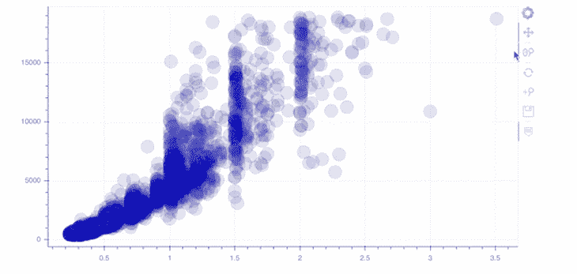

正如您在上面的第 1 行中看到的，您可以简单地将您选择的工具添加为一个字符串。例如，我们实现了滚轮缩放和保存工具！

### 使用散景部件进行互动

散景也允许我们创建小部件，以便提供一个交互式前端/用户界面。在下面的代码块中，我们将看看其中的一些小部件。

```
from bokeh.layouts import column
from bokeh.models import Slider

y = list(data.price.values)
x = list(data.carat.values)

mapper = linear_cmap(field_name="y", palette=Spectral6 ,low=min(y) ,high=max(y))

source = ColumnDataSource(dict(x=x,y=y))

p = figure(width=800, height=400,  tools="hover")

r = p.circle(x='x', y='y', line_color=mapper, color=mapper, fill_alpha=1, size=12, source=source)

slider = Slider(start=0.01, end=0.15, step=0.01, value=0.01)
slider.js_link('value', r.glyph, 'radius')

show(column(p, slider))

```

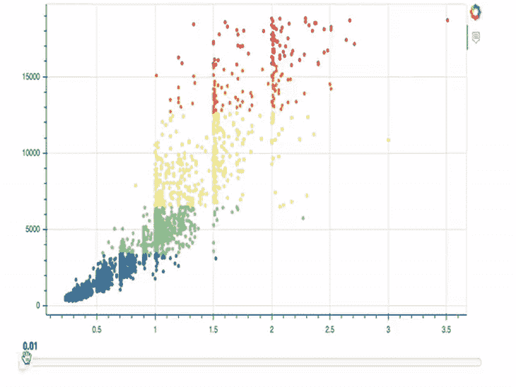

在上面的例子中，我们实现了一个滑块，允许我们改变我们的绘图圆的大小。第 1-13 行不是新的；只有最后三行包含新内容。

在第 15 行，我们调用了`Slider`对象并定义了`start`、`end`、`step`和初始值。在后面的代码行中，我们调用这个刚刚创建的`Slider`对象的`js_link`方法。这个方法让我们链接圆形符号和`Slider`对象。这意味着当滑块的值改变时，圆形图示符/绘图总是更新。

```
slider.js_link('value', r.glyph, 'radius')

```

我们主要对滑块的值感兴趣，所以我们将它定义为我们的第一个参数。其次，我们传递一个散景模型，这个模型应该链接到第一个参数(value)，这个参数应该是我们的 glyph 对象，`r`。最后，我们传递`radius`作为要更改的`r.glyph`的属性，并告诉 Bokeh 在一列中上下渲染绘图和滑块。

我们不仅可以将滑块链接到我们的绘图，还可以链接到颜色选择器！

```
from bokeh.models import ColorPicker

p = figure(width=800, height=400)

circle = p.circle(data.carat, data.price, size=20, color="black", alpha=0.3)

picker = ColorPicker(title="Circle Color")
picker.js_link('color', circle.glyph, "fill_color")

show(column(p, picker))

```

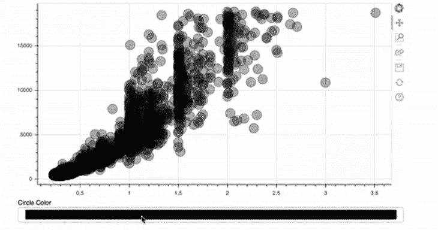

This is even easier than implementing the size slider! For the ColorPicker, we only provide a title — the rest will be done by Bokeh automatically.

```
picker = ColorPicker(title="Circle Color")
picker.js_link('color', circle.glyph, "fill_color")

```

在这种情况下，要更改的属性不是第一个示例中的值，而是字形的颜色。另外，`fill_color`应该是联动的而不是半径。

## 实现交互式图例

接下来，我们将实现一个交互式图例。单击图例项后，相应的数据将在绘图中隐藏或显示。

```
colors = list(data.color.unique()) 

ideal = [data[(data.cut == "Ideal") & (data.color == colors[i])].shape[0] for i in range(len(colors))]
very_good = [data[(data.cut == "Very Good") & (data.color == colors[i])].shape[0] for i in range(len(colors))]
premium = [data[(data.cut == "Premium") & (data.color == colors[i])].shape[0] for i in range(len(colors))]
good = [data[(data.cut == "Good") & (data.color == colors[i])].shape[0] for i in range(len(colors))]
fair = [data[(data.cut == "Fair") & (data.color == colors[i])].shape[0] for i in range(len(colors))]

cut = list(data.cut.unique())

data_stacked = {'colors': colors,
                'Ideal': ideal,
                'Very Good': very_good,
                'Premium': premium, 
                'Good': good, 
                'Fair': fair}

p = figure(x_range=colors, width=800, height=400, title="colors counts by cut",
           toolbar_location=None, tools="hover")

p.vbar_stack(cut, x='colors', width=0.9, color=GnBu5, source=data_stacked,
             legend_label=cut)

p.y_range.start = 0
p.y_range.end = 1000
p.legend.location = "top_left"
p.legend.orientation = "horizontal"
p.legend.click_policy="hide"

show(p)

```

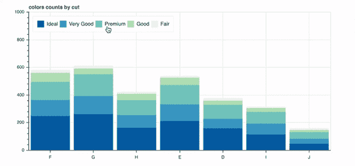

同样，大部分代码对您来说应该很熟悉。只有下面一行是新的:

```
p.legend.click_policy="hide"

```

这很简单，对吗？您也可以在这里将`mute`作为一个值传递；然后，被点击的数据不会消失，而是被静音(其不透明度会改变)。

## 为多个地块创建选项卡

前面，我向您解释了如何实现布局，以便在行、网格或列中呈现几个图。散景为这个问题提供了另一种解决方案，它为我们提供了创建选项卡的机会！

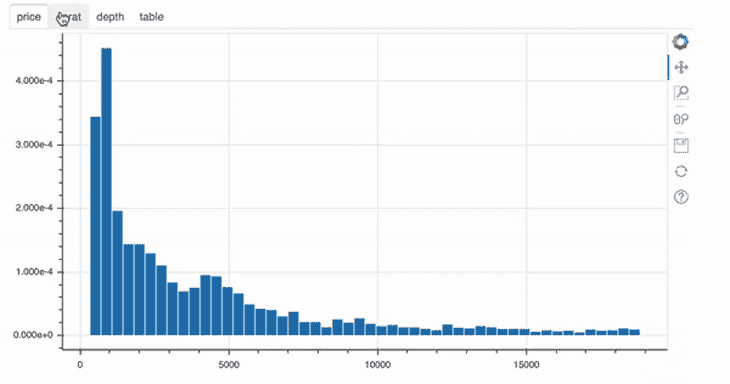

For each of those four plots, a `Panel` object was created. In the end, these objects are nothing more than containers with a title bar and controls. After defining the panel objects, you can then just go ahead and use them in the `Tab` object, like in line 23 of the example above.

## 用 JavaScript 进一步定制散景

最后，我们将仔细看看这篇博文中最先进的例子。到目前为止，我们使用互动工具，这种工具是 Bokeh 自带的。但是也有可能添加定制的 JavaScript 以提供非常定制的行为来响应事件或变化。

```
from bokeh.models import CustomJS

y = list(data.price.values)
x = list(data.carat.values)

s1 = ColumnDataSource(dict(x=x,y=y))
p1 = figure(width=300, height=300,  tools="lasso_select", x_range=(0, 3) , y_range=(0, 20000))
p1.circle(x='x', y='y', fill_alpha=1, source=s1)

s2 = ColumnDataSource(data=dict(x=[], y=[]))
p2 = figure(width=300, height=300, tools="lasso_select", x_range=(0, 3) , y_range=(0, 20000))
p2.circle('x', 'y', fill_alpha=1, source=s2)

s1.selected.js_on_change('indices', CustomJS(args=dict(s1=s1, s2=s2), code="""
        const inds = cb_obj.indices;
        const d1 = s1.data;
        const d2 = s2.data;
        d2['x'] = []
        d2['y'] = []
        for (let i = 0; i < inds.length; i++) {
            d2\['x'].push(d1['x'\][inds[i]])
            d2\['y'].push(d1['y'\][inds[i]])
        }
        s2.change.emit();
    """)
)

show(row(p1, p2))

```

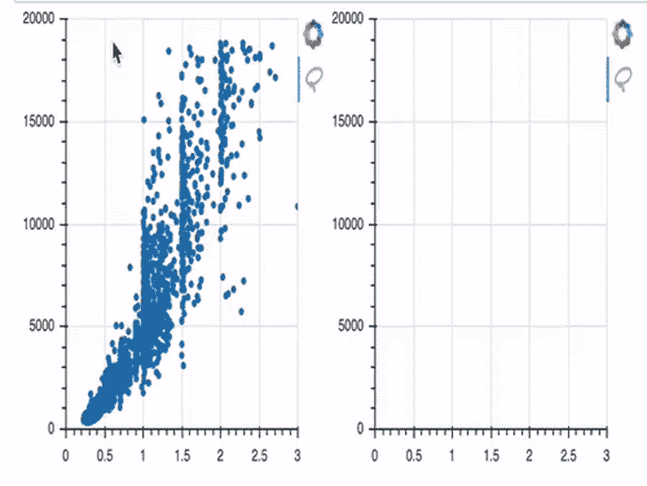

在这个例子中，我们首先创建两个图(`p1`和`p2`)。开始时，只有`p1`提供数据；`p2`没有提供数据，因此默认为空。

这从第 14 行开始改变。在这里，我们定义了一个`js_on_change`方法，您可以在其中附加一个`CustomJS`回调。这个`CustomJS`模型允许我们创建一个 JavaScript 代码片段，当某个事件发生时执行这个代码片段。

在这里，我不会过多地讨论 JavaScript 代码的细节，但我会尝试以一种易于理解的方式概述它。我们的代码正在监听一个事件，我们将它定义为在第一个图中选择的数据点。一旦这些点被选中，它们的 x 和 y 坐标将被存储在变量`s2`中，这是第二次绘图的数据基础。而一旦这些变化成功存储在`s2`中，相应的点就会呈现在右侧的`figure object p2`中。

如果你感兴趣，你可以查看 Bokeh 的文档，了解所有创建和嵌入定制 JS 回调的机会。

## 结论

我知道这很难接受。但这只是一小块蛋糕——散景提供了更多！所以，你可以自由地自己去发现 Bokeh 的文档。

在这篇文章中，我们介绍了 Bokeh 和 Jupyter Notebook 的安装和最简单的绘图方法。在那之后，我们看了一下添加注释和样式我们的情节的视觉方面。最有趣的部分可能是用 Bokeh 的内置特性和我们的自定义 JavaScript 代码来创建交互式的情节。

我希望你喜欢这篇关于散景的介绍，并感谢你的阅读！

## 使用 [LogRocket](https://lp.logrocket.com/blg/signup) 消除传统错误报告的干扰

[](https://lp.logrocket.com/blg/signup)

[LogRocket](https://lp.logrocket.com/blg/signup) 是一个数字体验分析解决方案，它可以保护您免受数百个假阳性错误警报的影响，只针对几个真正重要的项目。LogRocket 会告诉您应用程序中实际影响用户的最具影响力的 bug 和 UX 问题。

然后，使用具有深层技术遥测的会话重放来确切地查看用户看到了什么以及是什么导致了问题，就像你在他们身后看一样。

LogRocket 自动聚合客户端错误、JS 异常、前端性能指标和用户交互。然后 LogRocket 使用机器学习来告诉你哪些问题正在影响大多数用户，并提供你需要修复它的上下文。

关注重要的 bug—[今天就试试 LogRocket】。](https://lp.logrocket.com/blg/signup-issue-free)