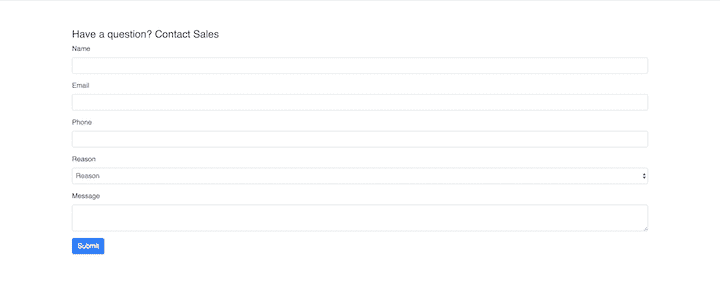
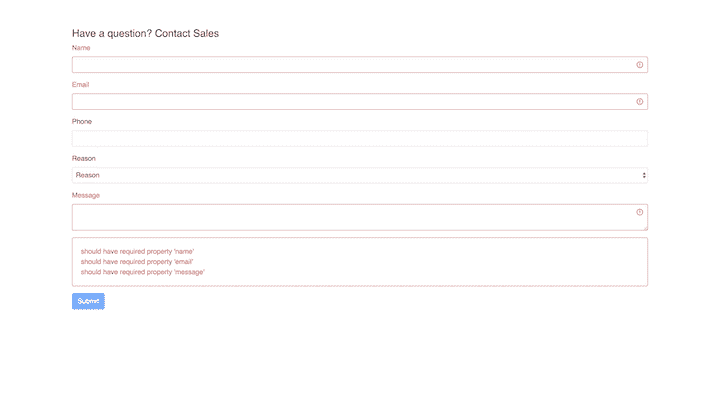

# 在 React with uniforms - LogRocket 博客中快速构建基于模式的表单

> 原文：<https://blog.logrocket.com/quickly-build-schema-based-forms-in-react-with-uniforms/>

制服是 React 库，用于从每个模式构建基于表单的 web UIs。模式是数据、数据类型、允许值、默认值、必需值等的正式表示。这些 web 用户界面是为接受、修改和呈现数据而设计的，通常嵌入在应用程序中。

在本教程中，我们将演示如何使用统一标准在 React 中高效地构建基于模式的表单。

## 你为什么需要制服？

手动编写 HTML 模板和数据绑定逻辑非常困难，尤其是在相对较大的应用程序中。表单甚至更棘手，因为它们通常涉及比数据绑定更高级的功能，比如验证和提交。

统一消除了编写模板和数据绑定的 JavaScript 逻辑的压力。它们有助于表单呈现，并负责状态管理、验证和提交。

以下是制服的核心特征，根据[官方文件](https://uniforms.tools/docs/what-are-uniforms/)。

*   自动表格生成
*   能够呈现每个模式的字段
*   用一行创建自定义字段的助手
*   内嵌和异步表单验证
*   各种模式集成
*   广泛的主题支持

## 制服是怎么工作的？

制服的定义如下。

1.  **模式** **—** 兼容模式包括 [GraphQL 模式](https://graphql.org/learn/schema/)、 [JSON 模式](https://json-schema.org/)、 [`uniforms-bridge-simple-schema`](https://www.npmjs.com/package/uniforms-bridge-simple-schema) 和`[uniforms-bridge-simple-schema-2](https://www.npmjs.com/package/uniforms-bridge-simple-schema-2)`
2.  **Theme**—Theme 是一个包，其中包含来自当今任何[流行风格 librar](https://blog.logrocket.com/top-10-react-component-libraries-for-2020/)[ie](https://blog.logrocket.com/top-10-react-component-libraries-for-2020/)的预样式表单组件，如 AntDesign、Bootstrap 3、Bootstrap 4、Material Design、Semantic、unstyled HTML 等。
3.  **模式桥** —桥是一个统一的模式映射器，uniforms 的内部人员使用它来操作模式数据，验证表单，并从错误中生成。uniforms 有一个预定义的模式到桥的映射器`[uniforms-bridge-json-schema](https://www.npmjs.com/package/uniforms-bridge-json-schema)`，它可以用来[创建一个模式桥](https://uniforms.tools/docs/uth-bridge-concept/)

## 使用制服

假设您公司的营销团队想要收集销售线索信息，您同意提供帮助。您的任务是使用制服创建一个表单，供用户联系营销团队。

### 装置

要使用制服，您必须首先安装依赖包。我们将使用 JSON Schema 指定数据格式，Bootstrap 4 作为我们的 UI 主题，使用 [Ajv](https://github.com/epoberezkin/ajv) 进行模式验证。

要安装所需的软件包，请运行以下命令。

```
npm install uniforms uniforms-bridge-json-schema uniforms-bootstrap4 [email protected] ajv

```

### 创建模式

通过定义普通 JSON 来定义表单的形状，普通 JSON 是 JSON 模式的有效部分。

```
// schema.js

const schema = {
  title: 'Lead Form',
  type: 'object',
  properties: {
    name: { type: 'string' },
    email: { type: 'string' },
    phone: {
      type: 'integer',
      minimum: 0,
      maximum: 100
    },
    reason: {
      type: 'string',
      options: [
        {
          label: 'Product Questions',
          value: 'product-questions'
        },
        {
          label: 'Online Order Support',
          value: 'online-order-support'
        },
        {
          label: 'Sales-support',
          value: 'sales-support'
        },
        {
          label: 'Events',
          value: 'events'
        }
      ]
    },
    message: {
      type: 'string',
      uniforms: {
        component: LongTextField
      }
    }
  },
  required: ['firstName', 'email', 'message']
};

```

### 创建一座桥梁

要让统一使用任何模式，您必须创建模式的桥梁。

以下模式与`uniforms`兼容。

*   `uniforms-bridge-graphql`中的`GraphQLBridge`
*   `uniforms-bridge-json-schema`中的`JSONSchemaBridge`
*   `uniforms-bridge-simple-schema-2`中的`SimpleSchema2Bridge`
*   `uniforms-bridge-simple-schema`中的`SimpleSchemaBridge`

```
import { JSONSchemaBridge } from 'uniforms-bridge-json-schema';

const bridge = new JSONSchemaBridge(schema);

```

尽管 JSON Schema 很容易与 uniforms 一起使用，但它没有开箱即用的验证。您必须手动定义要在联系人表单上使用的验证程序。

让我们使用 Ajv 进行验证:

```
import Ajv from 'ajv';

const ajv = new Ajv({ allErrors: true, useDefaults: true });

function createValidator(schema) {
  const validator = ajv.compile(schema);

  return model => {
    validator(model);

    if (validator.errors && validator.errors.length) {
      throw { details: validator.errors };
    }
  };
}

const schemaValidator = createValidator(schema);

```

现在您已经有了一个验证器，您可以将它作为桥的一部分。

```
const bridge = new JSONSchemaBridge(schema, schemaValidator);

```

此时，`schema.js`文件应该是这样的:

```
import Ajv from 'ajv';
import { JSONSchemaBridge } from 'uniforms-bridge-json-schema';
const ajv = new Ajv({ allErrors: true, useDefaults: true });
const schema = {
  title: 'Lead Form',
  type: 'object',
  properties: {
    name: { type: 'string' },
    email: { type: 'string' },
    phone: {
      type: 'integer',
      minimum: 0,
      maximum: 100
    },
    reason: {
      type: 'string',
      options: [
        {
          label: 'Product Questions',
          value: 'product-questions'
        },
        {
          label: 'Online Order Support',
          value: 'online-order-support'
        },
        {
          label: 'Sales-support',
          value: 'sales-support'
        },
        {
          label: 'Events',
          value: 'events'
        }
      ]
    },
    message: {
      type: 'string',
      uniforms: {
        component: LongTextField
      }
    }
  },
  required: ['firstName', 'email', 'message']
};

function createValidator(schema) {
  const validator = ajv.compile(schema);
  return model => {
    validator(model);
    if (validator.errors && validator.errors.length) {
      throw { details: validator.errors };
    }
  };
}
const schemaValidator = createValidator(schema);
const bridge = new JSONSchemaBridge(schema, schemaValidator);
export default bridge;

```

### 将架构添加到表单中

Uniforms 的主题包包括一个名为`AutoForm`的组件，它从模式中生成一个表单。

将模式传递给`AutoForm`以生成表单。

```
import React from "react";
import "./styles.css";
import { AutoForm, AutoFields, ErrorsField, SubmitField } from 'uniforms-bootstrap4';

import LeadSchema from './schema';
export default function App() {
  return (
    <div className="App">
      <div className="uniforms">
        <AutoForm schema={LeadSchema} onSubmit={(e) => {console.log(e)}}>
          <h4>Have a question? Contact Sales</h4>
          <AutoFields />
          <ErrorsField />
          <SubmitField />
        </AutoForm>
      </div>
    </div>
  );
}

```





## 结论

现在，您已经掌握了在 React 中使用制服创建基于模式的表单所需的基本知识。该库附带了无数其他预构建的表单元素，您可以在[制服文档](https://uniforms.tools/docs/api-fields/)中探索。

本教程中使用的片段来自一个[示例应用](https://codesandbox.io/s/agitated-feynman-itwiy?from-embed)。欢迎你克隆出来自己玩。

## [LogRocket](https://lp.logrocket.com/blg/react-signup-general) :全面了解您的生产 React 应用

调试 React 应用程序可能很困难，尤其是当用户遇到难以重现的问题时。如果您对监视和跟踪 Redux 状态、自动显示 JavaScript 错误以及跟踪缓慢的网络请求和组件加载时间感兴趣，

[try LogRocket](https://lp.logrocket.com/blg/react-signup-general)

.

[ ](https://lp.logrocket.com/blg/react-signup-general) [](https://lp.logrocket.com/blg/react-signup-general) 

LogRocket 结合了会话回放、产品分析和错误跟踪，使软件团队能够创建理想的 web 和移动产品体验。这对你来说意味着什么？

LogRocket 不是猜测错误发生的原因，也不是要求用户提供截图和日志转储，而是让您回放问题，就像它们发生在您自己的浏览器中一样，以快速了解哪里出错了。

不再有嘈杂的警报。智能错误跟踪允许您对问题进行分类，然后从中学习。获得有影响的用户问题的通知，而不是误报。警报越少，有用的信号越多。

LogRocket Redux 中间件包为您的用户会话增加了一层额外的可见性。LogRocket 记录 Redux 存储中的所有操作和状态。

现代化您调试 React 应用的方式— [开始免费监控](https://lp.logrocket.com/blg/react-signup-general)。