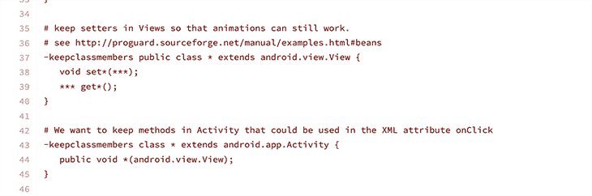
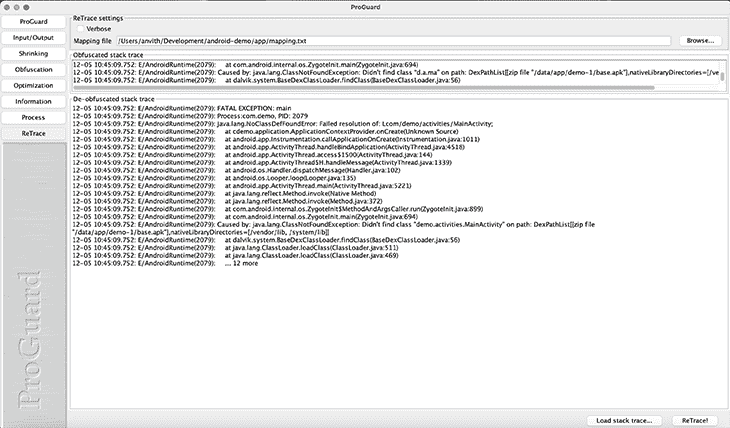

# Android 中的 R8 和代码缩减指南

> 原文：<https://blog.logrocket.com/r8-code-shrinking-android-guide/>

代码收缩是一种方法，它允许我们通过删除未使用的代码或重构现有代码来生成更小的 apk，从而减少占用空间。除了收缩，混淆是另一种策略，让我们能够保护我们的 Android 应用程序免受逆向工程。

使用这两种策略将确保你的应用程序下载更快，更难被他人修改。

在本帖中，我们将讨论:

## R8 对普罗瓜德

在 Android 的早期版本中，代码收缩和优化被委托给一个名为 [Proguard](https://www.guardsquare.com/proguard) 的工具。不过从 Android Gradle Plugin (AGP) v 3.4.0 开始，Android 就使用了 [R8 编译器](https://android-developers.googleblog.com/2018/11/r8-new-code-shrinker-from-google-is.html)。

虽然这两个工具都有助于代码压缩，但 R8 的功能比代码收缩更丰富。首先，R8 对 Kotlin 的支持有限，而 Proguard 是为 Java 工具链构建的。R8 实现了比 Proguard 更好的内联和概述(将公共代码提取到函数中),而后者在传播常量参数方面更好。

说到实际的代码压缩过程，R8 的性能更好，实现了 10%的压缩，而 Proguard 的压缩只有 8.5%。

## R8 的舞台

R8 编译器会做各种事情来减小最终 APK 的大小。其中包括:

*   **解糖**:这让我们可以使用 Java 8 和更高版本的 API 特性，而不用担心支持问题，R8 编译器会处理将代码中使用的新特性回移植到旧的 java APIs。
*   代码收缩:这是 R8 从你的应用中移除未使用代码的阶段，包括库依赖中未使用的代码
*   **资源收缩**:一旦完成收缩代码，R8 识别出未使用的资源，并删除未使用的字符串、drawables 等。
*   **混淆:**在这个阶段，R8 确保你的类和它们的字段被重命名，也可能被重新打包，以防止逆向工程。这个过程会生成一个映射文件，如果需要的话，可以用它来重新获得实际的实体名称
*   **优化代码**:在代码优化过程中，R8 通过删除代码中不可到达的分支(而不是类/文件)来减少应用程序的占用空间和/或进一步提高效率。它使用了高级的优化规则，比如当只从一个地方调用一个方法时，在调用点内联该方法
    *   其他技术包括垂直类合并，其中，如果一个接口只有一个实现，它将两者合并在一个类下

一旦完成上述所有步骤，R8 通过一个称为 dexing 的过程将字节码转换成 dexcode。早期，这是 D8 编译器的一部分，但现在已经集成到 R8 编译器中。

现在我们对 R8 编译器有了一些了解，让我们看看代码收缩实际上是如何工作的。

## 配置代码收缩

在 Android 中，我们可以通过在你的`build.gradle`文件中设置`minifyEnabled`标志为`true`来配置代码收缩。或者，您也可以启用`shrinkResources`来删除不需要的资源。

```
buildTypes{
        release{
            minifyEnabled true
            shrinkResources true
        proguardFiles getDefaultProguardFile('proguard-android-optimize.txt                           '), 'proguard-rules.pro'
        }
}

```

代码收缩从检查所谓的入口点开始。入口点在配置文件中声明，并通过`build.gradle`中的`proguardFiles`参数可用。

一旦 R8 有了一组入口点，它就开始搜索从这些入口点可以到达的所有类和实体。它继续构建这种令牌的列表。任何不可到达的令牌都将从最终输出中去除。

这一过程通常不是万无一失的，因为:

*   我们的一些代码可能使用反射来查找类，这使得编译器很难知道某个特定的类是否被使用
*   您的应用程序可能会通过 JNI 从本机调用方法。由于 R8 被设计为处理 Kotlin/Java 代码而不是本地代码，我们需要指导它保留这些类

这些入口点中有许多是在通过 AGP 插件提供的`proguard-android-optimize.txt`文件中定义的。这是它的部分快照:



让我们回顾一下上面两条规则的含义:

1.  保留 getters 和 setters 在扩展`View`的类中出现的所有函数，因此也保留了`View`类
2.  保留与接收单个`View`参数的签名相匹配的所有活动函数，即 XML 中使用的 click listeners，它是反射式查找的

接下来，让我们了解一下为 R8 提供动力的模式。

## 了解 Proguard 规则模式

尽管我们将这些作为 Proguard 规则来讨论，但它们也是配置 R8 的相同规则。让我们更深入地研究如何编写它们。

典型的 R8 或普罗瓜德规则由三部分组成:

1.  **保留选项:**保留选项定义为“谁”保留，如下所示:
    *   确保我们保留符合规则的目标
    *   确保我们保留符合规则的类别
    *   `keepclasswithmembers`保留其成员符合规则的类
    *   类似地，我们必须`keepclassmembers`只保留一个类的成员
2.  **令牌类型**:表示我们规则的目标实体的类型，即`class`、`enum`或`interface`
3.  **通配符**:这些通配符允许我们定义不同的格式来匹配不同的令牌，如下所示:

这是因为我们的第一个通配符匹配器`*`匹配`Task`和`Storage`，我们可以重用它们来定义函数名的动态部分。

## 写你自己的 R8 规则

通过 AGP 发货的 R8 或 Proguard 规则通常是足够的，但是，可能需要编写您自己的规则。在编写 R8 规则时，我们应该努力避免在 keep 规则中包含超出需要的内容，以确保我们可以压缩大部分代码。此外，我们指定的所有类都需要完全限定，也就是说，它们必须包含包名。

通常，XML 文件中使用的枚举是被 R8 剔除的罪魁祸首。但是我们可以定义自己规则来保持它们，如下所示:

```
-keep enum com.demo.main.MediaType{ *; }

```

> 注意:大括号中的`{*;}`意味着我们打算保留类/枚举的所有成员。

另一个规则是保留类构造函数；以下是使用关键字`init`的方法:

```
-keep public class * extends android.view.View {
    public <init>(android.content.Context);
}

```

有时候，您的应用程序中可能包含一些实体，这些实体通过它们在 jars 中的完全限定名被反射性地查找。您可能希望只保留名称，防止 R8 混淆或重命名该类。您可以使用`keepnames`限定符来保留名称:

```
-keepnames class com.ext.library.ServiceProvider

```

保留类的另一种方法是用`@Keep`注释对它们进行注释。这些类通过 [`androidx.annotation`库](https://github.com/androidx/androidx/blob/androidx-main/annotation/annotation/src/jvmMain/resources/META-INF/proguard/androidx-annotations.pro) Proguard 规则保留。但是，您只能在您控制的源代码上使用它；此外，这是一个更通用的解决方案，会导致包含不使用的成员。

## 资源萎缩

资源收缩通常在代码收缩之后完成，但是我们可以使用`res/raw`文件夹中的`keep.xml`来指定资源保留，而不是使用 Proguard 规则。我们一般不需要这个，除非我们正在通过 [`Resources.getIdentifier()`](https://developer.android.com/reference/android/content/res/Resources#getIdentifier(java.lang.String,%20java.lang.String,%20java.lang.String)) 寻找资源。

在这种情况下，资源收缩器的行为是保守的。下面是一个例子:

```
val name = String.format("ic_%1d", angle + 1)
val res = resources.getIdentifier(name, "drawable", packageName)

```

收缩器使用模式匹配并保留所有资产，从`ic_`开始。我们还可以在我们的`keep.xml`中明确地保留一些资产，如下所示:

```
<?xml version="1.0" encoding="utf-8"?>
<resources xmlns:tools="http://schemas.android.com/tools"
    tools:keep="@drawable/ic_sport*, @drawable/ic_banner_option, @layout/item_header"
    tools:discard="@drawable/wip" />

```

> 注意:`discard`选项确保了`wip`如果没有被使用的话会从最终版本中移除。

## 调试 R8 错误

偶尔在使用 R8 时，您会以`ClassNotFoundException`或`FieldNotFoundException`的形式结束资源丢失错误。然而，由于跟踪是模糊的，我们将需要使用一个叫做 retrace 的工具。

回撤通常出现在以下路径:`Android/sdk/tools/proguard/bin`。您可以通过使用 [proguardgui.sh 命令](http://proguardgui.sh)选择使用基于 GUI 的路线，如下所示:



一旦您发现是哪个类或成员导致了这个问题，您就可以通过为它包含一个特定的 keep 规则来轻松地解决这个问题:

```
-keep class com.demo.activities.MainActivity

```

R8 通常剥离像行号和源文件名这样的元属性。我们可以通过使用`keepattributes`来保留这些信息，如下面的规则所示:

```
-keepattributes SourceFile, LineNumberTable

```

你可以在这里找到属性[的完整列表。](https://www.guardsquare.com/manual/configuration/attributes)

有时，您可能会看到，应该从最终 APK 中删除的成员实际上并没有被删除。我们可以通过使用`whyareyoukeeping`来找出原因:

```
-whyareyoukeeping class com.android.AndroidApplication

```

这将打印以下输出:

```
com.android.AndroidApplication
|- is referenced in keep rule:
|  /Users/anvith/Development/Android/project-demo/app/build/intermediates/aapt_proguard_file/release/aapt_rules.txt:3:1

```

调试时另一个有用的工具是列出所有未使用的类。这可以使用`printusage`来完成，如下所示:

```
-printusage

```

> 关于 R8 规则的一个简短说明:最宽泛的规则优先。因此，如果`libraryA`附带一个规则来包含一个类的一个方法，而‘library b’附带一个规则来包含所有成员，那么`libraryB`的规则优先。

最后，如果您希望看到与您的规则匹配的类，您可以使用下面的命令来观察匹配的结果:

```
-printseeds

```

## 激进的缩水期权

我们可以让 R8 在非兼容模式下运行，并在`gradle.properties`文件中声明以下属性，从而让它变得更加主动:

```
android.enableR8.fullMode=true
```

该标志导致一些更严格的优化，如:

*   除非明确指定，否则避免保留默认构造函数
*   属性(如`Signature`、`Annotations`等。)只为匹配的类保留，即使我们为所有实体指定了泛型`keepattributes`

类似于代码收缩选项，有一个积极的资源收缩模式可以添加到`keep.xml`:

```
<?xml version="1.0" encoding="utf-8"?>
<resources xmlns:tools="http://schemas.android.com/tools"
    tools:shrinkMode="strict" />

```

## 结论

在本文中，我们了解了 R8 以及如何为其配置规则。在这个过程中，我们还讨论了各种调试选项，以解决激进收缩的危险。

我希望您已经发现本文中的信息对于解决您的代码收缩问题是有用的，并准备好利用 R8 工具链！

## LogRocket :即时重现你的安卓应用中的问题。

[](https://lp.logrocket.com/blg/kotlin-signup)

[LogRocket](https://lp.logrocket.com/blg/kotlin-signup) 是一款 Android 监控解决方案，可以帮助您即时重现问题，确定 bug 的优先级，并了解您的 Android 应用程序的性能。

LogRocket 还可以向你展示用户是如何与你的应用程序互动的，从而帮助你提高转化率和产品使用率。LogRocket 的产品分析功能揭示了用户不完成特定流程或不采用新功能的原因。

开始主动监控您的 Android 应用程序— [免费试用 LogRocket】。](hhttps://lp.logrocket.com/blg/kotlin-signup)