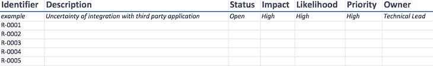
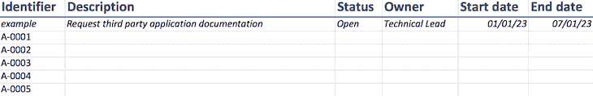
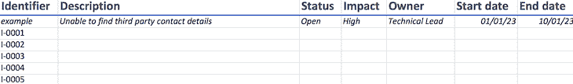
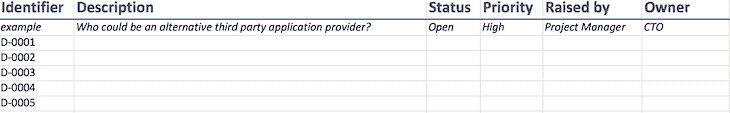

# 将 RAID 日志用于战略项目文档(带模板)

> 原文：<https://blog.logrocket.com/product-management/raid-log-template-strategic-project-documentation/>

每当你开始一个项目时，不管这个项目与什么有关，你都会遇到许多问题需要解决。你如何处理这些问题可以决定你项目的成败。

理想情况下，一个项目团队应该预见到这些元素，并且至少跟踪它们，这样它们就不会破坏项目。RAID 日志是预测和跟踪所有这些元素的完美工具，这可以像使用电子表格一样简单地完成。

* * *

## 目录

* * *

## RAID 是什么意思？

RAID 是帮助您记住影响项目成功的主要因素的首字母缩写词。

RAID 代表:

*   **风险**——可能对项目的成功产生不利影响的事情
*   **行动**——参与您项目的人需要完成什么
*   **问题** —被确定为不是最初计划的事件和发生的事情
*   **决策** —需要由参与项目的人员做出的决议或判断

当你运行一个任何类型的项目时，你需要和项目团队一起进行一些常规的检查，以确保项目顺利进行，并且你仍然在实现项目目标的轨道上。RAID 日志可以提供这些检查点中的一个焦点区域。这是一个检查所有突出点的机会，以确保项目保持健康。

## 处理 RAID 日志中的风险

当你在交付一个项目时开始考虑潜在的风险时，这个列表看起来好像会一直持续下去。

一些例子可能包括[利益相关者](https://blog.logrocket.com/product-management/what-stakeholder-management-tools-techniques/#what-stakeholder-management-why-need-it)在项目期间调整范围，诸如人员或资金等资源被转移到其他领域，以及与第三方应用程序集成的方式的不确定性。

承认风险的存在是很重要的。通过承认它们，你可以考虑减轻它们的方法，并监控它们实际发生的可能性。

对于每种风险，您应该记录以下内容:

*   **标识符** —确保每个人都知道正在讨论的风险的唯一参考
*   **描述** —对风险相关内容的描述，以某种方式书写，以便参与项目的每个人都了解风险是什么
*   **状态** —所述风险的状态，可以是“开放”且仍然相关，或者是“关闭”且不再对项目的未来构成风险
*   **影响** —风险可能对项目产生的影响强度，通常为 1-5(1 表示低影响，5 表示高影响)，或高、中、低
*   **可能性** —风险实际发生的可能性，通常为 1-5，或高、中、低
*   **优先级** —结合影响和可能性的得分，您就能够评估哪些风险具有高优先级；影响最大、可能性最大的风险是最需要优先解决的
*   **所有者** —确定项目团队中谁将负责监控和确保风险缓解的发生
*   **缓解措施** —必须采取什么措施来降低风险，使其处于项目可接受的水平
*   **开始日期** —何时发现风险
*   **结束日期** —应降低或消除风险的时间
*   **注释** —任何附加的相关信息

与 RAID 日志的所有元素一样，它的价值在于定期检查和更新风险，以确保尽一切努力支持项目的顺利运行。

以下是 RAID 日志中风险的一个示例:

## 处理 RAID 日志中的操作

虽然我们希望跟踪和减轻风险，但是需要记录和执行行动，以确保不遗漏所有需要完成的任务。

对于每个动作，您应该记录以下内容:

*   **标识符** —确保每个人都知道正在讨论的行动的唯一参考
*   **描述** —对行动相关内容的描述，以某种方式书写，以便参与项目的每个人都理解行动是什么
*   **状态** —该动作的状态，可以是“未开始”、“进行中”、“已完成”、“暂停”，甚至是“过期”
*   **所有者** —确定项目团队中负责确保行动完成的人。这可能不是实际完成动作的人，而只是负责动作的人
*   **开始日期** —创建行动的时间
*   **结束日期** —行动应于何时完成
*   **注释** —任何附加的相关信息

以下是 RAID 日志中的操作示例:

# 

## 处理 RAID 日志中的问题

当问题被记录在 RAID 日志中时，它们看起来与风险非常相似。然而，问题往往更具体，可以更直接地解决。

可以通过使用第三方应用程序来演示风险和问题之间的区别。与第三方应用程序集成方式的不确定性是项目的一个风险，因为它可能会导致技术问题。但是，由于防火墙问题而无法连接到第三方应用程序是一个可以直接解决的特定问题。

对于每个问题，您应该记录以下内容:

*   **标识符** —确保每个人都知道正在讨论哪个问题的唯一参考
*   **描述** —对问题相关内容的描述，以某种方式书写，以便参与项目的每个人都了解风险是什么
*   **状态** —所述问题的状态，可以是“开放”且仍然相关，或者“关闭”且不再是项目的问题
*   **影响** —问题对项目的影响强度，通常为 1-5 或高、中、低
*   **所有者** —确定项目团队中谁将负责确保问题以某种方式得到解决
*   **开始日期** —问题是什么时候发现的
*   **结束日期** —问题应于何时解决
*   **注释** —任何附加的相关信息

目的是确保影响最大的问题尽快得到解决，并逐步解决影响最小的问题。

以下是 RAID 日志中可能出现的问题的示例:

## 处理 RAID 日志中的决策

当涉及到一个项目团队时，有许多人参与其中，他们都扮演着不同的角色。有些是日常操作人员，参与完成大量的细节工作(例如，项目经理或技术负责人)，其他人是对项目结果感兴趣的项目涉众(例如，销售主管或财务总监)。

日常操作人员更多地涉及风险、行动和问题，而利益相关者更多地关注需要做出的决策。

跟踪决策的目的是确保项目在其覆盖的所有关键领域都有一定的方向。此外，它还允许您知道谁做出了决策以及为什么做出决策，并且在审查项目成果时可以参考审计。

对于每个决定，您应该尝试记录以下内容:

*   **标识符** —确保每个人都知道正在讨论哪个决策的唯一参考
*   **描述** —需要做出什么决定的描述，以问题的形式书写
*   **状态** —所述决策的状态，可以是“开放”且仍然相关，或者“关闭”且不再是项目的问题
*   **优先级** —从高到低衡量决策的优先级。
*   **提出者** —确定向项目团队提出问题的人
*   **所有者** —确定项目团队中谁将负责确保收到决策
*   **开始日期** —问题是什么时候确定的
*   **结束日期** —应该由谁做出决定
*   **注释** —任何附加的相关信息

以下是 RAID 日志中的决策示例:

# 

## RAID 日志看起来像什么？

从以上对四个主要元素的描述中可以看出，RAID 日志是由项目团队定期检查和更新的一系列数据点。

RAID 日志需要:

*   能够显示潜在的大量数据
*   允许多人访问日志，并查看他们需要采取哪些措施
*   提供变更审计

### RAID 日志模板

许多项目团队在 Excel 或 Google 电子表格中建立 RAID 日志。你可以使用我们的 [RAID 日志模板](https://docs.google.com/spreadsheets/d/187SBxFfiNzGknMSsQaDSTj9ITZxxn8l4uUu6NJK0h0U/edit#gid=1730023945)，但是你也可以在网上看到很多例子。当您开始在自己的组织中使用它们时，您将开始调整日志，以便它为您和您的项目服务。

## 使用 RAID 日志有什么好处？

使用 RAID 日志最明显的好处是，日志成为与项目相关的大量信息的中央存储库。这支持所有项目团队成员保持对影响他们项目成功的元素的控制。

* * *

订阅我们的产品管理简讯
将此类文章发送到您的收件箱

* * *

你可以看到谁做了或没做他们说过要做的事情，或者项目最有可能遇到困难的地方。你可以看到谁在做所有的决定，并且可以清楚地回顾所采取的方法。

最后，它们是灵活的。这意味着您可以随着时间的推移对它们进行调整，以满足您组织的需求。如果想让部门负责而不是个人负责，可以。如果你想有多个状态级别，你只需要更新你的模板来迎合它。无论您需要什么，RAID 日志都可以让您灵活地找到满足需求的方法。

尽管如此，日志的好坏取决于放入其中的信息以及更新和寻址的规律性。如果没有人寻求减轻风险，记录所有风险就没有意义。只包括一半的决策是没有意义的，因为当你回来看发生了什么时，你将不能产生完整的画面。

## 你应该使用 RAID 日志吗？

归根结底，这取决于你和你的[项目管理](https://blog.logrocket.com/product-management/product-manager-vs-project-manager/#what-is-a-project-manager)方法。如果你看到跟踪风险、行动、问题和决策的价值，那就试一试。如果你已经在另一个系统中包含了这个，比如[吉拉](https://www.atlassian.com/software/jira?&aceid=&adposition=&adgroup=136973856930&campaign=18440774103&creative=639487383004&device=c&keyword=jira&matchtype=e&network=g&placement=&ds_kids=p73335831609&ds_e=GOOGLE&ds_eid=700000001558501&ds_e1=GOOGLE&gclid=Cj0KCQiAn4SeBhCwARIsANeF9DJEwF8wqthNt74R8OSR4T8dWP1x0ZfyI_8tOMvGhgp78mqmZWmFJ_caAr9uEALw_wcB&gclsrc=aw.ds)或者 [DevOps](https://blog.logrocket.com/from-front-end-developer-to-a-devops-an-intro-to-ci-cd-7a8a8713fb34/) ，那么也许你可以不要它。选择权在你！

## [LogRocket](https://lp.logrocket.com/blg/pm-signup) 产生产品见解，从而导致有意义的行动

[LogRocket](https://lp.logrocket.com/blg/pm-signup) 确定用户体验中的摩擦点，以便您能够做出明智的产品和设计变更决策，从而实现您的目标。

使用 LogRocket，您可以[了解影响您产品的问题的范围](https://logrocket.com/for/analytics-for-web-applications)，并优先考虑需要做出的更改。LogRocket 简化了工作流程，允许工程和设计团队使用与您相同的[数据进行工作](https://logrocket.com/for/web-analytics-solutions)，消除了对需要做什么的困惑。

让你的团队步调一致——今天就试试 [LogRocket](https://lp.logrocket.com/blg/pm-signup) 。