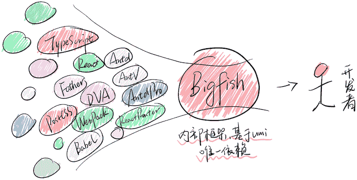
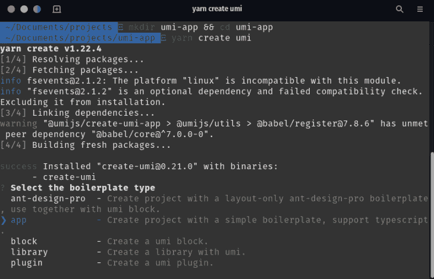
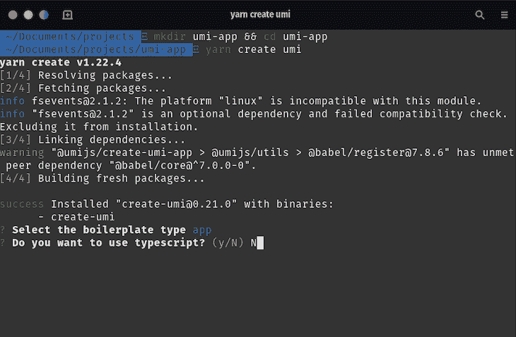
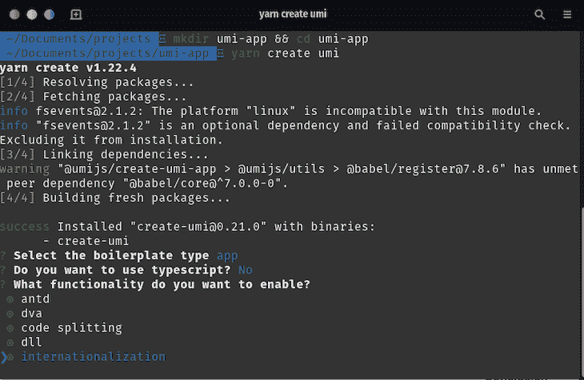
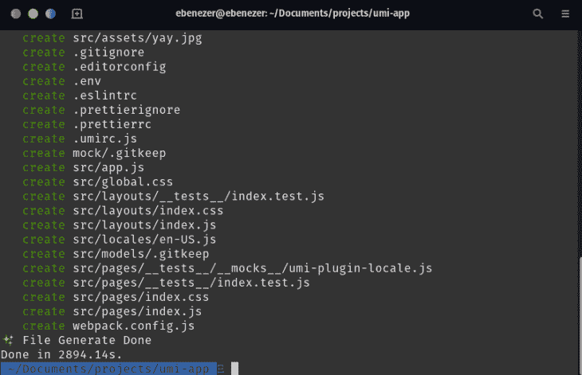
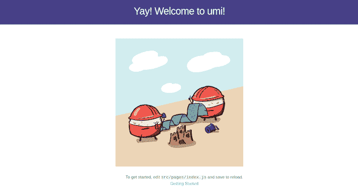
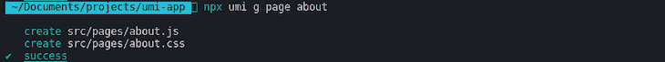
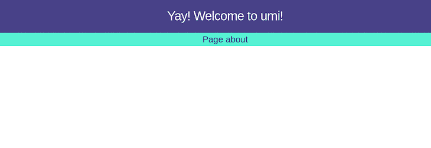
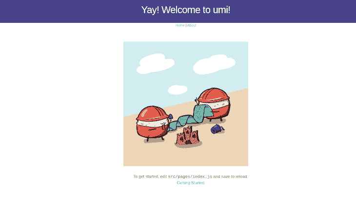

# 使用 UmiJS - LogRocket 博客进行快速的企业级开发

> 原文：<https://blog.logrocket.com/rapid-enterprise-class-development-umijs/>

React 真的很好用。它创建单页应用程序(spa)的能力确实是开创性的，加上它为开发人员提供的开放库的灵活性——不像 Angular 这样固执己见的前端框架——简直是惊人的。

然而，随着这种灵活性而来的是前端开发人员的大量责任，这可能导致许多坏习惯，以及降低软件工程师的生产力和增加开发时间。因此需要像 UmiJS 这样的企业级 React 框架。

海提供开箱即用的工具和插件来帮助快速开发可扩展的应用程序。再加上路由和内容交付的服务器端实现，海成为了一个非常有吸引力的前端开发工具。

## 什么是服务器端渲染(SSR)应用？

与 SPAs 不同，SSR 应用程序为浏览器提供了从服务器接收和显示 HTML 内容的杠杆，而不是完成渲染和转换 JavaScript 文件内容的所有工作。亚历克斯·格里戈良很好地分析了服务器端渲染相对于客户端渲染的优势。

## UmiJS 简介

UmiJS 是一个可扩展的企业级前端应用程序框架，支持配置和常规路由，同时保持功能完整性，如动态路由、嵌套路由和许可路由。

从源代码到构建产品，其完整的插件系统支持各种功能扩展和业务需求。这使得海成为企业级应用的高度可扩展的解决方案。

### 海的技术堆栈



这张来自海[文档](https://umijs.org/docs/how-umi-works#technology-convergence)的图片是它的内部框架，Bigfish。它由通常用于前端开发的技术和工具组成。这些工具融合在一起，构成了海。

### 限制

以下是海的一些限制，您应该在使用它之前考虑一下:

*   海不支持 **IE 8** 或更低版本
*   海仅支持 **React** 16.8 及以上版本
*   海仅支持**节点** 10.0.0 及以上版本
*   该框架非常固执己见(尽管我们认为这对于本文来说是一个优势)

## 入门指南

让我们从构建一个简单的两页海应用程序开始。首先，我们将在终端上运行以下命令，以确保我们安装了节点:

```
node --version
```

如果它返回一个错误信息或者比`10`更低的 Node 版本，你应该去 [Node 的官方网站](https://nodejs.org/en/)看看它的安装说明。海建议您使用 Yarn 来管理 npm 依赖关系。安装好节点后，让我们在终端上运行这个命令来全局添加 Yarn:

```
npm i -g yarn
```

接下来，我们将通过在终端上运行`yarn -v`来确认我们已经安装了 Yarn。

## 搭建我们的项目

让我们在终端上运行以下命令，为我们的应用程序创建一个空目录:

```
mkdir umi-app && cd umi-app
```

在我们的新目录和终端上，我们将运行下一个命令来搭建我们的海应用程序:

```
yarn create umi
```

您应该会得到类似如下的响应:



您可以安全地忽略`fsevents`警告。如上图所示，海为我们提供了五种样板文件类型:

*   ant-design-pro :它使用 ant design 的纯布局样板来搭建一个海应用
*   这个选项将创建一个简单的样板文件，包含海的基本功能
*   **块**:块选项创建一个海块
*   库:这将为海搭建一个库样板文件
*   **插件**:用于创建海插件

出于本指南的目的，我们将通过导航到**应用**选项并点击回车键。

完成后，您应该会看到类似如下的窗口:



如果你想在你的海应用中使用 TypeScript，当询问你是否想使用它时，键入`y`；否则，键入`N`。我们暂时不用打字稿。

下一组选项向我们展示了海现成提供的功能:

*   **Ant Design** :企业级 UI 设计语言和 React UI 库
*   DVA:基于 Redux、redux-saga 和 react-router 的轻量级前端框架
*   **代码分割**:将我们的代码分块成束，以支持动态和并行加载
*   **DLL** :一个动态链接库，用于捆绑包分割以提高构建时性能
*   国际化:这使得我们的应用程序可以根据目标受众的语言进行简单的本地化



我们将使用箭头键浏览选项和空格键进行选择。出于本指南的目的，我们将采用所有选项。完成后，按回车键。您应该会看到类似这样的内容:



接下来，我们将在终端上运行`yarn install`来安装初始依赖项，然后运行`yarn start`来启动我们的海应用程序。如果成功，当你在浏览器上导航到`[http://localhost:8000](http://localhost:8000)`时，你应该能够访问你的应用程序。您的海应用程序应该如下所示:



## 海的目录结构

现在我们已经成功创建了海应用程序，让我们在首选的文本编辑器/IDE 中打开应用程序目录，并检查我们的文件夹结构:

```
.
├── package.json
├── .umirc.js
├── .prettierrc
├── .eslintrc
├── .env
├── webpack.config.js
├── dist
└── src
    ├── assets
    ├── layouts
        ├── index.css
        └── index.js
    ├── locales
    ├── models
    ├── pages
        ├── index.less
        └── index.tsx
    └── app.js
```

*   `package.json`–包含支持我们海应用的默认依赖项
*   `.umirc.ts`–我们应用的配置文件
*   `.prettierrc`–prettle 的配置文件，一个固执己见的代码格式化程序
*   `.eslintrc`–ESLint 的配置文件，一个 JavaScript linter 和代码分析工具
*   `.env`–存放我们应用的环境变量
*   `webpack.config.js`–我们应用的模块捆绑器 webpack 的配置文件
*   `dist`–我们构建文件的默认位置
*   `assets`–我们应用程序的资产，如图片
*   `layouts`–包含我们应用程序的布局模块，用于传统路由模式
*   `locales`–我们应用程序国际化的配置
*   `models`–存放我们应用的模型文件
*   我们所有的页面和路由器条目都在这里
*   `app.js`–为数据流导出我们的 DVA 配置

## 组件和布线

我们的索引页面可以在`./src/pages/index.js`中找到:

```
import styles from './index.css';
import { formatMessage } from 'umi-plugin-locale';
export default function() {
  return (
    <div className={styles.normal}>
      <div className={styles.welcome} />
      <ul className={styles.list}>
        <li>To get started, edit src/pages/index.js and save to reload.</li> <li> <a href="https://umijs.org/guide/getting-started.html"> {formatMessage({ id: 'index.start' })} </a> </li> </ul> </div> ); }
```

您在海处理组件的方式与处理任何 React 组件的方式相同。在`line 2`上导入并在`line 11`上使用的`formatMessage`函数是海处理国际化的方式。当您导航到`./src/locales/en-US.js`时，您将找到`index.start`的值:

```
export default {
  'index.start': 'Getting Started',
}
```

### 在海创建页面

海使创建新页面变得相对容易，并为它创建的每个页面提供开箱即用的路由。让我们在终端上运行以下命令，创建一个名为**的关于**的新页面:

```
npx umi g page about
```

您应该会收到类似于以下内容的成功消息:



现在，当我们在网络浏览器上打开`[http://localhost:8000/about](http://localhost:8000/about)`时，我们应该会看到类似这样的内容:



为了查看和编辑我们的新组件，我们将导航到`/src/pages/about.js`:

```
import styles from './about.css';
export default function() {
  return (
    <div className={styles.normal}>
      <h1>Page about</h1>
    </div>
  );
}
```

正如你可能已经注意到的，新的**关于**页面仍然有消息**耶！欢迎来到 umi！**在导航栏中。这是因为它是我们应用程序布局的一部分。让我们通过添加**主页**和**关于**页面的导航链接来探索布局。

首先，我们将导航到`/src/layouts/index.js`。您的布局文件应该包含如下内容:

```
import styles from './index.css';

function BasicLayout(props) {
  return (
    <div className={styles.normal}>
      <h1 className={styles.title}>Yay! Welcome to umi!</h1>
      {props.children}
    </div>
  );
}
export default BasicLayout;
```

我们在这里所做的更改将会反映在我们应用程序的所有页面中。让我们从导入页面导航的`Link`组件开始。在 regular React 中，我们通常会从`react-router-dom`导入这个组件。然而，我们将使用`umi/link`，它是海默认提供的，用于管理组件导航:

```
import Link from 'umi/link';
import styles from './index.css';
...
```

接下来，我们将在我们的`BasicLayout`组件中使用它。让我们在标题下添加以下代码块:

```
<Link to="/">Home </Link> |
<Link to="/about"> About</Link>
```

最后，我们应该在我们的`BasicLayout`组件中包含以下内容:

```
import Link from 'umi/link';
import styles from './index.css';

function BasicLayout(props) {
  return (
    <div className={styles.normal}>
      <h1 className={styles.title}>Yay! Welcome to umi!</h1>
      <Link to="/">Home </Link> |
      <Link to="/about"> About</Link>
      {props.children}
    </div>
  );
}
export default BasicLayout;
```

一旦我们保存我们的新变化，海将自动重新编译我们的应用程序与新的变化，并在我们的浏览器中重新加载应用程序。现在，当我们回到浏览器中打开的应用程序时，我们应该会看到类似这样的内容:



现在，我们可以通过点击**主页**或**关于**按钮在不同组件之间导航。

## 结论

在本文中，我们通过构建一个简单的两页应用程序介绍了 UmiJS 的基础知识。与使用 create-react-app 的默认方法相比，海构建前端 React 应用程序的方法相对容易。凭借其高度可伸缩和完整的插件系统，简化了企业级应用程序的开发，它是前端开发的一个非常好的选择。

## 使用 LogRocket 消除传统反应错误报告的噪音

[LogRocket](https://lp.logrocket.com/blg/react-signup-issue-free)

是一款 React analytics 解决方案，可保护您免受数百个误报错误警报的影响，只针对少数真正重要的项目。LogRocket 告诉您 React 应用程序中实际影响用户的最具影响力的 bug 和 UX 问题。

[ ](https://lp.logrocket.com/blg/react-signup-general) [  ](https://lp.logrocket.com/blg/react-signup-general) [LogRocket](https://lp.logrocket.com/blg/react-signup-issue-free)

自动聚合客户端错误、反应错误边界、还原状态、缓慢的组件加载时间、JS 异常、前端性能指标和用户交互。然后，LogRocket 使用机器学习来通知您影响大多数用户的最具影响力的问题，并提供您修复它所需的上下文。

关注重要的 React bug—[今天就试试 LogRocket】。](https://lp.logrocket.com/blg/react-signup-issue-free)