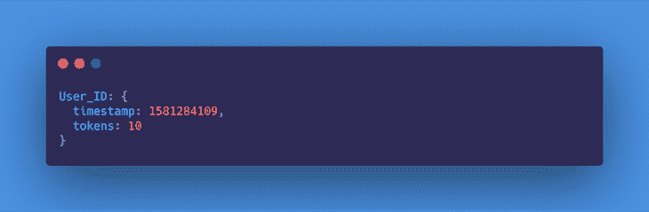
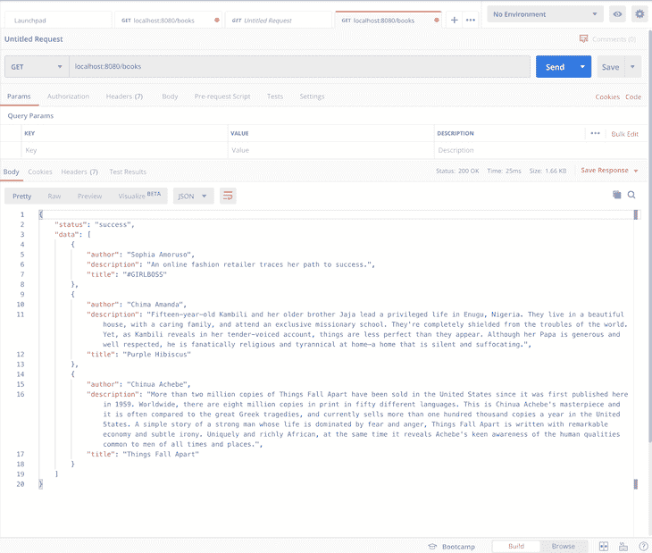
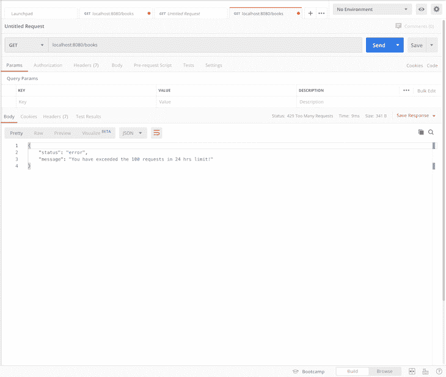

# 在 Node.js - LogRocket 博客中理解和实现速率限制

> 原文：<https://blog.logrocket.com/rate-limiting-node-js/>

***编者按:**本文于 2022 年 6 月 22 日更新，以与 Node.js 的最新版本保持一致，并包括更多关于速率限制的最新信息。*

## 介绍

速率限制是一个非常强大的功能，可以保护后端 API 免受恶意攻击，并处理来自用户的不需要的请求流。总的来说，它允许我们控制服务器处理用户请求的速度。

在本文中，我们将研究实现速率限制的不同方法，以及每种方法的优缺点。我们还将通过在 Node.js 中实现一个选定的方法来变得实用。

为了有效地阅读本文，您应该具备以下条件:

*   服务器如何处理请求的工作知识
*   了解如何在节点中构建 REST APIs
*   在节点中使用中间件的经验

如果你缺少这些中的一些或全部，不要感到害怕。我们将确保尽可能地把事情分解，以便你能容易地理解我们最终探索的每一个概念。

## 内容

## 什么是速率限制？

速率限制是一种用于控制网络内传入或传出流量的技术。在这种情况下，网络是指客户端(例如，web 浏览器)和我们的服务器(例如，API)之间的通信线路。

因此，这是一种允许我们基于一些指定的约束来处理用户请求的技术，例如:

*   有更好的数据流
*   降低了攻击的风险，即提高了安全性
*   服务器永远不会过载
*   用户只能做开发人员允许的事情

例如，我们可能希望将未订阅用户对公共 API 的请求数量限制为每月 1，000 个。一旦用户超过这个数量，我们可以忽略这个请求并抛出一个错误，指出用户已经超过了他们的限制。

请记住，为了实施速率限制，必须有一个明确定义的约束(限制)，它可以基于以下任何一项:

*   用户:约束是特定于用户的，并使用唯一的用户标识符来实现
*   位置:约束基于地理位置，并基于发出请求的位置来实现
*   IP 地址:该约束基于发起请求的设备的 IP 地址

现在让我们考虑各种速率限制算法以及它们的优缺点。

## 检查速率限制算法

与大多数工程问题一样，有不同的算法来实现速率限制，每种算法都有其优点和缺点。我们现在将检查五种众所周知的技术，并确定它们何时最有效，以及我们何时应该寻找另一种解决方案。

### 固定窗口计数器

这可能是实现速率限制的最明显的方法。在这种方法中，跟踪用户在每个窗口中发出的请求数量。

在这种情况下，窗口指的是所考虑的时间空间。也就是说，如果我希望我的 API 允许每分钟十个请求，我们有一个 60 秒的窗口。因此，从`00:00:00`开始，一个窗口将从`00:00:00`到`00:01:00`。

因此，对于用户在一分钟内发出的第一个请求，使用 HashMap 或 Redis 等优化的键值存储，我们可以根据计数存储用户的 ID(现在是`1`，因为这是第一个请求)。请参见下面的格式:


对于同一窗口内的后续请求，我们会检查用户是否未超出限制(即计数不大于 10)。如果用户没有这样做，我们将计数递增 1；否则，请求将被丢弃并触发错误。

在窗口结束时，我们将每个用户的记录重置为计数`0`，并对当前窗口重复该过程。

#### 赞成者

这种方法相对容易实现

#### 坏处

首先，这种方法并不完全准确，因为对所有用户强加一个通用的窗口开始时间是不公平的；实际上，用户的窗口应该从他们第一次请求时开始计数。

第二，当窗口快结束时，例如在第 55 秒时，流量突然增加，服务器每分钟的工作量比计划的要多得多。例如，我们可能有来自 55 秒到 60 秒之间的用户的十个请求，以及来自 0 秒到 5 秒之间的下一个窗口中的同一用户的另外十个请求。因此，服务器在十秒钟内为这个用户处理了 20 个请求。

最后，n 个特别大的窗口周期(例如，每小时 50 个请求，或 3600 秒)，如果用户在头十分钟(600 秒)内达到限制，他们可能会等待很长时间。这意味着用户发出 50 个请求需要 10 分钟，而发出 51 个请求需要 1 个小时。这可能会导致 API 在新窗口打开后立即运行。

### 滑动原木

滑动日志算法跟踪用户发出的每个请求的时间戳。这里的请求可以使用 HashMap 或 Redis 来记录。在这两种情况下，可以根据时间对请求进行排序，以便改进操作。

记录请求的过程如下所示:

*   检索最近窗口(60 秒)中记录的所有请求，并检查请求数量是否超过允许的限制
*   如果请求数量少于限制，则记录请求并进行处理
*   如果请求的数量等于限制，则放弃请求

#### 赞成者

*   这种方法更准确，因为它根据用户的活动计算每个用户的最后一个窗口，而不是为所有用户强加一个固定的窗口
*   因为没有固定的窗口，所以它不受接近窗口末尾的请求激增的影响

#### 坏处

*   它不是内存高效的，因为我们最终为每个请求存储一个新的条目
*   计算起来也非常昂贵，因为每个请求都会触发对以前保存的请求的计算，以检索最后一分钟的日志，然后获得计数

### 滑动窗口计数器

这种方法试图优化固定窗口计数器和滑动日志技术的一些低效率。在这种技术中，用户的请求按时间戳分组，我们为每个组保留一个计数器，而不是记录每个请求。

它跟踪每个用户的请求数，同时按固定的时间窗口(通常是限制窗口大小的一小部分)对它们进行分组。它是这样工作的:

当收到用户的请求时，我们检查用户的记录是否已经存在，以及该时间戳是否已经有一个条目。如果两种情况都成立，我们只需增加时间戳的计数器。

* * *

### 更多来自 LogRocket 的精彩文章:

* * *

在确定用户是否已经超出其限制时，我们检索在最后一个窗口中创建的所有组，然后对它们的计数器求和。如果总和等于限制，则用户已经达到他们的限制，并且传入的请求被丢弃。否则，插入或更新时间戳，并处理请求。

另外，可以将时间戳组设置为在窗口时间耗尽后过期，以控制内存消耗的速率。

#### 赞成者

这种方法节省了更多的内存，因为我们不是为每个请求创建一个新的条目，而是按时间戳对请求进行分组并递增计数器。

#### 坏处

该算法仅在回看窗口时间不严格时有效。

### 令牌桶

在令牌桶算法中，我们简单地保存一个指示用户还剩多少令牌的计数器和一个显示上次更新时间的时间戳。这个概念源于分组交换计算机网络和电信网络，其中有一个固定容量的桶来保存以固定速率(窗口间隔)添加的令牌。

当测试分组的一致性时，检查桶以查看它是否包含所需的足够数量的令牌。如果是，则适当数量的令牌被移除，并且该分组通过传输；否则，按不同方式处理。

在我们的例子中，当收到第一个请求时，我们记录时间戳，然后为用户创建一个新的令牌桶:



在随后的请求中，我们测试自最后一个时间戳创建以来窗口是否已经过去。如果没有，我们检查桶是否仍然包含那个特定窗口的令牌。如果是，我们将通过`1`减少令牌，并继续处理请求；否则，请求将被丢弃，并触发一个错误。

在自上一个时间戳以来窗口已经过去的情况下，我们将时间戳更新为当前请求的时间戳，并将令牌的数量重置为允许的限制。

#### 赞成者

*   这是一种准确的方法，因为窗口在用户之间不是固定的，因此是基于用户的活动来确定的
*   内存消耗最小，因为每个用户只有一个条目，用于管理他们随时间的活动(时间戳和可用令牌)

#### 坏处

令牌桶算法没有可能影响其使用的缺点。此外，如果桶变满了，令牌就会被丢弃，这对于节省内存来说仍然是一件好事。

### 漏桶

漏桶算法利用队列，以先进先出(FIFO)的方式接受和处理请求。队列大小受到限制。例如，如果限制是每分钟十个请求，那么队列一次只能容纳十个请求。

当请求排队时，它们以相对恒定的速率被处理。这意味着，即使服务器遇到突发流量，传出响应仍以相同的速率发出。

一旦队列填满，服务器将丢弃更多的传入请求，直到为更多的请求释放空间。

#### 赞成者

这种技术可以平滑流量，从而防止服务器过载。

#### 缺点

流量整形可能会导致用户感觉整体速度变慢，因为请求被抑制，影响了应用程序的 UX。

## 如何在 Node.js 中实现速率限制

既然我们已经从理论的角度探讨了速率限制，现在是我们开始实践的时候了。下面，我们已经确定了需要速率限制算法来实现预期结果的某些场景。花点时间浏览它们，在每种情况下，试着确定你倾向于使用什么算法，为什么。

1.  一家金融科技公司试图实现每位用户每日交易价值不超过 5000 美元。
2.  对公共图书 API 实施检查，以确保每个用户每天(24 小时)只能执行 100 个 API 请求。

在本教程中，我们将在 Node.js 中实现场景二。然而，现在我们需要决定哪种算法最适合我们的用例。

> 如果你准备好迎接挑战，可以在这里随意下载[教程样板文件](https://github.com/worldclassdev/node-rate-limiter/tree/boilerplate)，并尝试自己实现任何算法。

## 哪种限速算法最好？

对于我们的用例，我们坚持使用哪种算法？如上所述，固定窗口计数器和滑动日志是实现速率限制的最低效的方式。这给我们留下了滑动窗口计数器、漏桶和令牌桶。

漏桶算法最适用于速率限制和流量整形的情况。

> 流量整形(也称为数据包整形)是一种带宽管理技术，它延迟某些类型的网络数据包的流量，以确保高优先级应用程序的网络性能。在这种情况下，它描述了管理服务器资源的能力，以便以一定的速率处理和响应请求，而不管它接收的流量大小。

由于在这种情况下这不是一个主要问题，所以我们只能使用滑动窗口计数器和令牌桶算法。这两种方法都可以，但是在本文中，我们将使用滑动窗口计数器。

我们将使用该算法跟踪每个用户每天(24 小时)的请求数，同时按固定的一小时窗口对他们进行分组。现在，让我们开始吧！

## Node.js 中的采样速率限制项目

首先，[在您的计算机上克隆这个库](https://github.com/worldclassdev/node-rate-limiter/tree/boilerplate)，在您的终端上导航到项目目录，并使用下面的命令安装项目的依赖项:

```
npm i

```

样板代码包含一个简单的 API，允许我们使用对`/books`端点的`GET`请求来检索图书列表。因此，我们将使用一个中间件层来实现速率限制，该层将对每个用户实施限制。

API 的所有代码都在`src`目录中。在这种情况下，没有用户身份验证，因此我们将使用用户的 IP 地址来识别用户。这可作为每个请求的请求对象的属性，即`req.ip`。

最后，将`.env.example`文件重命名为`.env`，因为它包含了项目的环境变量。现在，您可以通过运行以下命令来启动服务器:

```
npm run dev

```

敬代码！

## 实现速率限制器

我们将以两种方式实现我们的滑动窗口计数器速率限制器算法。首先，我们将使用一个第三方库， [Express Rate Limit](https://www.npmjs.com/package/express-rate-limit) ，另一方面，我们将做一个自定义实现。

### 使用第三方库

快速速率限制是一个 npm 包，通常用作节点的基本速率限制中间件。要使用这个插件，我们必须先安装它。

从终端的项目目录中运行下面的命令来完成此操作:

```
npm i express-rate-limit --save

```

接下来，转到项目中的`middlewares`文件夹，创建一个名为`rateLimiter.js`的文件。这是我们将为我们的 API 编写速率限制中间件的地方。

将以下代码复制并粘贴到该文件中:

```
// src/middlewares/rateLimiter.js

import rateLimit from 'express-rate-limit';

export const rateLimiterUsingThirdParty = rateLimit({
  windowMs: 24 * 60 * 60 * 1000, // 24 hrs in milliseconds
  max: 100,
  message: 'You have exceeded the 100 requests in 24 hrs limit!', 
  standardHeaders: true,
  legacyHeaders: false,
});

```

在上面的代码片段中，我们将 npm 包导入到项目中。使用这个包，我们创建了一个中间件，它根据我们传入的选项执行速率限制，这些选项包括:

*   `windowMs`，窗口大小(在我们的例子中是 24 小时)，以毫秒为单位
*   `max`，代表每个用户每个窗口允许的请求数
*   `message`，指定用户超出允许限制时收到的响应消息
*   `standardHeaders`，它指定是否应该将适当的报头添加到响应中，以显示强制限制(`X-RateLimit-Limit`)、当前使用(`X-RateLimit-Remaining`)以及达到限制时重试前等待的时间(`Retry-After`)

现在我们已经创建了中间件，我们需要配置我们的应用程序在处理请求时使用这个中间件。

首先，通过更新`middlewares`文件夹中的`index.js`文件，从我们的中间件模块中导出中间件，如下所示:

```
// src/middlewares/index.js

export { default as errorHandler } from './errorHandler';
export { rateLimiterUsingThirdParty } from './rateLimiter';

```

接下来，导入`rateLimiterUsingThirdParty`中间件，并将其应用于所有应用程序路线:

```
// src/index.js
// ...Some code here

import { rateLimiterUsingThirdParty } from './middlewares';

// ...Some code here

app.use(rateLimiterUsingThirdParty);

// ...Some more code goes here

```

瞧啊。我们完了。请注意，我们不必手动为每个用户指定标识符。如果你仔细阅读这个软件包的文档，如 npm 上的[，你会注意到这个软件包默认使用`req.ip`通过用户的 IP 地址来识别用户。](https://www.npmjs.com/package/express-rate-limit)

很简单，对吧？现在让我们尝试一个稍微复杂一点的方法。

### 使用自定义实现(Redis 和 Moment)

对于这个实现，我们将利用 [Redis](https://redis.io/) 来跟踪每个用户的请求计数和使用其 IP 地址的时间戳。如果您的机器上没有安装 [Redis](https://blog.logrocket.com/using-redis-pub-sub-node-js/) ，请按照[这里的说明](https://redis.io/download)进行安装。

使用下面的命令，安装下面的包，这些包允许我们连接到 Redis 并在我们的应用程序中轻松地操作时间:

```
npm i redis moment --save

```

接下来，更新您的`rateLimiter.js`，文件如下所示。下面的代码是一个中间件，它使用 Redis 为我们的 API 处理速率限制。

复制粘贴到`rateLimiter.js`里面:

```
import moment from 'moment';
import redis from 'redis';

const redisClient = redis.createClient();
redisClient.on('error', (err) => console.log('Redis Client Error', err));

const WINDOW_SIZE_IN_HOURS = 24;
const MAX_WINDOW_REQUEST_COUNT = 100;
const WINDOW_LOG_INTERVAL_IN_HOURS = 1;

export const customRedisRateLimiter = async (req, res, next) => {
  await redisClient.connect();
  try {
    // check that redis client exists
    if (!redisClient) {
      throw new Error('Redis client does not exist!');
      process.exit(1);
    }
    // fetch records of current user using IP address, returns null when no record is found
    const record = await redisClient.get(req.ip);
    const currentRequestTime = moment();
    console.log(record);
    //  if no record is found , create a new record for user and store to redis
    if (record == null) {
      let newRecord = [];
      let requestLog = {
        requestTimeStamp: currentRequestTime.unix(),
        requestCount: 1,
      };
      newRecord.push(requestLog);
      await redisClient.set(req.ip, JSON.stringify(newRecord));
      next();
    }
    // if record is found, parse it's value and calculate number of requests users has made within the last window
    let data = JSON.parse(record);
    let windowStartTimestamp = moment().subtract(WINDOW_SIZE_IN_HOURS, 'hours').unix();
    let requestsWithinWindow = data.filter((entry) => {
      return entry.requestTimeStamp > windowStartTimestamp;
    });
    console.log('requestsWithinWindow', requestsWithinWindow);
    let totalWindowRequestsCount = requestsWithinWindow.reduce((accumulator, entry) => {
      return accumulator + entry.requestCount;
    }, 0);
    // if number of requests made is greater than or equal to the desired maximum, return error
    if (totalWindowRequestsCount >= MAX_WINDOW_REQUEST_COUNT) {
      res.status(429).jsend.error(`You have exceeded the ${MAX_WINDOW_REQUEST_COUNT} requests in ${WINDOW_SIZE_IN_HOURS} hrs limit!`);
    } else {
      // if number of requests made is less than allowed maximum, log new entry
      let lastRequestLog = data[data.length - 1];
      let potentialCurrentWindowIntervalStartTimeStamp = currentRequestTime.subtract(WINDOW_LOG_INTERVAL_IN_HOURS, 'hours').unix();
      //  if interval has not passed since last request log, increment counter
      if (lastRequestLog.requestTimeStamp > potentialCurrentWindowIntervalStartTimeStamp) {
        lastRequestLog.requestCount++;
        data[data.length - 1] = lastRequestLog;
      } else {
        //  if interval has passed, log new entry for current user and timestamp
        data.push({
          requestTimeStamp: currentRequestTime.unix(),
          requestCount: 1,
        });
      }
      await redisClient.set(req.ip, JSON.stringify(data));
      next();
    }
  } catch (error) {
    next(error);
  }
};

```

这里发生了很多事情，所以让我们一步步来。

首先，我们从 npm 安装并导入 Redis 和 [Moment.js](https://momentjs.com/docs/) 并初始化所有有用的常量。我们使用 Redis 作为内存存储来跟踪用户活动，而 Moment 帮助我们精确地解析、验证、操作和显示 JavaScript 中的日期和时间。

接下来，我们创建一个中间件`customRedisRateLimiter`，我们将在其中实现速率限制逻辑。在中间件函数的`try`块中，我们检查 Redis 客户机是否存在，如果不存在就抛出一个错误。

使用用户的 IP 地址`req.ip`，我们从 Redis 获取用户的记录。如果返回`null`,这表明还没有为有问题的用户创建记录。因此，我们为这个用户创建一个新记录，并通过在 Redis 客户机上调用`set()`方法将其存储到 Redis 中。

如果找到记录，则返回值。因此，我们将该值解析为 JSON，并继续计算用户是否有资格获得响应。为了确定这一点，我们通过检索时间戳在最近 24 小时内的所有日志来计算用户在最后一个窗口中发出的请求的累计总数，并对其对应的`requestCount`求和。

如果上一个窗口(即`totalWindowRequestsCount`)中的请求数等于允许的最大值，我们将向用户发送一条构造的错误消息，指示用户已经超过了限制。

然而，如果`totalWindowRequestsCount`小于允许的限制，则请求有资格得到响应。因此，我们执行一些检查，看看自上次创建日志以来是否已经过了一个小时。如果已经过了一个小时，我们为当前时间戳创建一个新的日志。否则，我们在最后一个时间戳上增加`requestCount`,并在 Redis 上存储(更新)用户记录。

确保将中间件导出并应用到我们的 Express 应用程序，就像我们在第三方库实现中所做的那样。

咻！就是这样。这是否符合预期？让我们看看！

## 测试

当您测试来自 [Postman](https://www.postman.com/downloads/) 的 API 时，您会得到以下响应:

```
localhost:8080/books

```



当您超过允许的限制(即每小时 100 个请求)时，服务器会返回以下消息:



我们成功了！🎊

## 结论

在本文中，我们成功地探索了速率限制的概念——它是什么，它是如何工作的，实现它的各种方法，以及它适用的实际场景。

我们还在 Node.js 中完成了自己的实现，首先使用一个简单的第三方库为我们处理所有繁重的工作，然后使用 Redis 定制实现。我希望你喜欢和我一起做这个。

## 200 只显示器出现故障，生产中网络请求缓慢

部署基于节点的 web 应用程序或网站是容易的部分。确保您的节点实例继续为您的应用程序提供资源是事情变得更加困难的地方。如果您对确保对后端或第三方服务的请求成功感兴趣，

[try LogRocket](https://lp.logrocket.com/blg/node-signup)

.

[](https://lp.logrocket.com/blg/node-signup)[https://logrocket.com/signup/](https://lp.logrocket.com/blg/node-signup)

LogRocket 就像是网络和移动应用程序的 DVR，记录下用户与你的应用程序交互时发生的一切。您可以汇总并报告有问题的网络请求，以快速了解根本原因，而不是猜测问题发生的原因。

LogRocket 检测您的应用程序以记录基线性能计时，如页面加载时间、到达第一个字节的时间、慢速网络请求，还记录 Redux、NgRx 和 Vuex 操作/状态。

[Start monitoring for free](https://lp.logrocket.com/blg/node-signup)

.