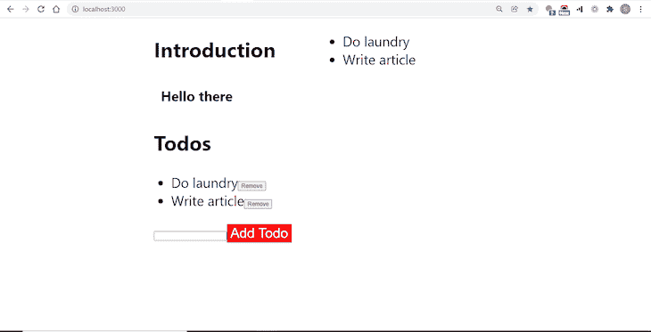

# React 18，React Redux 8，和 TypeScript:你需要知道的

> 原文：<https://blog.logrocket.com/react-18-redux-8-typescript/>

React 18 目前正在开发中，React Redux 8(React 状态管理库)正在同时构建，以整合 React 18 将提供的所有新功能，包括服务器端渲染(SSR)、过渡和自动批量渲染。

React Redux 8 中的另一个重大变化是将其整个代码库转换为 TypeScript，这使得用户更容易编写类型安全的代码并生成无错误的应用程序。

在本文中，我们将探讨这一变化如何影响开发者，由于 React Redux 8 目前处于测试阶段，我们将测试它与 React 18 的测试版的兼容性。

## 将现有应用程序升级到 React Redux 8

这里的目标是看看升级应用程序中的 React Redux 版本会对它产生什么影响——我们希望在升级后发现应用程序中的重大更改和意外行为。

让我们克隆并升级这个由 Jack Herrington 开发的[简单待办应用程序](https://github.com/jherr/no-bs-ts/tree/master/series-1/episode-27),对其进行手工检查，并强调必须做出的 React Redux 8 特有的更改。

您可以随意使用 React Redux 官方教程中的[示例应用程序，或者 React Redux 文档中链接的任何示例代码沙箱。或者，如果您想要更新现有的](https://react-redux.js.org/tutorials/quick-start) [React Redux 应用程序](https://blog.logrocket.com/comprehensive-guide-to-using-redux-in-react-native/)，您可以使用它来代替。

待办应用是用 React 17 和 Redux 8 构建的，所以我们会更新到这两个包的最新版本。要将 React Redux 8 添加到现有 React 应用程序，请使用 npm 运行以下命令:

```
npm i [email protected]

```

要将应用程序的 React 版本升级到 React 18，请运行以下命令:

```
npm install [email protected] [email protected]

```

React 18 提供了一个新的根 API`createRoot`，可以更高效地运行更新。旧的那个`ReactDOM.render`，现在已经弃用了。

要使用它，导航到应用程序的`src`文件夹中的`index.tsx`文件，并执行以下代码块:

```
ReactDOM.render(
  <React.StrictMode>
    <App />
  </React.StrictMode>,
  document.getElementById('root')
);

```

然后将其替换为以下内容:

```
const root = ReactDOM.createRoot(
  document.getElementById("root") as HTMLDivElement
);
root.render(<App />);

```

接下来，导航到您的`tsconfig.json`文件并添加以下行:

```
{
  "compilerOptions": {
    ...,
    "types": ["react/next", "react-dom/next"]
  },
  ...
}

```

现在，您的应用运行新的根 API`createRoot`，使 React 18 中的改进可用于您的应用。请注意，React 18 同时提供了遗留根 API 和新的根 API，因此如果您希望获得新的根 API 带来的性能改进，您可以选择只使用新的根 API。

但是，如果您坚持使用旧的 API，您将会收到推荐新 API 的反对消息。要将 React Redux 升级到版本 8，请运行以下命令:

```
npm i [email protected]
```

### 检查重大变更

现在，该应用程序可以与 React Redux 8 一起工作。要运行应用程序并观察重大更改和意外行为，请运行以下命令:

```
npm start

```

接下来，在浏览器中导航至`http//localhost:3000`。经过检查，我们看到待办事项列表应用程序功能正常。填充文本框并点击**添加待办事项**按钮更新 UI，点击项目旁边的**移除**按钮删除它。



在这里，没有突破性的更改或意外的行为，因为所有的更改都是在幕后进行的，公共 API 保持不变(`connect`和`useSelector`)。

没有添加新功能，没有更改 TypeScript 类型，也不需要更改语法。这个版本与前一个版本具有完全相同的功能；正如我们所看到的，将应用程序升级到 React Redux 8 所需的唯一步骤是修改软件包版本。

在确认了新的 React Redux 版本不需要语法更改或复杂的步骤之后，让我们放大一下 Redux 团队内部所做的更改，以及目前处于测试阶段的 React 18 的进展。

## React Redux 8 的显著变化

### 已将基本代码转换为类型脚本

React Redux 以前的版本(版本 7 及以下)是用普通 JavaScript 编写的。要在这些版本中使用 TypeScript，类型必须从不同的、由社区维护的包`@types/react-redux`中导入。

但是在版本 8 中，所有的类型都被导入到主包中，不再需要`@types/react-redux`包。事实上，如果你升级到 React Redux 8，而你的 app 使用了`@types/react-redux`包，你必须移除那个包。

### 与 React 18 的兼容性

在版本 8 中，React Redux 的两个公共 API(`connect`和`useSelector`)被重写以支持 React 18。

React 18 附带的[新 API 之一是`useSyncExternalStore`。这使开发人员能够访问新功能，如支持并发渲染和自动渲染批处理。](https://blog.logrocket.com/exploring-react-18-three-new-apis/)

React Redux 的`connect`和`useSelector`也被重新编写，以便在内部调用这个新的 API。

### 现代化的构建输出

现代 JavaScript 代码生成的文件非常小，运行速度非常快。然而，由于像 Internet Explorer 11 这样的传统浏览器只支持 ES5 而不支持更高版本，React Redux 的以前版本编译为 ES5 以在 Internet Explorer 11 上运行。

现在，Internet Explorer 11 不再真正起作用，React Redux 编译到 ES2017，利用现代浏览器中的一些内置支持，并创建大小更小的捆绑包。如果您仍然需要对遗留浏览器的支持，您将需要编译自己的依赖项。

### 移除了未使用的传统 API

随着[钩子的出现，React Redux 的](https://blog.logrocket.com/use-hooks-and-context-not-react-and-redux/) `connectAdvanced` API 变得几乎无关紧要，只是给包增加了不必要的复杂性。在版本 8 中它已经被删除了。

另一个几乎不再使用的遗留代码是`connect`的`[pure](https://react-redux.js.org/api/connect#pure-boolean)` [选项](https://react-redux.js.org/api/connect#pure-boolean)。随着 React 的发展，`pure`标志，就像`connectAdvanced` API 一样，已经变得几乎无关紧要了。在版本 8 中它也被删除了。

## React Redux 8 和 React 18 的新特性

### 自动渲染批处理

批处理是指多个状态更新同时触发，并且它们的响应呈现同时发生。对于 React 的早期版本，只有当触发器是正常函数时，才会发生这种情况。

如果多个状态更新是由承诺或回调触发的，它们的响应不会同时呈现。在 React 18 中，所有渲染都是批处理的，这意味着它们将同时发生，不管它们的触发器是什么。下面是一个常规函数的例子:

```
function App() {
  const [stateOne, setstateOne] = useState(false);
  const [stateTwo, setstateTwo] = useState(false);

  function handleClick() {
    setstateOne(val => !val); // set the first state
    setstateTwo(val => !val); // set the second state
    // In React 18, both states will be changed from false to true at 
    //the same time
  }

  return (
    <div>
      <button onClick={handleClick}>Click Me</button>
    </div>
  );
}

```

这里有一个承诺的例子:

```
    fetchData()
      .then(()=> {
          setstateOne(val => !val); // set the first state
          setstateTwo(val => !val); // set the second state
          // In React 18, both states will be changed from false to 
          //true at the same time
    })

```

### 服务器端渲染

有了`Suspense`，React 18 通过使异步提供应用程序的各个部分成为可能，对 SSR 进行了重大的性能改进。服务器端呈现允许您从提供的 React 组件生成 HTML 文本，然后加载 JavaScript 代码并与 HTML 合并(称为水合)。

现在，有了`Suspense`，你可以将你的应用分成小的、独立的单元，这些单元可以在没有应用的其余部分的情况下独立呈现，允许内容比以前更快地提供给你的用户。

假设您有两个组件:一个文本组件和一个图像组件。如果你像这样把它们叠在一起:

```
 <Text />
 <Image /&gt;

```

然后，服务器试图立刻呈现它们，减慢了整个页面的速度。如果文本对你的读者来说更重要，你可以通过将`Image`组件放在`Suspense`标签中，使其优先于图像:

```
    <Text />
    <Suspense fallback={<Spinner />}>
         <Image />   
    </Suspense>

```

这一次，服务器首先为您的文本组件提供服务，当您的图像等待加载时，会显示一个微调器。

### 过渡

React 应用程序是交互式的，但如果你希望你的应用程序在用户与它交互时不断更新自己，这种不断更新会大大降低你的应用程序的速度，并提供糟糕的用户体验。

这就是`startTransition` API 的用武之地。有了它，你可以定义哪个更新是紧急的，哪个不是(次要的)。这样，您可以将紧急更新置于次要更新之上，次要更新可以移到后台，或者在不再需要时完全跳过。

## 结论

如果您升级现有的 [React Redux 应用程序](https://blog.logrocket.com/why-use-redux-reasons-with-clear-examples-d21bffd5835/),它们应该可以正常工作。然而，如果你遇到任何突破性的变化或意想不到的行为，Redux 团队目前正在[这里](https://github.com/reduxjs/react-redux/discussions/1843)接受反馈，以在最终版本发布前解决任何问题。

## [LogRocket](https://lp.logrocket.com/blg/react-signup-general) :全面了解您的生产 React 应用

调试 React 应用程序可能很困难，尤其是当用户遇到难以重现的问题时。如果您对监视和跟踪 Redux 状态、自动显示 JavaScript 错误以及跟踪缓慢的网络请求和组件加载时间感兴趣，

[try LogRocket](https://lp.logrocket.com/blg/react-signup-general)

.

[ ](https://lp.logrocket.com/blg/react-signup-general) [](https://lp.logrocket.com/blg/react-signup-general) 

LogRocket 结合了会话回放、产品分析和错误跟踪，使软件团队能够创建理想的 web 和移动产品体验。这对你来说意味着什么？

LogRocket 不是猜测错误发生的原因，也不是要求用户提供截图和日志转储，而是让您回放问题，就像它们发生在您自己的浏览器中一样，以快速了解哪里出错了。

不再有嘈杂的警报。智能错误跟踪允许您对问题进行分类，然后从中学习。获得有影响的用户问题的通知，而不是误报。警报越少，有用的信号越多。

LogRocket Redux 中间件包为您的用户会话增加了一层额外的可见性。LogRocket 记录 Redux 存储中的所有操作和状态。

现代化您调试 React 应用的方式— [开始免费监控](https://lp.logrocket.com/blg/react-signup-general)。